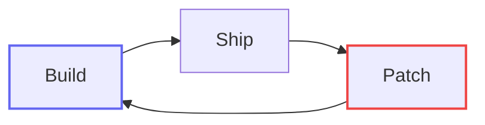
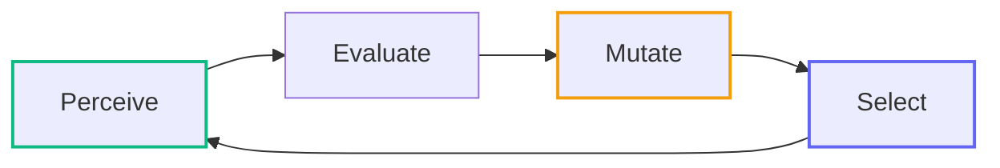
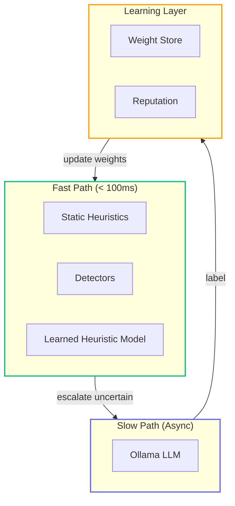
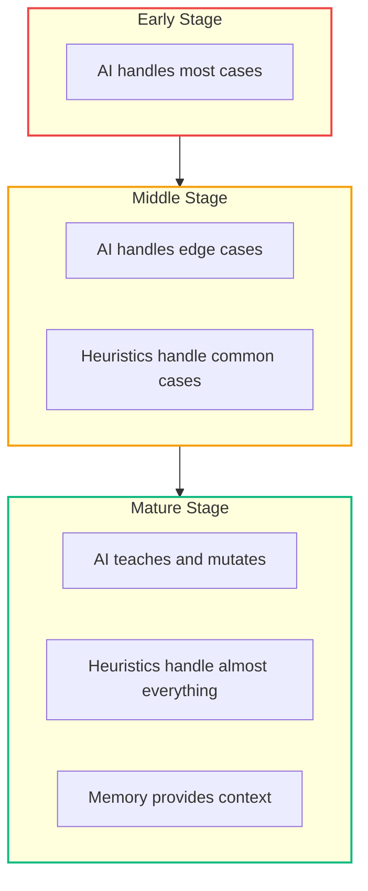
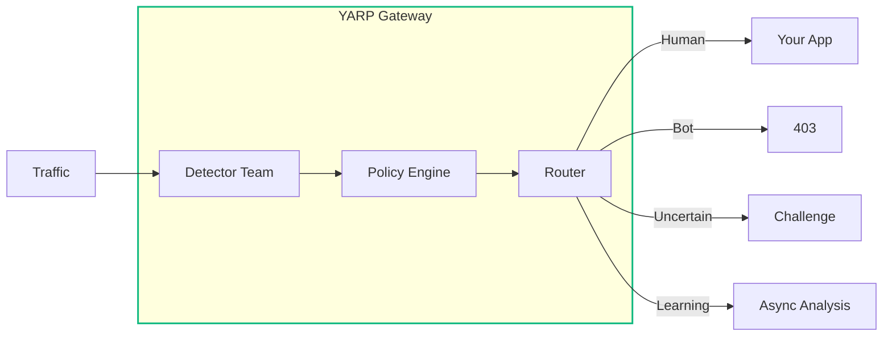

# Cooking with DiSE (Part 4): Building Systems That Learn, Adapt, and Evolve

Most software architectures assume the system is static. DiSE assumes the system is alive.

> **Note:** This is Part 4 in the "Cooking with DiSE" series. See [Part 1](https://www.mostlylucid.net/blog/semantidintelligence-part1), [Part 2: Graduated Apprenticeships](https://www.mostlylucid.net/blog/blog-article-cooking-dise-part2-apprenticeships), and [Part 3: Untrustworthy Gods](https://www.mostlylucid.net/blog/blog-article-cooking-dise-part3-untrustworthy-gods) for background. This article is the architectural overview - and now we have a working C# implementation: [mostlylucid.botdetection](https://www.mostlylucid.net/blog/botdetection-introduction).

**Key concept: Behavioural Routing.** This architecture enables a new category - where transparent, adjustable "teams" of detectors and learning systems reflexively route traffic based on learned behaviour patterns, not static rules. With the [YARP Gateway](https://hub.docker.com/r/scottgal/mostlylucid.yarpgateway), bots never reach your backend. Or use the middleware to build behavioural routing directly into your app layer.

## The Problem: Static Systems in a Dynamic World

For years, we've built software like clockwork: inputs, outputs, rules, pipelines, tests, deployments. All linear, all predictable.

But modern systems - especially AI-augmented ones - no longer behave like clocks. They behave like ecosystems:

- Attackers evolve their techniques
- Users change their behaviour
- Requirements drift over time
- The environment shifts constantly

Static architectures can't keep up. You patch one hole, three more appear. You tune one threshold, something else breaks. You're always reacting, never adapting.

**DiSE Architecture** (Directed Synthetic Evolution) treats software the way biologists treat organisms: as something that must adapt, self-correct, and improve under pressure.

## The Core Idea: Systems as Evolving Organisms

Traditional architecture:



DiSE architecture:



A DiSE system has four essential behaviours:

| Behaviour | What It Does | Biological Equivalent |
|-----------|--------------|----------------------|
| **Perceive** | Gather signals from the environment | Sensory organs |
| **Evaluate** | Score signals against goals | Nervous system |
| **Mutate** | Generate variants of strategies | Genetic mutation |
| **Select** | Keep what works, discard what doesn't | Natural selection |

This isn't metaphor. This is literally how your system evolves smarter behaviours over time.

## A Concrete Example: Bot Detection

[mostlylucid.botdetection](https://github.com/scottgal/mostlylucid.nugetpackages/tree/main/Mostlylucid.BotDetection) is the first C# implementation of DiSE principles. Let's trace the architecture:

### Perception: The Blackboard Architecture

The system uses a **blackboard orchestrator** - detectors contribute evidence to a shared state, triggering other detectors as signals accumulate:

```csharp
// Detectors emit contributions (evidence), not verdicts
public sealed record DetectionContribution
{
    public required string DetectorName { get; init; }
    public required string Category { get; init; }

    // Positive = bot signal, Negative = human signal
    public required double ConfidenceDelta { get; init; }
    public double Weight { get; init; } = 1.0;

    public required string Reason { get; init; }
    public BotType? BotType { get; init; }

    // Signals for triggering other detectors
    public ImmutableDictionary<string, object> Signals { get; init; }
}
```

Multiple detectors run **in parallel waves**. Each contributes a piece of evidence. The system perceives the environment through many lenses:

```csharp
// Wave 0: All detectors with no trigger conditions run in parallel
// Wave N: Detectors whose triggers are now satisfied run in parallel
while (waveNumber < MaxWaves && !cancellationToken.IsCancellationRequested)
{
    var readyDetectors = availableDetectors
        .Where(d => !ranDetectors.Contains(d.Name))
        .Where(d => CanRun(d, state.Signals))
        .ToList();

    await ExecuteWaveAsync(readyDetectors, state, aggregator, ...);

    // Check for early exit on high confidence
    if (aggregator.ShouldEarlyExit)
        break;
}
```

### Evaluation: Weighted Consensus with Sigmoid

Evidence aggregates into a decision using sigmoid transformation - this properly leverages strong signals from high-weight detectors:

```csharp
private (double botProbability, double confidence) CalculateWeightedScore()
{
    var weighted = _contributions
        .Where(c => c.Weight > 0)
        .Select(c => (delta: c.ConfidenceDelta, weight: c.Weight))
        .ToList();

    var weightedSum = weighted.Sum(w => w.delta * w.weight);

    // Sigmoid maps any real number to (0, 1)
    // Strong human signal (-3) → ~5% bot probability
    // Neutral (0) → 50% bot probability
    // Strong bot signal (+3) → ~95% bot probability
    var botProbability = 1.0 / (1.0 + Math.Exp(-weightedSum));

    return (botProbability, confidence);
}
```

The evaluation isn't a single model making a decision. It's **weighted consensus** across multiple specialised detectors - and crucially, when AI hasn't run, the probability is **clamped** to avoid overconfidence:

```csharp
// CRITICAL: Clamp probability when AI hasn't run
var botProbability = aiRan
    ? rawBotProbability
    : Math.Clamp(rawBotProbability, 0.20, 0.80);
```

### Early Exit: Fast Path Optimization

The system doesn't always run all detectors. When early evidence is conclusive, it exits fast:

```csharp
// Early exit on verified bots (good or bad)
public static DetectionContribution VerifiedGoodBot(
    string detector, string botName, string reason) => new()
{
    DetectorName = detector,
    Category = "Verification",
    ConfidenceDelta = 0,
    TriggerEarlyExit = true,
    EarlyExitVerdict = EarlyExitVerdict.VerifiedGoodBot
};
```

In production, **high-confidence requests exit in under 10ms** after just 2-3 detectors agree. The full pipeline only runs for uncertain cases.

### Circuit Breakers: Self-Healing

Detectors can fail. The system protects itself:

```csharp
// Circuit breaker per detector
private void RecordFailure(string detectorName)
{
    var state = _circuitStates.GetOrAdd(detectorName, _ => new CircuitState());
    state.FailureCount++;
    state.LastFailure = DateTimeOffset.UtcNow;

    if (state.FailureCount >= CircuitBreakerThreshold)
    {
        state.State = CircuitBreakerState.Open;
        // Detector disabled until reset time passes
    }
}
```

Failed detectors are temporarily disabled. After a cooldown, they're tried again (half-open state). This is **selection pressure at the infrastructure level**.

### Mutation: The Learning System

When the system detects with high confidence, it **learns** by publishing to the learning event bus:

```csharp
private void PublishLearningEvent(AggregatedEvidence result, ...)
{
    var eventType = result.BotProbability >= 0.8
        ? LearningEventType.HighConfidenceDetection
        : LearningEventType.FullDetection;

    _learningBus.TryPublish(new LearningEvent
    {
        Type = eventType,
        Confidence = result.Confidence,
        Label = result.BotProbability >= 0.5,
        Metadata = new Dictionary<string, object>
        {
            ["botProbability"] = result.BotProbability,
            ["categoryBreakdown"] = result.CategoryBreakdown,
            ["contributingDetectors"] = result.ContributingDetectors
        }
    });
}
```

This feeds into the weight store, updating the heuristic detector's learned weights over time.

## The Cognitive Stack

Instead of a single "AI brain," DiSE uses layered cognition:



| Layer | Speed | Purpose | Bot Detection Example |
|-------|-------|---------|----------------------|
| **Static Heuristics** | <1ms | Instinctive responses | Known bot UA patterns |
| **Detectors** | <10ms | Trait observation | Header analysis, IP checks |
| **Learned Heuristic** | 1-5ms | Dynamic classification | Logistic regression with learned weights |
| **LLM** | 50-500ms | Deep reasoning | Analysing novel patterns |
| **Learning** | Background | Memory formation | Weight updates, reputation changes |

The key insight: the system learns its own weights in real-time. No external ML models required. The heuristic detector starts with sensible defaults and evolves based on detection feedback.

> **Future:** ONNX models with RAG and embedding are planned for v2. The current heuristic model's output serves as labelled training data for future model training. The architecture already has the "genetic" artifacts (contributions, weights, signals) that make adding directed synthetic evolution straightforward - it's designed as a plugin point.

This mirrors biological cognition:
- **Innate immune system** → Static heuristics
- **Adaptive immune system** → Learned heuristic model
- **Memory cells** → Weight store + reputation

## The Heuristic Detector: Learning Without External Models

Here's the clever bit. Instead of shipping an external ML model, the system learns its own classifier using simple logistic regression with dynamic feature extraction:

```csharp
public class HeuristicDetector : IDetector
{
    // Default weights - sensible starting points
    private static readonly Dictionary<string, float> DefaultWeights = new()
    {
        // Human-like patterns (negative = more likely human)
        ["hdr:accept-language"] = -0.6f,
        ["hdr:referer"] = -0.4f,
        ["fp:received"] = -0.7f,      // Fingerprint = strong human signal
        ["fp:legitimate"] = -0.8f,

        // Bot indicators (positive = more likely bot)
        ["ua:contains_bot"] = 0.9f,
        ["ua:headless"] = 0.8f,
        ["ua:selenium"] = 0.7f,
        ["ua:curl"] = 0.6f,
        ["accept:wildcard"] = 0.4f,
    };

    private (bool IsBot, double Probability) RunInference(Dictionary<string, float> features)
    {
        // Simple linear model: score = bias + Σ(feature * weight)
        float score = _bias;

        foreach (var (featureName, featureValue) in features)
        {
            var weight = _weights.TryGetValue(featureName, out var w)
                ? w
                : DefaultNewFeatureWeight;
            score += featureValue * weight;
        }

        // Sigmoid gives us probability
        var probability = 1.0 / (1.0 + Math.Exp(-score));
        return (probability > 0.5, probability);
    }
}
```

Features are extracted dynamically from the request and aggregated evidence:

```csharp
public static class HeuristicFeatureExtractor
{
    public static Dictionary<string, float> ExtractFeatures(
        HttpContext context,
        AggregatedEvidence evidence)
    {
        var features = new Dictionary<string, float>();

        // Request metadata
        features["req:header_count"] = Math.Min(headers.Count / 20f, 1f);
        features["req:cookie_count"] = Math.Min(cookies.Count / 10f, 1f);

        // Header presence
        features["hdr:accept-language"] = headers.ContainsKey("Accept-Language") ? 1f : 0f;

        // UA patterns (dynamic - only present if detected)
        if (ua.Contains("bot")) features["ua:contains_bot"] = 1f;
        if (ua.Contains("selenium")) features["ua:selenium"] = 1f;

        // Detector results (named by actual detector)
        foreach (var contrib in evidence.Contributions)
            features[$"det:{contrib.DetectorName}"] = contrib.ConfidenceDelta;

        // Client-side fingerprint - STRONG human signal
        if (hasFingerprint)
        {
            features["fp:received"] = 1f;
            features["fp:legitimate"] = 1f;
        }

        return features;
    }
}
```

New features automatically get default weights and learn over time. The system discovers what matters.

## The Weight Store: Persistent Learning

Weights persist in SQLite and update via exponential moving average:

```csharp
public class SqliteWeightStore : IWeightStore
{
    public async Task RecordObservationAsync(
        string signatureType,
        string signature,
        bool wasBot,
        double detectionConfidence,
        CancellationToken ct = default)
    {
        // EMA update: weight = weight * (1 - α) + new_value * α
        var alpha = 0.1; // Learning rate
        var weightDelta = wasBot ? detectionConfidence : -detectionConfidence;

        var sql = @"
            INSERT INTO learned_weights (signature_type, signature, weight, ...)
            VALUES (@type, @sig, @delta, ...)
            ON CONFLICT(signature_type, signature) DO UPDATE SET
                weight = weight * (1 - @alpha) + @delta * @alpha,
                confidence = MIN(1.0, confidence + @conf * 0.01),
                observation_count = observation_count + 1,
                last_seen = @now
        ";

        await ExecuteAsync(sql, ...);
    }
}
```

This is **mutation through observation**. Every detection teaches the system something. Over time, the weights converge toward optimal values for your specific traffic patterns.

## Hallucination as Mutation

In DiSE, LLM hallucination isn't a bug. It's the generative substrate of evolution.

A high-temperature LLM proposing ten variants of a detection rule isn't "hallucinating" - it's **mutating the genome** of the system:

```csharp
public async Task<List<DetectionRule>> GenerateMutationsAsync(DetectionContext context)
{
    var prompt = $"""
        Given this traffic pattern:
        {JsonSerializer.Serialize(context)}

        Generate 5 variant detection rules that might catch similar patterns.
        Return JSON array of rules with: pattern, weight, confidence.
        Be creative. Some variants should be strict, some lenient.
        """;

    var response = await _ollama.GenerateAsync(new GenerateRequest
    {
        Model = "gemma3:1b",
        Prompt = prompt,
        Options = new RequestOptions { Temperature = 0.9 } // High creativity
    });

    return ParseRules(response.Response);
}
```

The mutations are then evaluated against historical data:

```csharp
public async Task<DetectionRule?> SelectFittestAsync(
    List<DetectionRule> mutations,
    List<LabeledRequest> testData)
{
    var results = new List<(DetectionRule Rule, double Fitness)>();

    foreach (var rule in mutations)
    {
        var tp = testData.Count(r => rule.Matches(r) && r.IsBot);
        var fp = testData.Count(r => rule.Matches(r) && !r.IsBot);
        var fn = testData.Count(r => !rule.Matches(r) && r.IsBot);

        // F1 score as fitness
        var precision = tp / (double)(tp + fp);
        var recall = tp / (double)(tp + fn);
        var f1 = 2 * (precision * recall) / (precision + recall);

        results.Add((rule, f1));
    }

    return results.OrderByDescending(r => r.Fitness).First().Rule;
}
```

Only the fittest survive to production. This transforms LLMs from brittle chatbots into **evolutionary operators**.

## The Genome: Policy-Based Configuration

At the centre of DiSE is the **policy system** - named configurations that define how detection behaves:

```json
{
  "Policies": {
    "fastpath": {
      "Description": "Fast path + Heuristic for sync decisions",
      "FastPath": ["UserAgent", "Header", "Ip", "Behavioral", "ClientSide", "Inconsistency", "VersionAge"],
      "AiPath": ["Heuristic"],
      "EscalateToAi": true,
      "EarlyExitThreshold": 0.15,
      "ImmediateBlockThreshold": 0.90,
      "Weights": {
        "ClientSide": 0.2,
        "Heuristic": 1.5
      },
      "Transitions": [
        { "WhenRiskExceeds": 0.5, "WhenRiskBelow": 0.85, "GoTo": "demo" }
      ]
    },
    "demo": {
      "Description": "Full pipeline sync for demonstration",
      "FastPath": [],
      "AiPath": [],
      "BypassTriggerConditions": true,
      "ForceSlowPath": true
    }
  }
}
```

Policies define:
- **FastPath detectors** - run in parallel, sub-10ms
- **AI path** - Heuristic (1-5ms) and/or LLM (500ms+)
- **Thresholds** - when to early exit, when to block
- **Transitions** - automatic escalation to other policies when uncertain
- **Per-policy weights** - tune detector importance per use case

The system can **transition between policies mid-request**. Uncertain fastpath results escalate to the full demo pipeline. This is **adaptive routing** - the genome responds to evidence in real-time.

You don't ship static configs. You ship **behavioural species** that adapt to traffic.

## Fitness Functions: What Survives

Every DiSE system optimises against a fitness landscape:

```csharp
public class FitnessEvaluator
{
    public double Evaluate(GenomeConfig genome, EvaluationData data)
    {
        var fpRate = data.FalsePositives / (double)data.TotalHumans;
        var fnRate = data.FalseNegatives / (double)data.TotalBots;
        var latency = data.P99LatencyMs;
        var cost = data.AiCallsPerRequest * _config.CostPerAiCall;

        // Multi-objective fitness
        return 1.0
            - (fpRate * _config.FalsePositivePenalty)   // Don't block humans
            - (fnRate * _config.FalseNegativePenalty)   // Don't miss bots
            - (latency / _config.MaxLatencyMs)          // Stay fast
            - (cost / _config.MaxCostPerRequest);       // Stay cheap
    }
}
```

We're not optimising for accuracy alone. We're optimising for **survival in a dynamic environment**.

Too much AI → high cost, poor latency.
Too little AI → poor detection of novel attacks.
Too aggressive → false positives, angry users.
Too lenient → bot floods.

The system must find a stable equilibrium. Pressure drives evolution.

## AI as Teacher, Not Worker

A mature DiSE system shifts AI out of the hot path:



Over time:
- Static detectors improve (trained by AI labels)
- Heuristics get more accurate (selected by fitness)
- AI handles only novelty and mutation

AI becomes:
- The **oracle** for novel behaviours
- The **generator** of mutations
- The **drift detector**
- The **teacher** that labels borderline cases

Not a runtime dependency. Adaptive scaffolding.

## Behavioural Routing: A New Category

With the [YARP Gateway](https://hub.docker.com/r/scottgal/mostlylucid.yarpgateway), this architecture enables something new: **behavioural routing**.

Traditional routing is static: path → backend. Behavioural routing is reflexive: traffic characteristics → dynamic routing decisions.



The key concepts:

- **Detector teams** - configurable groups of detectors that work together, adjustable per policy
- **Transparent decisions** - every routing decision is explainable (see the contribution breakdown)
- **Reflexive adjustment** - the system learns from its decisions and adjusts weights over time
- **Edge-level protection** - bots never reach your backend; blocked at the router

This isn't just "bot detection at the edge." It's a new routing primitive where traffic flows are shaped by learned behaviour patterns, not just static rules.

## Why This Matters

Most engineering cultures fear:
- Nondeterminism
- Drift
- Mutation
- Hallucination
- Emergent behaviour

DiSE uses those as **building materials**.

Static systems die. Evolving systems survive.

Every industry dealing with adversaries, drift, or scale pressure will eventually need architectures like this:
- Bot detection
- Fraud engines
- Adaptive firewalls
- LLM ecosystems
- Self-optimising microservices
- Autonomous debugging systems
- **Behavioural routing** - traffic shaping based on learned patterns

## What DiSE Isn't

Let me be clear about what this isn't:

- **Not "big LLMs everywhere"** - LLMs are expensive. Use them strategically.
- **Not "replace business logic with AI"** - Heuristics are faster and more predictable.
- **Not "let the system run wild"** - Evolution is directed, bounded, governed.
- **Not "AutoML on steroids"** - This is about behaviour, not just model tuning.

DiSE is controlled, explainable evolution:
- Bounded by constraints
- Governed by explicit fitness functions
- Memory-aware
- Versioned
- Safe to deploy

It's *directed* evolution - guided, not random.

## Try It

[mostlylucid.botdetection](https://www.nuget.org/packages/mostlylucid.botdetection/) implements these principles:

```bash
dotnet add package Mostlylucid.BotDetection
```

```csharp
builder.Services.AddBotDetection();
app.UseBotDetection();
```

Configure for production with learning enabled:

```json
{
  "BotDetection": {
    "BotThreshold": 0.7,
    "Policies": {
      "default": {
        "FastPath": ["UserAgent", "Header", "Ip", "Behavioral", "ClientSide", "Inconsistency", "VersionAge"],
        "AiPath": ["Heuristic", "Llm"],
        "EscalateToAi": true,
        "EarlyExitThreshold": 0.85
      }
    },
    "AiDetection": {
      "Provider": "Heuristic",
      "Heuristic": {
        "Enabled": true,
        "LoadLearnedWeights": true,
        "EnableWeightLearning": true,
        "LearningRate": 0.01
      }
    }
  }
}
```

Watch it evolve. The heuristic detector learns from every request, updating its weights to match your traffic patterns.

## Conclusion

DiSE Architecture is the shift from software as machines to software as organisms.

It's the architecture of:
- Adaptability
- Resilience
- Controlled evolution
- Layered cognition
- Memory-driven learning
- Mutation + selection
- Strategic behaviour

Static architectures cannot keep up with dynamic environments. Attackers evolve. Users evolve. Requirements evolve.

Systems must evolve too.

If you want systems that merely run, build them the old way.
If you want systems that **survive** - build them with DiSE.
