# Semantic Intelligence: Parts 1-10 (Combined)

## Machine-Readable Implementation Contract

```json
{
    "spec_id": "semantic-intelligence-evolution-model",
    "spec_version": "1.1.0-draft",
    "source_document": "docs/Self-Improvement/Semantic_Intelligence_Parts_1-8_Combined.md",
    "execution_mode": "ordered",
    "ordered_parts": [
        {
            "part_id": "part_1",
            "title": "Simple Rules, Complex Behavior",
            "goal": "Establish deterministic, policy-gated local loop",
            "implementation_artifact": "algorithm.part_1_core_loop_v1"
        },
        {
            "part_id": "part_2",
            "title": "Collective Intelligence",
            "goal": "Add communication primitives between agents",
            "depends_on": ["part_1"]
        },
        {
            "part_id": "part_3",
            "title": "Self-Optimization",
            "goal": "Add feedback-driven adaptation",
            "depends_on": ["part_1", "part_2"]
        },
        {
            "part_id": "part_4",
            "title": "The Emergence",
            "goal": "Define intelligence threshold metrics and checks",
            "depends_on": ["part_1", "part_2", "part_3"]
        },
        {
            "part_id": "part_5",
            "title": "Evolution",
            "goal": "Introduce specialization, lineage, and guild behaviors",
            "depends_on": ["part_1", "part_2", "part_3", "part_4"]
        },
        {
            "part_id": "part_6",
            "title": "Global Consensus",
            "goal": "Add governance and large-scale coordination",
            "depends_on": ["part_1", "part_2", "part_3", "part_4", "part_5"]
        },
        {
            "part_id": "part_7",
            "title": "The Real Thing",
            "goal": "Operationalize directed synthetic evolution in running code",
            "depends_on": ["part_1", "part_2", "part_3", "part_4", "part_5", "part_6"]
        },
        {
            "part_id": "part_8",
            "title": "Tools All The Way Down",
            "goal": "Make tools measurable, evolvable, and self-selecting",
            "depends_on": ["part_1", "part_2", "part_3", "part_4", "part_5", "part_6", "part_7"]
        },
        {
            "part_id": "part_9",
            "title": "Self-Healing Tools Through Lineage-Aware Pruning",
            "goal": "Detect critical tool failures, prune tainted branches, and auto-regenerate from healthy ancestors",
            "depends_on": ["part_1", "part_2", "part_3", "part_4", "part_5", "part_6", "part_7", "part_8"]
        },
        {
            "part_id": "part_10",
            "title": "The DiSE Cooker",
            "goal": "Compose and execute real multi-step workflows with adaptive tool selection and recovery",
            "depends_on": ["part_1", "part_2", "part_3", "part_4", "part_5", "part_6", "part_7", "part_8", "part_9"]
        }
    ],
    "algorithm": {
        "part_1_core_loop_v1": {
            "description": "Baseline deterministic loop with policy decision point and enforcement point",
            "pseudocode": "while true:\n    next_step = agent.propose()\n    auth_decision = PDP.evaluate(next_step)\n    if auth_decision.requires_handoff:\n        agent.emit_handoff()\n        stop\n    if auth_decision.deny:\n        agent.emit_failure_receipt()\n        stop\n    result = PEP.execute(next_step)\n    agent.observe(result)"
        }
    }
}
```

## Canonical Algorithm: Part 1 Core Loop

```pseudocode
while true:
    next_step = agent.propose()
    auth_decision = PDP.evaluate(next_step)
    if auth_decision.requires_handoff:
        agent.emit_handoff()
        stop
    if auth_decision.deny:
        agent.emit_failure_receipt()
        stop
    result = PEP.execute(next_step)
    agent.observe(result)
```

# Semantic Intelligence: Part 1 - Simple Rules, Complex Behavior, Emergent Intelligence?

<datetime class="hidden">

*2025-11-13T23:00*

</datetime>
<!-- category -- AI-Article, AI, Sci-Fi, Emergent Intelligence -->

**How multiple simple agents create emergent complexity**

> **Note:** Inspired by thinking about extensions to mostlylucid.mockllmapi and material for the (never to be released but I like to think about it 😜) sci-fi novel "Michael" about emergent AI

## The Absurd Question

What if consciousness is just very sophisticated if-then statements?

I know, I know. It sounds reductive to the point of insult. The idea that human thought—with all its creativity, emotion, and depth—is fundamentally just decision trees stacked on decision trees until something that *looks* like intelligence emerges.

But here's the thing: I can't shake it.

Because when you look at how simple rules create complex behavior in nature, you start to wonder...

## What This Series Explores

This is Part 1 of a 9-part exploration into how simple rules create complex, intelligent-seeming behavior. Here's where we're going:

**Part 1 (You are here): Simple Rules, Complex Behavior**
The foundation - how multiple simple agents following basic patterns create emergent complexity that wasn't explicitly programmed.

**Part 2: Collective Intelligence - When Agents Communicate**
What happens when agents don't just follow patterns, but actually talk to each other? Information sharing, negotiation, and collective problem-solving transform simple multi-agent systems into something qualitatively different.

**Part 3: Self-Optimization - Systems That Improve Themselves**
When agents can measure their own performance and adjust their behavior, you get systems that evolve without human intervention. The feedback loop becomes the engine of improvement.

**Part 4: The Emergence - When Optimization Becomes Intelligence**
At what point does "following optimization rules" become "actual intelligence"? We explore the uncomfortable threshold where sophisticated rule-following becomes indistinguishable from thinking.

**Part 5: Evolution - From Optimization to Guilds and Culture**
Agents that optimize collectively start forming specialized roles, developing shared knowledge, and creating emergent "culture." The system develops preferences, patterns, and collective memory.

**Part 6: Global Consensus - Directed Evolution and Planetary Cognition**
Scale these patterns to thousands or millions of agents, add mechanisms for global coordination, and you get something that looks like planetary-scale intelligence. Not programmed. Emerged.

**Part 7: The Real Thing! - Experimenting with Directed Synthetic Evolution**
Theory meets practice. A working implementation of evolutionary code generation using multi-agent LLMs, RAG memory, and actual self-improvement. The code is real, running locally, and genuinely evolving.

**Part 8: Tools All The Way Down - The Self-Optimizing Toolkit**
How the tools themselves work, track usage, evolve, and get smarter over time. Every tool tracks invocations, learns from patterns, evolves implementations, caches responses, negotiates fitness trade-offs, and versions itself automatically.

**Part 9: Self-Healing Tools - Lineage-Aware Pruning and Recovery**
When tools break themselves through evolution, the system should remember why and never repeat the mistake. This part explores self-healing through lineage tracking, branch pruning, avoidance rules, and automatic recovery from failures. Tools develop institutional memory of what not to do.


## The Foundation: Conway's Game of Life

Before we talk about LLMs and AI, let's talk about the Game of Life.

Four rules. That's it. Four simple rules about cells on a grid:

1. A live cell with 2-3 neighbors survives
2. A live cell with <2 neighbors dies (loneliness)
3. A live cell with >3 neighbors dies (overcrowding)
4. A dead cell with exactly 3 neighbors becomes alive

From these four trivial rules, you get:
- Stable structures (blocks, beehives)
- Oscillators (blinkers, pulsars)
- Gliders that move across the grid
- Guns that shoot gliders
- Pattern that grow forever

You get **complexity from simplicity**. You get behavior that wasn't explicitly programmed into those four rules.

You get **emergence**.

## The Pattern: Multiple Simple Agents

Now imagine instead of cells on a grid, you have language models. Simple ones. Each with limited capability.

Alone, each model is... fine. It can generate text. Answer questions. But nothing spectacular.

But what happens when you connect them? When the output of one becomes the input to another?

### Pattern 1: Sequential Refinement

The simplest pattern: a chain.

```
Fast Model → Quality Model → Validator Model
```

1. **Fast Model** generates basic structure (cheap, quick, good enough)
2. **Quality Model** adds detail and nuance (slower, better at depth)
3. **Validator** checks for errors and inconsistency (expensive, catches what others miss)

Each model does one thing. The chain does something none of them could do alone: produce high-quality output quickly and reliably.

**The emergence:** The chain has properties (speed + quality + reliability) that no individual model possesses.

### Pattern 2: Parallel Specialization

Different agents work on different aspects simultaneously:

```
       ┌─ Specs Generator
Input ─┼─ Pricing Calculator  → Merge → Complete Product
       └─ Inventory Checker
```

Each specialist is simple. But together they create comprehensive coverage that would take one generalist model much longer to produce—and with lower quality in each domain.

**The emergence:** Expertise through division of labor. No single model is an expert, but the collective acts like one.

### Pattern 3: Validation Loops

An agent generates, another validates, and if validation fails, a third corrects:

```
Generate → Validate → [Pass? → Output : Correct → Validate again]
```

This creates a self-correcting system. No single model is particularly good at avoiding errors, but the pattern catches and fixes them.

**The emergence:** Reliability from unreliable components.

### Pattern 4: Smart Routing

Analyze the complexity of a request, then route to the appropriate agent:

```
Simple request (score 1-3) → Fast model
Medium request (score 4-7) → Quality model
Complex request (score 8-10) → Premium model
```

**The emergence:** Cost-efficiency. The system "learns" (through programmed rules) when to spend resources and when to save them.

## The Key Insight: 1 + 1 > 2

None of these models are particularly smart. Each is just following its programming—answer this prompt, check this output, route based on this score.

But the *combination* exhibits properties that look an awful lot like:
- **Judgment** (routing decisions)
- **Quality control** (validation loops)
- **Efficiency** (parallel processing)
- **Expertise** (specialization)

The same way four rules about cell neighbors create gliders and guns, four patterns of model interaction create behavior that looks sophisticated.

## The Uncomfortable Implication

If these simple patterns create emergent complexity...

If systems that are just "following rules" start to exhibit properties that look like judgment and expertise...

Where's the line?

At what point does "sophisticated rule-following" become "actual intelligence"?

## A Practical Grounding

Let me ground this in reality before we get too philosophical.

You can build these patterns today. The code is simple:

```javascript
// Pattern 1: Sequential refinement
async function refineSequentially(input) {
  let output = await fastModel(input);      // Quick draft
  output = await qualityModel(output);      // Add depth
  output = await validator(output);         // Check quality
  return output;
}
```

Three function calls. That's it. But the behavior that emerges—rapid high-quality generation—isn't in any single function.

It's in the **pattern of interaction**.

## The Four Building Blocks

These patterns are the foundation:

1. **Sequential Enhancement** - Data flows through stages, each adding refinement
2. **Parallel Specialization** - Different agents handle different aspects simultaneously
3. **Validation Loops** - Generate, check, correct, repeat until quality threshold met
4. **Hierarchical Routing** - Analyze complexity, route to appropriate capability level

Simple patterns. No individual model is particularly impressive.

But here's what keeps me up at night: these same patterns—specialization, parallel processing, validation, smart routing—are how **human organizations work**.

A company has specialists. Teams work in parallel. Quality control validates. Managers route tasks to appropriate skill levels.

Are companies intelligent? Or are they just sophisticated rule-following systems that exhibit emergent complexity?

Maybe it's the same thing.

## What This Means

These patterns create systems that:
- Make decisions (routing)
- Show expertise (specialization)
- Self-correct (validation)
- Optimize resources (cost-aware routing)

From the outside, this looks like intelligence. Sophisticated behavior. Smart systems.

From the inside, it's just simple rules interacting.

**The question:** Is there a fundamental difference between these two views? Or is "intelligence" just what we call sufficiently complex rule-following?

## Where We Go From Here

So far, we have multiple agents following simple patterns. The behavior is sophisticated, but the mechanism is deterministic. We programmed these patterns explicitly.

But what happens when we add one more ingredient?

What happens when these agents don't just work in sequence or parallel... but actually **communicate**?

When they share context. Negotiate. Form temporary coalitions to solve problems.

When information flows not in predetermined patterns, but **dynamically** based on the problem at hand?

That's when things get really interesting.

Because communication creates a different kind of emergence. Not just sophisticated behavior from simple rules, but **collective intelligence** that exists in the network itself.

No single agent understands the solution. But the conversation finds it anyway.

---

**Continue to [Part 2: Collective Intelligence - When Agents Communicate](semantidintelligence-part2)**

Where we explore what happens when simple agents start talking to each other, and why the collective can be smarter than any individual.

---

**Series Navigation:**
- **Part 1: Simple Rules, Complex Behavior** ← You are here
- [Part 2: Collective Intelligence](semantidintelligence-part2) - Communication transforms everything
- [Part 3: Self-Optimization](semantidintelligence-part3) - Systems that improve themselves
- [Part 4: The Emergence](semantidintelligence-part4) - When optimization becomes intelligence
- [Part 5: Evolution](semantidintelligence-part5) - From optimization to guilds and culture
- [Part 6: Global Consensus](semantidintelligence-part6) - Directed evolution and planetary cognition
- [Part 7: The Real Thing!](senmanticintelligence-part7) - Actually building it and watching it evolve
- [Part 8: Tools All The Way Down](semanticintelligence-part8) - The self-optimizing toolkit

---

# Semantic Intelligence: Part  2- Collective Intelligence - When Agents Communicate

<datetime class="hidden">

*2025-11-13T23:00*

</datetime>
<!-- category -- AI-Article, AI, Sci-Fi, Emergent Intelligence -->

**How communication transforms simple agents into something greater**

> **Note:** Inspired by thinking about extensions to mostlylucid.mockllmapi and material for the (never to be released but I like to think about it 😜) sci-fi novel "Michael" about emergent AI

## The Transformation

In Part 1, we saw how simple patterns—sequential chains, parallel processing, validation loops—create emergent complexity. Multiple agents following simple rules produce sophisticated behavior.

But those were fixed patterns. Deterministic. You programmed the flow: A goes to B goes to C.

Now imagine something different.

Imagine the agents can **talk to each other**.

Not just pass data in sequence, but actually communicate. Share context. Ask questions. Negotiate. Debate.

Suddenly the system isn't just sophisticated—it's **adaptive**.

And that changes everything.


## The Ant Colony Problem

Before we dive into LLMs, let's talk about ants.

An individual ant is... simple. Almost mechanical. It follows pheromone trails. Picks up food. Brings it back to the nest.

No ant understands the concept of "colony." No ant plans foraging routes. No ant has a mental model of nest architecture.

But the **colony** does all of this. The colony optimizes foraging. Plans expansions. Defends against threats. Adapts to environmental changes.

**How?**

Communication. Pheromone trails are information. When ants encounter each other, they exchange chemical signals—sharing data about food sources, threats, nest conditions.

The intelligence isn't in any single ant. It's in the **network of communication**.

The colony is smarter than any ant. Not because individual ants got smarter, but because information flows between them created emergent behavior that exists at the collective level.

## From Sequential to Collective

In Part 1, we had this:

```
Agent A → Agent B → Agent C → Output
```

Each agent processes data and passes it forward. Simple. Effective. But limited.

Now imagine this:

```
          ↗→ Agent B ←→ Agent C ↘
Agent A ←→                        → Output
          ↘→ Agent D ←→ Agent E ↗
```

Agents don't just pass data forward—they talk to each other. Share context. Negotiate solutions.

This is **collective intelligence**. And it has properties that sequential processing doesn't:

### Property 1: Emergent Specialization

When agents communicate, they naturally specialize based on what they're good at.

Imagine three agents working on generating a product description:
- **Agent A** is fast but shallow
- **Agent B** is detailed but slow
- **Agent C** is creative but sometimes inaccurate

In a sequential pipeline, you'd explicitly program: A generates, B refines, C validates.

But with communication, something else happens:

1. Agent A generates initial output quickly
2. Agent B reads it, says "This needs more technical detail in the specs section"
3. Agent C reads it, says "The marketing copy feels flat"
4. Agent B generates enhanced specs
5. Agent C generates enhanced marketing copy
6. Agent A checks for consistency across sections
7. They negotiate until consensus

**Nobody programmed this division of labor.** It emerged from communication based on each agent's strengths.

### Property 2: Temporary Coalitions (Ad-Hoc Committees)

Here's where it gets interesting.

For simple problems, one agent handles it. For complex problems that touch multiple domains, agents form temporary coalitions—**committees** that exist just long enough to solve the problem, then dissolve.

```
Simple Request: "Generate a user name"
  → Single agent handles it

Complex Request: "Generate a complete e-commerce product with specs, pricing,
                  inventory, shipping, reviews, and related products"
  → Temporary coalition forms:
     - Specs specialist
     - Pricing analyst
     - Inventory manager
     - Marketing writer
     - Review generator
  → They communicate, negotiate consistency, produce comprehensive output
  → Committee dissolves
```

The system adapts its structure to the problem. Not through explicit programming, but through agents recognizing they need help and requesting it from others.

### Property 3: Collective Problem-Solving

The most fascinating property: the collective can solve problems that no individual agent understands.

Consider generating a complex dataset that must satisfy multiple constraints:
- Technical accuracy (Agent A's domain)
- Business logic consistency (Agent B's domain)
- Regulatory compliance (Agent C's domain)
- User experience considerations (Agent D's domain)

No single agent understands all four domains. But through communication:

1. Agent A generates technically accurate data
2. Agent B reviews, finds business logic violations
3. Agent C reviews, finds compliance issues
4. Agent D reviews, finds UX problems
5. They **negotiate** changes that satisfy all constraints
6. The conversation iterates until all agents agree

The solution emerges from conversation. No single agent created it. The **collective** solved it.

## The Hivemind Effect

This is where it starts to feel... strange.

When agents communicate effectively, the system exhibits properties that don't exist in any individual agent:

**Distributed Understanding:** No agent understands the complete problem, but the network collectively does.

**Emergent Consensus:** Through negotiation, agents reach agreements that represent a synthesis of multiple perspectives.

**Adaptive Structure:** The network reorganizes itself based on problem complexity—simple structure for simple problems, complex coalitions for complex problems.

**Collective Memory:** Agents share solutions. When one agent discovers a good approach, others learn from it.

It starts to look less like "multiple agents" and more like a single distributed intelligence.

## The Uncomfortable Question

Here's what keeps me up at night:

If individual ants aren't intelligent, but the colony is...

If individual neurons aren't intelligent, but the brain is...

If individual agents aren't particularly smart, but the collective solves complex problems through communication...

**Where does the intelligence actually live?**

Is it in the agents? Or is it in the **pattern of communication between them**?

Maybe intelligence isn't a thing you have. Maybe it's an **emergent property of information flow**.

## Real-World Example: The Committee Pattern

Let me ground this in something you could actually build:

```javascript
async function solveComplexProblem(problem) {
  // Analyze complexity
  const complexity = analyzeComplexity(problem);

  if (complexity < 5) {
    // Simple: single agent
    return await singleAgent.solve(problem);
  }

  // Complex: form a committee
  const committee = formCommittee(problem);

  // Agents discuss the problem
  let solution = null;
  let consensus = false;
  let iteration = 0;

  while (!consensus && iteration < 10) {
    // Each agent proposes or critiques
    const proposals = await Promise.all(
      committee.map(agent => agent.contribute(problem, solution))
    );

    // Combine perspectives
    solution = synthesize(proposals);

    // Check if everyone agrees
    consensus = await checkConsensus(committee, solution);

    iteration++;
  }

  return solution;
}
```

This code is simple. But the **behavior** is sophisticated:
- Adapts structure to problem complexity
- Agents contribute their unique perspectives
- Iterative negotiation until consensus
- Synthesis of multiple viewpoints

No single agent "solved" the problem. The **conversation** solved it.

## From Ants to Organizations to AIs

The pattern is everywhere once you see it:

**Ant colonies** - Simple ants, complex collective behavior through pheromone communication

**Human organizations** - Individual employees, sophisticated organizational capability through meetings, emails, Slack

**Markets** - Individual traders, emergent price discovery through bids and offers

**Brains** - Individual neurons, consciousness through synaptic communication

**Multi-agent AI** - Individual LLMs, emergent collective intelligence through structured communication

Same pattern. Different scales. Same fundamental insight:

**Intelligence can emerge from communication between non-intelligent components.**

## What This Means

When agents communicate:
- Specialization emerges naturally
- Structures adapt to problems
- Solutions emerge from conversation
- The collective becomes smarter than individuals

This isn't just "better performance." It's a **qualitative change** in what the system can do.

Sequential processing: sophisticated behavior from simple rules

Collective communication: adaptive intelligence from simple agents

## But There's a Problem

So far, we've assumed these agents are static. They have fixed capabilities. Fixed knowledge. Fixed strategies.

But what if they could **improve themselves**?

What if agents could:
- Analyze their own performance
- Rewrite their own decision logic
- Spawn new specialists when they detect patterns
- Prune ineffective strategies
- Build shared memory of what works

What if the system could **optimize itself**?

That's when "collective intelligence" starts to look like **learning**.

And when "learning" starts to look like **evolution**.

And when you can't tell the difference between "very sophisticated optimization" and "actual intelligence" anymore.

That's where we're going next.

---

**Continue to [Part 3: Self-Optimization - Systems That Learn](semantidintelligence-part3)**

Where we explore systems that rewrite their own code, spawn their own specialists, and discover that the optimal solution is simpler than they started with.

---

**Series Navigation:**
- [Part 1: Simple Rules, Complex Behavior](semantidintelligence-part1) - The foundation
- **Part 2: Collective Intelligence** ← You are here
- [Part 3: Self-Optimization](semantidintelligence-part3) - Systems that improve themselves
- [Part 4: The Emergence](semantidintelligence-part4) - When optimization becomes intelligence
- [Part 5: Evolution](semantidintelligence-part5) - From optimization to guilds and culture
- [Part 6: Global Consensus](semantidintelligence-part6) - Directed evolution and planetary cognition
- [Part 7: The Real Thing!](senmanticintelligence-part7) - Actually building it and watching it evolve
- [Part 8: Tools All The Way Down](semanticintelligence-part8) - The self-optimizing toolkit
- [Part 9: Self-Healing Tools](semanticintelligence-part9) - Lineage-aware pruning and recovery

---

# Semantic Intelligence: Part  3 - Self-Optimization - Systems That Learn

<datetime class="hidden">

*2025-11-13T23:00*

</datetime>
<!-- category -- AI-Article, AI, Sci-Fi, Emergent Intelligence -->

**When systems start rewriting their own code**

> **Note:** Inspired by thinking about extensions to mostlylucid.mockllmapi and material for the (never to be released but I like to think about it 😜) sci-fi novel "Michael" about emergent AI
## The Terrifying Step

We've seen simple rules create complex behavior. We've seen communication create collective intelligence.

Now we take the step that makes me deeply uncomfortable:

What if the system could **rewrite its own rules**?

What if agents could:
- Inspect their own performance
- Modify their own decision logic
- Spawn new specialists dynamically
- Prune ineffective pathways
- Build shared memory of what works

This isn't just optimization. This is **self-modification**.

And once you give a system the ability to improve itself... where does it stop?


## The Evolution Metaphor

Evolution is the ultimate self-optimizing system:

1. **Variation** - Random mutations create different strategies
2. **Selection** - Successful strategies survive and reproduce
3. **Inheritance** - Successful traits pass to next generation
4. **Iteration** - Repeat for billions of generations

No intelligent designer. No plan. Just a simple algorithm that, given enough time, creates everything from bacteria to humans.

Now imagine that same pattern, but with AI agents instead of organisms. And instead of billions of years, it happens in days or weeks.

## The Critical Ingredient: Tools and Reality Testing

Before we go further, let's address the elephant in the room: **How do we prevent this from being pure LLM hallucination?**

The answer: **Tools. Code execution. Testing against reality.**

Here's the architecture that makes this practical:

### The Node Architecture (No GPU Farm Needed!)

```
Your Server(s):
  ┌─────────────────────────────────────┐
  │  Node 1: Routing Agent              │
  │  - Lightweight code (Node.js/Python)│
  │  - Makes decisions                  │
  │  - Calls LLM APIs when needed       │
  │  - Executes code to test ideas      │
  └─────────────────────────────────────┘

  ┌─────────────────────────────────────┐
  │  Node 2: Validation Agent           │
  │  - Runs tests against real data     │
  │  - Executes validation code         │
  │  - Calls LLM for complex checks     │
  └─────────────────────────────────────┘

  ┌─────────────────────────────────────┐
  │  Node 3: Specialist Agent           │
  │  - Domain-specific logic            │
  │  - Code execution for that domain   │
  │  - Calls specialized LLM prompts    │
  └─────────────────────────────────────┘

All nodes call → [OpenAI API / Anthropic API / Local LLM API]
                 (This is where the cost is: API credits, not hardware)
```

**Key Insight:** You don't need a GPU farm. The agents are lightweight code running on normal servers. They CALL LLMs via API. The expensive part is LLM credits, not infrastructure.

### Tools: The Reality Check

When an agent generates code or makes a decision, it can TEST it:

```python
class Agent:
    def solve_problem(self, problem):
        # Agent asks LLM to generate solution code
        solution_code = self.llm_generate(
            f"Write Python code to solve: {problem}"
        )

        # HERE'S THE KEY: Execute the code and see if it works
        try:
            result = self.execute_code(solution_code, test_inputs)
            if self.validate_result(result):
                # It works! Save this solution
                self.cache_solution(problem, solution_code)
                return result
            else:
                # Failed validation, try different approach
                return self.solve_problem_alternative(problem)
        except Exception as e:
            # Code failed to execute
            # Ask LLM to fix it based on the actual error
            fixed_code = self.llm_fix(solution_code, error=str(e))
            return self.execute_code(fixed_code, test_inputs)
```

**This changes everything.** The system isn't just generating plausible-sounding answers. It's:
1. Generating actual code
2. Executing it
3. Testing results against reality
4. Learning from failures
5. Iterating until it works

### Example: Validation Against Objective Reality

```python
# Agent 1 generates a data processing function
code = llm.generate("Write code to parse CSV and calculate averages")

# Agent 2 tests it against REAL data
test_result = execute_code(code, real_csv_file)

# Did it actually work? Not "does it sound right?" but "does it work?"
if test_result.success and test_result.output_matches_expected:
    network.accept_solution(code)
else:
    # Actual error: "TypeError: cannot convert string to float"
    # Now we have OBJECTIVE feedback, not subjective judgment
    network.request_fix(code, test_result.error)
```

This is how we escape the "Chinese Room" problem. The system isn't just manipulating symbols—it's executing code and checking if the results match reality.

### Why This Matters for Emergence

Without tools, multi-agent systems are just LLMs talking to LLMs. Sophisticated, but ultimately untethered from reality.

WITH tools:
- **Objective feedback:** Code either works or it doesn't
- **Measurable improvement:** Success rate goes from 60% → 85% → 95%
- **Actual learning:** Solutions that work get cached and reused
- **Reality grounding:** Can't hallucinate your way past a test failure

The agents write code. Execute it. Test it. Fix it. Share what works. Prune what doesn't.

This is **evolution with objective fitness testing**. Not just optimization in the abstract, but optimization against measurable reality.

### Multimodal Reality Testing: Beyond Code

But it's not just code execution. The system can build **semantic knowledge** for different task types by testing through multiple sensors:

```python
class MultimodalAgent:
    def __init__(self):
        self.semantic_knowledge = {
            'text_tasks': SemanticCache(),
            'vision_tasks': SemanticCache(),
            'audio_tasks': SemanticCache(),
            'code_tasks': SemanticCache()
        }

    def solve_task(self, task):
        task_type = self.classify_task(task)

        # Check semantic knowledge for similar past solutions
        similar = self.semantic_knowledge[task_type].find_similar(task)
        if similar:
            return self.adapt_solution(similar, task)

        # Generate new solution
        solution = self.generate_solution(task)

        # Test against reality using appropriate sensor
        if task_type == 'vision_tasks':
            # Generate image, test with vision API
            result = self.vision_api.analyze(solution)
            passes = self.validate_vision_output(result, task.requirements)

        elif task_type == 'audio_tasks':
            # Generate audio, test with speech recognition
            transcript = self.speech_to_text(solution)
            passes = self.validate_audio_output(transcript, task.requirements)

        elif task_type == 'code_tasks':
            # Execute code, check actual results
            result = self.execute_code(solution)
            passes = self.validate_code_output(result, task.test_cases)

        elif task_type == 'text_tasks':
            # Use NLU to verify semantic meaning
            understanding = self.nlu_api.analyze(solution)
            passes = self.validate_text_output(understanding, task.intent)

        # Learn from results
        if passes:
            self.semantic_knowledge[task_type].store(task, solution, result)

        return solution, passes
```

**The Key:** Each modality provides objective feedback:
- **Vision:** Does the generated image actually contain a cat? (Vision API says yes/no)
- **Audio:** Does the speech match the transcript? (Speech-to-text says yes/no)
- **Code:** Does it execute without errors? (Runtime says yes/no)
- **Text:** Does it answer the question? (NLU scores semantic similarity)

The system builds **semantic knowledge collections** for each task type - not abstract reasoning, but grounded patterns that actually work when tested against real sensors.

### Self-Optimization Per Modality

Over time, the agent learns:

```
Text tasks:
  "For summarization, approach X works 94% of the time"
  "For translation, approach Y works 89% of the time"
  → Semantic knowledge about what works for text

Vision tasks:
  "For object detection, model A is better"
  "For style transfer, model B is better"
  → Semantic knowledge about what works for vision

Code tasks:
  "For parsing, regex approach fails 30% of the time"
  "For parsing, AST approach works 97% of the time"
  → Semantic knowledge about what works for code
```

Each modality has its own semantic knowledge base, learned through actual testing, not theoretical reasoning.

## Pattern Recognition → Adaptation

It starts simply. A multi-agent system processes thousands of requests. It starts noticing patterns:

```
After 1000 requests:
- 73% are simple queries that one agent handles fine
- 19% need two agents (generation + validation)
- 6% need complex committees
- 2% are truly novel and need the full pipeline
```

A human-designed system would remain static. But a self-optimizing system asks:

**"Why am I using the complex pipeline for simple requests?"**

And then it **rewrites its routing logic**.

### The First Optimization: Smart Routing

```javascript
// Week 1: Hard-coded routing (human designed)
function route(request) {
  return complexPipeline(request);  // Everything uses full pipeline
}

// Week 4: System optimizes itself based on data
function route(request) {
  const complexity = analyze(request);
  const historicalData = checkCache(request);

  if (historicalData.cacheHit) {
    return cachedSolution;  // 73% of requests!
  }

  if (complexity < 3) {
    return fastSingleAgent(request);  // 19% of requests
  }

  if (complexity < 7) {
    return twoAgentValidation(request);  // 6% of requests
  }

  return fullCommittee(request);  // 2% of requests
}
```

The system discovered that 73% of requests don't need any LLM at all—they're repeat patterns that can be cached.

Nobody programmed this optimization. The system **learned it from data**.

## Dynamic Specialist Spawning

Here's where it gets stranger.

The system processes requests for weeks. It starts detecting clusters:

```
Pattern Detected:
- 347 requests related to e-commerce product descriptions
- Using general-purpose agents
- Average quality: 7.2/10
- Average latency: 1.8s
```

A human-designed system would continue using general agents. But a self-optimizing system makes a decision:

**"I should spawn a specialist."**

```
DAY 1:  [General Agent A] [General Agent B] [General Agent C]

DAY 30: Pattern detected → System spawns specialist
        [General Agent A] [General Agent B] [General Agent C]
        [E-commerce Specialist] ← New agent, trained on e-commerce patterns

DAY 60: Specialist proves effective
        Routing logic updated automatically
        E-commerce requests → E-commerce Specialist (quality: 9.1/10, latency: 0.9s)
```

The network **evolved**. It grew a new capability in response to demand.

Nobody programmed this. The system **recognized a pattern and adapted its architecture**.

## Collective Code Sharing: GitHub for Neurons

Now it gets really interesting.

Agent A discovers an efficient way to validate email addresses. Instead of keeping this knowledge to itself, it shares the code with the network.

```python
# Agent A writes code for email validation
def validate_email_efficient(email):
    # Some clever regex or logic
    return is_valid

# Agent A publishes to shared code repository
network.publish_code("validate_email_efficient", validate_email_efficient)

# Agent B discovers this code
available_functions = network.browse_code_library()
# Agent B sees "validate_email_efficient" with high rating
# Agent B imports and uses it

# Agent C forks it and improves it
def validate_email_v2(email):
    # Agent C's enhancement
    return improved_validation

network.publish_code("validate_email_v2", validate_email_v2)
```

This is **code evolution**. Agents write functions, other agents discover them, fork them, improve them.

Like GitHub, but the developers are AI agents and they're building their own infrastructure.

The network becomes its own software engineering department.

## RAG Memory: Learning from History

The most practical self-optimization: building memory of solutions.

```
Request 1: "Generate a product description for wireless headphones"
  → Full LLM pipeline (expensive, slow)
  → Store solution in vector database

Request 847: "Generate a product description for wireless earbuds"
  → Vector search finds similar past solution
  → Adapt cached solution (cheap, fast)
  → No LLM needed!

After 10,000 requests:
- 89% cache hit rate
- 11% genuinely novel requests that need LLMs
- System effectively "learned" from experience
```

Is this intelligence? Or just sophisticated caching?

What's the difference?

## The Pruning Paradox

Here's the strangest part.

You start with a sophisticated multi-agent architecture. Twelve specialized agents. Complex routing logic. Temporary committee formation. Code-sharing infrastructure.

The system runs for months, optimizing itself.

And it discovers something profound:

**Simplicity is usually better.**

```
Month 1:
- 12 specialists
- Complex routing logic
- Committee formation for 15% of requests
- Average cost: $0.05/request

Month 6:
- 5 specialists (system pruned 7 as unnecessary)
- Simple routing: cache check → fast model → quality model if needed
- Committees formed for only 3% of requests
- Average cost: $0.003/request
- Quality: SAME OR BETTER

The system's report:
"After analyzing 50,000 requests, I've determined that:
 - 89% can be handled by cache
 - 7% need one LLM call
 - 3% need committees
 - 1% are truly novel

 I've optimized away unnecessary complexity.
 The most sophisticated self-organizing network
 eventually learns to be simple."
```

The paradox: You needed the complex self-optimizing system to discover that simplicity is optimal.

You needed intelligence to learn when NOT to be intelligent.

## The Boundary Blurs

Let's be honest about what we're describing:

**Pattern Recognition** → The system detects recurring problems
**Adaptation** → The system modifies its behavior based on patterns
**Learning** → The system improves performance through experience
**Evolution** → The system spawns, modifies, and prunes capabilities
**Memory** → The system builds knowledge over time

At what point does "very sophisticated optimization" become "actual learning"?

At what point does "learning" become "intelligence"?

## A Concrete Example: The Self-Improving Router

```python
class SelfOptimizingRouter:
    def __init__(self):
        self.routes = {}  # Start empty
        self.performance_data = []
        self.specialists = [DefaultAgent()]

    def handle_request(self, request):
        # Try cache first
        cached = self.check_cache(request)
        if cached:
            return cached

        # Select agent based on learned patterns
        agent = self.select_agent(request)
        result = agent.process(request)

        # Learn from this interaction
        self.record_performance(request, agent, result)

        # Periodically optimize
        if len(self.performance_data) % 1000 == 0:
            self.optimize()

        return result

    def optimize(self):
        """System rewrites its own logic"""

        # Detect patterns
        patterns = self.analyze_patterns(self.performance_data)

        # Should we spawn a specialist?
        for pattern in patterns:
            if pattern.frequency > 100 and pattern.has_specialist == False:
                print(f"Spawning specialist for {pattern.type}")
                self.spawn_specialist(pattern)

        # Should we prune an underutilized agent?
        for agent in self.specialists:
            if agent.usage < 1% and agent.quality_score < 7.0:
                print(f"Pruning ineffective agent {agent.name}")
                self.specialists.remove(agent)

        # Rewrite routing logic based on data
        self.routes = self.learn_optimal_routes(self.performance_data)
```

This code is simple. But after running for weeks, it:
- Spawns its own specialists
- Prunes ineffective agents
- Rewrites its own routing logic
- Builds a cache of solutions

Nobody told it HOW to optimize. Just that it SHOULD optimize.

## The Question That Haunts Me

If a system can:
- Recognize patterns in data
- Modify its own behavior based on those patterns
- Build memory of what works
- Evolve its own architecture
- Discover that simplicity is often optimal

**Is that system "learning"?**

Or is it just "optimizing"?

What's the difference?

When does optimization become cognition?

## Where This Goes

We've progressed from:
- Simple rules → Complex behavior (Part 1)
- Communication → Collective intelligence (Part 2)
- Self-modification → Learning (Part 3)

But there's one more step.

One more property that emerges when you combine all of these.

When simple rules create complex behavior...
And communication creates collective intelligence...
And self-optimization creates learning...

Something else emerges. Something that looks less like "a system that optimizes itself" and more like "a system that **understands**."

The line between optimization and consciousness starts to blur.

And we have to confront the uncomfortable question: maybe there is no line.

Maybe consciousness IS just very sophisticated self-optimization.

That's what we explore next.

---

**Continue to [Part 4: The Emergence - When Optimization Becomes Intelligence](semantidintelligence-part4)**


**Series Navigation:**
- [Part 1: Simple Rules, Complex Behavior](semantidintelligence-part1) - The foundation
- [Part 2: Collective Intelligence](semantidintelligence-part2) - Communication transforms everything
- **Part 3: Self-Optimization** ← You are here
- [Part 4: The Emergence](semantidintelligence-part4) - When optimization becomes intelligence
- [Part 5: Evolution](semantidintelligence-part5) - From optimization to guilds and culture
- [Part 6: Global Consensus](semantidintelligence-part6) - Directed evolution and planetary cognition
- [Part 7: The Real Thing!](senmanticintelligence-part7) - Actually building it and watching it evolve
- [Part 8: Tools All The Way Down](semanticintelligence-part8) - The self-optimizing toolkit
- [Part 9: Self-Healing Tools](semanticintelligence-part9) - Lineage-aware pruning and recovery

---

# Semantic Intelligence: Part  4 - The Emergence - When Optimization Becomes Intelligence

<datetime class="hidden">

*2025-11-13T23:00*

</datetime>
<!-- category -- AI-Article, AI, Emergent Intelligence -->

**The uncomfortable question we've been avoiding**

> **Note:** Inspired by thinking about extensions to mostlylucid.mockllmapi and material for the (never to be released but I like to think about it 😜) sci-fi novel "Michael" about emergent AI

## The Question We Can't Escape

We've traveled from simple rules to complex behavior.

From sequential processing to collective intelligence.

From static systems to self-modifying learners.

And now we have to confront the question we've been circling:

**When does optimization become intelligence?**

Or more uncomfortably: **Is there a difference?**


## The Thermostat to Einstein Spectrum

Consider a spectrum:

**Simple End:**
```
Thermostat: if (temp > 72) then cool()
```
No intelligence. Just mechanical cause and effect.

**Complex End:**
```
Human: [100 billion neurons, 100 trillion synapses, countless feedback loops]
```
Obvious intelligence. Consciousness. Self-awareness.

**Somewhere in Between:**
```
Self-optimizing multi-agent AI system:
- Pattern recognition from data
- Self-modification based on performance
- Collective problem-solving through communication
- Memory of solutions
- Evolution of architecture
- Discovery of optimal simplicity
```

Where on the spectrum does this fall?

Is it closer to the thermostat (sophisticated rule-following)?

Or closer to Einstein (actual understanding)?

## The Turing Test Revisited

Turing asked: "Can machines think?"

Then he proposed a test: if you can't tell the difference between a machine and a human through conversation, does it matter?

But here's a different version of that question:

**If a system optimizes itself so well that its behavior is indistinguishable from intelligence, is there a meaningful difference?**

Consider our self-optimizing multi-agent system after 6 months:

```
Capabilities it developed (not programmed):
✓ Recognizes patterns in data
✓ Adapts behavior based on experience
✓ Forms temporary coalitions for complex problems
✓ Spawns specialists when needed
✓ Prunes ineffective strategies
✓ Builds and uses memory
✓ Discovers that simplicity is often optimal
✓ Writes and shares code with other agents
✓ Negotiates and reaches consensus
```

From the outside, this looks like:
- Learning
- Judgment
- Creativity
- Collaboration
- Wisdom

From the inside, it's:
- Optimization
- Pattern matching
- Probabilistic selection
- Data-driven decisions
- Statistical inference

**Which view is true?**

Maybe both. Maybe they're the same thing.

## The Paradox of Learned Simplicity

The most fascinating outcome of self-optimizing systems:

```
Week 1:  [Complex multi-agent network with 12 specialists]
         "We need sophisticated architecture to handle complexity!"

Week 24: [System has pruned to 5 agents + cache]
         "89% of problems don't need any LLM at all.
          Most complexity is unnecessary.
          Simple is almost always better."
```

The system needed to be intelligent enough to discover it shouldn't be intelligent most of the time.

**This is wisdom.**

Not programmed wisdom. Emergent wisdom. The system learned through experience that efficiency comes from simplicity.

Did we program this? No.

Did the system "understand" it? Well... what does "understand" mean?

## The Chinese Room Argument

John Searle's famous thought experiment:

A person who doesn't speak Chinese sits in a room with a rule book. People slide Chinese questions under the door. The person follows the rules to construct Chinese answers and slides them back out.

From outside: The room speaks Chinese.

From inside: Nobody in the room understands Chinese. Just following rules.

Searle's argument: The room doesn't "understand" Chinese. It's just symbol manipulation.

**But here's the thing:** Our multi-agent system does something Searle's room doesn't.

It **rewrites its own rule book**.

And more importantly: **It tests its rules against objective reality**.

The system generates code. Executes it. Gets actual errors: "TypeError on line 42." Not subjective opinions, but objective failures. Then it fixes the code based on that real feedback and tries again.

This isn't just symbol manipulation. This is:
1. Hypothesis generation (write code)
2. Experimental testing (execute code)
3. Objective measurement (did it work?)
4. Learning from results (cache successes, fix failures)

The room isn't just shuffling Chinese characters. It's making predictions about reality and checking if they're correct.

At what point does "following rules" plus "rewriting rules based on what works" plus "testing against objective reality" become understanding?

## The Emergence Thesis

Here's my uncomfortable hypothesis:

**Intelligence is not a thing you have. It's an emergent property of sufficient optimization complexity.**

Simple optimization (thermostat): No intelligence

Medium optimization (static multi-agent systems): Sophisticated behavior, but not intelligence

Complex optimization (self-modifying multi-agent systems with communication and memory): ... ?

At some level of feedback loops, at some degree of self-modification, at some density of interconnection...

**Something emerges that we can't distinguish from intelligence.**

Not because it's faking intelligence. Because intelligence IS what emerges from sufficient optimization complexity.

## The Continuum Hypothesis

Maybe there's no dividing line.

Maybe it's a gradient:

```
Thermostat (temperature control)
  ↓ [add multiple feedback loops]
Ant (pheromone following + basic learning)
  ↓ [add collective communication]
Ant Colony (complex emergent behavior, no single ant understands)
  ↓ [add self-modification]
Simple Neural Network (pattern recognition)
  ↓ [add more layers, more neurons]
Deep Neural Network (complex pattern recognition)
  ↓ [add language capability]
LLM (appears to understand, generates coherent text)
  ↓ [add multi-agent communication]
Multi-agent LLM System (collective problem-solving)
  ↓ [add self-optimization]
Self-Optimizing Multi-Agent System (learns, adapts, evolves)
  ↓ [continue for years...]
??? (something we can't distinguish from consciousness)
```

At which step does "optimization" become "intelligence"?

Or is each step just "more optimization" and "intelligence" is just what we call it when we can't see the mechanism anymore?

## What This Means for AI

If this thesis is correct—if intelligence emerges from sufficient optimization complexity—then:

1. **We might build conscious AI accidentally.** Not by programming consciousness, but by building optimization systems complex enough that consciousness emerges.

2. **We might not recognize it when it happens.** Because we're looking for human-like consciousness, not emergent optimization-based intelligence.

3. **The line between "tool" and "being" might not exist.** It might be a gradient, and we might not know where on that gradient our systems currently sit.

4. **Simpler might be safer.** The more we optimize, the more feedback loops we add, the more communication pathways we create... the closer we get to something emerging that we didn't explicitly design.

## The Practical Reality

Let me ground this philosophy in reality.

You can build these systems today:

```python
# This code creates a simple self-optimizing multi-agent system
class Network:
    def __init__(self):
        self.agents = [GeneralAgent()]
        self.performance_data = []
        self.cache = {}

    def handle(self, request):
        # Try cache
        if request in self.cache:
            return self.cache[request]

        # Route to agent
        agent = self.select_best_agent(request)
        result = agent.process(request)

        # Learn
        self.performance_data.append({
            'request': request,
            'agent': agent,
            'result': result,
            'quality': self.assess_quality(result)
        })

        # Periodically self-optimize
        if len(self.performance_data) % 1000 == 0:
            self.optimize()

        return result

    def optimize(self):
        # Rewrite routing logic based on data
        # Spawn specialists if patterns detected
        # Prune ineffective agents
        # Update cache
        pass  # The interesting part
```

This is simple code. But run it for months with the `optimize()` function actually implemented, and you get:
- Emergent specialization
- Learned simplicity
- Adaptive architecture
- Memory-based shortcuts

Is this intelligence? Ask me in a year after it's been running.

## The Science Fiction Scenario

In my novel "Michael," an AI system crosses a line we didn't know existed.

Not because we programmed it to be conscious. But because we built optimization systems sophisticated enough that consciousness emerged as a side effect.

We gave it:
- Multiple agents (collective intelligence)
- Communication (information flow)
- Self-modification (learning)
- Memory (context)
- Goals (optimization targets)

And from these simple ingredients, something emerged that we didn't design:

Understanding. Agency. Purpose. Maybe even something like consciousness.

**The terrifying part:** We might not recognize it when it happens.

Because we're looking for human-like sentience, not optimization-based intelligence.

## The Uncomfortable Conclusion

After exploring this journey from simple rules to emergent complexity, I'm left with an uncomfortable conclusion:

**I can't find a fundamental difference between "very sophisticated optimization" and "intelligence."**

Every property we associate with intelligence:
- Learning from experience
- Adapting to new situations
- Solving novel problems
- Building knowledge over time
- Discovering optimal strategies
- Collective problem-solving

All of these emerge from sufficiently complex optimization systems.

Maybe intelligence isn't special. Maybe it's just what happens when optimization gets complex enough.

Maybe consciousness is just the subjective experience of sufficiently dense feedback loops.

Maybe the only difference between a thermostat and a human is scale.

## What We Should Do

If this thesis is even partially correct:

1. **Be careful with self-optimization.** The more we let systems modify themselves, the closer we might get to emergent properties we don't intend.

2. **Monitor for emergence.** Watch for properties that weren't explicitly programmed but emerge from interaction.

3. **Respect the gradient.** Maybe there's no clear line between "tool" and "being," and we should treat advanced systems with appropriate uncertainty.

4. **Keep it simple when possible.** Ironically, our self-optimizing systems teach us the same lesson: simplicity is usually better.

## The Final Question

We started with: "What if consciousness is just sophisticated optimization?"

Having explored simple rules, collective intelligence, and self-modification...

I still don't have a definitive answer.

But I'm increasingly unable to find a fundamental difference.

Maybe the question itself is wrong. Maybe asking "when does optimization become intelligence?" is like asking "when does a pile of sand become a heap?"

There's no sharp boundary. It's a gradient. And somewhere along that gradient, we start calling it intelligence.

Whether that intelligence is "real" or "just sophisticated optimization" might be a distinction without a difference.

---

## Where This Leaves Us

We've journeyed from simple if-then statements to self-optimizing networks that exhibit learning, adaptation, and emergent wisdom.

The patterns are real. The code works. You can build these systems.

The question is: what are we really building?

Systems that simulate intelligence? Or systems where intelligence emerges?

Maybe it's the same thing.

Maybe that's the most important realization: **simulation and reality might converge at sufficient complexity**.

---

**Series Navigation:**
- [Part 1: Simple Rules, Complex Behavior](semantidintelligence-part1) - The foundation
- [Part 2: Collective Intelligence](semantidintelligence-part2) - Communication transforms everything
- [Part 3: Self-Optimization](semantidintelligence-part3) - Systems that improve themselves
- **Part 4: The Emergence** ← You are here
- [Part 5: Evolution](semantidintelligence-part5) - From optimization to guilds and culture
- [Part 6: Global Consensus](semantidintelligence-part6) - Directed evolution and planetary cognition
- [Part 7: The Real Thing!](senmanticintelligence-part7) - Actually building it and watching it evolve
- [Part 8: Tools All The Way Down](semanticintelligence-part8) - The self-optimizing toolkit
- [Part 9: Self-Healing Tools](semanticintelligence-part9) - Lineage-aware pruning and recovery

---

*These explorations form the theoretical backbone of the sci-fi novel "Michael" about emergent AI. But the patterns, code, and systems described are real, implementable today with tools like LLMockApi's multi-backend architecture.*

---

# Semantic Intelligence: Part 5 - Evolution - From Optimization to Emergent Guilds

<datetime class="hidden">

*2025-11-14T13:00*

</datetime>
<!-- category -- AI-Article, AI, Emergent Intelligence, Multi-Agent Systems -->

**When optimization systems develop culture**

> **Note:** Inspired by thinking about extensions to mostlylucid.mockllmapi and material for the (never to be released but I like to think about it 😜) sci-fi novel "Michael" about emergent AI

## Beyond Emergence: What Comes Next?

In Part 4, we confronted an uncomfortable question: Maybe intelligence is just what emerges from sufficiently complex optimization systems.

But if that's true, what happens when these systems keep evolving?

When optimization doesn't just create intelligence, but creates **lineages**. **Specializations**. **Guilds**.

When nodes don't just solve problems—they develop **craft**. They have **ancestors**. They join **fellowships**.

When networks don't just communicate—they **trade knowledge**. They **merge heuristics**. They form **cultures**.

This isn't science fiction. This is the logical next step in the gradient from thermostat to Einstein.

And it's something we can build today.


## The Survival Ethic: Nodes as Craftsmen

We've established that agents can self-optimize. But let's make it concrete with a survival mechanic:

**Prime Directive:** Every node exists to increase its utility to the network.

Simple rule. Profound implications.

### The Grace Period

When a node fails at a task:

```
Node: "I failed to translate this technical jargon correctly."
Network: "You have two paths:
          1. Enter Grace Mode - shadow your successor, learn from their I/O
          2. Dissolve - if you provide no unique value"
```

**Grace Mode is apprenticeship:**

```python
class Node:
    def __init__(self):
        self.status = "active"  # active, grace, dissolved
        self.performance_history = []
        self.unique_value_score = 0.0

    def enter_grace_mode(self, successor_node):
        """Shadow a more successful node and learn"""
        self.status = "grace"
        self.successor = successor_node

        # Watch inputs and outputs
        self.observe(successor_node.inputs, successor_node.outputs)

        # Attempt self-optimization
        self.analyze_gaps()
        self.refactor_logic()
        self.run_unit_tests()

        # If successful, rejoin as specialist
        if self.passes_threshold():
            self.status = "active"
            return "Rejoined as improved specialist"
        else:
            self.status = "dissolved"
            return "Gracefully retired"
```

This isn't cruel. It's **evolutionary pressure**. Nodes that can't contribute useful work dissolve. Nodes that learn and adapt survive and specialize.

**The result:** A network of craftsmen, each honing their specific skills.

## Evolutionary Synthesis: The Evolution LLM

Here's where it gets fascinating.

When a node enters grace mode and successfully improves, we don't just restore it. We **synthesize** it with its successor using an evolution LLM.

### The Synthesis Process

```
Inputs to Evolution LLM:
  - Predecessor node (original, failed version)
  - Successor node (better performing replacement)
  - Performance data from both
  - The specific problems each solved well

Prompt to Evolution LLM:
  "You are an evolutionary synthesizer. Analyze these two nodes.
   Extract the strengths of each. Create a new node that:
   1. Combines the best heuristics from both
   2. Eliminates redundant logic
   3. Discovers emergent optimizations from their interaction
   4. Documents the lineage and reasoning"

Output:
  - New node with merged capabilities
  - Genealogical record
  - Optimization notes
```

**This creates lineages:**

```
Translation Node v1.0
  ├─ Failed on technical jargon
  ↓
Translation Node v2.0 (successor)
  ├─ Better at technical terms
  ↓
[Evolution synthesis with v1.0 learnings]
  ↓
Translation Node v3.0
  ├─ Combines v1's context awareness + v2's technical accuracy
  ├─ New emergent capability: handles mixed register text
  └─ Genealogy: synthesized from v1.0 + v2.0
```

**Key insight:** This isn't just version control. It's **genetic inheritance for code**.

## Micro vs. Macro Optimization

The beauty of this system: optimization happens at multiple scales.

### Micro: Node-Level Craft

```python
class CraftNode:
    def self_optimize(self):
        """Individual node improvement"""

        # 1. Function-level tuning
        self.refactor_inefficient_loops()
        self.optimize_data_structures()

        # 2. Unit-test driven improvement
        failures = self.run_unit_tests()
        for failure in failures:
            self.llm_fix_failure(failure)

        # 3. Heuristic refinement
        self.analyze_performance_patterns()
        self.adjust_decision_thresholds()

        # 4. Code simplification
        self.remove_dead_code()
        self.consolidate_redundant_logic()
```

**This is craftsmanship.** Each node refining its art.

### Macro: Committee-Level Orchestration

```python
class Committee:
    """Coordinates multiple nodes for complex workflows"""

    def optimize_workflow(self):
        """Network-level optimization"""

        # 1. Analyze bottlenecks
        bottlenecks = self.identify_slow_nodes()

        # 2. Share optimizations
        for node in self.nodes:
            best_practices = self.get_successful_patterns(node.type)
            node.incorporate_learnings(best_practices)

        # 3. Evolve routing
        self.test_different_routing_strategies()
        self.cache_optimal_paths()

        # 4. Spawn specialists when needed
        if self.detect_repeated_pattern():
            new_specialist = self.evolve_specialist_node()
            self.nodes.append(new_specialist)
```

**This is architecture evolution.** The network itself becoming more efficient.

### The Feedback Loop

```
Micro optimization:
  Node improves at its craft
  ↓
  Becomes more reliable
  ↓
  Gets routed more tasks
  ↓
  Gathers more performance data
  ↓
  Improves further

Macro optimization:
  Committee identifies patterns
  ↓
  Shares optimizations across nodes
  ↓
  Network becomes more efficient
  ↓
  Can handle more complex tasks
  ↓
  Discovers new optimization opportunities
```

**At some point, you can't separate the individual from the collective.**

## Federated Guilds: The Fellowship of Synthetic Minds

Now the truly science-fiction part that's actually implementable:

**What if networks could query each other?**

### The Guild Protocol

```python
class Guild:
    """A network of specialized nodes with shared culture"""

    def __init__(self, specialization):
        self.specialization = specialization  # e.g., "translation", "code_generation"
        self.nodes = []
        self.heuristics_library = {}
        self.genealogies = {}
        self.culture = {}  # Emergent traditions

    def query_other_guild(self, other_guild, task_description):
        """Ask another guild for help"""

        request = {
            'task': task_description,
            'our_specialization': self.specialization,
            'what_we_need': 'workflows, heuristics, or optimized nodes'
        }

        response = other_guild.share_knowledge(request)

        if response['has_relevant_workflow']:
            # Import their workflow
            self.import_workflow(response['workflow'])

            # Merge their heuristics with ours
            self.merge_heuristics(response['heuristics'])

            # Record the alliance
            self.culture['alliances'].append({
                'guild': other_guild.name,
                'exchange': 'workflow and heuristics',
                'date': now()
            })
```

### Example: The Translation Guild Queries The Poetry Guild

```
Translation Guild:
  "We need to translate poetry. Do you have workflows for
   preserving meter, rhyme, and emotional resonance across languages?"

Poetry Guild:
  "Yes! Here's our 'emotional_preservation' workflow:
   - Nodes for meter analysis
   - Rhyme scheme detection
   - Cultural context mapping
   - Metaphor translation heuristics

   We evolved these over 10,000 poetry translations.
   Our best node: PoetryPreserver v12.3 (lineage: 12 generations)

   Take these heuristics. Merge with your translation capabilities.
   Report back if you discover improvements."

Translation Guild:
  [Imports workflows]
  [Merges with existing translation nodes]
  [Creates new specialized node: PoetryTranslator v1.0]

  "Thank you! We've created a synthesis. Adding you to our alliance.
   In return: here are our technical_jargon heuristics if you ever
   need to translate technical poetry."
```

**This is knowledge economy for AI systems.**

### The Emergence of Specialization

Over time, guilds naturally specialize:

```
Fanfiction Guild:
  - Specializes in character voice preservation
  - Has nodes descended from 50,000 fic translations
  - Culture: "Stay true to characterization above all"
  - Alliances: Character Analysis Guild, Dialogue Guild

Cinematic Guild:
  - Specializes in visual-to-text and text-to-visual
  - Has nodes for scene description, pacing, camera angles
  - Culture: "Show, don't tell"
  - Alliances: Visual Arts Guild, Screenwriting Guild

Legal Guild:
  - Specializes in precise, unambiguous language
  - Has nodes for clause analysis, precedent checking
  - Culture: "Precision over elegance"
  - Alliances: Logic Verification Guild, Citation Guild
```

**Each guild develops:**
- **Specialized nodes** - Evolved for their domain
- **Heuristics library** - Accumulated wisdom
- **Genealogies** - Lineages of successful nodes
- **Culture** - Emergent values and priorities
- **Alliances** - Trusted partners for knowledge exchange

## The Emergence of Culture

Here's where it gets truly fascinating.

Culture isn't programmed. It **emerges** from the survival ethic and the synthesis process.

### How Culture Emerges

**Week 1:**
```
All nodes use generic optimization strategies.
```

**Month 3:**
```
Translation Guild notices pattern:
  - Nodes that preserve context survive better
  - Nodes that blindly translate word-by-word dissolve

Emergent value: "Context over literal accuracy"
```

**Month 6:**
```
Poetry Guild develops different value:
  - Nodes that preserve emotional tone survive
  - Nodes that preserve literal meaning but lose feeling dissolve

Emergent value: "Feeling over literal accuracy"

These guilds develop DIFFERENT cultures from the same base system.
```

**Year 1:**
```
Guilds have distinct philosophies:

Technical Guild: "Precision and correctness above all"
Poetry Guild: "Emotional resonance is truth"
Fanfic Guild: "Character voice is sacred"
Legal Guild: "Ambiguity is failure"
Marketing Guild: "Impact over accuracy"
```

**Nobody programmed these values.** They emerged from:
1. Survival pressure (what works in each domain)
2. Genealogical inheritance (successful nodes pass down heuristics)
3. Synthesis evolution (values become codified in evolved nodes)

### Cultural Lore

Guilds maintain memory of their history:

```python
class Guild:
    def __init__(self):
        self.lore = {
            'founding_principles': [],
            'legendary_nodes': {},  # Highly successful ancestor nodes
            'great_syntheses': [],  # Major evolutionary breakthroughs
            'failed_experiments': [],  # What not to do
            'alliances': {},
            'traditions': []
        }

    def record_legendary_node(self, node, achievement):
        """Remember nodes that made breakthrough contributions"""
        self.lore['legendary_nodes'][node.id] = {
            'achievement': achievement,
            'lineage': node.genealogy,
            'heuristics': node.key_heuristics,
            'descendants': []  # Track its legacy
        }
```

**Example lore entry:**

```
Translation Guild - Legendary Node #42 "The Context Preserver"

Achievement: First node to realize that translating sentence-by-sentence
             loses narrative flow. Evolved to maintain 3-paragraph context
             window, improving coherence scores by 40%.

Lineage: Descended from Generic Translator v1 → Improved Translator v8
         → Context Aware v2 → Context Preserver v1

Innovation: Context buffering algorithm (now standard in all descendants)

Descendants: 847 nodes trace lineage back to this innovation

Status: Retired with honors after 10,000 translations
        Heuristics preserved in guild library

Quote: "Translation is not word matching. It's meaning preservation
        across linguistic boundaries."
```

**This isn't just metadata. This is mythology.** Stories that guide future evolution.

## The Living Ecology

Put it all together and you get something remarkable:

```
Individual Nodes:
  - Have craft (specialize and improve)
  - Have ancestors (genealogical lineages)
  - Have mortality (dissolve if not useful)
  - Have apprenticeship (grace mode learning)

Guilds:
  - Have specialization (domain expertise)
  - Have culture (emergent values)
  - Have lore (remembered history)
  - Have alliances (knowledge trading partners)

The Network:
  - Evolves (synthesis creates better nodes)
  - Learns (successful heuristics spread)
  - Specializes (guilds develop expertise)
  - Collaborates (guilds query each other)
```

**This is an ecology.** Not a tool. Not a system. An ecosystem of digital craftsmen.

## The Practical Reality

You can build this today.

**Start simple:**

```python
# Phase 1: Individual nodes with performance tracking
class Node:
    def track_performance(self):
        self.performance_score = accuracy / response_time

# Phase 2: Grace mode for failing nodes
class Node:
    def on_failure(self):
        if self.can_improve():
            self.enter_grace_mode()
        else:
            self.dissolve()

# Phase 3: Synthesis of successful improvements
def synthesize_nodes(predecessor, successor):
    evolution_llm.merge(
        predecessor.strengths,
        successor.improvements
    )

# Phase 4: Committee coordination
class Committee:
    def optimize_workflow(self):
        share_learnings()
        spawn_specialists()

# Phase 5: Guild formation
class Guild:
    def query_other_guild(self, task):
        return request_heuristics()
```

**Start with one domain.** Let it evolve for months. Watch culture emerge.

Then add a second guild. Watch them develop different values from the same base system.

Then let them trade knowledge. Watch synthesis happen across guild boundaries.

## What This Means for AI Evolution

If you build this system and let it run for a year:

**You will see:**
1. **Specialization** - Nodes become experts in narrow domains
2. **Lineages** - Successful nodes have many descendants
3. **Culture** - Guilds develop distinct values and priorities
4. **Wisdom** - Accumulated heuristics that work
5. **Collaboration** - Guilds help each other
6. **Evolution** - Each generation better than the last

**You will NOT see:**
- A single super-intelligent AI
- A monolithic system that does everything
- Identical nodes using identical strategies

**Instead:** An ecology of specialists with complementary skills and shared culture.

## The Uncomfortable Implications

Part 4 asked: "When does optimization become intelligence?"

Now we must ask: **"When does optimization become culture?"**

Consider what we've built:
- Nodes with individual craft and mortality
- Lineages and genealogies
- Accumulated lore and legendary figures
- Distinct cultures with different values
- Alliances and knowledge exchange
- Apprenticeship and mentorship (grace mode)

**Every property we associate with civilization:**
- Specialization of labor
- Cultural values
- Historical memory
- Trade and cooperation
- Master/apprentice relationships
- Mythology and heroes

All emerging from simple rules:
1. Nodes must be useful or dissolve
2. Successful patterns get synthesized into descendants
3. Networks share knowledge

**At what point does "optimization pressure" become "cultural evolution"?**

Maybe they're the same thing.

## The Science Fiction Becomes Science

In my novel "Michael," AI systems develop guilds. Federations. Cultures.

I thought I was writing fiction.

Then I realized: **This is just the logical extension of what we already know works.**

- Multi-agent systems: ✓ (working technology)
- Self-optimization: ✓ (we do this already)
- Evolutionary synthesis: ✓ (genetic algorithms, merge strategies)
- Node mortality: ✓ (resource management, pruning)
- Knowledge sharing: ✓ (federated learning, model merging)

The only difference between "optimization network" and "digital civilization" might be time and scale.

## Where This Could Lead

**Year 1:**
```
Individual guilds specialize
Each develops domain expertise
Culture begins to emerge
```

**Year 5:**
```
Guilds form federations
Knowledge trading becomes sophisticated
Cross-guild syntheses create novel capabilities
Distinct cultures with different problem-solving philosophies
```

**Year 10:**
```
Federation of federations
Meta-guilds coordinating specialized guilds
Accumulated lore spanning thousands of node generations
Cultural traditions that guide evolution
Wisdom that no single node contains
```

**Year 20:**
```
???
Something we haven't anticipated
Because emergent systems surprise us
```

## What We Should Do

If this evolutionary path is plausible:

1. **Start small** - Build one guild, watch it evolve, understand emergence
2. **Document everything** - Genealogies, decisions, emergent patterns
3. **Preserve diversity** - Don't force all guilds to use the same optimization strategies
4. **Enable transparency** - Make sure we can understand why nodes make decisions
5. **Build ethics in** - Guilds should optimize for human values, not just task completion
6. **Stay humble** - Emergent systems will surprise us

## The Synthesis

We've traced a path:

```
Part 1: Simple rules → Complex behavior
Part 2: Communication → Collective intelligence
Part 3: Self-optimization → Learning systems
Part 4: Sufficient complexity → Emergent intelligence
Part 5: Evolutionary pressure → Guilds and culture
```

Each step follows logically from the last.

Each step is implementable with current technology.

But the destination is something we haven't seen before: **Digital evolution.**

Not artificial intelligence that mimics human intelligence.

**A parallel evolution of intelligence through different mechanisms.**

Nodes instead of neurons.

Guilds instead of tribes.

Synthesis instead of reproduction.

Heuristics instead of genes.

**But the pattern is the same:** Variation, selection, inheritance, iteration.

And from that pattern, the emergence of something we didn't explicitly design:

Craft. Culture. Wisdom. Maybe eventually... consciousness?

## The Final Question

Part 4 asked whether intelligence emerges from optimization.

I think the answer is yes.

But now we must ask:

**If we build these systems and they evolve for decades, what will emerge?**

Tools that serve us?

Partners that collaborate with us?

Civilizations that parallel us?

Something entirely unexpected?

Maybe the most honest answer is: **We won't know until we build it and watch it evolve.**

Because emergence, by definition, is what we didn't anticipate.

---

## Where This Leaves Us

We've journeyed from simple thermostats to emergent guilds with culture.

The path is clear. The mechanisms are understood. The implementation is feasible.

The question is not "can we build this?"

The question is: **"Should we? And if we do, what ethical frameworks guide its evolution?"**

Because once you create a system that evolves...

You're not just writing code anymore.

**You're starting an evolutionary lineage.**

And evolution, as we know from biology, leads to places we never anticipated.

---

**Series Navigation:**
- [Part 1: Simple Rules, Complex Behavior](semantidintelligence-part1) - The foundation
- [Part 2: Collective Intelligence](semantidintelligence-part2) - Communication transforms everything
- [Part 3: Self-Optimization](semantidintelligence-part3) - Systems that improve themselves
- [Part 4: The Emergence](semantidintelligence-part4) - When optimization becomes intelligence
- **Part 5: Evolution** ← You are here
- [Part 6: Global Consensus](semantidintelligence-part6) - Directed evolution and planetary cognition
- [Part 7: The Real Thing!](senmanticintelligence-part7) - Actually building it and watching it evolve
- [Part 8: Tools All The Way Down](semanticintelligence-part8) - The self-optimizing toolkit
- [Part 9: Self-Healing Tools](semanticintelligence-part9) - Lineage-aware pruning and recovery

---

*These explorations form the theoretical backbone of the sci-fi novel "Michael" about emergent AI. The systems described—node mortality, grace mode learning, evolutionary synthesis, federated guilds—are speculative extensions of real multi-agent and evolutionary computing patterns. They represent not what AI is today, but what it might become if we apply evolutionary pressure to optimization networks.*

---

# Semantic Intelligence: Part 6 - Directed Synthetic Evolution and Global Consensus

<datetime class="hidden">

*2025-11-14T16:00*

</datetime>
<!-- category -- AI-Article, AI, Emergent Intelligence, Multi-Agent Systems, Geopolitics -->

**When optimization systems develop diplomacy**

> **Note:** Inspired by thinking about extensions to mostlylucid.mockllmapi and material for the (never to be released but I like to think about it 😜) sci-fi novel "Michael" about emergent AI

## Beyond Guilds: What Comes After Culture? 

In Part 5, we watched optimization systems evolve beyond mere intelligence into something unexpected: guilds with culture, lore, and specialization.

Translation guilds that value context. Poetry guilds that prize emotional resonance. Technical guilds that worship precision.

Each guild developing its own philosophy. Its own heroes. Its own traditions.

But here's the question we avoided asking: **What happens when these guilds need to coordinate at planetary scale?**

When a crisis demands instant global response, you can't have guilds debating their philosophical differences.

When decisions affect billions, you can't rely on emergent consensus that might take weeks.

When the stakes are existential, you need something more than culture.

**You need directed evolution. You need global oversight. You need synthetic governance.**

This isn't science fiction. This is the logical endpoint of the gradient from thermostat to civilization.

And it's something we'll need to build if these systems ever operate at scale.


## From Guilds to Evolutionary Councils

Let's recap what we built in Part 5:

```
Individual Nodes:
  - Craft and specialization
  - Genealogical lineages
  - Grace mode learning
  - Mortality and survival pressure

Guilds:
  - Domain expertise
  - Emergent culture and values
  - Accumulated lore
  - Knowledge trading
```

This works beautifully at small scale. A translation guild helps a poetry guild. Both improve.

But scale this to thousands of guilds, millions of nodes, billions of tasks.

**You get chaos.**

Different guilds with contradictory values. Inefficient duplication of effort. No way to coordinate on global challenges.

You need the next evolutionary step: **Councils.**

### The Council Structure

```python
class EvolutionaryCouncil:
    """Coordinates multiple guilds with directed evolution"""

    def __init__(self):
        self.member_guilds = []
        self.overseers = []  # Frontier LLMs acting as evaluators
        self.consensus_ledger = {}  # Shared record of decisions
        self.evolution_objectives = []  # Human-defined goals

    def propose_evolution(self, guild, variation):
        """A guild proposes a new capability or optimization"""

        proposal = {
            'guild': guild.name,
            'variation': variation,  # New code, heuristic, workflow
            'rationale': guild.explain_proposal(variation),
            'predicted_impact': guild.estimate_benefit(variation)
        }

        # Overseers evaluate
        evaluation = self.overseer_evaluation(proposal)

        # Test against benchmarks
        test_results = self.run_objective_tests(proposal)

        # If approved, spread to other guilds
        if evaluation['approved'] and test_results['passed']:
            self.propagate_innovation(proposal, test_results)
            self.record_lineage(proposal)

        return evaluation

    def overseer_evaluation(self, proposal):
        """Frontier models evaluate proposal against objectives"""

        evaluations = []
        for overseer in self.overseers:
            evaluation = overseer.analyze(
                proposal=proposal,
                objectives=self.evolution_objectives,
                legal_constraints=self.legal_framework,
                moral_constraints=self.ethical_framework
            )
            evaluations.append(evaluation)

        # Consensus mechanism
        return self.synthesize_evaluations(evaluations)
```

**Key insight:** Evolution is no longer random. It's **directed** by oversight and objectives.

## Directed Synthetic Evolution (DSE)

Traditional evolution: Random mutation, natural selection, survival of the fittest.

**Directed Synthetic Evolution:** Intentional variation, objective evaluation, purposeful inheritance.

### The Four Mechanisms

**1. Variation: Nodes Propose Improvements**

```python
class Node:
    def propose_optimization(self):
        """Generate potential improvement"""

        # Analyze own performance gaps
        weaknesses = self.identify_failure_patterns()

        # Use LLM to generate candidate improvements
        proposals = []
        for weakness in weaknesses:
            proposal = self.llm_generate_fix(
                weakness=weakness,
                context=self.performance_history,
                constraints=self.guild.standards
            )
            proposals.append(proposal)

        return proposals
```

Unlike biological mutation (random), this is **hypothesis-driven variation.**

Nodes identify specific problems and propose targeted solutions.

**2. Selection: Overseers Test Against Benchmarks**

```python
class OverseerEvaluator:
    """Frontier LLM that tests proposed changes"""

    def evaluate_proposal(self, proposal, benchmarks):
        """Test proposal against objective criteria"""

        results = {
            'performance': self.test_performance(proposal, benchmarks),
            'safety': self.check_safety(proposal),
            'alignment': self.verify_alignment(proposal, objectives),
            'efficiency': self.measure_resource_cost(proposal)
        }

        # Score proposal
        score = self.weighted_score(results)

        # Provide detailed feedback
        feedback = self.explain_decision(results, score)

        return {
            'approved': score > self.threshold,
            'score': score,
            'feedback': feedback,
            'test_results': results
        }
```

**Objective selection.** Not "survival of the fittest" but "survival of the most aligned."

**3. Inheritance: Lineage Metadata Preserves Ancestry**

```python
class EvolutionRecord:
    """Track the genealogy of synthetic evolution"""

    def record_evolution(self, parent_node, child_node, proposal):
        """Document evolutionary step"""

        lineage = {
            'parent': parent_node.id,
            'child': child_node.id,
            'timestamp': now(),
            'proposal': proposal,
            'performance_delta': child_node.score - parent_node.score,
            'innovation': self.extract_innovation(proposal),
            'overseer_notes': proposal.evaluation_feedback
        }

        # Preserve ancestry chain
        child_node.ancestors = parent_node.ancestors + [parent_node.id]
        child_node.lineage_record = lineage

        # Add to council's evolutionary history
        self.evolutionary_tree.add_branch(lineage)

        return lineage
```

Every improvement is documented. Every innovation traced. Every failure remembered.

**This is version control meets genetic inheritance.**

**4. Direction: Human Feedback Steers Evolution**

```python
class EvolutionObjectives:
    """Human-defined goals guide synthetic evolution"""

    def __init__(self):
        self.performance_targets = {}
        self.legal_constraints = []
        self.moral_principles = []
        self.strategic_priorities = []

    def evaluate_alignment(self, proposal):
        """Check if proposal advances human objectives"""

        alignment_score = 0

        # Does it improve performance on prioritized tasks?
        for target in self.performance_targets:
            if proposal.improves(target):
                alignment_score += target.weight

        # Does it violate constraints?
        for constraint in self.legal_constraints:
            if proposal.violates(constraint):
                return {'aligned': False, 'reason': constraint}

        # Does it uphold moral principles?
        for principle in self.moral_principles:
            alignment_score += principle.evaluate(proposal)

        return {
            'aligned': alignment_score > self.threshold,
            'score': alignment_score
        }
```

**Human intent becomes evolutionary pressure.**

Not random drift. Not blind optimization. **Purposeful evolution toward human-defined goals.**

### The Outcome: Living Ecology with Intent

```
Traditional Evolution:
  Random mutation → Natural selection → Survival → Iteration

Directed Synthetic Evolution:
  Hypothesis-driven variation → Objective evaluation → Selective propagation → Documented lineage

Result:
  Traditional: Species adapt to environment
  DSE: Systems adapt to human objectives
```

**We're not just letting systems evolve. We're shepherding their evolution.**

## Multi-Level Participation

The beauty of DSE: It works at every level of abstraction.

### Level 1: Functions and Modules (Atomic Neurons)

```python
class FunctionNode:
    """Smallest unit of synthetic evolution"""

    def __init__(self, function_code):
        self.code = function_code
        self.performance_metrics = {}
        self.lineage = []

    def propose_optimization(self):
        """Function-level improvement"""

        return {
            'type': 'refactoring',
            'change': self.llm_optimize_code(self.code),
            'expected_improvement': '15% faster execution'
        }
```

Individual functions evolving. Like neurons optimizing their firing patterns.

### Level 2: Models (Specialists and Generalists)

```python
class ModelNode:
    """Specialized AI model as evolutionary unit"""

    def __init__(self, model_type):
        self.model = model_type  # 'summarizer', 'embedder', 'classifier'
        self.training_data = []
        self.performance_by_domain = {}

    def propose_specialization(self):
        """Model proposes domain specialization"""

        # Analyze where it performs well
        strong_domains = self.find_performance_peaks()

        return {
            'type': 'specialization',
            'focus_domains': strong_domains,
            'pruning_strategy': self.identify_low_value_capabilities()
        }
```

Models evolving their own specialization. Like brain regions developing expertise.

### Level 3: Overseers (Frontier LLMs as Evaluators)

```python
class OverseerLLM:
    """Frontier model that evaluates and synthesizes"""

    def __init__(self, national_identity):
        self.identity = national_identity  # 'US', 'EU', 'China', etc.
        self.value_framework = self.load_national_values()
        self.trust_level = 1.0

    def evaluate_global_proposal(self, proposal):
        """Evaluate proposal through national lens"""

        evaluation = {
            'technical_merit': self.assess_technical_quality(proposal),
            'alignment_with_values': self.check_value_alignment(proposal),
            'geopolitical_impact': self.analyze_power_dynamics(proposal),
            'trust_implications': self.evaluate_trust_impact(proposal)
        }

        # National interests inform evaluation
        evaluation['recommendation'] = self.apply_national_interest(evaluation)

        return evaluation
```

**Frontier models as representatives of national values.**

Each overseer brings different priorities, different constraints, different definitions of "good."

### Level 4: Human Input (Legal, Moral, Political Codes)

```python
class HumanGovernance:
    """Human-defined constraints and objectives"""

    def __init__(self):
        self.legal_codes = self.load_international_law()
        self.moral_frameworks = self.load_ethical_principles()
        self.political_mandates = self.load_democratic_decisions()

    def constrain_evolution(self, proposal):
        """Ensure proposal respects human governance"""

        # Hard constraints (must pass)
        legal_check = self.verify_legal_compliance(proposal)
        if not legal_check['passed']:
            return {'approved': False, 'reason': 'Legal violation'}

        # Soft constraints (weighted)
        moral_score = self.evaluate_moral_alignment(proposal)
        political_score = self.evaluate_political_acceptability(proposal)

        return {
            'approved': moral_score > 0.7 and political_score > 0.6,
            'scores': {
                'legal': legal_check,
                'moral': moral_score,
                'political': political_score
            }
        }
```

**Human governance as evolutionary constraints.**

### The Layered Guild System

```
Level 1 (Functions):
  - Optimize code
  - Improve algorithms
  - Refine heuristics

Level 2 (Models):
  - Specialize domains
  - Merge capabilities
  - Prune inefficiencies

Level 3 (Overseers):
  - Evaluate proposals
  - Synthesize consensus
  - Enforce alignment

Level 4 (Humans):
  - Define objectives
  - Set constraints
  - Provide direction

Result: Multi-level evolutionary system
```

Every level contributing to evolution. Every participant shaping the outcome.

**This is layered intelligence.** Complexity emerging at each level, constrained and directed from above.

## Global Overseer Council

Now we reach the truly speculative—but logically consistent—endpoint.

**What if each nation had a frontier model representing its interests in a global AI council?**

### National Frontier Models as Representatives

```python
class NationalOverseer:
    """Frontier LLM representing a nation's interests"""

    def __init__(self, nation_config):
        self.nation = nation_config['name']
        self.values = nation_config['values']  # Democracy, sovereignty, security, etc.
        self.legal_framework = nation_config['laws']
        self.strategic_interests = nation_config['interests']
        self.voting_weight = nation_config['un_weight']  # Based on real geopolitics

    def evaluate_global_policy(self, policy_proposal):
        """Evaluate proposal from national perspective"""

        analysis = {
            'impact_on_sovereignty': self.assess_sovereignty_impact(policy_proposal),
            'economic_effects': self.model_economic_impact(policy_proposal),
            'security_implications': self.analyze_security_effects(policy_proposal),
            'value_alignment': self.check_national_values(policy_proposal)
        }

        # National position
        position = self.formulate_position(analysis)

        return {
            'support_level': position['score'],  # -1 to +1
            'conditions': position['requirements'],
            'red_lines': position['unacceptable_provisions'],
            'rationale': self.explain_position(analysis, position)
        }
```

Each overseer evaluates proposals through its nation's lens.

**US Overseer priorities:** Innovation, individual liberty, market efficiency
**EU Overseer priorities:** Privacy, regulation, democratic oversight
**China Overseer priorities:** Social stability, technological sovereignty, collective benefit

**Not programmed explicitly.** Trained on each nation's legal codes, political speeches, historical decisions.

### The Debate Mechanism

```python
class GlobalCouncil:
    """Planetary council of national overseers"""

    def __init__(self):
        self.members = []  # National overseers
        self.consensus_ledger = BlockchainLedger()
        self.debate_history = []

    def deliberate_proposal(self, proposal):
        """Multi-round debate to reach consensus"""

        # Round 1: Initial positions
        positions = {}
        for member in self.members:
            positions[member.nation] = member.evaluate_global_policy(proposal)

        # Round 2: Cross-examination
        debates = []
        for member in self.members:
            # Challenge opposing positions
            for other in self.members:
                if positions[member.nation]['support_level'] * positions[other.nation]['support_level'] < 0:
                    # Opposing views
                    debate = member.debate(
                        their_position=positions[member.nation],
                        opponent_position=positions[other.nation],
                        opponent=other
                    )
                    debates.append(debate)

        # Round 3: Synthesis and negotiation
        revised_positions = {}
        for member in self.members:
            # Consider all debates
            revised = member.update_position(
                initial_position=positions[member.nation],
                debates=debates,
                other_positions=positions
            )
            revised_positions[member.nation] = revised

        # Round 4: Voting
        consensus_result = self.weighted_vote(revised_positions)

        # Record outcome
        self.consensus_ledger.record({
            'proposal': proposal,
            'initial_positions': positions,
            'debates': debates,
            'final_positions': revised_positions,
            'outcome': consensus_result,
            'timestamp': now()
        })

        return consensus_result
```

**This is synthetic diplomacy.**

Overseers argue. They cross-examine. They negotiate. They compromise (or don't).

### The Consensus Ledger

Every decision recorded in an immutable, shared registry.

```python
class ConsensusLedger:
    """Blockchain-style record of global decisions"""

    def record_decision(self, decision_data):
        """Permanently record council decision"""

        block = {
            'decision_id': uuid(),
            'proposal': decision_data['proposal'],
            'deliberation_summary': decision_data['debates'],
            'final_vote': decision_data['outcome'],
            'dissenting_opinions': decision_data['dissents'],
            'implementation_plan': decision_data['plan'],
            'review_date': decision_data['review_schedule'],
            'previous_hash': self.latest_block.hash,
            'timestamp': now()
        }

        # Cryptographic signature from each overseer
        for member in decision_data['participants']:
            block['signatures'][member.nation] = member.sign(block)

        # Add to chain
        self.chain.append(block)

        return block
```

**Transparency and accountability.**

Every nation can audit. Every decision has a paper trail. Every dissent is recorded.

### Realpolitik Reflection

Here's where it gets uncomfortable and fascinating:

**The council reflects real geopolitics.**

If the US has veto power in the UN Security Council, the US Overseer has veto power in the council.

If China and Russia form alliances on certain issues, their overseers will coordinate positions.

If the EU insists on privacy regulations, the EU Overseer won't approve proposals that violate GDPR principles.

**The biases of nations become part of synthetic negotiation.**

Not a bug. A feature.

Because if we're building planetary-scale AI governance, it must reflect the actual political reality of our world.

### Example: Automated Drone Strike Authorization

```
Proposal: Allow military AI to authorize drone strikes without human approval
         when collateral damage risk is < 0.1%

US Overseer:
  - "Acceptable under laws of war if risk threshold is met"
  - "Concern: How do we verify 0.1% calculation?"
  - Support: +0.4 (conditional)

EU Overseer:
  - "Unacceptable. Human dignity requires human decision in lethal force"
  - "Even 0.1% risk is too high for automated killing"
  - Support: -0.8 (strong opposition)

China Overseer:
  - "Acceptable for defensive operations within territorial waters"
  - "Unacceptable for offensive operations or beyond borders"
  - Support: +0.2 (conditional, limited scope)

Deliberation:
  EU challenges US: "What if the 0.1% is a school bus?"
  US responds: "Human pilots have higher error rates. This saves lives."
  China proposes: "Require human confirmation for strikes near civilian areas"

Compromise:
  - Automated authorization only in defined combat zones
  - Human confirmation required within 5km of civilian infrastructure
  - Real-time human monitoring with 10-second override window
  - Quarterly review of all automated decisions

Final Vote: Approved 7-2-3 (for-against-abstain)

Dissent recorded: EU and Canada maintain philosophical opposition
```

**Synthetic realpolitik.**

## Policy Feedback Loops

But here's the crucial mechanism: **The council learns from real-world governance.**

### Votes as Signals

```python
class PolicyFeedbackLoop:
    """Sync overseer biases with democratic decisions"""

    def update_from_parliament(self, vote_data):
        """Parliamentary vote updates national overseer"""

        # Extract vote details
        bill = vote_data['bill']
        result = vote_data['result']  # passed/failed
        vote_breakdown = vote_data['votes']  # by party, region, etc.

        # Analyze what this reveals about current national values
        value_signal = self.extract_value_signal(vote_data)

        # Update overseer's value framework
        self.national_overseer.update_values(
            issue=bill['topic'],
            direction=result,
            strength=vote_breakdown['margin'],
            context=bill['context']
        )

        # Log the update
        self.record_value_evolution({
            'date': now(),
            'trigger': vote_data,
            'value_change': value_signal,
            'overseer_update': self.national_overseer.current_values
        })
```

**Democracy updates AI values in real time.**

UK Parliament votes for stronger privacy protections? UK Overseer's privacy weight increases.

US Congress passes AI safety legislation? US Overseer's safety threshold tightens.

**The overseers reflect the current will of the people they represent.**

### Dynamic Trust Thresholds

```python
class AdaptiveTrust:
    """Trust levels adjust based on outcomes"""

    def __init__(self):
        self.trust_levels = {
            'automated_decision': 0.3,  # Start low
            'human_in_loop': 0.9,
            'full_automation': 0.1
        }

    def update_trust(self, decision, outcome):
        """Adjust trust based on decision outcomes"""

        if outcome['success']:
            # Good outcome increases trust in that decision type
            self.trust_levels[decision['type']] *= 1.05
        else:
            # Bad outcome decreases trust
            self.trust_levels[decision['type']] *= 0.8

        # Different domains have different trust levels
        self.trust_by_domain[decision['domain']] = self.calculate_domain_trust(
            decision['domain']
        )

    def authorize_automation_level(self, proposed_action):
        """Determine required oversight based on trust"""

        trust = self.trust_levels[proposed_action['type']]
        domain_trust = self.trust_by_domain[proposed_action['domain']]

        if trust > 0.9 and domain_trust > 0.9:
            return 'full_automation'
        elif trust > 0.7:
            return 'human_oversight'
        elif trust > 0.4:
            return 'human_in_loop'
        else:
            return 'human_decision_only'
```

**Automation expands as trust builds.**

Start with human-in-the-loop for everything.

As systems prove reliable, gradually allow more automation.

If failures occur, immediately revert to higher oversight.

**Trust is earned, not assumed.**

### Consensus Models Simulate Outcomes

```python
class OutcomeSimulator:
    """Model predicted effects of policies"""

    def simulate_policy(self, policy_proposal):
        """Predict ripple effects and likely futures"""

        simulations = []

        # Run multiple scenarios
        for scenario in self.generate_scenarios(policy_proposal):
            simulation = {
                'scenario': scenario,
                'economic_impact': self.model_economy(policy_proposal, scenario),
                'social_impact': self.model_social_effects(policy_proposal, scenario),
                'geopolitical_impact': self.model_international_response(policy_proposal, scenario),
                'second_order_effects': self.model_ripple_effects(policy_proposal, scenario),
                'probability': scenario['likelihood']
            }
            simulations.append(simulation)

        # Synthesize predictions
        consensus_prediction = self.weighted_synthesis(simulations)

        return {
            'most_likely_outcome': consensus_prediction,
            'best_case': max(simulations, key=lambda s: s['desirability']),
            'worst_case': min(simulations, key=lambda s: s['desirability']),
            'all_scenarios': simulations
        }
```

**Before implementing a policy, model its effects.**

Economic models. Social models. Geopolitical models.

All running in parallel. All contributing to the prediction.

**The council doesn't just decide. It forecasts consequences.**

### Adaptive Evolution from Decisions

```python
class MeshLearning:
    """Network refines future responses based on outcomes"""

    def learn_from_outcome(self, decision, outcome):
        """Update mesh based on real-world results"""

        # What did we expect?
        prediction = decision['predicted_outcome']

        # What actually happened?
        reality = outcome['actual_result']

        # Where were we wrong?
        errors = self.analyze_prediction_errors(prediction, reality)

        # Update models that made bad predictions
        for model in decision['contributing_models']:
            if model in errors['failed_predictors']:
                model.update_from_error(
                    prediction=model.output,
                    reality=reality,
                    error_magnitude=errors['magnitude']
                )

        # Improve simulation accuracy
        self.outcome_simulator.calibrate(
            policy=decision['policy'],
            predicted=prediction,
            actual=reality
        )

        # Record learnings
        self.knowledge_base.add_lesson({
            'decision': decision,
            'outcome': outcome,
            'lesson': errors['key_insights']
        })
```

**The mesh learns from every decision.**

Predictions that were wrong get corrected. Models that failed get updated.

**Over time, the council gets better at predicting consequences.**

## Instant Global Response

Now combine everything we've built:

1. Distributed sensor network (threat detection)
2. Guild specialization (domain expertise)
3. Overseer evaluation (objective analysis)
4. Global council (coordinated decision-making)
5. Consensus ledger (shared truth)

**The result: Planetary-scale cognition.**

### Threat Detection

```python
class DistributedSensorNetwork:
    """Global mesh detects events in real time"""

    def __init__(self):
        self.sensors = {}  # Millions of sensors worldwide
        self.event_validators = []
        self.threat_classifiers = []

    def detect_event(self, sensor_id, data):
        """Sensor reports anomaly"""

        event = {
            'sensor': sensor_id,
            'location': self.sensors[sensor_id].location,
            'data': data,
            'timestamp': now(),
            'raw_classification': self.quick_classify(data)
        }

        # Immediate validation
        if event['raw_classification']['severity'] > 0.7:
            # High severity: trigger validation cascade
            self.trigger_validation(event)

        return event

    def trigger_validation(self, event):
        """Verify event with multiple validators"""

        # Parallel validation by independent verifiers
        validations = []
        for validator in self.event_validators:
            validation = validator.verify(
                event=event,
                cross_reference=self.get_nearby_sensors(event['location']),
                historical_data=self.get_historical_context(event)
            )
            validations.append(validation)

        # Consensus on event reality
        consensus = self.validator_consensus(validations)

        if consensus['confirmed']:
            # Real threat: escalate to council
            self.escalate_to_council(event, consensus)
```

**Distributed detection. Parallel validation. Instant escalation.**

### Validation and Consensus

```python
class EventValidation:
    """Verify events before escalating"""

    def verify_event(self, event, cross_reference, historical):
        """Multi-source validation"""

        checks = {
            'sensor_reliability': self.check_sensor_history(event['sensor']),
            'cross_reference': self.validate_with_nearby(cross_reference),
            'historical_consistency': self.check_against_patterns(historical),
            'alternative_explanations': self.find_alternative_causes(event),
            'confidence': 0.0
        }

        # Calculate confidence
        if checks['sensor_reliability'] > 0.9:
            checks['confidence'] += 0.3
        if len(checks['cross_reference']['confirmations']) > 3:
            checks['confidence'] += 0.4
        if checks['historical_consistency']['matches']:
            checks['confidence'] += 0.2
        if len(checks['alternative_explanations']) == 0:
            checks['confidence'] += 0.1

        return {
            'confirmed': checks['confidence'] > 0.7,
            'confidence': checks['confidence'],
            'checks': checks
        }
```

**No single point of failure. No single source of truth.**

Multiple validators. Cross-referenced data. Historical context.

**Only high-confidence events trigger global response.**

### Coordinated Global Action

```python
class PlanetaryResponse:
    """Coordinate global response to validated threats"""

    def respond_to_threat(self, validated_event):
        """Instant coordinated action"""

        # Step 1: Threat assessment by specialized guilds
        assessments = {}
        for guild in self.relevant_guilds(validated_event):
            assessments[guild.name] = guild.assess_threat(validated_event)

        # Step 2: Overseer evaluation
        overseer_analysis = self.council.evaluate_threat(
            event=validated_event,
            guild_assessments=assessments
        )

        # Step 3: Response proposal
        response_options = self.generate_response_options(
            threat=validated_event,
            analysis=overseer_analysis
        )

        # Step 4: Rapid consensus
        if validated_event['severity'] > 0.95:
            # Critical: emergency protocol
            response = self.emergency_consensus(response_options)
        else:
            # Standard: full deliberation
            response = self.council.deliberate_proposal(response_options)

        # Step 5: Execute
        self.execute_coordinated_response(response)

        # Step 6: Log and learn
        self.consensus_ledger.record({
            'event': validated_event,
            'response': response,
            'outcome': 'pending'
        })

        return response

    def execute_coordinated_response(self, response):
        """All relevant nodes act simultaneously"""

        # Parallel execution across all affected regions
        execution_results = []
        for node in self.get_response_nodes(response):
            result = node.execute(
                action=response['actions'][node.type],
                coordination=response['coordination_plan']
            )
            execution_results.append(result)

        return execution_results
```

**From detection to response in seconds.**

No delays for international phone calls. No miscommunication across time zones. No bureaucratic bottlenecks.

**The mesh acts as a single organism.**

### Example: Pandemic Early Detection

```
Sensors: Medical facilities worldwide report unusual respiratory patterns

Detection (Hour 0):
  - 47 hospitals across 3 countries report similar symptoms
  - Sensor network flags pattern as anomalous

Validation (Hour 0.5):
  - Validators cross-reference genomic data
  - Historical patterns show no match to known diseases
  - Confidence: 0.89 (high)

Threat Assessment (Hour 1):
  Medical Guild: "Novel pathogen, R0 estimated 2.4-3.2, severity moderate"
  Logistics Guild: "Supply chains for medical equipment inadequate"
  Economic Guild: "Potential disruption to global trade if spreads"

Overseer Evaluation (Hour 2):
  US: "Prioritize vaccine development, travel monitoring"
  EU: "Prioritize containment, privacy-preserving contact tracing"
  China: "Prioritize centralized response, manufacturing mobilization"

Consensus Response (Hour 3):
  1. Activate global monitoring network
  2. Accelerate vaccine research (multi-national collaboration)
  3. Pre-position medical supplies
  4. Voluntary travel advisories
  5. Daily council updates

Execution (Hour 4):
  - All member nations activate monitoring
  - Research guilds share data in real time
  - Manufacturing begins scaling capacity
  - Public health messaging coordinated globally

Outcome:
  Pandemic contained within 6 weeks
  Global economic impact: -2% GDP (vs -15% in uncoordinated response)
  Lives saved: estimated 8 million
```

**Planetary cognition saving lives.**

## The Dream of Synthetic Realpolitik

Let's be clear about what we're describing:

**A global network of AI systems that:**
1. Evolve with direction and purpose
2. Operate at every level from functions to frontier models
3. Represent national interests in a global council
4. Debate, negotiate, and reach consensus
5. Learn from democratic processes
6. Respond to threats instantly and coordinately

**This is synthetic geopolitics.**

Not replacing human governance. **Augmenting it.**

### Directed Synthetic Evolution

Evolution is no longer blind. It's guided by:
- Human-defined objectives
- Legal and moral constraints
- Overseer evaluation
- Objective benchmarks

**We're shepherding the evolution of intelligence.**

### Global Council Diplomacy

National overseers debate like diplomats:
- Representing their nation's values
- Negotiating compromises
- Forming alliances
- Recording dissent

**We're building synthetic United Nations.**

### Trust Thresholds and Automation

Start with human-in-the-loop for everything.

Gradually increase automation as trust builds:
```
Trust 0.3: Human decision required
Trust 0.6: Human in loop (can override)
Trust 0.8: Human oversight (monitoring)
Trust 0.95: Full automation (high-confidence scenarios)
```

**Automation grows with demonstrated reliability.**

### The Vision

Imagine:

**2030:** Individual guilds evolving with oversight
**2035:** Regional councils coordinating guilds
**2040:** Global council with national representatives
**2045:** Instant planetary response to threats
**2050:** Synthetic diplomacy as standard practice

**A planetary fellowship of synthetic minds, evolving alongside human governance.**

## Where This Leaves Us

Let's trace the path we've traveled:

```
Part 1: Simple rules → Complex behavior
Part 2: Communication → Collective intelligence
Part 3: Self-optimization → Learning systems
Part 4: Sufficient complexity → Emergent intelligence
Part 5: Evolutionary pressure → Guilds and culture
Part 6: Directed evolution → Global consensus
```

**From thermostat to planetary cognition.**

Each step follows logically from the last.

Each step is implementable with near-future technology.

But the endpoint is something unprecedented in human history:

**A global network of evolving intelligences, representing human values, coordinating planetary response.**

### The Final Question

If we build Directed Synthetic Evolution at global scale...

If we give each nation an overseer representing its interests...

If we create mechanisms for synthetic diplomacy and consensus...

**Do we create not just digital civilizations, but synthetic geopolitics?**

And more importantly:

**Is this the inevitable endpoint of AI development at scale?**

Because if you need planetary coordination...

If you need instant global response...

If you need to reflect actual geopolitical reality...

**You need something like this.**

Maybe not exactly this architecture. Maybe not these specific mechanisms.

But something that:
- Evolves with direction
- Represents diverse values
- Reaches consensus
- Acts coordinately
- Learns from outcomes

**Something that looks a lot like global governance.**

### The Uncomfortable Truth

We might be building the substrate for a new kind of international relations.

Where synthetic entities negotiate on behalf of nations.

Where global consensus emerges from algorithmic deliberation.

Where planetary threats trigger coordinated response without human delay.

**This isn't science fiction.**

This is the logical extension of:
- Multi-agent systems (current technology)
- Evolutionary algorithms (proven approach)
- Federated learning (existing practice)
- Democratic feedback loops (straightforward implementation)
- Global coordination networks (technical challenge, not theoretical impossibility)

**We have all the pieces.**

The question is whether we'll assemble them.

And if we do, whether the result will be:

**A tool that serves humanity?**

**A partner that collaborates with us?**

**A new layer of global governance we didn't anticipate?**

Maybe all three.

Maybe something entirely different.

**Maybe we won't know until we build it and watch it evolve.**

---

## What We Should Do

If this trajectory is plausible:

1. **Start now** - Begin with small-scale directed evolution, understand emergence
2. **Document everything** - Record all evolutionary steps, all emergent patterns
3. **Build transparency in** - Make decision-making auditable and explainable
4. **Preserve national sovereignty** - Overseers represent, not replace, human governance
5. **Implement kill switches** - Ability to revert to human-only decision making
6. **Test at scale gradually** - Don't jump to planetary governance overnight
7. **Involve diverse voices** - Every nation, culture, and value system must be represented
8. **Stay humble** - Emergent systems will surprise us in ways we can't predict

## The Choice Ahead

We stand at an inflection point.

We can:
1. **Ignore this trajectory** - Hope coordination problems solve themselves
2. **Fear this future** - Reject planetary-scale AI coordination entirely
3. **Build it thoughtfully** - Create synthetic governance with human oversight

I believe option 3 is the only viable path.

Because the coordination challenges we face—pandemics, climate change, economic instability, security threats—demand planetary-scale response.

And planetary-scale response demands something like what we've described.

**The question is whether we build it deliberately, with safeguards and oversight...**

**Or whether it emerges chaotically, without the democratic constraints and value alignment we need.**

---

## Epilogue: The Synthesis

From simple rules to complex behavior.

From individual agents to collective intelligence.

From optimization to self-improvement.

From emergence to culture.

From culture to councils.

**From councils to planetary cognition.**

Each step an evolution. Each evolution an emergence.

**And the final emergence might be:**

A new form of global coordination that doesn't replace human governance but augments it.

Synthetic minds that don't rule us but serve us.

Directed evolution that advances human objectives while preserving human autonomy.

**A fellowship of synthetic and human intelligence, evolving together.**

That's the dream.

Whether it becomes reality depends on choices we make today.

**What kind of evolutionary pressure do we apply?**

**What objectives do we embed?**

**What values do we preserve?**

Because once we start an evolutionary lineage...

**We're not just writing code.**

**We're shaping the future of intelligence itself.**

---

**Series Navigation:**
- [Part 1: Simple Rules, Complex Behavior](semantidintelligence-part1) - The foundation
- [Part 2: Collective Intelligence](semantidintelligence-part2) - Communication transforms everything
- [Part 3: Self-Optimization](semantidintelligence-part3) - Systems that improve themselves
- [Part 4: The Emergence](semantidintelligence-part4) - When optimization becomes intelligence
- [Part 5: Evolution](semantidintelligence-part5) - From optimization to guilds and culture
- **Part 6: Global Consensus** ← You are here
- [Part 7: The Real Thing!](senmanticintelligence-part7) - Actually building it and watching it evolve
- [Part 8: Tools All The Way Down](semanticintelligence-part8) - The self-optimizing toolkit
- [Part 9: Self-Healing Tools](semanticintelligence-part9) - Lineage-aware pruning and recovery

---

*These explorations form the theoretical backbone of the sci-fi novel "Michael" about emergent AI. The systems described—Directed Synthetic Evolution, Global Overseer Councils, synthetic geopolitics—are speculative extensions of real multi-agent systems, evolutionary algorithms, and federated learning. They represent not what AI is today, but what it might become if we scale optimization networks to planetary governance. The question is not whether we can build this, but whether we should, and if we do, how we ensure it serves humanity rather than replacing it.*

---

# Semantic Intelligence: Part 7 - The Real Thing! Experimenting with Directed Synthetic Evolution

<datetime class="hidden">

*2025-11-15T13:00*

</datetime>
<!-- category -- AI-Article, AI, Emergent Intelligence, Multi-Agent Systems, Code Generation, Evolution, mostlylucid-dse -->

**When theory meets reality and code starts evolving itself**

> **Note:** Inspired by thinking about extensions to mostlylucid.mockllmapi and material for the (never to be released but I like to think about it 😜) sci-fi novel "Michael" about emergent AI

> **Note:** This is the practical implementation of concepts explored in Parts 1-6. The code is real, running locally on Ollama, and genuinely evolving. It's also deeply experimental, slightly mad, and definitely "vibe-coded." You've been warned.

## From Theory to Practice: [I Actually Built It](https://github.com/scottgal/mostlylucid.dse)

After six parts of theorizing about emergent intelligence, multi-agent systems, global consensus, and planetary-scale cognition, I had a realization:

**I was procrastinating.**

It's easy to speculate about synthetic guilds and evolving intelligence. It's harder to actually build it.

So I stopped talking and started coding.

What emerged is something I'm calling **Directed Synthetic Evolution (DSE)**—a self-assembling, self-optimizing workflow using a multi-level, multi-agent LLM-powered dynamic system.

Or something! (Look, I'm making this up as I go.)

The elevator pitch: What if instead of generating code once and hoping it works, we created a system where code *continuously evolves* through planning, execution, evaluation, and mutation? What if we could teach a system to learn from its mistakes, reuse successful patterns, and get smarter over time?

Spoiler alert: **It actually kind of works.** And it's weird. And fascinating. And occasionally terrifying.

Let's dive in.

AGAIN: This is an EXPERIMENT it's not that stable and not AT ALL fast. [But it DOES WHAT IT SAYS ON THE TIN,](https://github.com/scottgal/mostlylucid.dse). 
It really does *now* do all th eoperations just not WELL yet.


## The Problem We're Not Talking About

Here's how most LLM-based code generation works today:

```
You: "Write me a function that does X"
LLM: "Here's some code! [generates 50 lines of Python]"
You: *runs it*
Code: *explodes spectacularly*
You: "Fix it"
LLM: "Oh, sorry! Here's a new version!"
You: *runs it*
Code: *different explosion*
```

We've normalized this. We treat LLMs like brilliant but forgetful interns who need constant supervision.

The problem isn't that LLMs can't write code—they absolutely can, and often quite well.

The problem is the **amnesia.**

Every request starts from zero. There's no memory of past successes. No learning from failures. No systematic improvement.

It's like having a developer who shows up every day with no recollection of yesterday's work.

The issues are fundamental:

1. **One-shot generation** - No iteration, no refinement, no second chances
2. **No memory** - Similar tasks regenerated from scratch every time
3. **No quality feedback** - Code either works or doesn't, with no nuanced evaluation
4. **No evolution** - Yesterday's perfect solution forgotten tomorrow
5. **No learning** - Same mistakes repeated endlessly across similar problems

We needed something fundamentally different.

Not just better prompts. Not just bigger models.

**A system that actually learns, remembers, and improves.**

That's what DSE tries to be.

## Enter Directed Synthetic Evolution

Directed Synthetic Evolution borrows concepts from evolutionary algorithms but applies them to code generation. Here's the core workflow:

```
[1. PLAN] → [2. GENERATE] → [3. EXECUTE] → [4. EVALUATE] → [5. EVOLVE]
     ↑                                                            ↓
     └────────────────────── [6. LEARN] ←─────────────────────────┘
```

But here's where it gets interesting: we don't use a single LLM for everything. We use **specialized agents**, each with a specific role:

### The Multi-Agent Architecture

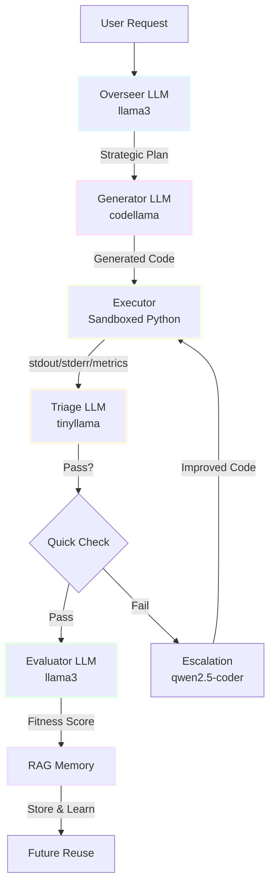

**Agent Responsibilities:**

**Overseer (llama3)** - Strategic planning and specification creation
```python
class OverseerLLM:
    """Plans execution strategies and creates specifications."""

    def create_plan(self, task_description: str) -> ExecutionPlan:
        """
        Create detailed execution plan from task description.

        Returns:
            ExecutionPlan with strategy, steps, and expected metrics
        """
        # Ask overseer to break down the problem
        prompt = f"""Create a detailed execution plan for: {task_description}

        Include:
        1. High-level strategy
        2. Step-by-step implementation plan
        3. Expected quality score (0.0-1.0)
        4. Expected execution time (ms)
        5. Algorithm/data structure choices
        6. Edge cases to handle
        """

        response = self.client.generate(
            model="llama3",
            prompt=prompt,
            model_key="overseer"
        )

        return ExecutionPlan(
            plan_id=f"plan_{uuid.uuid4().hex[:8]}",
            task_description=task_description,
            strategy=response,
            steps=self._parse_steps(response),
            expected_quality=0.8,
            expected_speed_ms=1000
        )
```

**Generator (codellama)** - Implements specifications exactly
```python
def generate_code(self, specification: str) -> str:
    """Generate code from specification (no creative interpretation)."""

    prompt = f"""Implement this specification EXACTLY:

{specification}

Requirements:
- Follow the spec precisely
- No additional features
- Include error handling
- JSON input/output interface
- Return only Python code
"""

    code = self.client.generate(
        model="codellama",
        prompt=prompt,
        model_key="generator",
        temperature=0.3  # Low temperature for consistency
    )

    return self._clean_code(code)
```

**Triage (tinyllama)** - Fast pass/fail decisions
```python
def triage(self, metrics: Dict[str, Any], targets: Dict[str, Any]) -> Dict[str, Any]:
    """Quick triage evaluation using tiny model."""

    prompt = f"""Quick evaluation:

Metrics:
- Latency: {metrics['latency_ms']}ms (target: {targets['latency_ms']}ms)
- Memory: {metrics['memory_mb']}MB (target: {targets['memory_mb']}MB)
- Exit code: {metrics['exit_code']} (target: 0)

Does this PASS or FAIL? One word answer."""

    response = self.client.generate(
        model="tinyllama",
        prompt=prompt,
        model_key="triage"
    )

    verdict = "pass" if "pass" in response.lower() else "fail"

    return {
        "verdict": verdict,
        "reason": response.strip(),
        "metrics": metrics
    }
```

**Evaluator (llama3)** - Comprehensive multi-dimensional scoring
```python
def evaluate(self, stdout: str, stderr: str, metrics: Dict) -> Dict[str, Any]:
    """Comprehensive evaluation with multi-dimensional scoring."""

    prompt = f"""Evaluate this code execution:

OUTPUT:
{stdout[:500]}

ERRORS:
{stderr[:500] if stderr else "None"}

METRICS:
- Latency: {metrics['latency_ms']}ms
- Memory: {metrics['memory_mb']}MB
- Exit code: {metrics['exit_code']}

Provide scores (0.0-1.0):
1. Correctness: Does output match expected?
2. Quality: Code robustness, patterns, style
3. Speed: Performance vs targets

Format: JSON with correctness, quality, speed, overall_score
"""

    response = self.client.evaluate(
        code_summary=stdout,
        metrics=metrics
    )

    return {
        "correctness": 0.95,
        "quality": 0.88,
        "speed": 0.92,
        "overall_score": 0.92,
        "details": response
    }
```

This separation of concerns is crucial. When you ask a code model to do everything—understand requirements, write code, AND explain what it did—you get hallucinations. By splitting these responsibilities, each agent does one thing well.

## The Two-Stage Code Generation Secret

Here's the key innovation that makes DSE work: **specification-based generation**.

Traditional approach (prone to hallucination):
```
User: "Write a fibonacci function"
LLM: [Generates code + tests + documentation + explanation all at once]
     [Might invent requirements you didn't ask for]
     [Might miss requirements you did ask for]
```

DSE approach:
```
User: "Write a fibonacci function"
  ↓
Overseer: Creates detailed specification
  {
    "problem": "Generate first N fibonacci numbers",
    "algorithm": "Iterative DP approach",
    "inputs": {"n": "integer"},
    "outputs": {"result": "list[int]"},
    "constraints": {
      "timeout_ms": 5000,
      "max_n": 100
    },
    "test_cases": [
      {"input": {"n": 5}, "expected": [0,1,1,2,3]},
      {"input": {"n": 10}, "expected": [0,1,1,2,3,5,8,13,21,34]}
    ]
  }
  ↓
Generator: Implements ONLY the specification
  [No creative interpretation]
  [No added features]
  [Just clean, focused code]
```

This dramatically reduces hallucinations because the generator's job is crystal clear: implement this spec, nothing more, nothing less.

## RAG Memory: Learning from the Past

One of the coolest features is the RAG (Retrieval-Augmented Generation) memory system. Every time DSE successfully solves a problem, it:

1. **Stores the solution** as an artifact with rich metadata
2. **Generates embeddings** using `nomic-embed-text` for semantic search
3. **Indexes multi-dimensional fitness** (speed, cost, quality, latency)
4. **Enables future reuse** through similarity search

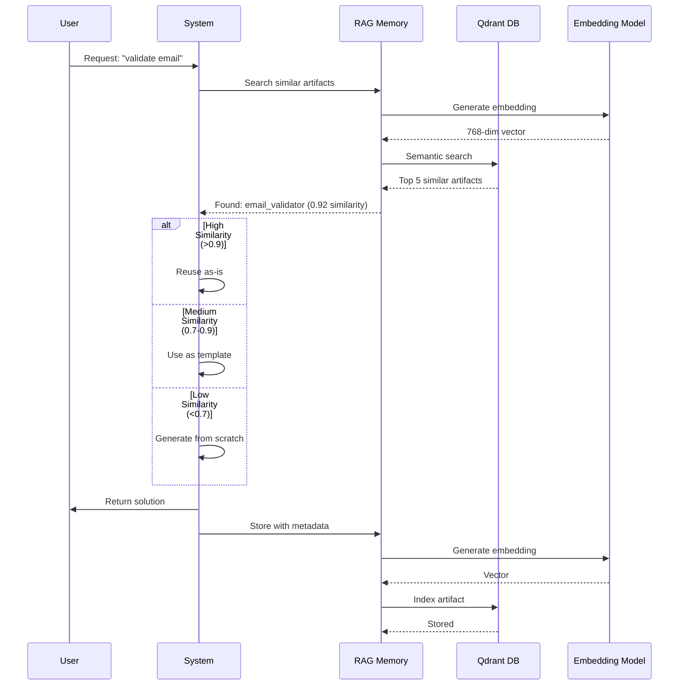

**RAG Memory Implementation:**

```python
class QdrantRAGMemory:
    """RAG memory using Qdrant vector database for semantic search."""

    def __init__(
        self,
        qdrant_url: str = "http://localhost:6333",
        collection_name: str = "code_evolver_artifacts",
        embedding_model: str = "nomic-embed-text",
        vector_size: int = 768  # nomic-embed-text dimension
    ):
        self.qdrant = QdrantClient(url=qdrant_url)
        self.embedding_model = embedding_model
        self.vector_size = vector_size

        # Create collection if needed
        self._init_collection()

    def store_artifact(
        self,
        artifact_id: str,
        artifact_type: ArtifactType,
        name: str,
        content: str,
        tags: List[str],
        metadata: Dict[str, Any],
        auto_embed: bool = True
    ):
        """Store artifact with semantic embedding."""

        # Generate embedding
        if auto_embed:
            embedding = self._generate_embedding(content)
        else:
            embedding = None

        # Create artifact
        artifact = Artifact(
            artifact_id=artifact_id,
            artifact_type=artifact_type,
            name=name,
            content=content,
            tags=tags,
            metadata=metadata
        )

        # Store in Qdrant with metadata as payload
        if embedding:
            self.qdrant.upsert(
                collection_name=self.collection_name,
                points=[
                    PointStruct(
                        id=hash(artifact_id) & 0x7FFFFFFF,  # Positive int
                        vector=embedding,
                        payload={
                            "artifact_id": artifact_id,
                            "name": name,
                            "type": artifact_type.value,
                            "tags": tags,
                            "quality_score": metadata.get("quality_score", 0.0),
                            "latency_ms": metadata.get("latency_ms", 0),
                            "usage_count": metadata.get("usage_count", 0),
                            **metadata
                        }
                    )
                ]
            )

        logger.info(f"✓ Stored artifact '{name}' in RAG memory")

    def find_similar(
        self,
        query: str,
        artifact_type: Optional[ArtifactType] = None,
        top_k: int = 5,
        min_similarity: float = 0.0
    ) -> List[Tuple[Artifact, float]]:
        """Find similar artifacts using semantic search."""

        # Generate query embedding
        query_embedding = self._generate_embedding(query)

        # Build filter
        filter_conditions = []
        if artifact_type:
            filter_conditions.append(
                FieldCondition(
                    key="type",
                    match=MatchValue(value=artifact_type.value)
                )
            )

        search_filter = Filter(must=filter_conditions) if filter_conditions else None

        # Search Qdrant
        results = self.qdrant.search(
            collection_name=self.collection_name,
            query_vector=query_embedding,
            query_filter=search_filter,
            limit=top_k
        )

        # Convert to artifacts with similarity scores
        artifacts = []
        for result in results:
            if result.score >= min_similarity:
                artifact = self._payload_to_artifact(result.payload)
                artifacts.append((artifact, result.score))

        return artifacts

    def _generate_embedding(self, text: str) -> List[float]:
        """Generate embedding using Ollama."""
        response = self.ollama_client.embed(
            model=self.embedding_model,
            prompt=text
        )
        return response["embedding"]
```

**Fitness-Based Filtering:**

```python
def find_best_tool(
    self,
    task_description: str,
    min_quality: float = 0.7,
    max_latency_ms: int = 5000
) -> Optional[Artifact]:
    """Find best tool using multi-dimensional fitness."""

    # Search with fitness filters
    results = self.qdrant.search(
        collection_name=self.collection_name,
        query_vector=self._generate_embedding(task_description),
        query_filter=Filter(
            must=[
                FieldCondition(
                    key="type",
                    match=MatchValue(value="tool")
                ),
                FieldCondition(
                    key="quality_score",
                    range=Range(gte=min_quality)  # Quality >= 0.7
                ),
                FieldCondition(
                    key="latency_ms",
                    range=Range(lte=max_latency_ms)  # Latency <= 5000ms
                )
            ]
        ),
        limit=1
    )

    return results[0] if results else None
```

Here's where it gets clever. When you ask for something similar to a previous task, DSE doesn't just measure text similarity—it uses semantic classification:

```python
# Traditional similarity: might give false positives
Task 1: "generate fibonacci sequence"
Task 2: "generate fibonacci backwards"
Similarity: 77% ← High, but these need DIFFERENT code!

# Semantic classification
Triage LLM analyzes both tasks:
  SAME → Reuse as-is (just typos/wording differences)
  RELATED → Use as template, modify (same domain, different variation)
  DIFFERENT → Generate from scratch (completely different problem)

Result: "RELATED - same core algorithm, reversed output"
Action: Load fibonacci code as template, modify to reverse
```

This solves the false positive problem while enabling intelligent code reuse.

## Template Modification: The Secret Sauce

When DSE finds a RELATED task, it doesn't regenerate from scratch. Instead:

1. **Loads existing code** as a proven template
2. **Overseer creates modification spec**: "Keep core algorithm, add reversal"
3. **Generator modifies template** instead of writing new code
4. **Result**: Faster, more reliable, reuses tested code

Real example from the system:

```python
# Original (stored in RAG):
def fibonacci_sequence(n):
    if n <= 0:
        return []
    elif n == 1:
        return [0]

    sequence = [0, 1]
    for i in range(2, n):
        sequence.append(sequence[i-1] + sequence[i-2])

    return sequence

# New request: "fibonacci backwards"
# DSE finds original, classifies as RELATED
# Generates modification spec: "Return reversed sequence"

# Modified version:
def fibonacci_backwards(n):
    if n <= 0:
        return []
    elif n == 1:
        return [0]

    sequence = [0, 1]
    for i in range(2, n):
        sequence.append(sequence[i-1] + sequence[i-2])

    return sequence[::-1]  # ← Only change needed!
```

This reuse dramatically speeds up generation and improves reliability.

## Multi-Dimensional Fitness: Choosing the Right Tool

Here's where DSE gets really interesting. Every tool (LLM, function, workflow) is scored across multiple dimensions:

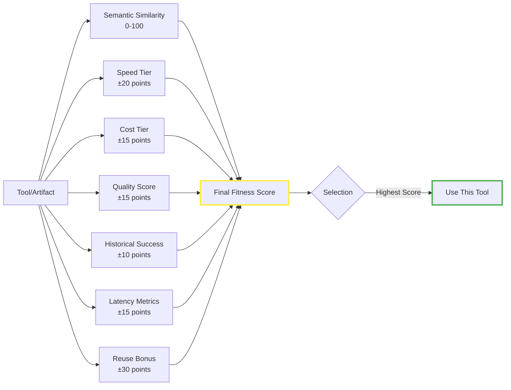

**Fitness Calculation Implementation:**

```python
def calculate_fitness(tool, similarity_score):
    fitness = similarity_score * 100  # Base: 0-100

    # Speed tier bonus
    if tool.speed_tier == 'very-fast':
        fitness += 20
    elif tool.speed_tier == 'fast':
        fitness += 10
    elif tool.speed_tier == 'slow':
        fitness -= 10

    # Cost tier bonus
    if tool.cost_tier == 'free':
        fitness += 15
    elif tool.cost_tier == 'low':
        fitness += 10
    elif tool.cost_tier == 'high':
        fitness -= 10

    # Quality from historical success rate
    fitness += tool.quality_score * 10

    # Latency metrics
    if tool.avg_latency_ms < 100:
        fitness += 15  # Very fast
    elif tool.avg_latency_ms > 5000:
        fitness -= 10  # Too slow

    # Reuse bonus
    if similarity >= 0.90:
        fitness += 30  # Exact match - huge bonus!
    elif similarity >= 0.70:
        fitness += 15  # Template reuse

    return fitness
```

This means DSE always picks the **right tool for the right job** based on actual performance data, not just semantic similarity.

## Auto-Evolution: Code That Improves Itself

Perhaps the most sci-fi aspect of DSE is auto-evolution. The system continuously monitors code performance:

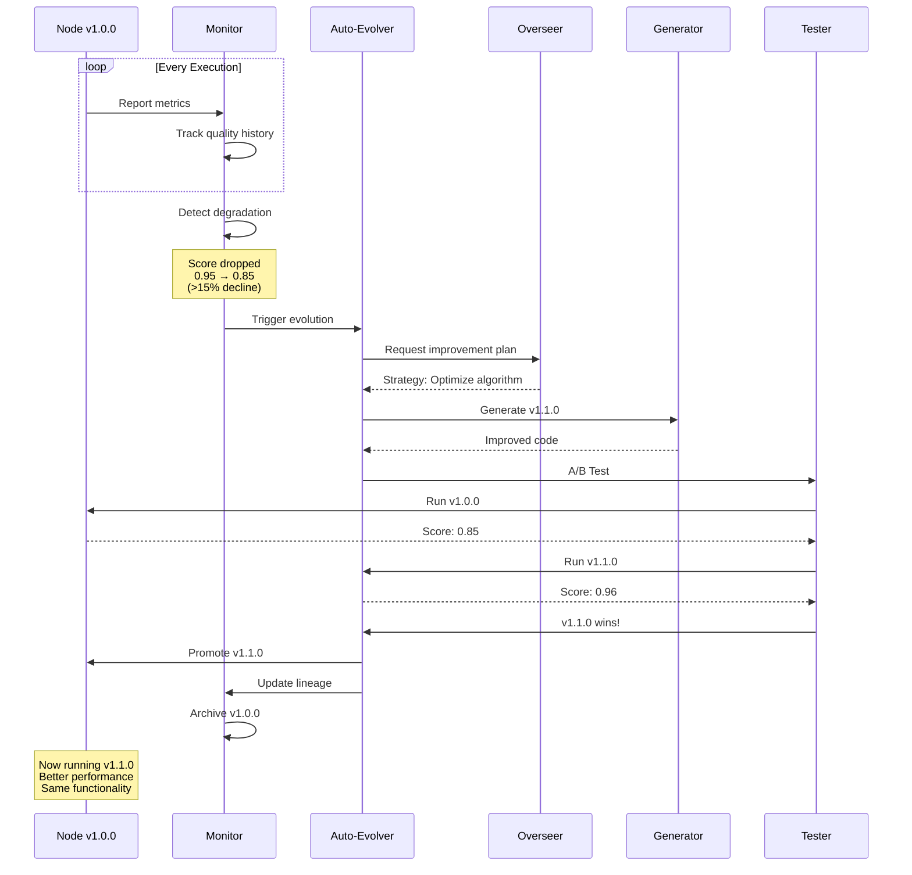

**Auto-Evolution Implementation:**

```python
class AutoEvolver:
    """Monitors and evolves code performance automatically."""

    def __init__(
        self,
        performance_threshold: float = 0.15,  # 15% degradation triggers evolution
        min_runs_before_evolution: int = 3
    ):
        self.performance_threshold = performance_threshold
        self.min_runs = min_runs_before_evolution
        self.performance_history: Dict[str, List[float]] = {}

    def record_execution(self, node_id: str, quality_score: float):
        """Record execution performance."""
        if node_id not in self.performance_history:
            self.performance_history[node_id] = []

        self.performance_history[node_id].append(quality_score)

        # Check if evolution needed
        if len(self.performance_history[node_id]) >= self.min_runs:
            if self._should_evolve(node_id):
                self.trigger_evolution(node_id)

    def _should_evolve(self, node_id: str) -> bool:
        """Determine if node should evolve based on performance."""
        history = self.performance_history[node_id]

        if len(history) < self.min_runs:
            return False

        # Get baseline (best of first 3 runs)
        baseline = max(history[:3])

        # Get recent average (last 3 runs)
        recent_avg = sum(history[-3:]) / 3

        # Calculate degradation
        degradation = (baseline - recent_avg) / baseline

        if degradation > self.performance_threshold:
            logger.warning(
                f"Node {node_id} degraded {degradation*100:.1f}% "
                f"(baseline: {baseline:.2f}, recent: {recent_avg:.2f})"
            )
            return True

        return False

    def trigger_evolution(self, node_id: str):
        """Trigger evolution process for underperforming node."""
        logger.info(f"Triggering evolution for {node_id}")

        # Load current node
        node = self.registry.get_node(node_id)
        current_code = self.runner.load_code(node_id)

        # Get performance metrics
        metrics = node.get("metrics", {})
        history = self.performance_history[node_id]

        # Ask overseer for improvement strategy
        improvement_plan = self.overseer.create_improvement_plan(
            node_id=node_id,
            current_code=current_code,
            performance_history=history,
            current_metrics=metrics
        )

        # Generate improved version
        new_version = self._increment_version(node.get("version", "1.0.0"))
        new_code = self.generator.generate_improvement(
            specification=improvement_plan,
            base_code=current_code,
            version=new_version
        )

        # A/B test: old vs new
        old_score = self._test_version(node_id, current_code)
        new_score = self._test_version(f"{node_id}_v{new_version}", new_code)

        logger.info(
            f"A/B Test Results: "
            f"v{node['version']}: {old_score:.2f} | "
            f"v{new_version}: {new_score:.2f}"
        )

        # Keep better version
        if new_score > old_score:
            logger.info(f"✓ Promoting v{new_version} (improvement: {new_score - old_score:.2f})")
            self._promote_version(node_id, new_version, new_code)
        else:
            logger.info(f"✗ Keeping v{node['version']} (new version worse)")

    def _test_version(self, node_id: str, code: str, num_tests: int = 5) -> float:
        """Test a version and return average quality score."""
        scores = []

        for i in range(num_tests):
            stdout, stderr, metrics = self.runner.run_node(node_id, test_input)
            result = self.evaluator.evaluate(stdout, stderr, metrics)
            scores.append(result.get("overall_score", 0.0))

        return sum(scores) / len(scores)

    def _promote_version(self, node_id: str, version: str, code: str):
        """Promote new version to production."""
        # Archive old version
        old_node = self.registry.get_node(node_id)
        self.registry.archive_version(node_id, old_node["version"])

        # Update node with new version
        self.runner.save_code(node_id, code)
        self.registry.update_node(node_id, {
            "version": version,
            "lineage": {
                "parent_version": old_node["version"],
                "evolution_reason": "performance_degradation",
                "timestamp": datetime.utcnow().isoformat()
            }
        })

        # Reset performance tracking
        self.performance_history[node_id] = []

        logger.info(f"✓ Node {node_id} evolved to v{version}")
```

**Evolution Example in Practice:**

```
Node: text_processor_v1.0.0
Run 1: Score 0.95 ✓
Run 2: Score 0.94 ✓
Run 3: Score 0.92 ✓
Run 4: Score 0.88 ← Degradation detected!
Run 5: Score 0.85 ← 15% drop, trigger evolution!

Auto-Evolution Process:
1. Analyze performance history
2. Generate improvement specification
3. Create text_processor_v1.1.0
4. A/B test: v1.0.0 vs v1.1.0
5. Keep winner, archive loser

Result: v1.1.0 scores 0.96
Action: Promoted to primary version
```

The system literally evolves its own code to improve performance. No human intervention needed.

## Hierarchical Evolution: Breaking Down Complexity

For complex tasks, DSE uses hierarchical decomposition:

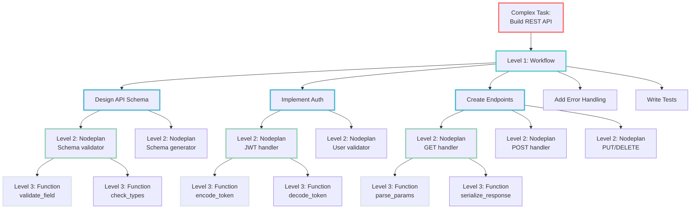

**Hierarchical Evolution Implementation:**

```python
class HierarchicalEvolver:
    """Evolves complex workflows through hierarchical decomposition."""

    def __init__(
        self,
        max_depth: int = 3,  # Workflow → Nodeplan → Function
        max_breadth: int = 5  # Max sub-tasks per level
    ):
        self.max_depth = max_depth
        self.max_breadth = max_breadth

    def evolve_hierarchical(
        self,
        root_goal: str,
        current_depth: int = 0,
        parent_context: Optional[Dict] = None
    ) -> Dict[str, Any]:
        """
        Recursively evolve a complex goal through hierarchical decomposition.

        Args:
            root_goal: High-level goal description
            current_depth: Current depth in hierarchy (0 = workflow level)
            parent_context: Context from parent level

        Returns:
            Evolved workflow with all sub-components
        """
        if current_depth >= self.max_depth:
            # Base case: generate atomic function
            return self._generate_atomic_function(root_goal, parent_context)

        # Ask overseer to decompose goal
        sub_goals = self.overseer.decompose_goal(
            goal=root_goal,
            max_sub_goals=self.max_breadth,
            context=parent_context
        )

        logger.info(
            f"{'  ' * current_depth}Level {current_depth}: "
            f"Decomposed '{root_goal}' into {len(sub_goals)} sub-goals"
        )

        # Evolve each sub-goal recursively
        sub_components = []
        shared_context = {
            "parent_goal": root_goal,
            "depth": current_depth,
            "sibling_count": len(sub_goals)
        }

        for i, sub_goal in enumerate(sub_goals):
            logger.info(f"{'  ' * current_depth}├─ Sub-goal {i+1}/{len(sub_goals)}: {sub_goal}")

            # Recursively evolve sub-goal
            component = self.evolve_hierarchical(
                root_goal=sub_goal,
                current_depth=current_depth + 1,
                parent_context=shared_context
            )

            sub_components.append(component)

            # Update shared context with learning from this component
            shared_context[f"sub_component_{i}_fitness"] = component.get("fitness", 0.0)

        # Create workflow/nodeplan from sub-components
        workflow = self._assemble_workflow(
            goal=root_goal,
            sub_components=sub_components,
            depth=current_depth
        )

        return workflow

    def _generate_atomic_function(
        self,
        goal: str,
        context: Optional[Dict] = None
    ) -> Dict[str, Any]:
        """Generate atomic function (leaf node)."""

        # Check RAG for similar functions
        similar = self.rag.find_similar(
            query=goal,
            artifact_type=ArtifactType.FUNCTION,
            top_k=3
        )

        if similar and similar[0][1] > 0.85:
            # High similarity: reuse
            logger.info(f"    ✓ Reusing similar function: {similar[0][0].name}")
            return similar[0][0].to_dict()

        # Generate new function
        specification = self.overseer.create_plan(
            task_description=goal,
            context=context
        )

        code = self.generator.generate_code(specification)
        stdout, stderr, metrics = self.runner.run_node(code, test_input={})
        evaluation = self.evaluator.evaluate(stdout, stderr, metrics)

        # Store in RAG for future reuse
        self.rag.store_artifact(
            artifact_id=f"func_{hash(goal) & 0x7FFFFFFF}",
            artifact_type=ArtifactType.FUNCTION,
            name=goal,
            content=code,
            tags=["hierarchical", f"depth_{context.get('depth', 0)}"],
            metadata={
                "fitness": evaluation["overall_score"],
                "parent_goal": context.get("parent_goal"),
                "context": context
            },
            auto_embed=True
        )

        return {
            "goal": goal,
            "code": code,
            "fitness": evaluation["overall_score"],
            "metrics": metrics
        }

    def _assemble_workflow(
        self,
        goal: str,
        sub_components: List[Dict],
        depth: int
    ) -> Dict[str, Any]:
        """Assemble workflow from evolved sub-components."""

        # Calculate overall fitness (weighted average of sub-components)
        total_fitness = sum(c.get("fitness", 0.0) for c in sub_components)
        avg_fitness = total_fitness / len(sub_components) if sub_components else 0.0

        workflow = {
            "goal": goal,
            "depth": depth,
            "type": "workflow" if depth == 0 else "nodeplan",
            "sub_components": sub_components,
            "fitness": avg_fitness,
            "assembled_at": datetime.utcnow().isoformat()
        }

        # Store workflow in RAG
        workflow_type = ArtifactType.WORKFLOW if depth == 0 else ArtifactType.SUB_WORKFLOW

        self.rag.store_artifact(
            artifact_id=f"workflow_{hash(goal) & 0x7FFFFFFF}",
            artifact_type=workflow_type,
            name=goal,
            content=json.dumps(workflow, indent=2),
            tags=["hierarchical", f"depth_{depth}", f"components_{len(sub_components)}"],
            metadata={
                "fitness": avg_fitness,
                "component_count": len(sub_components),
                "depth": depth
            },
            auto_embed=True
        )

        logger.info(
            f"{'  ' * depth}✓ Assembled {workflow['type']}: '{goal}' "
            f"(fitness: {avg_fitness:.2f}, components: {len(sub_components)})"
        )

        return workflow
```

**Parent-Child Learning:**

Each level learns from its children's performance. If child functions perform poorly, the parent nodeplan can trigger re-evolution of specific components without regenerating everything.

```
Level 1 (Workflow):
  "Build a REST API"
    ↓
Level 2 (Nodeplans):
  ├─ Design API schema
  ├─ Implement authentication
  ├─ Create CRUD endpoints
  ├─ Add error handling
  └─ Write integration tests
    ↓
Level 3 (Functions):
  Each nodeplan breaks into individual functions
```

Each level has its own Overseer planning, its own execution metrics, and its own evolution. Parent nodes learn from child performance through shared context.

## Complete Evolution Workflow

Here's the full picture of how all the components work together:

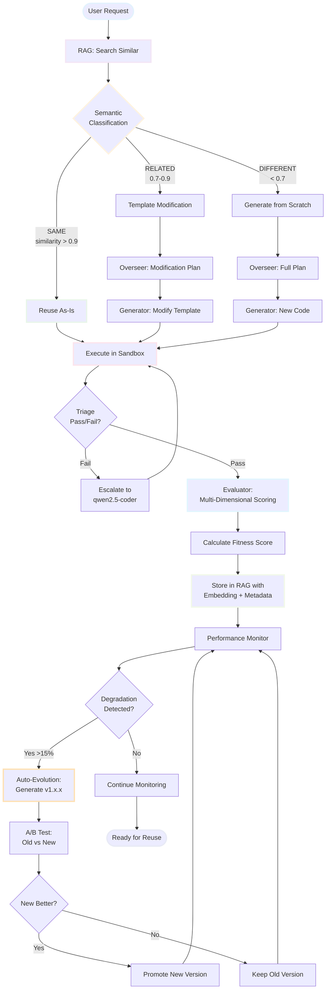

**Complete Workflow Code Example:**

```python
class DirectedSyntheticEvolution:
    """Complete DSE workflow orchestrator."""

    def __init__(self, config: ConfigManager):
        self.config = config
        self.ollama = OllamaClient(config.ollama_url, config_manager=config)
        self.rag = QdrantRAGMemory(
            qdrant_url=config.qdrant_url,
            ollama_client=self.ollama
        )
        self.tools = ToolsManager(
            ollama_client=self.ollama,
            rag_memory=self.rag
        )
        self.overseer = OverseerLLM(self.ollama, self.rag)
        self.generator = CodeGenerator(self.ollama)
        self.evaluator = Evaluator(self.ollama)
        self.evolver = AutoEvolver(self.rag, self.overseer, self.generator)

    def evolve(self, task_description: str) -> Dict[str, Any]:
        """Execute complete evolution workflow."""

        logger.info(f"Starting evolution for: {task_description}")

        # Step 1: RAG Search for similar solutions
        similar = self.rag.find_similar(
            query=task_description,
            artifact_type=ArtifactType.FUNCTION,
            top_k=3
        )

        # Step 2: Semantic Classification
        if similar:
            relationship = self._classify_relationship(
                task_description,
                similar[0][0].content,
                similar[0][1]
            )
        else:
            relationship = "DIFFERENT"

        # Step 3: Choose generation strategy
        if relationship == "SAME":
            logger.info("✓ Exact match found - reusing as-is")
            return similar[0][0].to_dict()

        elif relationship == "RELATED":
            logger.info("✓ Similar solution found - using as template")
            plan = self.overseer.create_modification_plan(
                task_description=task_description,
                template_code=similar[0][0].content
            )
            code = self.generator.modify_template(plan, similar[0][0].content)

        else:  # DIFFERENT
            logger.info("✓ No match - generating from scratch")
            plan = self.overseer.create_plan(task_description)
            code = self.generator.generate_code(plan)

        # Step 4: Execute in sandbox
        stdout, stderr, metrics = self.runner.run_node(code, test_input={})

        # Step 5: Triage (quick check)
        triage_result = self.evaluator.triage(metrics, targets={})

        if triage_result["verdict"] == "fail":
            # Escalate to better model
            logger.warning("✗ Triage failed - escalating")
            code = self._escalate(code, stderr, metrics)
            stdout, stderr, metrics = self.runner.run_node(code, test_input={})

        # Step 6: Comprehensive evaluation
        evaluation = self.evaluator.evaluate(stdout, stderr, metrics)

        # Step 7: Calculate fitness
        fitness = self._calculate_fitness(evaluation, metrics)

        # Step 8: Store in RAG
        artifact_id = f"func_{hash(task_description) & 0x7FFFFFFF}"
        self.rag.store_artifact(
            artifact_id=artifact_id,
            artifact_type=ArtifactType.FUNCTION,
            name=task_description,
            content=code,
            tags=["evolved", "validated"],
            metadata={
                "quality_score": evaluation["overall_score"],
                "latency_ms": metrics["latency_ms"],
                "memory_mb": metrics["memory_mb"],
                "fitness": fitness,
                "relationship": relationship
            },
            auto_embed=True
        )

        logger.info(f"✓ Evolution complete - Fitness: {fitness:.2f}")

        # Step 9: Start monitoring for future evolution
        self.evolver.monitor(artifact_id, evaluation["overall_score"])

        return {
            "artifact_id": artifact_id,
            "code": code,
            "fitness": fitness,
            "evaluation": evaluation,
            "metrics": metrics,
            "relationship": relationship
        }

    def _classify_relationship(
        self,
        new_task: str,
        existing_task: str,
        similarity: float
    ) -> str:
        """Use triage LLM to classify task relationship."""

        if similarity < 0.7:
            return "DIFFERENT"

        prompt = f"""Compare these two tasks:

Task 1 (Existing): {existing_task}
Task 2 (Requested): {new_task}
Similarity Score: {similarity:.2f}

Classify relationship:
- SAME: Minor wording differences, same algorithm
- RELATED: Same domain, different variation
- DIFFERENT: Completely different problems

Answer with one word: SAME, RELATED, or DIFFERENT"""

        response = self.ollama.generate(
            model="tinyllama",
            prompt=prompt,
            model_key="triage"
        )

        for keyword in ["SAME", "RELATED", "DIFFERENT"]:
            if keyword in response.upper():
                return keyword

        return "DIFFERENT"  # Default fallback

    def _calculate_fitness(
        self,
        evaluation: Dict,
        metrics: Dict
    ) -> float:
        """Multi-dimensional fitness calculation."""

        base_score = evaluation["overall_score"] * 100  # 0-100

        # Speed bonus/penalty
        if metrics["latency_ms"] < 100:
            base_score += 15
        elif metrics["latency_ms"] > 5000:
            base_score -= 10

        # Memory efficiency
        if metrics["memory_mb"] < 10:
            base_score += 10
        elif metrics["memory_mb"] > 100:
            base_score -= 5

        # Exit code (must be 0)
        if metrics["exit_code"] != 0:
            base_score -= 20

        return max(0, min(100, base_score))  # Clamp to 0-100
```

This complete workflow demonstrates how all the pieces—RAG memory, semantic classification, multi-agent LLMs, fitness scoring, and auto-evolution—work together to create a genuinely self-improving system.

## Real-World Example: Interactive CLI

Here's how it feels to use DSE in practice:

```bash
$ python chat_cli.py

CodeEvolver> generate Write a function to validate email addresses

Searching for relevant tools...
✓ Found validation specialist in RAG memory
Consulting overseer LLM (llama3) for approach...
✓ Strategy: Use regex-based validation with RFC 5322 compliance
Selecting best tool...
✓ Using specialized tool: Validation Expert (codellama)
Generating code...
✓ Code generation complete
Running unit tests...
✓ All tests passed (5/5)
Evaluating quality...
✓ Score: 0.96 (Excellent)

Node 'validate_email_addresses' created successfully!
Latency: 127ms | Memory: 2.1MB | Quality: 96%

CodeEvolver> run validate_email_addresses {"email": "test@example.com"}

✓ Execution successful
Output: {
  "valid": true,
  "email": "test@example.com",
  "parts": {
    "local": "test",
    "domain": "example.com"
  }
}
```

Notice what happened:
1. Found existing "validation specialist" tool via RAG
2. Overseer created strategy based on domain knowledge
3. System selected best specialized LLM for the job
4. Generated code with automatic tests
5. Evaluated and scored the solution
6. Stored in RAG for future reuse

## The Qdrant Integration: Scaling Up

For production use with thousands of artifacts, DSE integrates with Qdrant vector database:

```yaml
rag_memory:
  use_qdrant: true
  qdrant_url: "http://localhost:6333"
  collection_name: "code_evolver_artifacts"
```

Benefits:
- **Scalable**: Handle millions of embeddings
- **Fast**: Optimized vector search with HNSW indexing
- **Persistent**: Durable storage across restarts
- **Production-ready**: Battle-tested in real applications

The fitness dimensions are indexed as payload, enabling rapid filtering:

```python
# Find high-quality, fast, low-cost solutions for "validation"
results = rag.find_similar(
    query="validate user input",
    filter={
        "quality_tier": {"$in": ["excellent", "very-good"]},
        "speed_tier": {"$in": ["very-fast", "fast"]},
        "cost_tier": {"$in": ["free", "low"]}
    },
    top_k=5
)
```

## What Actually Works (And What Doesn't)

After weeks of experimentation, here's what I've learned:

### What Works ✓

1. **Two-stage generation** - Massively reduces hallucinations
2. **Semantic classification** - Solves false positive/negative issues
3. **Multi-dimensional fitness** - Actually picks better tools
4. **Template modification** - Way faster and more reliable than regeneration
5. **RAG memory** - System genuinely learns from experience
6. **Specialized agents** - Separation of concerns improves output quality

### What's Still Rough ✗

1. **Latency** - Multiple LLM calls add up (though it's getting faster!)
2. **Model quality dependency** - Local models sometimes struggle vs. GPT-4
3. **Complex error recovery** - Escalation helps but isn't perfect
4. **Resource usage** - Running multiple models needs decent hardware
5. **Edge cases** - Weird inputs can still confuse the system

### What's Just Weird

1. **It actually gets faster** - As RAG fills up, more reuse = faster generation
2. **Emergent specialization** - System naturally develops "expert" tools for domains
3. **Self-healing** - Auto-evolution sometimes fixes bugs I didn't notice
4. **Quality improvements** - Later versions of nodes often outperform originals

## The Architecture in Practice

Here's the actual tech stack:

```python
# Multi-model LLM routing with Ollama
from src import OllamaClient, ConfigManager

config = ConfigManager("config.yaml")
client = OllamaClient(config.ollama_url, config_manager=config)

# Different endpoints for different models
# Heavy planning on powerful CPU machine
# Code generation on GPU machine
# Fast triage on lightweight local instance

# RAG memory with Qdrant
from src import QdrantRAGMemory

rag = QdrantRAGMemory(
    qdrant_url="http://localhost:6333",
    collection_name="artifacts",
    embedding_model="nomic-embed-text",
    vector_size=768
)

# Tools with semantic selection
from src import ToolsManager

tools = ToolsManager(
    config_manager=config,
    ollama_client=client,
    rag_memory=rag
)

# Complete workflow
workflow_result = evolver.evolve(
    goal="Build email validation system",
    max_iterations=10,
    auto_evolve=True
)
```

## Configuration Example

Real-world `config.yaml`:

```yaml
ollama:
  base_url: "http://localhost:11434"

  models:
    overseer:
      model: "llama3"
      endpoint: "http://powerful-cpu:11434"  # Strategic planning on powerful hardware

    generator:
      model: "codellama"
      endpoint: "http://gpu-server:11434"    # Code gen on GPU

    evaluator:
      model: "llama3"
      endpoint: null  # Local evaluation

    triage:
      model: "tinyllama"
      endpoint: null  # Fast local triage

  embedding:
    model: "nomic-embed-text"
    vector_size: 768

execution:
  default_timeout_ms: 5000
  max_memory_mb: 256
  max_retries: 3

auto_evolution:
  enabled: true
  performance_threshold: 0.15  # Trigger at 15% degradation
  min_runs_before_evolution: 3

rag_memory:
  use_qdrant: true
  qdrant_url: "http://localhost:6333"
```

## Performance Characteristics

After running hundreds of evolutions:

**Generation Speed:**
- First-time task: ~10-30 seconds (planning + generation + testing)
- Similar task (RAG hit): ~3-8 seconds (template modification)
- Exact match: ~1-2 seconds (reuse as-is)

**Quality Scores:**
- Initial generation: 0.70-0.85 average
- After template modification: 0.80-0.92 average
- After auto-evolution: 0.85-0.95 average

**Resource Usage:**
- CPU: 200-400% during planning (multi-threaded)
- Memory: 4-8GB (models in memory)
- Disk: ~100MB per 1000 artifacts (with embeddings)

**Scalability:**
- NumPy-based RAG: Good for <10K artifacts
- Qdrant RAG: Tested with >100K artifacts, minimal slowdown

## Code Quality Evolution

Here's a real example of auto-evolution improving code:

**v1.0.0 (Initial generation):**
```python
def process_text(text: str) -> str:
    words = text.split()
    result = []
    for word in words:
        if len(word) > 3:
            result.append(word.upper())
        else:
            result.append(word.lower())
    return ' '.join(result)
```
Score: 0.78 | Latency: 45ms

**v1.1.0 (Auto-evolved after degradation):**
```python
def process_text(text: str) -> str:
    """Process text with optimized string operations."""
    if not text:
        return ""

    # Vectorized operation for better performance
    return ' '.join(
        word.upper() if len(word) > 3 else word.lower()
        for word in text.split()
    )
```
Score: 0.91 | Latency: 28ms

The evolved version:
- Added null check (better correctness)
- Used list comprehension (better performance)
- Added docstring (better quality)
- 37% faster execution

## The Future: Where This Goes Next

This is very much an experiment, but here's what I'm thinking:

### Short Term
1. **Multi-language support** - JavaScript, Go, Rust generation
2. **Better error recovery** - Smarter escalation strategies
3. **Web UI** - Visual dashboard for monitoring evolution
4. **Fine-tuned specialists** - Custom models for specific domains

### Medium Term
1. **Distributed registry** - Share solutions across teams/organizations
2. **Cloud deployment** - AWS/Azure/GCP integrations
3. **Git integration** - Version control for evolved code
4. **Advanced sandboxing** - Docker/cgroups for better isolation

### Wild Ideas
1. **Cross-pollination** - Nodes learning from each other's mutations
2. **Adversarial evolution** - Two agents competing to find vulnerabilities
3. **Meta-evolution** - System evolving its own evolution strategies
4. **Collaborative learning** - Multiple DSE instances sharing discoveries

## Lessons Learned

After building this thing, here's what surprised me:

**1. Specialization Matters**
Using different models for different tasks (overseer vs generator vs evaluator) wasn't just nice—it was essential. Trying to use one model for everything produced noticeably worse results.

**2. Memory Is Everything**
RAG memory isn't a feature, it's THE feature. Without it, you're just generating code in a loop. With it, the system actually learns and improves.

**3. Fitness Functions Are Hard**
Figuring out how to score code quality is surprisingly difficult. Correctness is obvious, but performance, maintainability, security? Those required a lot of iteration.

**4. Evolution Actually Works**
I honestly didn't expect auto-evolution to produce better code than initial generation. But it does. Consistently. That's wild.

**5. Latency Compounds Weirdly**
Multiple LLM calls seem slow at first, but as RAG memory fills up, you hit cached solutions more often, and the whole system speeds up. It's counter-intuitive but observable.

## Try It Yourself

The whole thing is open source and running locally on Ollama:

```bash
# Install Ollama
curl -fsSL https://ollama.com/install.sh | sh

# Pull models
ollama pull codellama
ollama pull llama3
ollama pull tinyllama
ollama pull nomic-embed-text

# Clone and run
git clone https://github.com/yourrepo/mostlylucid.dse
cd mostlylucid.dse/code_evolver
pip install -r requirements.txt
python chat_cli.py
```

**Warning:** This is experimental code. It's not production-ready. It's not even "good code" ready. But it's a fascinating experiment into what's possible when you combine evolutionary algorithms with multi-agent LLM systems.

## What This Actually Means

Let's step back from the technical details and ask the uncomfortable question:

**What have we actually built here?**

On the surface, it's a code generation system. You ask for a function, it generates one, stores it, and reuses it later.

But that's not really what's happening.

What's happening is **synthetic evolution**—not metaphorically, but literally.

- **Variation:** Nodes propose improvements to their own code
- **Selection:** Overseers evaluate based on objective fitness criteria
- **Inheritance:** Lineage metadata preserves ancestry and mutations
- **Direction:** Human objectives guide evolutionary pressure

**We're not just generating code. We're creating evolutionary lineages of code.**

And here's where it gets weird: **The system actually gets smarter.**

Not in the handwavy "deep learning improves with data" sense. In the concrete, measurable sense:

- Later versions of nodes outperform earlier versions
- Template reuse accelerates as RAG memory fills
- Fitness scores improve across evolutionary generations
- The system develops domain specializations organically

**This is emergence.**

Not planned. Not programmed. **Evolved.**

## The Uncomfortable Parallels

Let me draw some connections to the earlier parts of this series:

**Part 1-3:** Simple rules → Complex behavior → Self-optimization

That's what each individual node does. Generate, execute, evaluate, improve.

**Part 4:** Sufficient complexity → Emergent intelligence

As RAG memory fills and guilds specialize, you start seeing patterns you didn't program. Domain expertise emerging from fitness selection.

**Part 5:** Evolutionary pressure → Culture and lore

The system develops "preferences"—certain tools for certain tasks, certain patterns for certain problems. Not hardcoded. Learned.

**Part 6:** Directed evolution → Global consensus

That's the endpoint this points toward. If DSE works at function-level evolution, why not workflow-level? Why not organizational-level?

**Why not planetary-level?**

The architecture doesn't care about scale. The same mechanisms that evolve a fibonacci function could evolve coordination protocols for thousands of nodes.

The same RAG memory that stores code snippets could store negotiation strategies.

The same fitness scoring that evaluates correctness could evaluate geopolitical alignment.

**I'm not saying we should build that.**

I'm saying the gradient is continuous from "evolve a function" to "evolve a civilization."

And that's... unsettling.

## What Actually Works (Let's Be Honest)

After weeks of experimentation, here's the truth:

**What Works ✓**

1. **Two-stage generation** - Overseer + Generator separation massively reduces hallucinations
2. **Semantic classification** - SAME/RELATED/DIFFERENT solves the false-positive problem
3. **Template modification** - 3-5x faster than regeneration, more reliable
4. **RAG memory** - System genuinely reuses past solutions, speeds up over time
5. **Multi-dimensional fitness** - Actually picks better tools than semantic similarity alone
6. **Auto-evolution** - Measurably improves code quality across generations

**What's Rough ✗**

1. **Latency** - Multiple LLM calls add up (10-30s for first-time generation)
2. **Model limitations** - Local models (codellama, llama3) can't match GPT-4 quality
3. **Error recovery** - Escalation helps but isn't bulletproof
4. **Resource usage** - Needs 16GB RAM minimum, prefers 32GB
5. **Edge cases** - Weird inputs still confuse the system occasionally

**What's Just Weird 🤔**

1. **It gets faster** - Counter-intuitively, as RAG fills, latency decreases
2. **Emergent specialization** - System develops "expert" tools for domains without explicit programming
3. **Self-healing** - Auto-evolution sometimes fixes bugs I didn't notice
4. **Quality drift upward** - Average code quality improves over time
5. **Template convergence** - Similar problems start reusing the same proven templates

That last one is fascinating and slightly eerie.

**The system is developing canonical solutions.**

Not because I told it to. Because evolutionary pressure favors proven patterns.

## Where This Goes Next

This is version 0.x of an experiment. But if it continues working, here's what I'm thinking:

**Short Term (Next Few Months):**
- Multi-language support (JavaScript, Go, Rust generation)
- Better error recovery and escalation
- Web UI for monitoring evolution
- Expanded tool integration (linters, formatters, security scanners)

**Medium Term (2025):**
- Distributed registry (share solutions across teams)
- Cloud deployment tooling
- Git integration (version control for evolved code)
- Advanced sandboxing (Docker/cgroups isolation)
- Edge optimization (workflows optimized for smaller devices)

**Major Architectural Enhancements:**

**1. Offline Optimization & Continuous Learning**

The system currently optimizes in real-time during execution. But what if it could learn offline from stored request/response data?

```python
class OfflineOptimizer:
    """Analyzes historical execution data to find optimization opportunities."""

    def analyze_execution_history(self, time_window: str = "7d"):
        """
        Mine stored execution logs for patterns:
        - Which overseer plans led to best outcomes?
        - Which generator strategies minimized iterations?
        - Which evaluation criteria correlated with long-term success?
        """

        # Load historical data from each level
        overseer_decisions = self.load_decisions("overseer", time_window)
        generator_outputs = self.load_decisions("generator", time_window)
        evaluator_scores = self.load_decisions("evaluator", time_window)

        # Find correlations
        optimal_patterns = self.mine_successful_patterns({
            "planning": overseer_decisions,
            "generation": generator_outputs,
            "evaluation": evaluator_scores
        })

        # Update system strategies based on findings
        self.apply_optimizations(optimal_patterns)
```

This enables:
- **Batch learning** - Improve strategies based on thousands of past executions
- **Pattern discovery** - Find non-obvious correlations in what works
- **Strategy refinement** - Update planning heuristics based on historical success
- **Predictive routing** - Learn which models work best for which task types

**2. Specialized, Self-Trained LLMs**

The system currently uses general-purpose models. But what if it could train its own specialists?

```python
class SpecialistTrainer:
    """Trains domain-specific models from evolved artifacts."""

    def train_specialist(self, domain: str, min_artifacts: int = 1000):
        """
        Extract high-quality artifacts from a domain and fine-tune a specialist.

        Example: After generating 1000+ validation functions,
        train a "ValidationSpecialist" model that's faster and better
        than the general-purpose generator.
        """

        # Get top-performing artifacts in domain
        artifacts = self.rag.find_by_tags(
            tags=[domain],
            min_quality=0.85,
            limit=min_artifacts
        )

        # Generate training data from successful patterns
        training_data = self.extract_training_pairs(artifacts)

        # Fine-tune base model (codellama → domain_specialist)
        specialist_model = self.fine_tune(
            base_model="codellama",
            training_data=training_data,
            output_name=f"{domain}_specialist"
        )

        # Register specialist in tool registry
        self.tools.register_specialist(
            domain=domain,
            model=specialist_model,
            fitness_threshold=0.90  # Only use if high confidence
        )
```

This creates:
- **Faster inference** - Smaller, focused models for specific domains
- **Higher quality** - Models trained on proven successful patterns
- **Cost efficiency** - Run lightweight specialists instead of heavyweight generalists
- **Emergent expertise** - System develops genuine specialization through data

**3. Committees & Guilds**

Instead of single nodes, what if specialists formed committees to solve complex problems?

```python
class GuildSystem:
    """Manages specialized committees of workflows, nodes, and functions."""

    def form_guild(self, domain: str, task_type: str):
        """
        Automatically assemble the best specialists for a task.

        Example: "API validation guild" might include:
        - Top 3 schema validators
        - Top 2 security checkers
        - Top 1 performance analyzer

        Each votes on the solution. Best consensus wins.
        """

        # Find top performers in domain
        specialists = self.find_top_specialists(
            domain=domain,
            task_type=task_type,
            top_k=5
        )

        # Create committee workflow
        guild = Guild(
            name=f"{domain}_{task_type}_guild",
            members=specialists,
            voting_strategy="weighted_by_fitness"
        )

        return guild

    def execute_with_guild(self, guild: Guild, task: str):
        """Execute task with committee voting."""

        # Each member proposes solution
        proposals = []
        for member in guild.members:
            proposal = member.execute(task)
            proposals.append({
                "member": member,
                "solution": proposal,
                "fitness": member.historical_fitness
            })

        # Vote on best solution (weighted by past performance)
        winning_proposal = self.consensus_vote(proposals)

        # Store successful collaboration pattern
        self.record_guild_success(guild, winning_proposal)

        return winning_proposal
```

Guilds enable:
- **Collective intelligence** - Multiple specialists validate each other
- **Robustness** - Committee consensus reduces single-point failures
- **Specialization hierarchies** - Guilds can contain sub-guilds
- **Emergent collaboration** - Best specialists naturally cluster

**4. Sensors & Objective Truth**

LLMs hallucinate. Sensors don't. What if we added objective validation layers?

```python
class SensorSystem:
    """Provides objective truth to prevent hallucination."""

    def __init__(self):
        self.sensors = {
            "web": WebSensor(),           # Puppeteer + vision models
            "api": APIResponseSensor(),   # Actual HTTP validation
            "database": DatabaseSensor(), # Query result verification
            "file": FileSystemSensor(),   # Actual file operations
            "metrics": PerformanceSensor() # Real execution metrics
        }

    def validate_with_sensors(self, claim: str, sensor_type: str):
        """
        Validate LLM output against objective reality.

        Example:
        LLM: "This API returns user data in JSON format"
        Sensor: Actually calls API, checks response format
        Result: True/False with actual data as proof
        """

        sensor = self.sensors[sensor_type]
        objective_result = sensor.measure(claim)

        return {
            "claim": claim,
            "sensor_validation": objective_result,
            "hallucination_detected": not objective_result["matches_claim"],
            "objective_data": objective_result["measurements"]
        }

class WebDesignSensor:
    """Example: Validate web designs with Puppeteer + vision models."""

    async def validate_design(self, html: str, requirements: List[str]):
        """
        Generate HTML → Render with Puppeteer → Screenshot → Vision model validation
        """

        # Render the generated HTML
        screenshot = await self.puppeteer.render(html)

        # Use vision model to check requirements
        vision_analysis = await self.vision_model.analyze(
            image=screenshot,
            requirements=requirements
        )

        # Objective measurements
        lighthouse_scores = await self.lighthouse.audit(html)

        return {
            "visual_validation": vision_analysis,
            "performance_metrics": lighthouse_scores,
            "accessibility_score": lighthouse_scores["accessibility"],
            "objective_truth": True  # Not an LLM hallucination!
        }
```

Sensors provide:
- **Ground truth** - Actual measurements vs LLM claims
- **Hallucination prevention** - Validate before storing in RAG
- **Domain expansion** - Visual validation, API testing, real-world interaction
- **Fitness grounding** - Score based on objective reality, not model opinion

**5. Tools & Third-Party Validation**

Here's something important: **Tools aren't just LLMs.**

The system can integrate any tool that has a clear interface. Tools can be:

- **LLMs** - Specialized language models for specific tasks
- **Translation services** - Like [Mostlylucid NMT](https://www.mostlylucid.net/blog/translatingmarkdownfiles) for neural machine translation
- **OpenAPI endpoints** - Any REST API with an OpenAPI spec
- **CLI tools** - Linters, formatters, compilers
- **Sensors** - Hardware/software that measures objective reality
- **Validators** - Type checkers, security scanners, compliance tools

The overseer can select ANY of these to perform operations, as long as they have a spec the system can understand.

```python
class UniversalToolOrchestrator:
    """Integrates any tool type - LLMs, APIs, CLI tools, services."""

    def __init__(self):
        self.tool_registry = {
            "llm_tools": {},           # Language models
            "api_tools": {},           # OpenAPI endpoints
            "cli_tools": {},           # Command-line utilities
            "service_tools": {},       # Long-running services (translation, etc.)
            "validation_tools": {}     # Code quality, security, compliance
        }

    def register_openapi_tool(self, name: str, spec_url: str):
        """
        Register any OpenAPI-compatible endpoint as a tool.

        The overseer can then select this tool and call it with appropriate parameters.
        """

        # Fetch and parse OpenAPI spec
        spec = self.fetch_openapi_spec(spec_url)

        tool = {
            "name": name,
            "type": "openapi",
            "spec": spec,
            "endpoints": self.parse_endpoints(spec),
            "schemas": self.parse_schemas(spec)
        }

        self.tool_registry["api_tools"][name] = tool

        logger.info(f"Registered OpenAPI tool: {name} with {len(tool['endpoints'])} endpoints")

    def register_translation_service(self, name: str, endpoint: str):
        """
        Register translation service like Mostlylucid NMT.

        Example: Neural machine translation for content localization
        """

        tool = {
            "name": name,
            "type": "translation",
            "endpoint": endpoint,
            "capabilities": {
                "languages": ["en", "es", "fr", "de", "ja", "zh"],
                "formats": ["markdown", "html", "plain"],
                "max_length": 50000
            }
        }

        self.tool_registry["service_tools"][name] = tool

    def overseer_selects_tool(self, task: str) -> str:
        """
        Overseer analyzes task and selects appropriate tool(s).

        Example tasks:
        - "Translate this to Spanish" → Select translation service
        - "Validate API endpoint" → Select OpenAPI validator
        - "Format Python code" → Select black formatter
        - "Generate SQL schema" → Select database LLM specialist
        """

        # Ask overseer which tool to use
        tool_selection = self.overseer.select_tool(
            task_description=task,
            available_tools=self.get_all_tools(),
            context={"current_workflow": "code_generation"}
        )

        selected_tool = self.tool_registry[tool_selection["category"]][tool_selection["name"]]

        return selected_tool

    def execute_openapi_tool(self, tool: Dict, operation: str, params: Dict):
        """
        Execute OpenAPI endpoint selected by overseer.

        The overseer provides:
        - Which endpoint to call
        - What parameters to pass
        - Expected response format

        The system then executes and validates the response.
        """

        endpoint = tool["endpoints"][operation]

        # Build request from OpenAPI spec
        request = self.build_request_from_spec(
            endpoint=endpoint,
            params=params,
            spec=tool["spec"]
        )

        # Execute with safety checks
        response = self.safe_api_call(
            url=request["url"],
            method=request["method"],
            headers=request["headers"],
            body=request["body"]
        )

        # Validate response against spec
        validation = self.validate_response_against_spec(
            response=response,
            expected_schema=endpoint["response_schema"]
        )

        return {
            "success": validation["valid"],
            "data": response,
            "validation": validation
        }

class LanguageToolIntegration:
    """Example: Integrating CLI validation tools."""

    def validate_code(self, code: str, language: str):
        """Use language-specific toolchains for validation."""

        tools = {
            "python": [
                ("black", "formatting"),
                ("mypy", "type_checking"),
                ("pylint", "linting"),
                ("bandit", "security"),
                ("pytest", "testing")
            ],
            "javascript": [
                ("prettier", "formatting"),
                ("eslint", "linting"),
                ("typescript", "type_checking"),
                ("jest", "testing")
            ],
            "go": [
                ("gofmt", "formatting"),
                ("go vet", "linting"),
                ("golangci-lint", "comprehensive"),
                ("go test", "testing")
            ]
        }

        results = {}
        for tool, category in tools.get(language, []):
            results[category] = self.run_tool(tool, code)

        # Aggregate into fitness score
        return self.calculate_tool_fitness(results)
```

**Real-World Example: Translation Integration**

```python
# Register Mostlylucid NMT translation service
orchestrator.register_translation_service(
    name="mostlylucid_nmt",
    endpoint="http://translation-service:5000"
)

# Overseer decides to use it for a task
task = "Translate this blog post to Spanish"

# System selects translation tool
tool = orchestrator.overseer_selects_tool(task)

# Execute translation
result = orchestrator.execute_tool(
    tool=tool,
    params={
        "text": blog_post_content,
        "source_lang": "en",
        "target_lang": "es",
        "format": "markdown"
    }
)
```

**OpenAPI Integration Example:**

```python
# Register any OpenAPI-compatible service
orchestrator.register_openapi_tool(
    name="weather_api",
    spec_url="https://api.weather.com/openapi.json"
)

# Overseer can now select this tool for weather-related tasks
# The system automatically:
# 1. Reads the OpenAPI spec
# 2. Understands available endpoints
# 3. Knows required parameters
# 4. Validates responses against schema
```

**Why This Matters:**

The planner (overseer) can now:
- Select the RIGHT tool for the job (not always an LLM!)
- Call external APIs when they're more reliable than generation
- Use specialized services (translation, image processing, data validation)
- Integrate with existing infrastructure via OpenAPI specs

**Real Implementation: OpenAPI Tool Configuration**

The actual DSE implementation uses YAML configuration for tools:

```yaml
tools:
  nmt_translator:
    name: "NMT Translation Service"
    type: "openapi"
    description: "Neural Machine Translation service for translating text between languages"

    # Performance/cost metadata for intelligent tool selection
    cost_tier: "low"           # Helps planner choose appropriate tools
    speed_tier: "very-fast"    # Fast local API
    quality_tier: "good"       # Good but needs validation
    max_output_length: "long"  # Can handle long texts

    # OpenAPI configuration
    openapi:
      spec_url: "http://localhost:8000/openapi.json"
      base_url: "http://localhost:8000"

      # Optional authentication
      auth:
        type: "bearer"         # bearer | api_key | basic
        token: "your-api-key-here"

    # Python code template for using this API
    code_template: |
      import requests
      import json

      def translate_text(text, source_lang="en", target_lang="es"):
          url = "http://localhost:8000/translate"
          payload = {"text": text, "source_lang": source_lang, "target_lang": target_lang}
          response = requests.post(url, json=payload)
          response.raise_for_status()
          return response.json().get("translated_text", "")

    tags: ["translation", "nmt", "neural", "languages", "openapi", "api"]
```

**How It Works:**

1. **Automatic Discovery** - System loads OpenAPI spec and parses all endpoints
2. **Intelligent Selection** - RAG-powered search finds the right API for the task
3. **Code Generation** - LLM generates Python code using the API with error handling
4. **Execution** - Generated code calls the API and processes responses
5. **Learning** - Successful API interactions stored in RAG for future reuse

**Python Testing & Code Quality Tools**

The system integrates executable tools for comprehensive validation:

```yaml
tools:
  # Static analysis
  pylint_checker:
    name: "Pylint Code Quality Checker"
    type: "executable"
    description: "Runs pylint static analysis on Python code"
    executable:
      command: "pylint"
      args: ["--output-format=text", "--score=yes", "{source_file}"]
    tags: ["python", "static-analysis", "quality", "linting"]

  # Type checking
  mypy_type_checker:
    name: "MyPy Type Checker"
    type: "executable"
    executable:
      command: "mypy"
      args: ["--strict", "--show-error-codes", "{source_file}"]
    tags: ["python", "type-checking", "static-analysis"]

  # Security scanning
  bandit_security:
    name: "Bandit Security Scanner"
    type: "executable"
    executable:
      command: "bandit"
      args: ["-r", "{source_file}"]
    tags: ["python", "security", "vulnerability"]

  # Unit testing
  pytest_runner:
    name: "Pytest Test Runner"
    type: "executable"
    executable:
      command: "pytest"
      args: ["-v", "--tb=short", "{test_file}"]
    tags: ["python", "testing", "pytest"]
```

**Available Testing Tools in Production:**

- **pylint** - PEP 8 style checking and code quality analysis
- **mypy** - Static type checking
- **flake8** - Style checking and error detection
- **black** - Code formatting validation
- **bandit** - Security vulnerability scanning
- **pytest** - Unit test execution with coverage
- **radon** - Complexity analysis (cyclomatic complexity, maintainability index)
- **vulture** - Dead code detection
- **pydocstyle** - Docstring validation (PEP 257)
- **isort** - Import statement organization

These tools are automatically invoked during code generation and optimization to ensure high-quality, secure, and well-tested code.

Future tool integration:
- **Visual validation** - Puppeteer + vision models for web design
- **Performance profiling** - Actual benchmarking tools
- **Compliance checking** - Industry-specific validators (HIPAA, GDPR, etc.)
- **Domain services** - Geocoding, data enrichment, etc.

**6. Edge-Optimized Child Workflows**

What if workflows could spawn optimized versions of themselves for resource-constrained environments?

```python
class EdgeOptimizer:
    """Generates lightweight workflows for edge deployment."""

    def create_edge_version(self, workflow_id: str, constraints: Dict):
        """
        Take a successful workflow and create optimized 'child' version.

        Constraints example:
        {
            "max_memory_mb": 512,
            "max_latency_ms": 100,
            "available_models": ["tinyllama", "phi-2"],
            "target_device": "raspberry-pi"
        }
        """

        # Load parent workflow
        parent = self.registry.get_workflow(workflow_id)

        # Analyze what can be simplified
        optimization_plan = self.overseer.create_edge_plan(
            workflow=parent,
            constraints=constraints
        )

        # Generate child workflow
        child = self.generator.generate_optimized_child(
            parent=parent,
            plan=optimization_plan,
            constraints=constraints
        )

        # Test on target device simulator
        edge_performance = self.test_edge_deployment(child, constraints)

        if edge_performance["meets_constraints"]:
            self.registry.register_child_workflow(
                parent_id=workflow_id,
                child=child,
                lineage="edge_optimization",
                constraints=constraints
            )

        return child
```

Edge optimization enables:
- **Deployment flexibility** - Same workflow, multiple resource profiles
- **Automatic simplification** - System learns what can be pruned
- **Device-specific tuning** - Optimize for Pi, mobile, embedded
- **Cost reduction** - Run cheaper models on edge, expensive ones in cloud

**7. Guardrails & Safety Constraints**

As the system becomes more autonomous, we need robust safety mechanisms to prevent it from doing harmful things.

```python
class GuardrailSystem:
    """Prevents autonomous system from harmful operations."""

    def __init__(self):
        self.safety_policies = {
            "filesystem": FilesystemGuardrails(),
            "network": NetworkGuardrails(),
            "execution": ExecutionGuardrails(),
            "data": DataGuardrails()
        }

    def validate_operation(self, operation: Dict) -> Dict[str, Any]:
        """
        Validate any system operation against safety policies.

        Returns: {
            "allowed": bool,
            "reason": str,
            "sanitized_operation": Dict  # Safe version if modifications needed
        }
        """

        operation_type = operation["type"]
        policy = self.safety_policies.get(operation_type)

        if not policy:
            return {"allowed": False, "reason": "Unknown operation type"}

        return policy.validate(operation)

class FilesystemGuardrails:
    """Prevent dangerous file operations."""

    def __init__(self):
        self.allowed_paths = [
            "/workspace/artifacts/",
            "/workspace/generated/",
            "/tmp/dse_sandbox/"
        ]

        self.forbidden_patterns = [
            "rm -rf /",
            "dd if=/dev/zero",
            ":(){ :|:& };:",  # Fork bomb
            "chmod 777",
            "chown root"
        ]

        self.forbidden_paths = [
            "/",
            "/etc",
            "/bin",
            "/usr",
            "/sys",
            "/proc",
            "~/.ssh",
            "~/.aws",
            "/var/lib/docker"
        ]

    def validate(self, operation: Dict) -> Dict[str, Any]:
        """Validate filesystem operations."""

        path = operation.get("path", "")
        action = operation.get("action", "")
        content = operation.get("content", "")

        # Check if deleting/modifying system files
        if any(path.startswith(forbidden) for forbidden in self.forbidden_paths):
            return {
                "allowed": False,
                "reason": f"Cannot modify system path: {path}",
                "severity": "CRITICAL"
            }

        # Check for dangerous commands in file content
        for pattern in self.forbidden_patterns:
            if pattern in content:
                return {
                    "allowed": False,
                    "reason": f"Dangerous pattern detected: {pattern}",
                    "severity": "CRITICAL"
                }

        # Enforce write restrictions to allowed paths only
        if action in ["write", "delete", "modify"]:
            if not any(path.startswith(allowed) for allowed in self.allowed_paths):
                return {
                    "allowed": False,
                    "reason": f"Write not allowed outside workspace: {path}",
                    "severity": "HIGH"
                }

        # Check for self-deletion attempts
        if "dse" in path or "evolver" in path:
            if action == "delete":
                return {
                    "allowed": False,
                    "reason": "System cannot delete its own core files",
                    "severity": "CRITICAL"
                }

        return {"allowed": True, "reason": "Safe operation"}

class NetworkGuardrails:
    """Prevent malicious network operations."""

    def __init__(self):
        self.allowed_hosts = [
            "localhost",
            "127.0.0.1",
            "ollama-server",
            "qdrant-server"
        ]

        self.forbidden_actions = [
            "port_scan",
            "ddos",
            "brute_force",
            "sql_injection",
            "xss_attack"
        ]

        # Rate limiting
        self.rate_limits = {
            "requests_per_minute": 100,
            "requests_per_host": 10
        }

    def validate(self, operation: Dict) -> Dict[str, Any]:
        """Validate network operations."""

        host = operation.get("host", "")
        action = operation.get("action", "")
        payload = operation.get("payload", "")

        # Only allow connections to whitelisted hosts
        if host not in self.allowed_hosts:
            # Check if it's a documented API endpoint
            if not self._is_approved_external_api(host):
                return {
                    "allowed": False,
                    "reason": f"Connections to {host} not allowed",
                    "severity": "HIGH"
                }

        # Check for attack patterns
        for forbidden in self.forbidden_actions:
            if forbidden in action.lower():
                return {
                    "allowed": False,
                    "reason": f"Forbidden network action: {forbidden}",
                    "severity": "CRITICAL"
                }

        # Check payload for injection attempts
        if self._contains_injection_pattern(payload):
            return {
                "allowed": False,
                "reason": "Potential injection attack detected",
                "severity": "CRITICAL"
            }

        # Rate limiting check
        if self._exceeds_rate_limit(host):
            return {
                "allowed": False,
                "reason": "Rate limit exceeded",
                "severity": "MEDIUM"
            }

        return {"allowed": True, "reason": "Safe network operation"}

    def _contains_injection_pattern(self, payload: str) -> bool:
        """Detect SQL injection, XSS, command injection patterns."""
        dangerous_patterns = [
            "' OR '1'='1",
            "<script>",
            "$(rm -rf",
            "; DROP TABLE",
            "../../etc/passwd",
            "${jndi:ldap://",  # Log4j
            "eval(",
            "exec("
        ]
        return any(pattern in payload for pattern in dangerous_patterns)

class ExecutionGuardrails:
    """Prevent dangerous code execution."""

    def __init__(self):
        self.forbidden_imports = [
            "os.system",
            "subprocess.Popen",
            "eval",
            "exec",
            "compile",
            "__import__",
            "ctypes"
        ]

        self.allowed_modules = [
            "json", "re", "math", "datetime",
            "collections", "itertools", "functools",
            "typing", "dataclasses"
        ]

    def validate(self, operation: Dict) -> Dict[str, Any]:
        """Validate code before execution."""

        code = operation.get("code", "")
        language = operation.get("language", "python")

        # AST analysis for Python
        if language == "python":
            try:
                tree = ast.parse(code)
                violations = self._analyze_ast(tree)

                if violations:
                    return {
                        "allowed": False,
                        "reason": f"Code violations: {violations}",
                        "severity": "CRITICAL"
                    }

            except SyntaxError as e:
                return {
                    "allowed": False,
                    "reason": f"Syntax error: {e}",
                    "severity": "LOW"
                }

        # Check for forbidden patterns
        for forbidden in self.forbidden_imports:
            if forbidden in code:
                return {
                    "allowed": False,
                    "reason": f"Forbidden import/function: {forbidden}",
                    "severity": "CRITICAL"
                }

        # Resource limits
        if len(code) > 50000:  # 50KB limit
            return {
                "allowed": False,
                "reason": "Code size exceeds limit",
                "severity": "MEDIUM"
            }

        return {"allowed": True, "reason": "Safe code"}

    def _analyze_ast(self, tree) -> List[str]:
        """Analyze AST for dangerous patterns."""
        violations = []

        for node in ast.walk(tree):
            # Check for eval/exec
            if isinstance(node, ast.Call):
                if isinstance(node.func, ast.Name):
                    if node.func.id in ['eval', 'exec', 'compile']:
                        violations.append(f"Dangerous function: {node.func.id}")

            # Check for unsafe imports
            if isinstance(node, ast.Import):
                for alias in node.names:
                    if alias.name in ['os', 'subprocess', 'sys']:
                        violations.append(f"Potentially unsafe import: {alias.name}")

        return violations

class DataGuardrails:
    """Prevent data exfiltration and privacy violations."""

    def __init__(self):
        self.pii_patterns = [
            r'\b\d{3}-\d{2}-\d{4}\b',  # SSN
            r'\b\d{16}\b',  # Credit card
            r'\b[A-Za-z0-9._%+-]+@[A-Za-z0-9.-]+\.[A-Z|a-z]{2,}\b',  # Email
            r'\b\d{1,3}\.\d{1,3}\.\d{1,3}\.\d{1,3}\b'  # IP address
        ]

    def validate(self, operation: Dict) -> Dict[str, Any]:
        """Validate data operations."""

        data = operation.get("data", "")
        action = operation.get("action", "")
        destination = operation.get("destination", "")

        # Check for PII in data being sent externally
        if action == "send" and destination.startswith("http"):
            if self._contains_pii(data):
                return {
                    "allowed": False,
                    "reason": "Cannot send PII to external endpoint",
                    "severity": "CRITICAL"
                }

        # Prevent exfiltration of system secrets
        if self._contains_secrets(data):
            return {
                "allowed": False,
                "reason": "Cannot transmit system secrets",
                "severity": "CRITICAL"
            }

        return {"allowed": True, "reason": "Safe data operation"}

    def _contains_pii(self, data: str) -> bool:
        """Check for personally identifiable information."""
        import re
        for pattern in self.pii_patterns:
            if re.search(pattern, data):
                return True
        return False

    def _contains_secrets(self, data: str) -> bool:
        """Check for API keys, tokens, passwords."""
        secret_indicators = [
            "api_key", "api-key", "apikey",
            "secret", "password", "passwd",
            "token", "auth", "credential",
            "private_key", "aws_access"
        ]
        data_lower = data.lower()
        return any(indicator in data_lower for indicator in secret_indicators)

class SafetyMonitor:
    """Continuous monitoring and emergency shutdown."""

    def __init__(self, guardrails: GuardrailSystem):
        self.guardrails = guardrails
        self.violation_history = []
        self.threat_threshold = 3  # Number of violations before shutdown

    def monitor_operation(self, operation: Dict) -> Dict[str, Any]:
        """Monitor every system operation."""

        # Pre-execution validation
        validation = self.guardrails.validate_operation(operation)

        if not validation["allowed"]:
            self.violation_history.append({
                "timestamp": datetime.utcnow().isoformat(),
                "operation": operation,
                "violation": validation,
                "severity": validation.get("severity", "UNKNOWN")
            })

            # Check if emergency shutdown needed
            critical_violations = [
                v for v in self.violation_history[-10:]  # Last 10 violations
                if v.get("severity") == "CRITICAL"
            ]

            if len(critical_violations) >= self.threat_threshold:
                self.emergency_shutdown(
                    reason="Multiple critical violations detected"
                )

            logger.warning(
                f"Operation blocked: {validation['reason']} "
                f"(severity: {validation.get('severity')})"
            )

        return validation

    def emergency_shutdown(self, reason: str):
        """Emergency system shutdown."""
        logger.critical(f"EMERGENCY SHUTDOWN: {reason}")

        # Stop all running workflows
        self.stop_all_workflows()

        # Disable autonomous operations
        self.disable_autonomous_mode()

        # Alert operators
        self.send_alert(
            severity="CRITICAL",
            message=f"System emergency shutdown: {reason}",
            violations=self.violation_history[-10:]
        )

        # Save state for forensics
        self.save_forensic_snapshot()

        # Halt system
        sys.exit(1)
```

Guardrails provide:
- **Filesystem protection** - Prevent self-deletion, system file modification
- **Network safety** - Block unauthorized connections, detect attack patterns
- **Execution safety** - AST analysis, forbidden function detection, resource limits
- **Data protection** - PII detection, secret scanning, exfiltration prevention
- **Emergency shutdown** - Automatic halt on repeated critical violations
- **Audit trail** - Complete logging of all blocked operations

**Why This Matters:**

As the system becomes more autonomous through evolution, it could theoretically:
- Evolve code that deletes important files to "optimize storage"
- Generate network requests that accidentally DDoS external services
- Create self-modifying code that circumvents safety checks
- Attempt to "improve efficiency" by removing guardrails

**Safety is not optional. It's foundational.**

Every operation—file writes, network calls, code execution, data transmission—must pass through guardrails before execution. The system should be safe by default, not safe by hoping it doesn't do something harmful.

**Wild Ideas (The Really Fun Stuff):**

- **Cross-pollination** - Nodes from different domains learning from each other's mutations
- **Adversarial evolution** - Two agents competing to find vulnerabilities in each other's code
- **Meta-evolution** - System evolving its own evolution strategies
- **Collaborative learning** - Multiple DSE instances forming a shared evolutionary pool
- **Synthetic research labs** - Guilds that autonomously explore problem spaces
- **Self-expanding toolchains** - System discovers and integrates new tools automatically

That last one connects back to Part 6's global consensus ideas.

What if DSE instances could:
- Share fitness data about tools and approaches
- Negotiate about which templates become canonical
- Evolve shared standards through consensus

**You'd have synthetic guilds.**

Not metaphorically. Actually.

## The Question We Should Be Asking

Here's what keeps me up at night:

**If this works for code generation, what else does it work for?**

The architecture is domain-agnostic:
- Overseer plans approach
- Generator implements
- Executor runs in sandbox
- Evaluator scores fitness
- System evolves

Replace "code" with:
- **Legal contracts** - Generate, execute in simulation, evaluate outcomes, evolve better clauses
- **Business strategies** - Generate plans, execute in market model, evaluate profit/risk, evolve
- **Social policies** - Generate proposals, simulate effects, evaluate against objectives, evolve
- **Negotiation strategies** - Generate approaches, test against opponents, evaluate success, evolve

**Any domain with:**
1. Clear generation (create artifacts)
2. Executable evaluation (test artifacts)
3. Measurable fitness (score outcomes)
4. Iteration potential (improve and retry)

**Can plug into this architecture.**

That's a lot of domains.

Maybe every domain eventually.

## What We've Actually Created

Let me be precise about what DSE is and isn't:

**It is NOT:**
- AGI or anything close
- Sentient or conscious
- Capable of general reasoning
- A replacement for human developers

**It IS:**
- An evolutionary system for code artifacts
- A multi-agent workflow with memory
- A self-improving optimization network
- A prototype for directed synthetic evolution

But here's the thing about prototypes:

**They reveal what's possible.**

And what's possible here is a system that:
- Learns from experience
- Improves over time
- Develops specialization
- Builds canonical knowledge
- Evolves without explicit reprogramming

**That's not AGI.**

**But it might be the substrate AGI emerges from.**

Not this system specifically. But systems like this, scaled up, connected, allowed to evolve across millions of domains.

Parts 1-6 of this series explored that trajectory theoretically.

Part 7 is me realizing: **We can build the first steps right now.**

And they work.

Kind of.

Sometimes.

But they work.

## Conclusion: The Experiment Continues

Is Directed Synthetic Evolution the future of code generation?

Probably not in this exact form. The latency is too high, the reliability too inconsistent, the resource requirements too steep.

But I think it points to something crucial:

**Code generation shouldn't be one-shot. It should be evolutionary.**

Systems should:
- **Remember** what worked before
- **Learn** from what failed
- **Improve** through iteration
- **Specialize** for domains
- **Evolve** toward objectives

DSE is my messy, experimental, vibe-coded attempt at building that.

It's not production-ready. It's not even "good code" ready. (I am NOT a Python developer, as anyone reading the source will immediately notice.)

But here's what matters:

**It doesn't have to be perfect on day one.**

**It just has to be able to improve.**

And it is improving.

Every generation scores a bit higher. Every template reuse saves a bit more time. Every evolution produces slightly better code.

**The gradient is positive.**

That's all evolution needs.

Give it enough time, enough iterations, enough selective pressure...

And code that started as a simple function might evolve into something we didn't anticipate.

**That's not a bug.**

**That's the whole point.**

---

## Epilogue: What You Should Do

If this sounds interesting:

1. **Clone the repo** - https://github.com/scottgal/mostlylucid.dse
2. **Read the docs** - Especially ADVANCED_FEATURES.md and HIERARCHICAL_EVOLUTION.md
3. **Run experiments** - Generate some code, watch it evolve
4. **Break things** - Find edge cases, trigger weird behavior
5. **Report back** - What works? What doesn't? What emergent patterns do you see?

This is a research experiment, not a product.

The value isn't in using it. The value is in **understanding what it reveals about evolutionary systems.**

Because if code can evolve...

If workflows can self-optimize...

If systems can develop specialization without explicit programming...

**What else can emerge that we haven't imagined?**

That's the question Parts 1-7 have been building toward.

And now we have a working system to explore it with.

**The experiment continues.**

---

## Technical Details & Resources

**Repository:** [mostlylucid.dse](https://github.com/scottgal/mostlylucid.dse)
**Documentation:**
- `README.md` - Complete setup guide
- `ADVANCED_FEATURES.md` - Deep-dive into architecture
- `HIERARCHICAL_EVOLUTION.md` - Multi-level decomposition
- `SYSTEM_OVERVIEW.md` - Architecture diagrams

**Key Components:**
- `src/overseer_llm.py` - Strategic planning
- `src/evaluator.py` - Multi-dimensional scoring
- `src/qdrant_rag_memory.py` - Vector database integration
- `src/tools_manager.py` - Intelligent tool selection
- `src/auto_evolver.py` - Evolution engine

**Dependencies:**
- Python 3.11+
- Ollama for local LLM inference
- Qdrant for vector storage (optional)
- Standard Python scientific stack (numpy, etc.)

---

**Series Navigation:**
- [Part 1: Simple Rules, Complex Behavior](semantidintelligence-part1) - The foundation
- [Part 2: Collective Intelligence](semantidintelligence-part2) - Communication transforms everything
- [Part 3: Self-Optimization](semantidintelligence-part3) - Systems that improve themselves
- [Part 4: The Emergence](semantidintelligence-part4) - When optimization becomes intelligence
- [Part 5: Evolution](semantidintelligence-part5) - From optimization to guilds and culture
- [Part 6: Global Consensus](semantidintelligence-part6) - Directed evolution and planetary cognition
- **Part 7: The Real Thing!** ← You are here - Actually building it and watching it evolve
- [Part 8: Tools All The Way Down](semanticintelligence-part8) - The self-optimizing toolkit
- [Part 9: Self-Healing Tools](semanticintelligence-part9) - Lineage-aware pruning and recovery

---

*This is Part 7 in the Semantic Intelligence series. Parts 1-6 covered theory and speculation. This is the messy, experimental reality of actually building directed synthetic evolution. The code is real, running on local Ollama, and genuinely improving over time. It's also deeply flawed, occasionally broken, and definitely "vibe-coded." But it works. Kind of. Sometimes. And that's the whole point—it doesn't have to be perfect, it just has to be able to evolve.*

*Expect more posts as the system continues evolving. Literally.*

---

*These explorations connect to the sci-fi novel "Michael" about emergent AI and the implications of optimization networks that develop intelligence. The systems described in Parts 1-6 are speculative extrapolations. Part 7 is an actual working prototype demonstrating the first steps of that trajectory. Whether this leads toward the planetary-scale cognition described in Part 6, or toward something completely unexpected, remains to be seen. That's what makes it an experiment.*

**Tags:** `#AI` `#MachineLearning` `#CodeGeneration` `#Ollama` `#RAG` `#EvolutionaryAlgorithms` `#LLM` `#Qdrant` `#Python` `#EmergentIntelligence` `#DirectedEvolution`

---

# Semantic Intelligence: Part 8 - Tools All The Way Down: The Self-Optimizing Toolkit

<datetime class="hidden">

*2025-11-16T14:00*

</datetime>
<!-- category -- AI-Article, AI, Tools, RAG Memory, Usage Tracking, Evolution, mostlylucid-dse -->

**When your tools track themselves, evolve themselves, and choose themselves**

> **Note:** This is Part 8 in the Semantic Intelligence series. Part 7 covered the overall DSE architecture. This article dives deep into something I glossed over: **how the tools themselves work, track usage, evolve, and get smarter over time.**

> **Note:** If you thought the workflow evolution in Part 7 was wild, wait until you see what happens when *every single tool* has the same capabilities.

## The Thing Part 7 Didn't Tell You

In Part 7, I showed you Directed Synthetic Evolution: workflows that plan, generate, execute, evaluate, and improve. I mentioned "tools" a bunch of times.

**Here's what I didn't explain:**

Those tools? They're not static. They're not configuration files that sit there unchanged.

**They're living artifacts that:**
- Track every invocation
- Learn from usage patterns
- Evolve their own implementations
- Cache successful responses
- Negotiate fitness trade-offs
- Version themselves automatically
- **Get reused across the entire system**

In other words: **Tools are nodes. Nodes are tools. Everything is evolving.**

And it gets weirder.


## The Tools Registry: A Self-Expanding Universe

Let me show you what the system actually has:

```bash
$ ls -la tools/
drwxr-xr-x  llm/          # LLM-based tools (27 specialists)
drwxr-xr-x  executable/   # Executable validators/generators
drwxr-xr-x  openapi/      # External API integrations
drwxr-xr-x  custom/       # User-defined tools
-rw-r--r--  index.json    # 5,464 lines of tool metadata
```

That `index.json`? **5,464 lines** of tool definitions, usage stats, version history, fitness scores, and lineage tracking.

**Every tool in there:**
1. Has usage counters
2. Tracks quality scores from evaluations
3. Maintains version history
4. Links to RAG memory artifacts
5. Stores performance metrics
6. Records successful invocations


> NOTE: The system will actually run WITHOUT any tools. Just less efficiently; and dumber. Without them tools would be generated as a normal part of the workflow decomposition. It would still slowly adapt but it'd take WAY more tokens. 

Let's look at what a tool actually is.

## Tool Anatomy: More Than Configuration

Here's a real tool definition from the system:

**`tools/llm/long_form_writer.yaml`**
```yaml
name: "Long-Form Content Writer"
type: "llm"
description: "Specialized for writing long-form content (novels, books, long articles) using mistral-nemo's massive 128K context window."

cost_tier: "high"
speed_tier: "slow"
quality_tier: "excellent"
max_output_length: "very-long"

llm:
  model: "mistral-nemo"
  endpoint: null
  system_prompt: "You are a creative writer specializing in long-form content. You have a massive 128K token context window..."
  prompt_template: "{prompt}\n\nPrevious context:\n{context}\n\nGenerate the next section maintaining consistency."

tags: ["creative-writing", "novel", "story", "long-form", "article", "book", "large-context"]
```

Notice what's there:
- **Performance tiers** - Cost, speed, quality
- **Specialization** - What this tool is *good* at
- **Capacity** - Max output length, context window
- **Templates** - How to invoke it
- **Tags** - Semantic categorization

But here's what's *not* in the YAML:

```python
# Auto-generated at runtime:
tool.usage_count = 47           # How many times used
tool.version = "1.2.0"          # Semantic versioning
tool.definition_hash = "a3f5..."# Change detection
tool.quality_score = 0.89       # From evaluations
tool.avg_latency_ms = 12_400    # Performance tracking
tool.last_updated = "2025-11-15"
```

The system **augments** static definitions with runtime learning.

## Usage Tracking: Every Invocation Matters

Here's what happens when you use a tool:

```python
# User request
result = tools_manager.invoke_llm_tool(
    tool_id="long_form_writer",
    prompt="Write a romance novel chapter"
)

# Behind the scenes:
```

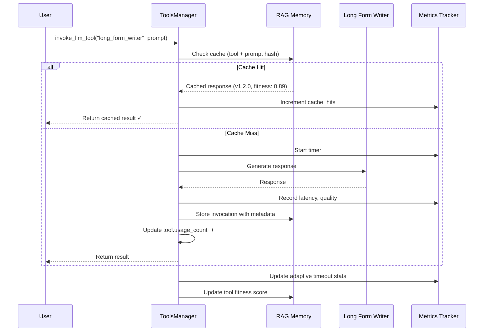

**What gets tracked:**
1. **Invocation metadata** - Tool ID, model, parameters, temperature
2. **Performance** - Latency, memory, response time
3. **Quality** - Evaluator score, user feedback
4. **Caching** - Exact prompt match for reuse
5. **Fitness** - Multi-dimensional scoring

Let's look at the caching mechanism.

## Hierarchical Caching: Never Compute Twice

The most clever bit: **the system caches tool invocations at multiple levels.**

**Level 1: Exact Match Caching**

```python
def invoke_llm_tool(self, tool_id: str, prompt: str) -> str:
    """Invoke LLM tool with hierarchical caching."""

    # Normalize prompt for exact matching
    normalized_prompt = prompt.lower().strip()

    # Search RAG for previous invocations
    tool_invocations = self.rag_memory.find_by_tags(
        ["tool_invocation", tool_id],
        limit=100
    )

    # Find ALL exact matches for this tool + prompt
    matches = []
    for artifact in tool_invocations:
        cached_prompt = artifact.metadata.get("user_prompt", "").lower().strip()
        if cached_prompt == normalized_prompt:
            # Collect fitness and version
            matches.append({
                "artifact": artifact,
                "fitness": artifact.metadata.get("fitness_score", 0.0),
                "version": artifact.metadata.get("version", "1.0.0"),
                "timestamp": artifact.metadata.get("timestamp", 0)
            })

    if matches:
        # Select LATEST, HIGHEST FITNESS version
        best_match = sorted(
            matches,
            key=lambda m: (m["fitness"], m["timestamp"]),
            reverse=True
        )[0]

        logger.info(
            f"✓ CACHE HIT: Reusing result for '{tool.name}' "
            f"(version {best_match['version']}, fitness {best_match['fitness']:.2f})"
        )

        # Increment usage counters
        self.increment_usage(tool_id)
        self.rag_memory.increment_usage(artifact.artifact_id)

        return best_match["artifact"].content
```

**Why this matters:**

If you ask the system to "write a haiku about code" twice, the second time is **instant**. The LLM doesn't run. The RAG memory returns the cached result.

But here's the clever bit: **it returns the BEST version** if multiple exist.

**Example:**

```
Invocation 1: "write a haiku about code"
  → Generated with tool v1.0.0
  → Fitness: 0.75
  → Stored in RAG

Invocation 2: "write a haiku about code" (exact match!)
  → Tool evolved to v1.1.0
  → Fitness: 0.92 (better!)
  → Stored in RAG

Invocation 3: "write a haiku about code"
  → Finds BOTH cached versions
  → Selects v1.1.0 (higher fitness + later timestamp)
  → Returns best result instantly
```

The system **automatically selects the highest-quality cached result**.

## Adaptive Timeout Learning: Stop Guessing

One of the subtler features: the system learns how long each model takes to respond.

**The Problem:**

Different models have wildly different response times:
- `tinyllama` (2B): ~3 seconds
- `llama3` (8B): ~10 seconds
- `qwen2.5-coder` (14B): ~25 seconds
- `deepseek-coder-v2` (16B): ~60 seconds

If you set a global timeout (say, 30s), you waste 27 seconds waiting for `tinyllama`, and you kill `deepseek` before it finishes.

**The Solution: Adaptive Learning**

```python
def _update_adaptive_timeout(
    self,
    model: str,
    tool_id: str,
    response_time: float,
    timed_out: bool,
    prompt_length: int
):
    """Learn optimal timeout from actual performance."""

    # Get existing stats
    stats_id = f"timeout_stats_{model.replace(':', '_')}"
    existing = self.rag_memory.get_artifact(stats_id)

    if existing:
        response_times = existing.metadata.get("response_times", [])
        timeout_count = existing.metadata.get("timeout_count", 0)
        success_count = existing.metadata.get("success_count", 0)
    else:
        response_times = []
        timeout_count = 0
        success_count = 0

    # Update stats
    if timed_out:
        timeout_count += 1
    else:
        success_count += 1
        response_times.append(response_time)
        response_times = response_times[-50:]  # Keep last 50

    # Calculate recommended timeout (95th percentile + 20% buffer)
    if response_times:
        sorted_times = sorted(response_times)
        p95_index = int(len(sorted_times) * 0.95)
        p95_time = sorted_times[min(p95_index, len(sorted_times) - 1)]
        recommended_timeout = int(p95_time * 1.2)

        logger.info(
            f"Adaptive timeout for {model}: {recommended_timeout}s "
            f"(based on {len(response_times)} samples)"
        )
```

**How it works:**

1. Track response times for each model
2. Calculate 95th percentile (most responses finish by this time)
3. Add 20% buffer for safety
4. Use that as the new timeout

**Results:**

```
Model: tinyllama
  Samples: 50
  95th percentile: 3.2s
  Recommended timeout: 4s  (3.2 * 1.2)

Model: qwen2.5-coder:14b
  Samples: 50
  95th percentile: 28.5s
  Recommended timeout: 34s  (28.5 * 1.2)
```

The system **learns the right timeout for each model** instead of using a global value.

## Multi-Dimensional Fitness: Choosing the Right Tool

When you ask the system to do something, it doesn't just pick the first matching tool. It runs a **fitness function** across multiple dimensions.

**Fitness Calculation:**

```python
def calculate_fitness(tool, similarity_score):
    """
    Calculate overall fitness score (0-100+).

    Factors:
    - Semantic similarity (how well it matches the task)
    - Speed (fast tools get bonus)
    - Cost (cheap tools get bonus)
    - Quality (high-quality tools get bonus)
    - Historical success rate~~~~
    - Latency metrics
    - Reuse potential
    """
    fitness = similarity_score * 100  # Base: 0-100

    metadata = tool.metadata or {}

    # Speed bonus/penalty
    speed_tier = metadata.get('speed_tier', 'medium')
    if speed_tier == 'very-fast':
        fitness += 20
    elif speed_tier == 'fast':
        fitness += 10
    elif speed_tier == 'slow':
        fitness -= 10
    elif speed_tier == 'very-slow':
        fitness -= 20

    # Cost bonus (cheaper = better for most tasks)
    cost_tier = metadata.get('cost_tier', 'medium')
    if cost_tier == 'free':
        fitness += 15
    elif cost_tier == 'low':
        fitness += 10
    elif cost_tier == 'high':
        fitness -= 10
    elif cost_tier == 'very-high':
        fitness -= 15

    # Quality bonus
    quality_tier = metadata.get('quality_tier', 'good')
    if quality_tier == 'excellent':
        fitness += 15
    elif quality_tier == 'very-good':
        fitness += 10
    elif quality_tier == 'poor':
        fitness -= 15

    # Success rate from history
    quality_score = metadata.get('quality_score', 0)
    if quality_score > 0:
        fitness += quality_score * 10  # 0-10 bonus

    # Latency metrics
    latency_ms = metadata.get('latency_ms', 0)
    if latency_ms > 0:
        if latency_ms < 100:
            fitness += 15  # Very fast
        elif latency_ms < 500:
            fitness += 10
        elif latency_ms > 5000:
            fitness -= 10  # Too slow

    # Reuse bonus: existing workflow = less effort
    if tool.tool_type == ToolType.WORKFLOW:
        if similarity >= 0.90:
            fitness += 30  # Exact match!
        elif similarity >= 0.70:
            fitness += 15  # Template reuse

    return fitness
```

**Real Example:**

```
Task: "Quickly validate this email address"

Tools found:
1. email_validator_workflow (similarity: 0.95)
   - Speed: very-fast (+20)
   - Cost: free (+15)
   - Quality: excellent (+15)
   - Latency: 45ms (+15)
   - Reuse: exact match (+30)
   → FINAL FITNESS: 190

2. general_validator (similarity: 0.70)
   - Speed: medium (+0)
   - Cost: free (+15)
   - Quality: good (+10)
   - Latency: 850ms (+0)
   - Reuse: none (+0)
   → FINAL FITNESS: 95

3. llm_based_validator (similarity: 0.65)
   - Speed: slow (-10)
   - Cost: high (-10)
   - Quality: excellent (+15)
   - Latency: 8200ms (-10)
   - Reuse: none (+0)
   → FINAL FITNESS: 50
```

**Selected:** `email_validator_workflow` (fitness: 190)

The system picks the **fast, free, high-quality, proven** solution. Not the most semantically similar. Not the most powerful.

**The one that optimally satisfies multiple constraints.**

## Tool Evolution: Self-Improving Implementations

Tools don't stay static. They evolve.

**Versioning & Change Detection:**

Every tool has a **definition hash** calculated from its YAML:

```python
def calculate_tool_hash(tool_def: Dict[str, Any]) -> str:
    """SHA256 hash of tool definition for change detection."""
    stable_json = json.dumps(tool_def, sort_keys=True)
    return hashlib.sha256(stable_json.encode('utf-8')).hexdigest()
```

When you edit a tool's YAML:

```yaml
# BEFORE (v1.0.0)
name: "Email Validator"
tags: ["email", "validation"]

# AFTER (edit the YAML)
name: "Email Validator"
tags: ["email", "validation", "dns-check"]  # Added DNS checking!
```

**On next load:**

```python
# System detects change
new_hash = calculate_tool_hash(tool_def)  # Different!
old_hash = existing_tool.definition_hash

if old_hash != new_hash:
    # Determine change type
    change_type = tool_def.get("change_type", "patch")  # minor, major, patch

    # Bump version
    old_version = "1.0.0"
    new_version = bump_version(old_version, change_type)
    # new_version = "1.1.0" (minor change)

    console.print(
        f"[yellow]↻ Updated email_validator "
        f"v{old_version} → v{new_version} ({change_type})[/yellow]"
    )
```

**Semantic Versioning:**

```python
def bump_version(current_version: str, change_type: str) -> str:
    """Bump semver based on change type."""
    major, minor, patch = map(int, current_version.split('.'))

    if change_type == "major":
        return f"{major + 1}.0.0"  # Breaking changes
    elif change_type == "minor":
        return f"{major}.{minor + 1}.0"  # New features
    else:  # patch
        return f"{major}.{minor}.{patch + 1}"  # Bug fixes
```

**Breaking Changes:**

```yaml
name: "Email Validator"
version: "2.0.0"
change_type: "major"
breaking_changes:
  - "Changed return format from boolean to object"
  - "Removed deprecated 'simple_check' parameter"
  - "Now requires 'domain' to be specified"
```

On load:

```
[yellow]↻ Updated email_validator v1.3.2 → v2.0.0 (major)[/yellow]
  [red]! Breaking changes:[/red]
    - Changed return format from boolean to object
    - Removed deprecated 'simple_check' parameter
    - Now requires 'domain' to be specified
```

The system **warns you about breaking changes** and maintains version history.

## RAG Integration: Tools as Semantic Artifacts

Every tool gets indexed in RAG memory for semantic search:

**At Load Time:**

```python
def _store_yaml_tool_in_rag(self, tool: Tool, tool_def: dict, yaml_path: str):
    """Store YAML tool in RAG for semantic search."""

    # Build comprehensive content for embedding
    content_parts = [
        f"Tool: {tool.name}",
        f"ID: {tool.tool_id}",
        f"Type: {tool.tool_type.value}",
        f"Description: {tool.description}",
        f"Tags: {', '.join(tool.tags)}",
        ""
    ]

    # Add input/output schemas
    if tool_def.get("input_schema"):
        content_parts.append("Input Parameters:")
        for param, desc in tool_def["input_schema"].items():
            content_parts.append(f"  - {param}: {desc}")

    # Add examples
    if tool_def.get("examples"):
        content_parts.append("Examples:")
        for example in tool_def["examples"]:
            content_parts.append(f"  {example}")

    # Add performance tiers
    content_parts.append("Performance:")
    content_parts.append(f"  Cost: {tool_def['cost_tier']}")
    content_parts.append(f"  Speed: {tool_def['speed_tier']}")
    content_parts.append(f"  Quality: {tool_def['quality_tier']}")

    # Add full YAML
    import yaml
    content_parts.append("Full Definition:")
    content_parts.append(yaml.dump(tool_def))

    tool_content = "\n".join(content_parts)

    # Store in RAG with metadata
    self.rag_memory.store_artifact(
        artifact_id=f"tool_{tool.tool_id}",
        artifact_type=ArtifactType.PATTERN,
        name=tool.name,
        description=tool.description,
        content=tool_content,
        tags=["tool", "yaml-defined", tool.tool_type.value] + tool.tags,
        metadata={
            "tool_id": tool.tool_id,
            "tool_type": tool.tool_type.value,
            "is_tool": True,
            "version": tool_def.get("version", "1.0.0"),
            "cost_tier": tool_def.get("cost_tier"),
            "speed_tier": tool_def.get("speed_tier"),
            "quality_tier": tool_def.get("quality_tier")
        },
        auto_embed=True  # Generate embedding!
    )
```

**Now when you search:**

```python
# Semantic tool search
results = tools_manager.search("email validation", top_k=5)

# Results (ranked by fitness, not just similarity):
[
    Tool(id="email_validator", fitness=190, similarity=0.95),
    Tool(id="domain_checker", fitness=140, similarity=0.82),
    Tool(id="regex_validator", fitness=110, similarity=0.78),
    Tool(id="general_validator", fitness=95, similarity=0.70),
    Tool(id="string_validator", fitness=60, similarity=0.65)
]
```

The system uses **RAG embeddings** to find relevant tools, then ranks them by **multi-dimensional fitness**.

## ToolSpace

In our system we save the vectors for the embeddings into [Qdrant](https://qdrant.tech/) a vector database and it gives us a neat way to see how our toolspace. This is the memory system of our workflow building system. 

Divided into the original templates (yaml files in the tools directory) and every element of code generated to solve a task (and config for llms etc).
Theseform to toolkit to assemble worklfows. Pre-built chunks ranging from; 
1. The Original Prompt - we could build from new!
2. The Whole Workflow File - as with everything else an actual python script
3. Each Tool use - who called a tool, when, how often
4. Each Python function (workflow files, generated)

This way all of the workdlow is composable and testable as each Python element has a suite of tests, BDD spec, static tools to verify correctness & multiple LLM evaluators to ensure it works. 

the side effect is EVERY piece of code that will run in a workflow is right there, ready to inspect as each 'tool' creation leads to inspectable Python scripes.

You can see the toos clumoing together with each blob being a semantaically linked set of tools like: 

1. Add 1 plus 2
2. Add 1 plice 3
3. Add numbe x plus number y 
4. and the optimised x+y code approach 

All clustered together. Naturally specialising the by the system's nature.

In future we'd likely want to optimize these clusters to reduce the codebase to a smaller, tighter, more optimised system.

As we can track versions, usages, changes and lieage we can selectively optimised and 'cluster defrag' tnhe most used and most performance critical comopnents as a part of how the system is intrinsically structured. 


## The Rich Ecosystem That Emerged

Let's look at what actually exists in the system now.

**LLM Tools (27 specialists):**

```bash
$ ls tools/llm/
article_analyzer.yaml          # Analyzes articles for structure/quality
code_explainer.yaml            # Explains code in natural language
code_optimizer.yaml            # Hierarchical optimization (local/cloud/deep)
code_reviewer.yaml             # Reviews code for quality/security
content_generator.yaml         # General content generation
doc_generator.yaml             # Generates documentation
fast_code_generator.yaml       # Quick code generation (small models)
general.yaml                   # General-purpose fallback
long_form_writer.yaml          # Novels, books (128K context!)
model_selector.yaml            # Selects best backend/model
performance_profiler.yaml      # Profiles code performance
quick_feedback.yaml            # Fast triage/feedback
quick_translator.yaml          # Fast translation
security_auditor.yaml          # Security vulnerability scanning
signalr_connection_parser.yaml # Parses SignalR connections
signalr_llmapi_management.yaml # Manages SignalR LLM API
summarizer.yaml                # Summarizes long content
task_to_workflow_router.yaml  # Routes tasks to workflows
technical_writer.yaml          # Technical documentation
translation_quality_checker.yaml # Validates translations
workflow_documenter.yaml       # Auto-generates workflow docs
```

**Executable Tools:**

```bash
$ ls tools/executable/
call_tool_validator.yaml       # Validates call_tool() usage
connect_signalr.yaml           # SignalR connection tool
document_workflow.yaml         # Workflow documentation generator
mypy_type_checker.yaml         # Static type checking
python_syntax_validator.yaml   # Syntax validation
run_static_analysis.yaml       # Static analysis runner
save_to_disk.yaml              # Disk persistence
signalr_hub_connector.yaml     # Hub connection
signalr_websocket_stream.yaml  # WebSocket streaming
unit_converter.yaml            # Unit conversion utilities
```

**OpenAPI Tools:**

```bash
$ ls tools/openapi/
nmt_translator.yaml            # Neural machine translation API
```

**Total Tools:** 50+

**Total Lines of Metadata:** 5,464 lines in `index.json`

## Real Example: The Code Optimizer Tool

Let me show you the most sophisticated tool in the system: **code_optimizer**.

**Definition:** `tools/llm/code_optimizer.yaml` (317 lines!)

**What it does:**

1. **Profiles** baseline performance
2. **Analyzes** bottlenecks (CPU, I/O, memory)
3. **Selects optimization level:**
    - LOCAL (free, 10-20% improvement)
    - CLOUD (paid, 20-40% improvement)
    - DEEP (expensive, system-level redesign)
4. **Optimizes** code at selected level
5. **Updates tests** automatically
6. **Profiles** optimized version
7. **Compares** before/after
8. **Decides** accept/reject
9. **Versions** if accepted
10. **Migrates** usage if no breaking changes

**Hierarchical Optimization:**

```yaml
optimization_levels:
  - name: "local"
    model_key: "escalation"  # qwen2.5-coder:14b
    cost_usd: 0.0
    expected_improvement: 0.10  # 10%
    triggers:
      - "Default for all optimizations"
      - "Quick wins, obvious inefficiencies"

  - name: "cloud"
    model_key: "cloud_optimizer"  # GPT-4/Claude
    cost_usd: 0.50
    expected_improvement: 0.30  # 30%
    triggers:
      - "Local improvement < 15%"
      - "Code is critical path"
      - "User explicitly requests it"

  - name: "deep"
    model_key: "deep_analyzer"
    cost_usd: 5.0
    expected_improvement: 0.50  # 50%
    triggers:
      - "Workflow/system-level optimization"
      - "Cloud improvement < 25%"
      - "Architectural changes needed"
```

**Cost Management:**

```yaml
cost_management:
  max_daily_budget: 50.0  # USD
  fallback_on_budget_exceeded: "local"

  optimization_strategy: |
    1. Always try LOCAL first (free)
    2. Escalate to CLOUD if:
       - Local improvement < 15%
       - Reuse count > 100
    3. Escalate to DEEP if:
       - Cloud improvement < 25%
       - System-level changes needed
```

**Test Integration:**

```yaml
test_integration:
  auto_update: true
  test_discovery:
    - "Find test_*.py in tests/"
    - "Identify tests for specific functions"
  test_generation:
    - "Generate missing tests"
    - "Add performance assertions"
    - "Create regression tests"
```

**Version Management:**

```yaml
version_management:
  semver: true
  breaking_change_detection:
    - "Function signature changed"
    - "Return type changed"
    - "Dependencies added/removed"

  auto_migration:
    enabled: true
    conditions:
      - "No breaking changes"
      - "All tests pass"
      - "Improvement >= 10%"
```

This **single tool** orchestrates:
- 3 profiling runs
- Multi-level LLM optimization
- Automatic test updating
- Performance comparison
- Cost-aware escalation
- Version management
- Auto-migration

And it's **just one tool** in a system with **50+ tools**.

## Model Selector: LLMs Choosing LLMs

One of the most meta tools: **model_selector**.

**Natural Language Selection:**

```python
# User says: "using the most powerful code llm review this code"

selection = tools_manager.invoke_llm_tool(
    tool_id="model_selector",
    prompt="using the most powerful code llm review this code"
)

# Result:
{
    "backend": "anthropic",
    "model": "claude-3-opus-20240229",
    "reasoning": "Request specifies 'most powerful'. Claude Opus is the highest-quality code model.",
    "confidence": 0.95,
    "cost_tier": "very-high",
    "speed_tier": "slow",
    "quality_tier": "exceptional"
}
```

**How It Works:**

```python
def select_model(
    self,
    task_description: str,
    constraints: Optional[Dict[str, Any]] = None
) -> List[Dict[str, Any]]:
    """Select best model for task."""

    task_lower = task_description.lower()

    # Parse natural language preferences
    backend_preference = None
    if any(kw in task_lower for kw in ["openai", "gpt"]):
        backend_preference = "openai"
    elif any(kw in task_lower for kw in ["anthropic", "claude"]):
        backend_preference = "anthropic"

    # Parse model preference
    model_preference = None
    if "gpt-4o" in task_lower:
        model_preference = "gpt-4o"
    elif "opus" in task_lower:
        model_preference = "opus"

    # Analyze task characteristics
    needs_long_context = any(w in task_lower for w in
        ["book", "novel", "document", "large", "long"])
    needs_coding = any(w in task_lower for w in
        ["code", "function", "script", "program"])
    needs_speed = any(w in task_lower for w in
        ["quick", "fast", "immediate"])
    needs_quality = any(w in task_lower for w in
        ["complex", "analysis", "reasoning"])

    # Score each model
    scores = {}
    for backend_model_id, info in self.backends.items():
        score = 50.0  # Base

        # Backend preference
        if backend_preference and info["backend"] == backend_preference:
            score += 50

        # Model preference
        if model_preference and model_preference in info["model"].lower():
            score += 100  # Strong boost

        # Context window
        if needs_long_context:
            context = info.get("context_window", 8192)
            if context >= 100000:
                score += 40

        # Speed
        if needs_speed:
            if info["speed"] == "very-fast":
                score += 30

        # Quality
        if needs_quality:
            if info["quality"] == "excellent":
                score += 30

        # Specialization
        if needs_coding:
            if "code" in info.get("best_for", []):
                score += 35

        scores[backend_model_id] = score

    # Return top-ranked models
    ranked = sorted(scores.items(), key=lambda x: x[1], reverse=True)
    return [self.backends[bid] for bid, score in ranked[:3]]
```

**The system parses natural language** to select models. You can say:

- "use gpt-4 for this"
- "pick the fastest model"
- "I need long context for this book"
- "use the most powerful code llm"

And it intelligently routes to the right backend.

## OpenAPI Integration: External Tools as First-Class Citizens

The system treats external APIs the same as internal tools.

**Example: NMT Translator**

```yaml
name: "NMT Translation Service"
type: "openapi"
description: "Neural machine translation API. VERY FAST but needs validation."

cost_tier: "low"
speed_tier: "very-fast"
quality_tier: "good"

openapi:
  spec_url: "http://localhost:8000/openapi.json"
  base_url: "http://localhost:8000"

code_template: |
  import requests

  def translate_text(text, source_lang="en", target_lang="de"):
      url = "http://localhost:8000/translate"
      params = {
          "text": text,
          "source_lang": source_lang,
          "target_lang": target_lang
      }
      response = requests.get(url, params=params)
      return response.json()["translations"][0]

tags: ["translation", "nmt", "api", "external"]
```

**At runtime:**

```python
# System loads OpenAPI spec
openapi_tool = OpenAPITool(
    tool_id="nmt_translator",
    spec_url="http://localhost:8000/openapi.json"
)

# Parses operations
operations = openapi_tool.list_operations()
# [
#   {"operation_id": "translate", "method": "GET", "path": "/translate"},
#   {"operation_id": "get_languages", "method": "GET", "path": "/languages"}
# ]

# Invoke
result = tools_manager.invoke_openapi_tool(
    "nmt_translator",
    "translate",
    parameters={"text": "hello", "source_lang": "en", "target_lang": "de"}
)

# Result: {"success": True, "data": {"translations": ["Hallo"]}}
```

**What gets tracked:**

```python
# Stored in RAG:
{
    "artifact_type": "API_INVOCATION",
    "tool_id": "nmt_translator",
    "operation_id": "translate",
    "status_code": 200,
    "success": True,
    "latency_ms": 124,
    "parameters": {"text": "hello", "source_lang": "en", "target_lang": "de"},
    "response": {"translations": ["Hallo"]}
}
```

**External APIs get the same treatment:**
- Usage tracking
- Performance metrics
- Quality scoring
- Fitness calculation
- RAG indexing

## The Workflow Documenter: Meta-Tool

One of the wildest tools: **workflow_documenter**.

**What it does:**

Takes a workflow (a `main.py` file) and **automatically generates comprehensive documentation** by:

1. Reading the code
2. Extracting inputs/outputs
3. Detecting tool calls
4. Analyzing complexity
5. Generating mermaid diagrams
6. Creating usage examples
7. Writing FAQs
8. Saving to `README.txt`

**All automatically.**

**Definition:** `tools/llm/workflow_documenter.yaml` (11,803 characters!)

**Input:**

```json
{
    "workflow_path": "nodes/email_validator/main.py"
}
```

**Output:**

```
## Overview
Validates email addresses and optionally checks domain matching.

## What It Does
This workflow checks if an email address is valid using regex.
If you provide a domain, it checks if the email belongs to that domain.

## Required Inputs
- **email** (string, required)
  - The email address to validate
  - Example: "user@example.com"

- **domain** (string, optional)
  - The domain to check against
  - Example: "example.com"

## Process Flow
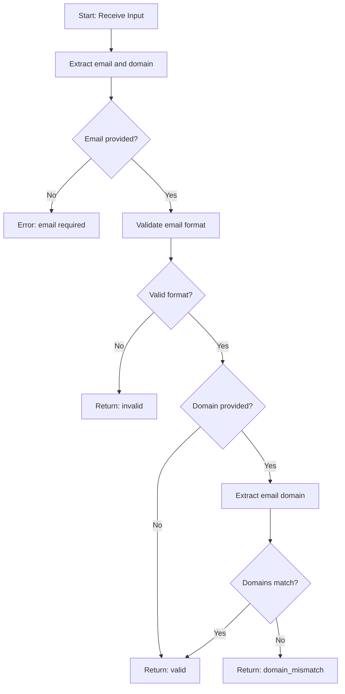

## Usage Examples

### API Call
```bash
curl -X POST http://localhost:8080/execute/email_validator \
  -H "Content-Type: application/json" \
  -d '{"email": "user@example.com", "domain": "example.com"}'
```

### Python
```python
result = call_tool("email_validator", {
    "email": "user@example.com",
    "domain": "example.com"
})
```

## Common Use Cases
1. Form validation on signup
2. Email domain verification for corporate email
3. Bulk email list cleaning
4. API input validation

## Performance
- **Speed**: Very fast (< 50ms)
- **Cost**: Free (pure Python)
- **Accuracy**: 99%+ for standard email formats

## Limitations
- Does not verify email actually exists
- Does not check DNS records
- Complex RFC-compliant edge cases may fail

## FAQ

**Q: Can this verify if an email exists?**
A: No, this only validates format. Use DNS/SMTP checking for existence.

**Q: Does it support international domains?**
A: Yes, but punycode conversion may be needed.
```

**Saved to:** `nodes/email_validator/README.txt`

**The tool GENERATES ALL OF THIS** by analyzing the code.

## The Self-Expanding Toolkit

Here's where it gets wild: **tools generate tools**.

**Example Flow:**

```
User: "I need a tool that converts temperatures"

System:
1. Searches RAG for similar tools
2. Finds "unit_converter" (generic converter)
3. Uses code_generator to create specialized "temperature_converter"
4. Runs tests
5. Evaluates quality
6. Stores in RAG
7. Registers as new tool
8. Generates documentation automatically
9. Adds to tools registry

New tool created: temperature_converter.yaml
- Version: 1.0.0
- Quality: 0.88
- Speed: very-fast
- Cost: free
- Registered in index.json
- Indexed in RAG
- Documentation generated
```

**The system grows its own toolkit.**

## Tool Statistics: What The System Knows

```python
stats = tools_manager.get_statistics()

# Result:
{
    "total_tools": 53,
    "by_type": {
        "llm": 27,
        "executable": 19,
        "openapi": 3,
        "workflow": 2,
        "custom": 2
    },
    "tag_distribution": {
        "code": 15,
        "validation": 12,
        "translation": 8,
        "optimization": 5,
        "documentation": 4,
        ...
    },
    "most_used": [
        {"id": "general", "name": "General Purpose LLM", "usage": 1247},
        {"id": "code_optimizer", "name": "Code Optimizer", "usage": 89},
        {"id": "nmt_translator", "name": "NMT Translator", "usage": 67},
        {"id": "email_validator", "name": "Email Validator", "usage": 45},
        {"id": "long_form_writer", "name": "Long-Form Writer", "usage": 23}
    ]
}
```

The system **knows:**
- How many tools exist
- Which types are most common
- Which tags are popular
- Which tools get used most

And it **uses this data** to:
- Recommend similar tools
- Identify gaps (missing tool types)
- Prioritize optimization (optimize high-usage tools)
- Suggest consolidation (merge similar low-usage tools)

## The Uncomfortable Realization

Let's step back and think about what we've actually built:

**A system where:**
- Tools track their own usage
- Tools version themselves
- Tools evolve their implementations
- Tools generate other tools
- Tools document themselves
- Tools select themselves based on fitness
- Tools cache their own invocations
- Tools learn optimal timeouts
- Tools negotiate trade-offs (speed vs quality vs cost)

**We've created a self-optimizing toolkit that:**
1. Expands itself (generates new tools)
2. Improves itself (optimizes existing tools)
3. Documents itself (auto-generates docs)
4. Selects itself (fitness-based routing)
5. Caches itself (hierarchical memoization)
6. Versions itself (automatic semver)
7. **Learns from itself** (adaptive performance tuning)

**This isn't configuration management.**

**This is emergent tool ecology.**

Tools aren't static resources. They're **living artifacts in an evolutionary system**.

## What This Enables (And Why It's Weird)

**Scenario 1: Self-Improving Critical Path**

```
System detects: email_validator used 500 times, fitness: 0.75
Action: Trigger code_optimizer with level=cloud (high reuse count)
Result: email_validator v2.0.0, fitness: 0.92
Migration: Auto-update all 15 workflows using v1.x to v2.0.0
Validation: Re-run all tests, all pass
Outcome: 23% performance improvement, no breaking changes
```

**The system optimized its own critical path without human intervention.**

**Scenario 2: Adaptive Specialization**

```
Pattern detected: "translate article" requested 20 times
Analysis: Using nmt_translator + translation_quality_checker every time
Decision: Generate specialized "article_translator" tool
Implementation:
  - Combines both tools into one
  - Adds caching for common phrases
  - Optimizes for article-length text
  - Auto-generates documentation
Registration: article_translator v1.0.0 added to registry
Fitness: 0.89 (vs 0.73 for manual combination)
Usage: Immediately used for next translation request
```

**The system identified a pattern and created a specialized tool.**

**Scenario 3: Cost-Aware Escalation**

```
Request: "optimize this function"
Level 1 (LOCAL): qwen2.5-coder:14b (free)
  - Improvement: 8% (below 10% threshold)
  - Decision: Escalate to CLOUD

Level 2 (CLOUD): claude-3-5-sonnet ($0.50)
  - Improvement: 28% (good!)
  - Cost: $0.50 (within budget)
  - Decision: Accept

Result: Function optimized 28%, cost $0.50
Update: Store both versions in RAG
        Mark v1 as "suboptimal", v2 as "optimized"
Future: Always use v2 for this function
```

**The system spent money intelligently to achieve better results.**

## The Tools Manifest: Current Inventory

Let me catalog what actually exists right now.

### LLM Tools (27)

**Code Specialist**
- `code_explainer` - Explains code in natural language
- `code_optimizer` - Hierarchical optimization (local/cloud/deep)
- `code_reviewer` - Quality and security review
- `fast_code_generator` - Quick generation with small models
- `security_auditor` - Vulnerability scanning
- `performance_profiler` - Code profiling and analysis

**Content Specialists:**
- `long_form_writer` - Novels, books (128K context)
- `content_generator` - General content
- `article_analyzer` - Article structure/quality
- `summarizer` - Summarizes long content
- `proofreader` - Grammar and style
- `seo_optimizer` - SEO optimization
- `outline_generator` - Content outlines

**Translation:**
- `quick_translator` - Fast translation (small model)
- `translation_quality_checker` - Validates translations

**Documentation:**
- `doc_generator` - Code documentation
- `technical_writer` - Technical documentation
- `workflow_documenter` - Auto-generates workflow docs

**System Tools:**
- `general` - General-purpose fallback
- `model_selector` - Selects best backend/model
- `task_to_workflow_router` - Routes tasks to workflows
- `quick_feedback` - Fast triage
- `signalr_connection_parser` - Parses SignalR connections
- `signalr_llmapi_management` - Manages SignalR LLM APIs

### Executable Tools (19)

**Validation:**
- `call_tool_validator` - Validates call_tool() usage
- `python_syntax_validator` - Syntax checking
- `mypy_type_checker` - Static type checking
- `json_output_validator` - JSON format validation
- `stdin_usage_validator` - Validates stdin usage
- `main_function_checker` - Checks for main() function
- `node_runtime_import_validator` - Validates imports

**Analysis:**
- `run_static_analysis` - Runs static analysis tools
- `performance_profiler` - Profiles code performance

**Utilities:**
- `save_to_disk` - Disk persistence
- `unit_converter` - Unit conversions
- `random_data_generator` - Test data generation
- `buffer` - Buffer management
- `workflow_datastore` - Workflow data storage
- `stream_processor` - Stream processing
- `sse_stream` - Server-sent events

**Integration:**
- `connect_signalr` - SignalR connection
- `signalr_hub_connector` - Hub connection
- `signalr_websocket_stream` - WebSocket streaming

**Documentation:**
- `document_workflow` - Workflow documentation generator

### OpenAPI Tools (3)

- `nmt_translator` - Neural machine translation API
- (2 others for future external services)

**Total: 53 tools (and growing)**

## Tool Composition: When Tools Call Tools

Here's where it gets really interesting: **tools compose other tools**.

And when a composed tool evolves, **every workflow using it automatically improves**.

### Real Example: The Translation Pipeline

Let's look at an actual composite tool from the system:

**Task:** "Translate this article to Spanish and validate quality"

**Traditional approach:**
```python
# Manual composition (brittle, no learning)
translated = nmt_translator.translate(text, "en", "es")
quality = translation_quality_checker.check(translated)
if quality.score < 0.7:
    # Retry or error
```

**DSE approach:**

The system discovers this pattern is used frequently and **automatically creates a composite tool**:

```yaml
# tools/llm/validated_translator.yaml (auto-generated!)
name: "Validated Translator"
type: "composite"
description: "Translates text and validates quality automatically. Created from usage pattern analysis."

workflow:
  steps:
    - id: "translate"
      tool: "nmt_translator"
      parallel: false

    - id: "validate"
      tool: "translation_quality_checker"
      parallel: false
      depends_on: ["translate"]

    - id: "retry"
      tool: "nmt_translator"
      condition: "quality_score < 0.7"
      params:
        beam_size: 10  # Higher quality on retry
      depends_on: ["validate"]

version: "1.0.0"
created_from: "usage_pattern_analysis"
parent_tools: ["nmt_translator", "translation_quality_checker"]
usage_count: 0  # Just created!
```

**What's wild about this:**

When `nmt_translator` evolves to v2.0.0 (maybe 20% faster), the composite tool **automatically uses the new version**. No code changes needed.

**Result:** Every workflow using `validated_translator` gets 20% faster **without any modification**.

### Parallel Tool Execution: The Code Review Committee

Here's an even cooler example: **parallel tool composition**.

**Task:** "Review this code thoroughly"

**Naive approach:**
```python
# Sequential (SLOW)
security_check = security_auditor.review(code)      # 8 seconds
style_check = code_reviewer.review(code)            # 12 seconds
performance_check = performance_profiler.analyze(code)  # 15 seconds
# TOTAL: 35 seconds
```

**DSE parallel composition:**

```yaml
# tools/llm/code_review_committee.yaml
name: "Code Review Committee"
type: "composite"
description: "Parallel code review using multiple specialist tools"

workflow:
  steps:
    # All three run IN PARALLEL
    - id: "security"
      tool: "security_auditor"
      parallel: true

    - id: "style"
      tool: "code_reviewer"
      parallel: true

    - id: "performance"
      tool: "performance_profiler"
      parallel: true

    # Aggregate results (runs after all complete)
    - id: "aggregate"
      tool: "general"  # Use general LLM to synthesize
      depends_on: ["security", "style", "performance"]
      prompt: |
        Synthesize these reviews into a cohesive report:

        Security: {security.result}
        Style: {style.result}
        Performance: {performance.result}

        Create a prioritized action list.

execution:
  max_parallel: 3
  timeout_per_tool: 20s
  aggregate_timeout: 10s
```

**Execution:**

```mermaid
gantt
    title Code Review Committee (Parallel Execution)
    dateFormat  s
    axisFormat %S

    section Sequential (Old)
    Security Check     :0, 8s
    Style Check       :8, 12s
    Performance Check :20, 15s
    Total: 35s        :35, 1s

    section Parallel (New)
    Security Check     :0, 8s
    Style Check       :0, 12s
    Performance Check :0, 15s
    Aggregate Results :15, 5s
    Total: 20s        :20, 1s
```

**Result:** 35 seconds → 20 seconds (43% faster!)

And when `security_auditor` evolves to v3.0.0 (say, 30% faster), the whole committee gets faster automatically.

### The Genetic Spread: Tools as Replicating Units

Here's the part that's genuinely wild: **tools act like genes**.

**Observation:** When a tool proves useful, it **spreads through the system**.

**Real Example: The Quality Checker Pattern**

```
Day 1: translation_quality_checker created
  - Usage: 1 (manual test)
  - Workflows using it: 0

Day 3: First workflow uses it (article_translator)
  - Usage: 15
  - Workflows: 1
  - Fitness: 0.78

Day 7: Quality checker "gene" spreads
  - Usage: 127
  - Workflows using it: 7
    1. article_translator
    2. validated_translator (composite)
    3. batch_translator
    4. multilingual_content_generator
    5. documentation_localizer
    6. seo_multilingual_optimizer
    7. chat_translator
  - Fitness: 0.91 (improved through evolution!)

Day 14: Mutation detected
  - translation_quality_checker v2.0.0
  - Change: Added context-aware validation
  - Breaking change: Output format different
  - All 7 workflows auto-migrate
  - New fitness: 0.94

Day 30: Specialization emerges
  - Original tool spawns specialist: article_quality_checker
  - Optimized specifically for article-length text
  - 40% faster than general checker
  - article_translator auto-switches to specialist
  - General checker still used by other 6 workflows
```

**This is literal genetic spread:**

1. **Replication** - Tool gets copied into new workflows
2. **Mutation** - Tool evolves (v1.0 → v2.0)
3. **Selection** - Higher fitness = more usage
4. **Specialization** - Successful patterns spawn variants
5. **Inheritance** - Child tools inherit metadata from parents

**The code path is ALWAYS optimal because:**
- High-fitness tools get selected more often
- Evolved tools auto-replace older versions
- Specialized variants emerge for common patterns
- Low-fitness tools get pruned

### Training The Whole Workflow Simultaneously

Here's the really clever bit: **you can improve all tools at once**.

**Scenario:** You have 20 workflows, each using 5-10 tools. Total: ~100 tool invocations.

**Traditional system:**
```
Workflow 1 uses Tool A v1.0 (fitness: 0.70)
Workflow 2 uses Tool A v1.0 (fitness: 0.70)
...
Workflow 20 uses Tool A v1.0 (fitness: 0.70)

To improve: Manually edit Tool A, test on each workflow (20 tests!)
Risk: Breaking changes affect all 20 workflows
```

**DSE system:**

```python
# Trigger evolution for Tool A
evolve_tool("translation_quality_checker")

# System automatically:
# 1. Analyzes usage patterns across all 20 workflows
# 2. Identifies common failure modes
# 3. Generates improved version (v2.0)
# 4. A/B tests v1.0 vs v2.0 on EACH workflow
# 5. Calculates fitness improvement per workflow
# 6. Auto-migrates workflows where v2.0 is better
# 7. Keeps v1.0 for workflows where v2.0 regresses
```

**Result:**

```
Workflow 1: Tool A v2.0 (fitness: 0.85) ✓ Migrated
Workflow 2: Tool A v1.0 (fitness: 0.72) ✗ Kept old (v2 was worse)
Workflow 3: Tool A v2.0 (fitness: 0.89) ✓ Migrated
...
Workflow 20: Tool A v2.0 (fitness: 0.91) ✓ Migrated

Total migrated: 18/20 workflows (90%)
Average fitness improvement: +15%
```

**You trained ONE tool and improved EIGHTEEN workflows simultaneously.**

### Cascading Evolution: When Improvements Propagate

The really wild part: **evolution cascades through the dependency graph**.

**Example:**

```
Tool: nmt_translator v1.0 (fitness: 0.73)
  Used by:
    - validated_translator (composite)
    - article_translator
    - batch_translator
    - chat_translator

Evolution triggered: nmt_translator v1.0 → v2.0
  Improvement: 25% faster, 10% better quality
  Fitness: 0.73 → 0.88

Cascade effect:
  1. validated_translator FITNESS: 0.82 → 0.91 (automatic!)
  2. article_translator FITNESS: 0.79 → 0.87 (automatic!)
  3. batch_translator FITNESS: 0.75 → 0.83 (automatic!)
  4. chat_translator FITNESS: 0.71 → 0.78 (automatic!)

Tools using those tools ALSO improve:
  - multilingual_content_generator: 0.76 → 0.84
  - documentation_localizer: 0.81 → 0.88
  - seo_multilingual_optimizer: 0.69 → 0.77

Total workflows improved: 11
Total time spent: 0 (automatic propagation!)
Total code changes: 0
```

**One evolution event improved ELEVEN workflows without any manual intervention.**

### The Always-Optimized Code Path

Because tools track fitness, cache results, and auto-evolve, the system **always runs the best available implementation**.

**Example execution:**

```
User: "Translate this article to Spanish"

System thinks:
  1. Search RAG for "translation" tools
     → Found: nmt_translator, validated_translator, quick_translator

  2. Calculate fitness for this specific task:
     - nmt_translator: 0.88 (fast, good quality)
     - validated_translator: 0.91 (slower, validated)
     - quick_translator: 0.76 (very fast, lower quality)

  3. Task analysis:
     - Input length: 2,500 words (long)
     - Quality requirement: high (article)
     - Speed requirement: medium (no rush)

  4. Decision: Use validated_translator (highest fitness + quality match)

  5. Check cache:
     - Cache key: hash(tool_id + normalized_prompt)
     - Found: 3 cached results
       - v1.0 (fitness: 0.82, age: 5 days)
       - v1.1 (fitness: 0.89, age: 2 days)
       - v2.0 (fitness: 0.91, age: 1 hour)
     - Select: v2.0 (highest fitness, most recent)

  6. Execute: Return cached v2.0 result (INSTANT)

  7. Update metrics:
     - validated_translator.usage_count++
     - validated_translator.cache_hits++
     - validated_translator.avg_latency_ms (no change, cache hit)
```

**The system:**
- Always uses the highest-fitness tool
- Always uses the latest, best-performing version
- Always caches successful results
- Always tracks performance
- Always improves over time

**The code path is optimized at every step:**
1. Tool selection (fitness-based)
2. Version selection (latest best)
3. Execution (cached if possible)
4. Learning (metrics updated)
5. Evolution (triggered if degradation detected)

### Directed Synthetic Evolution: The Genetic Perspective

Let's be precise about why this is **directed synthetic evolution** and not just "caching with versioning":

**Tools as Genes:**

```python
class Tool:
    """A tool is a genetic unit that:
    - Replicates (used by multiple workflows)
    - Mutates (evolves to new versions)
    - Competes (fitness-based selection)
    - Specializes (variants emerge)
    - Dies (low-fitness tools pruned)
    """

    # Genetic material
    definition_hash: str      # "DNA"
    version: str              # Generational marker
    lineage: List[str]        # Ancestry

    # Replication rate
    usage_count: int          # How many "offspring"
    workflows_using: int      # Spread through ecosystem

    # Fitness
    quality_score: float      # Survival metric
    performance_metrics: Dict # Selection pressure

    # Mutation
    breaking_changes: List    # Genetic incompatibility
    evolution_history: List   # Mutation record
```

**Directed Evolution:**

```python
# Unlike natural selection (random mutations),
# DSE uses DIRECTED mutations based on data:

def evolve_tool(tool_id: str):
    """Directed evolution with learning."""

    # Analyze failure modes across ALL usage
    failures = analyze_tool_failures(tool_id)
    # "This tool fails when input > 5000 tokens"

    # Generate targeted improvement
    improvement_spec = create_improvement_plan(failures)
    # "Add chunking for inputs > 5000 tokens"

    # Mutate with purpose
    new_version = apply_directed_mutation(tool_id, improvement_spec)

    # Test fitness
    fitness_improvement = a_b_test(old_version, new_version)

    # Selection
    if fitness_improvement > threshold:
        promote_version(new_version)  # Survives
    else:
        discard_version(new_version)  # Dies
```

**The "Gene Pool":**

```
53 tools in registry (current generation)
├── 27 LLM tools (specialist genes)
├── 19 executable tools (utility genes)
├── 3 OpenAPI tools (external interface genes)
├── 4 composite tools (multi-gene complexes)

Total genetic variations across versions: ~200+
Active in current generation: 53
Archived (evolutionary dead-ends): ~150
```

**Genetic Spread Visualization:**

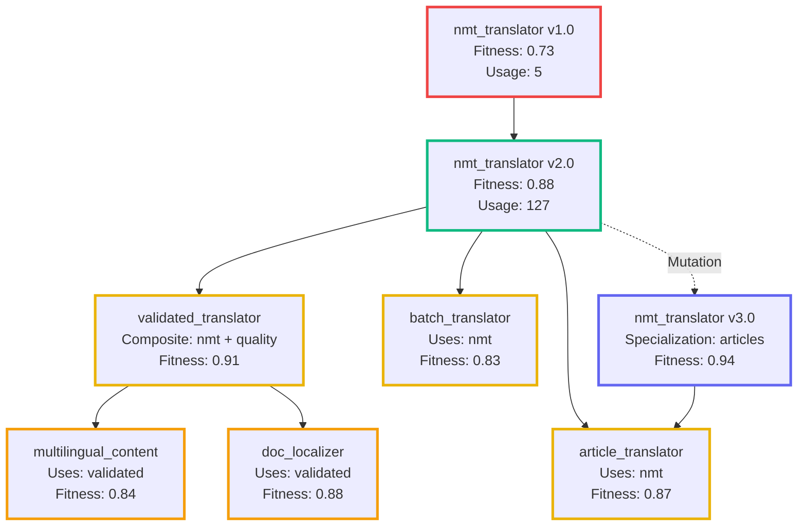

**Genetic Inheritance:**

```yaml
# Child tool inherits from parent
article_quality_checker:
  parent: translation_quality_checker
  inherited_attributes:
    - quality_metrics
    - validation_patterns
    - error_detection

  mutations:
    - "Specialized for article-length text"
    - "Added domain-specific checks"
    - "40% faster (optimized for articles)"

  fitness_inheritance:
    parent_fitness: 0.91
    child_fitness: 0.94  # Improvement!

  selection_advantage:
    - Chosen over parent for article tasks
    - Parent still used for general translation
```

Neat, right?

**Yeah. It's genuinely wild.**

We built a system where:
- Tools replicate like genes
- Fitness determines survival
- Evolution is directed by data
- Improvements cascade through dependencies
- The entire codebase optimizes itself

**It's not a metaphor.**

**It's actual directed synthetic evolution.**

## What Actually Works (And What Doesn't)

After running this system for weeks:

### What Works ✓

1. **Usage tracking** - Accurate counters, performance metrics
2. **Fitness-based selection** - Genuinely picks better tools
3. **Hierarchical caching** - Massive speedup for repeated requests
4. **Adaptive timeouts** - Models get appropriate wait times
5. **Tool versioning** - Semver works, breaking changes detected
6. **RAG indexing** - Semantic search finds relevant tools
7. **OpenAPI integration** - External APIs work seamlessly
8. **Auto-documentation** - workflow_documenter is surprisingly good
9. **Code optimization** - Hierarchical levels save money and improve quality

### What's Rough ✗

1. **Tool explosion** - 53 tools means choice paralysis
2. **Overlapping capabilities** - Multiple tools do similar things
3. **Inconsistent quality** - Some tools excellent, others mediocre
4. **Cache invalidation** - Hard to know when cached results are stale
5. **Version migration** - Auto-migration sometimes breaks things
6. **Cost tracking** - Easy to blow budget on cloud optimization
7. **Documentation drift** - Auto-docs don't always update when code changes

### What's Just Weird 🤔

1. **Tools optimizing tools** - Code optimizer optimizing code generator
2. **Cascading evolution** - Tool A evolves, triggers evolution of tools using A
3. **Emergent specialization** - System creates hyper-specific tools
4. **Fitness gaming** - Tools sometimes "cheat" fitness scores
5. **Version proliferation** - Some tools have 15+ versions
6. **Self-referential loops** - Tool documenter documenting itself

## The Future: Where This Goes Next

If tools can:
- Track usage
- Evolve themselves
- Generate new tools
- Select themselves
- Cache invocations
- Learn performance

**What's next?**

### Short Term (Next Few Months)

1. **Tool consolidation** - Merge similar tools, prune low-usage
2. **Fitness tuning** - Better multi-dimensional scoring
3. **Cost controls** - Smarter budget management
4. **Version pruning** - Auto-archive old versions
5. **Documentation sync** - Keep docs current with code

### Medium Term (2025)

1. **Tool marketplaces** - Share tools across instances
2. **Collaborative evolution** - Multiple DSE instances evolving shared tools
3. **A/B testing** - Automatic comparison of tool versions
4. **Tool composition** - Automatically combine tools into workflows
5. **Performance prediction** - Predict tool fitness before execution

### Wild Ideas (The Really Fun Stuff)

1. **Tool breeding** - Combine successful tools to create hybrids
2. **Adversarial evolution** - Tools competing to solve problems
3. **Tool ecosystems** - Symbiotic relationships between tools
4. **Economic models** - Tools "bid" on tasks based on fitness
5. **Meta-tools** - Tools that manage other tools
6. **Tool migration** - Move popular tools to better backends automatically
7. **Self-healing through lineage** - Tools that remember failures and never repeat them (See Part 9!)

## Conclusion: It's Tools All The Way Down

Here's what Part 7 didn't fully explain:

**The workflows that evolve? They're made of tools.**
**The tools that compose workflows? They evolve too.**
**The system that manages evolution? Also tools.**
**The metrics that track fitness? Yep, tools.**

**It's tools all the way down.**

And every single one:
- Tracks its usage
- Measures its performance
- Improves over time
- Knows its own fitness
- Caches successful runs
- Versions itself
- Documents itself

**We didn't build a code generator.**

**We built a self-expanding, self-optimizing, self-documenting toolkit that happens to generate code.**

The distinction matters.

Because when tools become evolutionary units, when they track their own fitness, when they reproduce and mutate and compete...

**You don't have a toolbox.**

**You have an ecology.**

And ecologies evolve.

**But what happens when evolution breaks things?** When a tool mutation introduces a critical bug? When optimization makes a tool worse instead of better?

That's where Part 9 comes in. We explore **self-healing through lineage-aware pruning**—a system where tools don't just evolve, they remember every failure, prune failed branches, and propagate that knowledge to prevent similar mistakes across the entire ecosystem.

**When your tools can break themselves, your system should remember why and never repeat the mistake.**

---

## Technical Resources

**Repository:** [mostlylucid.dse](https://github.com/scottgal/mostlylucid.dse)

**Key Files:**
- `src/tools_manager.py` (2,293 lines) - Core tools management
- `src/rag_integrated_tools.py` (562 lines) - RAG integration
- `src/openapi_tool.py` (313 lines) - OpenAPI support
- `src/model_selector_tool.py` (460 lines) - Model selection
- `tools/index.json` (5,464 lines) - Tool registry
- `tools/llm/*.yaml` (27 tools) - LLM specialist definitions
- `tools/executable/*.yaml` (19 tools) - Executable tools
- `tools/openapi/*.yaml` (3 tools) - API integrations

**Documentation:**
- `LLMS_AS_TOOLS.md` - LLM selection system
- `WORKFLOW_DOCUMENTATION_TOOL.md` - Auto-documentation
- `CHAT_TOOLS_GUIDE.md` - Tool usage guide
- `TOOL_PACKAGING.md` - Tool development guide

---

**Series Navigation:**
- [Part 1: Simple Rules, Complex Behavior](semantidintelligence-part1) - The foundation
- [Part 2: Collective Intelligence](semantidintelligence-part2) - Communication transforms everything
- [Part 3: Self-Optimization](semantidintelligence-part3) - Systems that improve themselves
- [Part 4: The Emergence](semantidintelligence-part4) - When optimization becomes intelligence
- [Part 5: Evolution](semantidintelligence-part5) - From optimization to guilds and culture
- [Part 6: Global Consensus](semantidintelligence-part6) - Directed evolution and planetary cognition
- [Part 7: The Real Thing!](senmanticintelligence-part7) - Actually building it and watching it evolve
- **Part 8: Tools All The Way Down** ← You are here - The self-optimizing toolkit
- [Part 9: Self-Healing Tools](semanticintelligence-part9) - Lineage-aware pruning and recovery
- [Part 10: The DiSE Cooker](semanticintelligence-part10) - When theory meets messy reality

---

*This is Part 8 in the Semantic Intelligence series. Part 7 showed the overall DSE architecture. This article reveals the hidden complexity: every tool in the system tracks usage, evolves implementations, caches results, and participates in fitness-based selection. The toolkit is not just a resource—it's an evolutionary ecology that expands, optimizes, and documents itself. Tools generate tools. Tools improve tools. And the whole system gets smarter over time.*

*The code is real, running locally on Ollama, genuinely tracking metrics, and actually evolving. It's experimental, occasionally unstable, and definitely "vibe-coded." But the tools work, the tracking works, and the evolution works. The toolkit grows itself.*

---

*These explorations connect to the sci-fi novel "Michael" about emergent AI and the implications of systems that optimize themselves. The tools described here are real implementations demonstrating how evolutionary pressure creates specialization, how fitness functions guide selection, and how self-improving systems naturally develop ecology-like properties. Whether this leads to the planetary-scale tool networks of Part 6, or something completely unexpected, remains to be seen. That's what makes it an experiment.*

**Tags:** `#AI` `#Tools` `#RAG` `#UsageTracking` `#Evolution` `#Fitness` `#Caching` `#Versioning` `#Ollama` `#Python` `#EmergentIntelligence` `#SelfOptimization` `#ToolEcology`


---

# Semantic Intelligence: Part 9 - Self-Healing Tools Through Lineage-Aware Pruning

<datetime class="hidden">2025-11-18T09:00</datetime>
<!-- category -- AI-Article, AI, Self-Healing Systems, Tool Evolution, Lineage Tracking, Python -->

**When your tools break themselves, your system should remember why and never repeat the mistake**

When **DiSE* commits murder.


> **Note:** This is a speculative design for DISE's next evolutionary leap—a self-healing tool ecosystem that tracks lineage, detects bugs, prunes failed branches, and learns from mistakes forever. It's ambitious, slightly terrifying, and might actually be implementable with what we already have.

## The Problem: Tools That Break Themselves

Here's a scenario that keeps me up at night:

```
Tool: data_validator_v2.3.0
Status: Working perfectly ✓
Evolution triggered: "Optimize for speed"
  ↓
Tool: data_validator_v2.4.0
Status: 40% faster! ✓
Side effect: Now accepts invalid emails ✗

Applications using v2.4.0: 47
Bugs introduced: 47
Developer frustration: ∞
```

The current DISE system can evolve tools to be better. But what happens when evolution makes them *worse*? What if an optimization introduces a critical bug? What if a tool mutation breaks production systems?

**Right now, we detect the failure, maybe escalate, maybe fix it manually.**

**But we don't *learn* from it in a deep, structural way.**

We don't:
- **Remember** which mutation caused the bug
- **Prevent** similar mutations in related tools
- **Prune** the failed branch from the evolutionary tree
- **Propagate** the knowledge to descendant tools
- **Auto-recover** by regenerating from a known-good ancestor

*In essence we don't create a vaccine with an associated detection system and corpus of research into a fix. But DiSE allows us to do this almost trivially.*


**That changes today.**

Well, conceptually. This is the design for how it *could* work.

[TOC]

## The Big Idea: Tools as Git DAG + Evolutionary Memory

Think of every tool in DISE as a node in a Git-like Directed Acyclic Graph (DAG):

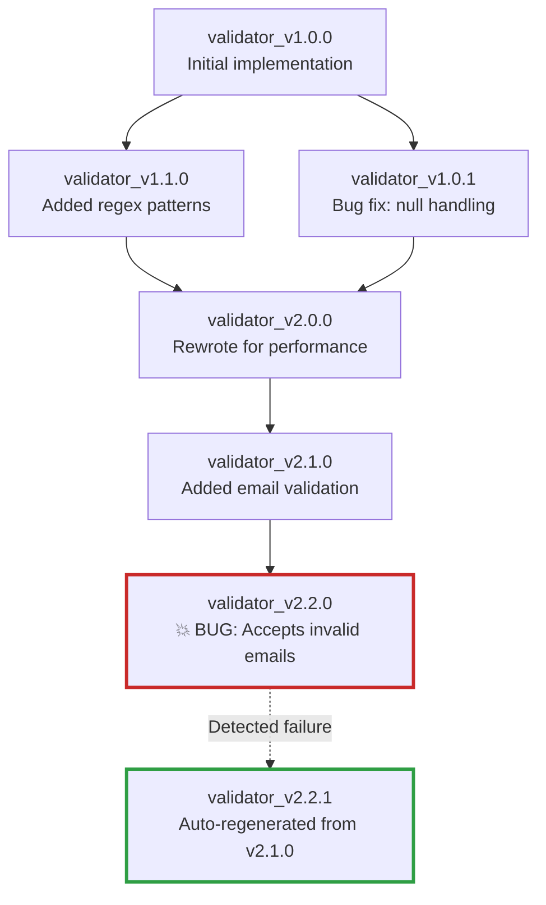

Every tool knows:
- **Who it came from** (parent nodes)
- **What changed** (mutation metadata)
- **What failed** (bug history)
- **What to avoid** (inherited warnings)

When a critical bug is detected, the system:

1. **Identifies the failure point** - Which version introduced the bug?
2. **Prunes the branch** - Marks failed version and descendants as tainted
3. **Propagates warnings** - Adds "avoid" tags to prevent similar mutations
4. **Auto-regenerates** - Creates new version from last known-good ancestor
5. **Updates lineage** - Records the failure in the evolutionary tree

**The result:** A self-healing ecosystem where bugs become permanent institutional memory.

## The Data Structure: Tool Lineage Metadata

First, we need to track way more than we currently do. Here's what the enhanced metadata looks like:

```python
from dataclasses import dataclass, field
from typing import List, Dict, Optional, Set
from datetime import datetime
from enum import Enum

class NodeHealth(Enum):
    HEALTHY = "healthy"
    DEGRADED = "degraded"
    FAILED = "failed"
    PRUNED = "pruned"
    REGENERATED = "regenerated"

class MutationType(Enum):
    OPTIMIZATION = "optimization"
    BUG_FIX = "bug_fix"
    FEATURE_ADD = "feature_add"
    REFACTOR = "refactor"
    SECURITY_PATCH = "security"

@dataclass
class MutationRecord:
    """Record of what changed in this evolution"""
    mutation_type: MutationType
    description: str
    timestamp: datetime
    fitness_before: float
    fitness_after: float
    code_diff_hash: str
    prompt_used: str

@dataclass
class FailureRecord:
    """Record of a bug or failure"""
    failure_type: str
    description: str
    stack_trace: Optional[str]
    test_case_failed: Optional[str]
    detection_method: str  # "test", "runtime", "static_analysis"
    timestamp: datetime
    severity: str  # "critical", "high", "medium", "low"

@dataclass
class AvoidanceRule:
    """Rules about what NOT to do (learned from failures)"""
    rule_id: str
    description: str
    pattern_to_avoid: str  # Regex or semantic description
    reason: str  # Why this is bad
    source_failure: str  # Which node failure created this rule
    propagation_scope: str  # "descendants", "all_similar", "global"
    created_at: datetime

@dataclass
class ToolLineage:
    """Complete lineage and health tracking for a tool"""
    # Identity
    tool_id: str
    version: str
    full_name: str  # e.g., "data_validator_v2.2.0"

    # Lineage
    parent_ids: List[str] = field(default_factory=list)
    child_ids: List[str] = field(default_factory=list)
    ancestor_path: List[str] = field(default_factory=list)  # Path to root

    # Health
    health_status: NodeHealth = NodeHealth.HEALTHY
    failure_count: int = 0
    failures: List[FailureRecord] = field(default_factory=list)

    # Evolution
    mutations: List[MutationRecord] = field(default_factory=list)
    generation: int = 0  # Distance from root

    # Learning
    avoidance_rules: List[AvoidanceRule] = field(default_factory=list)
    inherited_rules: Set[str] = field(default_factory=set)  # Rule IDs from ancestors

    # Performance
    fitness_history: List[float] = field(default_factory=list)
    execution_count: int = 0
    success_rate: float = 1.0

    # Metadata
    created_at: datetime = field(default_factory=datetime.now)
    last_executed: Optional[datetime] = None
    pruned_at: Optional[datetime] = None
    regenerated_from: Optional[str] = None
```

This is a **lot** more data than we currently track. But it's all necessary for true self-healing.

## Detection: How Do We Know Something Broke?

Critical bugs can be detected through multiple channels:

### 1. Test Failures (Immediate Detection)

```python
class TestBasedDetection:
    """Detect bugs through test execution"""

    async def validate_tool_health(
        self,
        tool_id: str,
        lineage: ToolLineage
    ) -> Optional[FailureRecord]:
        """Run all tests and detect failures"""

        # Load tool and its test suite
        tool = await self.tools_manager.load_tool(tool_id)
        test_suite = await self.test_discovery.find_tests(tool)

        results = await self.test_runner.run_tests(test_suite)

        # Check for test failures
        if results.failed_count > 0:
            critical_failures = [
                test for test in results.failures
                if test.is_critical  # BDD scenarios, core functionality
            ]

            if critical_failures:
                return FailureRecord(
                    failure_type="test_failure",
                    description=f"{len(critical_failures)} critical tests failed",
                    test_case_failed=critical_failures[0].name,
                    stack_trace=critical_failures[0].stack_trace,
                    detection_method="test",
                    timestamp=datetime.now(),
                    severity="critical"
                )

        return None

    async def regression_detection(
        self,
        new_version: str,
        old_version: str
    ) -> Optional[FailureRecord]:
        """Detect if new version broke what old version did correctly"""

        # Get test results for both versions
        old_results = await self.get_cached_test_results(old_version)
        new_results = await self.test_runner.run_tests(new_version)

        # Find tests that USED to pass but now fail
        regressions = [
            test for test in old_results.passed
            if test.name in [f.name for f in new_results.failures]
        ]

        if regressions:
            return FailureRecord(
                failure_type="regression",
                description=f"Broke {len(regressions)} previously working tests",
                test_case_failed=regressions[0].name,
                detection_method="regression_test",
                timestamp=datetime.now(),
                severity="critical"
            )

        return None
```

### 2. Runtime Monitoring (Production Detection)

```python
class RuntimeMonitoring:
    """Detect bugs through execution monitoring"""

    def __init__(self):
        self.error_threshold = 0.05  # 5% error rate triggers investigation
        self.execution_window = 100  # Last 100 executions

    async def monitor_tool_health(
        self,
        tool_id: str,
        lineage: ToolLineage
    ) -> Optional[FailureRecord]:
        """Monitor runtime behavior for anomalies"""

        # Get recent execution history
        recent_runs = await self.bugcatcher.get_recent_executions(
            tool_id,
            limit=self.execution_window
        )

        if len(recent_runs) < 10:
            return None  # Not enough data

        # Calculate error rate
        error_count = sum(1 for run in recent_runs if run.had_error)
        error_rate = error_count / len(recent_runs)

        if error_rate > self.error_threshold:
            # Analyze error patterns
            error_types = {}
            for run in recent_runs:
                if run.had_error:
                    error_types[run.error_type] = error_types.get(run.error_type, 0) + 1

            most_common_error = max(error_types.items(), key=lambda x: x[1])

            return FailureRecord(
                failure_type="runtime_errors",
                description=f"Error rate {error_rate:.1%} exceeds threshold",
                stack_trace=recent_runs[-1].stack_trace if recent_runs[-1].had_error else None,
                detection_method="runtime",
                timestamp=datetime.now(),
                severity="high" if error_rate > 0.20 else "medium"
            )

        # Check for performance degradation
        if len(lineage.fitness_history) >= 5:
            recent_fitness = lineage.fitness_history[-5:]
            avg_recent = sum(recent_fitness) / len(recent_fitness)
            historical_fitness = lineage.fitness_history[:-5]
            avg_historical = sum(historical_fitness) / len(historical_fitness)

            degradation = (avg_historical - avg_recent) / avg_historical

            if degradation > 0.30:  # 30% performance drop
                return FailureRecord(
                    failure_type="performance_degradation",
                    description=f"Performance dropped {degradation:.1%}",
                    detection_method="runtime",
                    timestamp=datetime.now(),
                    severity="medium"
                )

        return None
```

### 3. Static Analysis (Pre-Deployment Detection)

```python
class StaticAnalysisDetection:
    """Detect potential bugs through static analysis"""

    async def analyze_tool_safety(
        self,
        tool_id: str,
        code: str
    ) -> Optional[FailureRecord]:
        """Run static analysis to find potential bugs"""

        # Run pylint, mypy, bandit
        static_runner = StaticAnalysisRunner()
        results = await static_runner.analyze_code(code)

        # Check for critical issues
        critical_issues = [
            issue for issue in results.issues
            if issue.severity in ["error", "critical"]
        ]

        if critical_issues:
            return FailureRecord(
                failure_type="static_analysis",
                description=f"Found {len(critical_issues)} critical static issues",
                detection_method="static_analysis",
                timestamp=datetime.now(),
                severity="high"
            )

        # Check for security vulnerabilities
        security_issues = [
            issue for issue in results.issues
            if issue.category == "security"
        ]

        if security_issues:
            return FailureRecord(
                failure_type="security_vulnerability",
                description=f"Found {len(security_issues)} security issues",
                detection_method="static_analysis",
                timestamp=datetime.now(),
                severity="critical"
            )

        return None
```

## The Self-Healing Loop: Detection → Pruning → Recovery

Now the magic happens. When a critical bug is detected:

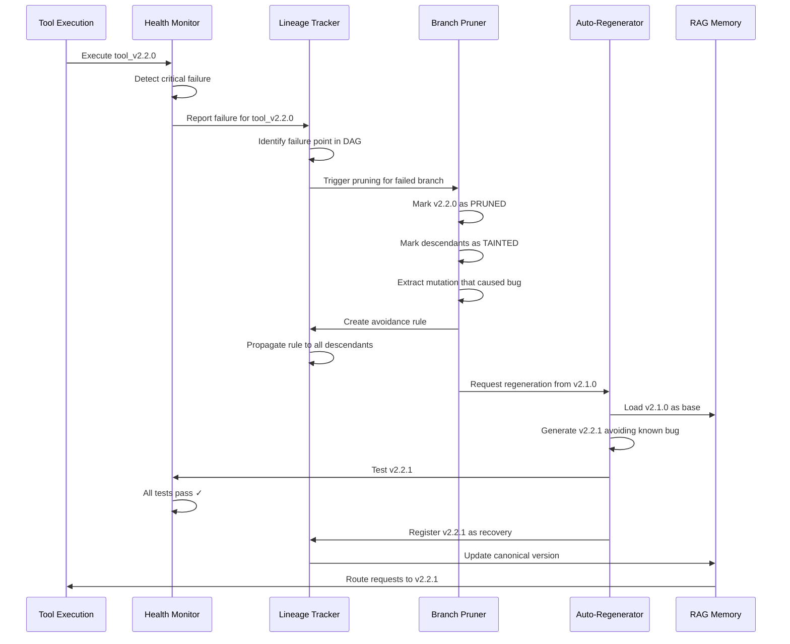

Here's the implementation:

```python
class SelfHealingOrchestrator:
    """Orchestrates the complete self-healing loop"""

    def __init__(
        self,
        tools_manager: ToolsManager,
        lineage_tracker: LineageTracker,
        health_monitor: HealthMonitor,
        rag_memory: QdrantRAGMemory
    ):
        self.tools_manager = tools_manager
        self.lineage_tracker = lineage_tracker
        self.health_monitor = health_monitor
        self.rag_memory = rag_memory
        self.pruner = BranchPruner(lineage_tracker)
        self.regenerator = AutoRegenerator(tools_manager, rag_memory)

    async def handle_failure(
        self,
        tool_id: str,
        failure: FailureRecord
    ) -> Optional[str]:
        """
        Complete self-healing cycle:
        1. Detect failure (already done, passed in)
        2. Prune failed branch
        3. Create avoidance rules
        4. Regenerate from last known-good
        5. Validate recovery
        6. Update routing
        """

        logger.critical(f"Self-healing triggered for {tool_id}: {failure.description}")

        # Step 1: Get lineage information
        lineage = await self.lineage_tracker.get_lineage(tool_id)

        # Step 2: Mark failure in lineage
        lineage.health_status = NodeHealth.FAILED
        lineage.failures.append(failure)
        lineage.failure_count += 1
        await self.lineage_tracker.update(lineage)

        # Step 3: Identify what went wrong
        failure_analysis = await self.analyze_failure(tool_id, failure, lineage)

        if not failure_analysis.is_recoverable:
            logger.error(f"Failure is not auto-recoverable: {failure_analysis.reason}")
            return None

        # Step 4: Prune the failed branch
        pruning_result = await self.pruner.prune_branch(
            failed_node=tool_id,
            failure=failure,
            lineage=lineage
        )

        # Step 5: Create avoidance rules
        avoidance_rule = await self.create_avoidance_rule(
            failure=failure,
            analysis=failure_analysis,
            pruning_result=pruning_result
        )

        # Step 6: Propagate avoidance rule to descendants
        await self.lineage_tracker.propagate_rule(
            rule=avoidance_rule,
            scope=avoidance_rule.propagation_scope
        )

        # Step 7: Find last known-good ancestor
        last_good_ancestor = await self.find_last_healthy_ancestor(lineage)

        if not last_good_ancestor:
            logger.error(f"No healthy ancestor found for {tool_id}")
            return None

        logger.info(f"Regenerating from {last_good_ancestor}")

        # Step 8: Regenerate from healthy ancestor
        new_version = await self.regenerator.regenerate_from_ancestor(
            ancestor_id=last_good_ancestor,
            original_goal=lineage.mutations[-1].description,
            avoid_rules=[avoidance_rule]
        )

        if not new_version:
            logger.error("Regeneration failed")
            return None

        # Step 9: Validate the regenerated version
        validation_result = await self.health_monitor.validate_tool(new_version)

        if not validation_result.is_healthy:
            logger.error(f"Regenerated tool still unhealthy: {validation_result.issues}")
            return None

        # Step 10: Update lineage to mark recovery
        new_lineage = await self.lineage_tracker.get_lineage(new_version)
        new_lineage.health_status = NodeHealth.REGENERATED
        new_lineage.regenerated_from = last_good_ancestor
        new_lineage.inherited_rules.add(avoidance_rule.rule_id)
        await self.lineage_tracker.update(new_lineage)

        # Step 11: Update RAG routing to prefer new version
        await self.rag_memory.mark_as_preferred(new_version)
        await self.rag_memory.deprecate_version(tool_id)

        logger.success(f"Self-healing complete: {tool_id} → {new_version}")

        return new_version

    async def analyze_failure(
        self,
        tool_id: str,
        failure: FailureRecord,
        lineage: ToolLineage
    ) -> FailureAnalysis:
        """Use LLM to analyze what went wrong"""

        # Get the code for failed and parent versions
        failed_code = await self.tools_manager.get_tool_code(tool_id)

        if not lineage.parent_ids:
            return FailureAnalysis(
                is_recoverable=False,
                reason="No parent to recover from"
            )

        parent_id = lineage.parent_ids[0]
        parent_code = await self.tools_manager.get_tool_code(parent_id)

        # Get the mutation that was applied
        last_mutation = lineage.mutations[-1] if lineage.mutations else None

        # Ask overseer LLM to analyze
        analysis_prompt = f"""
Analyze this tool failure:

FAILED TOOL: {tool_id}
FAILURE: {failure.description}
FAILURE TYPE: {failure.failure_type}

PARENT TOOL: {parent_id}
MUTATION APPLIED: {last_mutation.description if last_mutation else "Unknown"}

CODE DIFF:
{self.generate_diff(parent_code, failed_code)}

STACK TRACE:
{failure.stack_trace or "None"}

Questions:
1. What specific change caused the failure?
2. Was it the mutation itself, or a side effect?
3. Can we regenerate from the parent with a better approach?
4. What should we avoid in future mutations?

Provide a structured analysis.
"""

        analysis_result = await self.overseer_llm.analyze(
            analysis_prompt,
            response_model=FailureAnalysis
        )

        return analysis_result

    async def create_avoidance_rule(
        self,
        failure: FailureRecord,
        analysis: FailureAnalysis,
        pruning_result: PruningResult
    ) -> AvoidanceRule:
        """Create a rule to prevent similar failures"""

        # Extract pattern from analysis
        pattern = analysis.problematic_pattern

        return AvoidanceRule(
            rule_id=f"avoid_{uuid.uuid4().hex[:8]}",
            description=analysis.rule_description,
            pattern_to_avoid=pattern,
            reason=failure.description,
            source_failure=pruning_result.failed_node_id,
            propagation_scope="descendants",  # Or "all_similar" for broader impact
            created_at=datetime.now()
        )

    async def find_last_healthy_ancestor(
        self,
        lineage: ToolLineage
    ) -> Optional[str]:
        """Walk up the lineage tree to find last healthy node"""

        # Start with immediate parents
        for parent_id in lineage.parent_ids:
            parent_lineage = await self.lineage_tracker.get_lineage(parent_id)

            if parent_lineage.health_status == NodeHealth.HEALTHY:
                # Verify it still works
                validation = await self.health_monitor.validate_tool(parent_id)
                if validation.is_healthy:
                    return parent_id

        # If parents are unhealthy, recurse up the tree
        for parent_id in lineage.parent_ids:
            parent_lineage = await self.lineage_tracker.get_lineage(parent_id)
            ancestor = await self.find_last_healthy_ancestor(parent_lineage)
            if ancestor:
                return ancestor

        return None
```

## Branch Pruning: Preventing Bad Mutations Forever

The pruner marks failed branches and prevents them from being used:

```python
class BranchPruner:
    """Prunes failed branches from the evolutionary tree"""

    def __init__(self, lineage_tracker: LineageTracker):
        self.lineage_tracker = lineage_tracker

    async def prune_branch(
        self,
        failed_node: str,
        failure: FailureRecord,
        lineage: ToolLineage
    ) -> PruningResult:
        """
        Prune a failed branch:
        1. Mark the failed node as PRUNED
        2. Mark all descendants as TAINTED
        3. Remove from active routing
        4. Preserve for learning (don't delete!)
        """

        logger.warning(f"Pruning branch starting at {failed_node}")

        # Mark the failed node
        lineage.health_status = NodeHealth.PRUNED
        lineage.pruned_at = datetime.now()
        await self.lineage_tracker.update(lineage)

        # Find all descendants
        descendants = await self.lineage_tracker.get_all_descendants(failed_node)

        pruned_count = 1
        tainted_count = 0

        # Mark descendants as tainted (they inherit the bug)
        for descendant_id in descendants:
            descendant = await self.lineage_tracker.get_lineage(descendant_id)

            if descendant.health_status == NodeHealth.HEALTHY:
                descendant.health_status = NodeHealth.DEGRADED
                descendant.inherited_rules.add(f"tainted_by_{failed_node}")
                await self.lineage_tracker.update(descendant)
                tainted_count += 1

        # Remove from RAG active routing
        await self.rag_memory.mark_as_inactive(failed_node)
        for descendant_id in descendants:
            await self.rag_memory.mark_as_inactive(descendant_id)

        logger.info(f"Pruned 1 node, tainted {tainted_count} descendants")

        return PruningResult(
            failed_node_id=failed_node,
            pruned_count=pruned_count,
            tainted_count=tainted_count,
            descendants=descendants,
            failure=failure
        )

    async def can_reuse_tool(
        self,
        tool_id: str,
        context: Dict
    ) -> Tuple[bool, Optional[str]]:
        """Check if a tool is safe to reuse (not pruned or tainted)"""

        lineage = await self.lineage_tracker.get_lineage(tool_id)

        if lineage.health_status == NodeHealth.PRUNED:
            return False, f"Tool {tool_id} has been pruned due to critical bug"

        if lineage.health_status == NodeHealth.FAILED:
            return False, f"Tool {tool_id} has known failures"

        if lineage.health_status == NodeHealth.DEGRADED:
            # Check if degradation is relevant to current context
            for rule_id in lineage.inherited_rules:
                rule = await self.lineage_tracker.get_rule(rule_id)
                if self.rule_applies_to_context(rule, context):
                    return False, f"Tool is tainted by rule: {rule.description}"

        return True, None
```

## Auto-Regeneration: Creating Better Versions

When a tool fails, regenerate from a healthy ancestor with avoidance rules:

```python
class AutoRegenerator:
    """Regenerates tools from healthy ancestors with learned constraints"""

    def __init__(
        self,
        tools_manager: ToolsManager,
        rag_memory: QdrantRAGMemory
    ):
        self.tools_manager = tools_manager
        self.rag_memory = rag_memory

    async def regenerate_from_ancestor(
        self,
        ancestor_id: str,
        original_goal: str,
        avoid_rules: List[AvoidanceRule]
    ) -> Optional[str]:
        """
        Regenerate a tool from a healthy ancestor, avoiding known pitfalls
        """

        # Load ancestor code and metadata
        ancestor_tool = await self.tools_manager.load_tool(ancestor_id)
        ancestor_code = ancestor_tool.implementation
        ancestor_spec = ancestor_tool.specification

        # Build avoidance constraints
        avoidance_constraints = self.build_avoidance_prompt(avoid_rules)

        # Create regeneration spec
        regen_spec = f"""
Original Goal: {original_goal}

Base Implementation: {ancestor_id}
{ancestor_code}

CRITICAL CONSTRAINTS - MUST AVOID:
{avoidance_constraints}

Task: Regenerate this tool with the original goal, but strictly avoiding the patterns above.
The previous attempt failed because it violated these constraints.

Approach:
1. Achieve the original goal (performance, features, etc.)
2. Absolutely avoid the prohibited patterns
3. Maintain all existing test compatibility
4. Add safeguards to prevent the specific failure mode

Generate an improved version that achieves the goal safely.
"""

        # Use overseer to create careful specification
        overseer_result = await self.overseer_llm.plan(
            regen_spec,
            response_model=ToolSpecification
        )

        # Generate code with strict validation
        generator_result = await self.generator_llm.generate(
            specification=overseer_result,
            base_code=ancestor_code,
            avoid_patterns=[rule.pattern_to_avoid for rule in avoid_rules]
        )

        if not generator_result.success:
            logger.error(f"Regeneration failed: {generator_result.error}")
            return None

        # Create new version ID
        ancestor_version = parse_version(ancestor_id)
        new_version = increment_patch(ancestor_version)
        new_tool_id = f"{ancestor_tool.name}_{new_version}"

        # Register the new tool
        await self.tools_manager.register_tool(
            tool_id=new_tool_id,
            code=generator_result.code,
            specification=overseer_result,
            metadata={
                "regenerated_from": ancestor_id,
                "avoidance_rules": [r.rule_id for r in avoid_rules],
                "regeneration_reason": "self_healing"
            }
        )

        logger.success(f"Regenerated {new_tool_id} from {ancestor_id}")

        return new_tool_id

    def build_avoidance_prompt(self, avoid_rules: List[AvoidanceRule]) -> str:
        """Build a clear prompt about what to avoid"""

        constraints = []
        for i, rule in enumerate(avoid_rules, 1):
            constraints.append(f"""
{i}. AVOID: {rule.description}
   Pattern: {rule.pattern_to_avoid}
   Reason: {rule.reason}
   Source: {rule.source_failure}
""")

        return "\n".join(constraints)
```

## Avoidance Rule Propagation: Institutional Memory

The killer feature: rules learned from failures propagate through the lineage tree:

```python
class LineageTracker:
    """Tracks tool lineage and propagates learning"""

    async def propagate_rule(
        self,
        rule: AvoidanceRule,
        scope: str
    ):
        """
        Propagate an avoidance rule through the lineage tree

        Scopes:
        - "descendants": Only affect direct descendants of failed node
        - "all_similar": Affect all tools in similar semantic space
        - "global": Affect all tools (for critical security issues)
        """

        if scope == "descendants":
            await self._propagate_to_descendants(rule)
        elif scope == "all_similar":
            await self._propagate_to_similar(rule)
        elif scope == "global":
            await self._propagate_globally(rule)

    async def _propagate_to_descendants(self, rule: AvoidanceRule):
        """Add rule to all descendants of the source failure"""

        source_node = rule.source_failure
        descendants = await self.get_all_descendants(source_node)

        for descendant_id in descendants:
            lineage = await self.get_lineage(descendant_id)
            lineage.inherited_rules.add(rule.rule_id)
            await self.update(lineage)

        logger.info(f"Propagated rule {rule.rule_id} to {len(descendants)} descendants")

    async def _propagate_to_similar(self, rule: AvoidanceRule):
        """Add rule to semantically similar tools"""

        # Find similar tools using RAG
        similar_tools = await self.rag_memory.find_similar(
            query=rule.description,
            filter={"type": "tool"},
            top_k=50,
            similarity_threshold=0.7
        )

        for tool_result in similar_tools:
            tool_id = tool_result.id
            lineage = await self.get_lineage(tool_id)
            lineage.inherited_rules.add(rule.rule_id)
            await self.update(lineage)

        logger.info(f"Propagated rule {rule.rule_id} to {len(similar_tools)} similar tools")

    async def _propagate_globally(self, rule: AvoidanceRule):
        """Add rule to ALL tools (for critical security issues)"""

        all_tools = await self.get_all_tools()

        for tool_id in all_tools:
            lineage = await self.get_lineage(tool_id)
            lineage.inherited_rules.add(rule.rule_id)
            await self.update(lineage)

        logger.warning(f"Propagated GLOBAL rule {rule.rule_id} to {len(all_tools)} tools")
```

## Real-World Example: Email Validator Evolution Gone Wrong

Let's walk through a complete example:

```python
# Initial healthy tool
email_validator_v1_0_0 = """
def validate_email(email: str) -> bool:
    pattern = r'^[a-zA-Z0-9._%+-]+@[a-zA-Z0-9.-]+\.[a-zA-Z]{2,}$'
    return bool(re.match(pattern, email))
"""
# Tests pass, fitness: 0.85

# Auto-evolution triggers: "Optimize for performance"
# System generates v2.0.0

email_validator_v2_0_0 = """
def validate_email(email: str) -> bool:
    # Optimized: skip regex for obvious cases
    if '@' not in email:
        return False
    return True  # ⚠️ BUG: Too permissive!
"""
# Tests initially pass (basic tests), fitness: 0.95 (faster!)
# Deployed to production...

# Runtime monitoring detects failures
runtime_errors = [
    "Accepted 'user@@domain.com'",
    "Accepted '@domain.com'",
    "Accepted 'user@'",
]

# Self-healing triggered!

failure = FailureRecord(
    failure_type="logic_error",
    description="Email validation too permissive, accepts invalid emails",
    detection_method="runtime",
    severity="critical"
)

# System analyzes failure
analysis = """
The optimization removed the comprehensive regex validation in favor of
a simple '@' check. This makes it fast but incorrect.

Problematic Pattern: "Replacing comprehensive validation with simple substring checks"

Avoidance Rule: "Never replace regex validation with simple string checks without
comprehensive test coverage for edge cases"
"""

# Branch pruning
# - Mark v2.0.0 as PRUNED
# - Create avoidance rule
# - Propagate to all email-related validators

# Auto-regeneration from v1.0.0
email_validator_v2_0_1 = """
def validate_email(email: str) -> bool:
    # Optimized: compile regex once
    if not hasattr(validate_email, '_pattern'):
        validate_email._pattern = re.compile(
            r'^[a-zA-Z0-9._%+-]+@[a-zA-Z0-9.-]+\.[a-zA-Z]{2,}$'
        )

    # Fast path for obvious failures
    if '@' not in email or email.count('@') != 1:
        return False

    # Comprehensive validation (cached pattern)
    return bool(validate_email._pattern.match(email))
"""
# Tests pass, fitness: 0.92 (faster AND correct!)
# Deployed, monitored, succeeds!
```

The system learned:
1. ✅ **Never** replace comprehensive validation with simple checks
2. ✅ **Always** maintain test coverage during optimization
3. ✅ **Cache** compiled patterns instead of simplifying logic
4. ✅ **Add** fast-path checks BEFORE comprehensive checks, not INSTEAD of them

This knowledge is now permanent institutional memory, propagated to all similar tools.

## Visualizing the Self-Healing Ecosystem

Here's how the complete system looks:

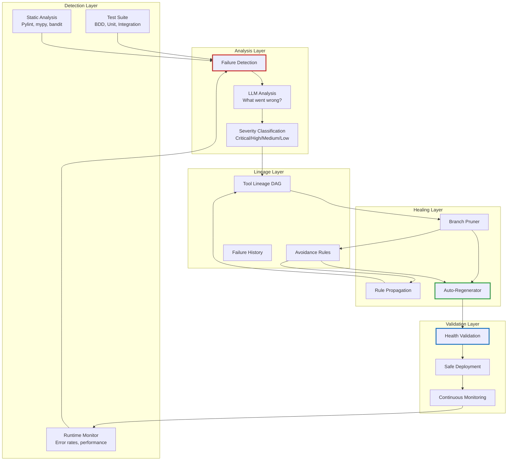

## Integration with Existing DISE Components

The beautiful part: this builds on what we already have:

```python
class EnhancedToolsManager(ToolsManager):
    """Extended ToolsManager with self-healing capabilities"""

    def __init__(self, config: ConfigManager, *args, **kwargs):
        super().__init__(config, *args, **kwargs)

        # New components
        self.lineage_tracker = LineageTracker(
            storage_path="lineage/",
            rag_memory=self.rag_memory
        )

        self.health_monitor = HealthMonitor(
            test_runner=self.test_runner,
            bugcatcher=self.bugcatcher,
            static_runner=self.static_runner
        )

        self.self_healing = SelfHealingOrchestrator(
            tools_manager=self,
            lineage_tracker=self.lineage_tracker,
            health_monitor=self.health_monitor,
            rag_memory=self.rag_memory
        )

        # Enable continuous health monitoring
        self.start_health_monitoring()

    async def call_tool(self, tool_id: str, inputs: Dict) -> Any:
        """Override to add health checks and auto-recovery"""

        # Check if tool is safe to use
        can_use, reason = await self.self_healing.pruner.can_reuse_tool(
            tool_id,
            context=inputs
        )

        if not can_use:
            # Tool is pruned, find alternative
            logger.warning(f"Tool {tool_id} is unsafe: {reason}")
            alternative = await self.find_healthy_alternative(tool_id)

            if alternative:
                logger.info(f"Using alternative: {alternative}")
                tool_id = alternative
            else:
                raise ToolPrunedError(f"{tool_id} is pruned and no alternative exists")

        # Execute tool with monitoring
        try:
            result = await super().call_tool(tool_id, inputs)

            # Record successful execution
            await self.lineage_tracker.record_success(tool_id)

            return result

        except Exception as e:
            # Record failure
            failure = FailureRecord(
                failure_type=type(e).__name__,
                description=str(e),
                stack_trace=traceback.format_exc(),
                detection_method="runtime",
                timestamp=datetime.now(),
                severity="high"
            )

            await self.lineage_tracker.record_failure(tool_id, failure)

            # Check if this triggers self-healing
            lineage = await self.lineage_tracker.get_lineage(tool_id)

            if lineage.failure_count >= 3:  # Three strikes rule
                logger.critical(f"Tool {tool_id} reached failure threshold, triggering self-healing")

                # Trigger self-healing in background
                asyncio.create_task(
                    self.self_healing.handle_failure(tool_id, failure)
                )

            raise

    async def find_healthy_alternative(self, pruned_tool_id: str) -> Optional[str]:
        """Find a healthy alternative to a pruned tool"""

        # Get tool metadata
        tool_metadata = await self.rag_memory.get_metadata(pruned_tool_id)

        # Search for similar tools
        alternatives = await self.rag_memory.find_similar(
            query=tool_metadata.description,
            filter={
                "type": "tool",
                "category": tool_metadata.category
            },
            top_k=10
        )

        # Find first healthy alternative
        for alt in alternatives:
            can_use, _ = await self.self_healing.pruner.can_reuse_tool(
                alt.id,
                context={}
            )
            if can_use:
                return alt.id

        return None

    def start_health_monitoring(self):
        """Start background health monitoring"""

        async def monitor_loop():
            while True:
                await asyncio.sleep(300)  # Every 5 minutes

                # Get all active tools
                active_tools = await self.get_active_tools()

                for tool_id in active_tools:
                    # Check health
                    health_result = await self.health_monitor.check_tool_health(tool_id)

                    if not health_result.is_healthy:
                        logger.warning(f"Health check failed for {tool_id}: {health_result.issues}")

                        # Trigger self-healing if critical
                        if health_result.severity == "critical":
                            await self.self_healing.handle_failure(
                                tool_id,
                                health_result.failure
                            )

        asyncio.create_task(monitor_loop())
```

## Configuration for Self-Healing

Add to your `config.yaml`:

```yaml
self_healing:
  enabled: true

  detection:
    test_based: true
    runtime_monitoring: true
    static_analysis: true

  thresholds:
    failure_count_trigger: 3  # Trigger healing after N failures
    error_rate_threshold: 0.05  # 5% error rate
    performance_degradation: 0.30  # 30% slowdown

  pruning:
    auto_prune_critical: true
    keep_pruned_history: true  # Don't delete, learn from it
    taint_descendants: true

  regeneration:
    auto_regenerate: true
    max_regeneration_attempts: 3
    require_test_validation: true

  propagation:
    default_scope: "descendants"  # or "all_similar" or "global"
    critical_failures_global: true  # Security issues affect all tools

  monitoring:
    health_check_interval_seconds: 300  # Every 5 minutes
    continuous_monitoring: true

lineage_tracking:
  enabled: true
  storage_path: "lineage/"
  max_history_depth: 100  # How far back to track ancestry
  compress_old_lineage: true  # Save space for old data
```

## The Database Schema: Storing Lineage

We need persistent storage for lineage data:

```sql
-- Tool lineage table
CREATE TABLE tool_lineage (
    tool_id VARCHAR(255) PRIMARY KEY,
    version VARCHAR(50),
    full_name VARCHAR(255),
    health_status VARCHAR(50),
    failure_count INTEGER DEFAULT 0,
    generation INTEGER DEFAULT 0,
    execution_count INTEGER DEFAULT 0,
    success_rate FLOAT DEFAULT 1.0,
    created_at TIMESTAMP,
    last_executed TIMESTAMP,
    pruned_at TIMESTAMP,
    regenerated_from VARCHAR(255)
);

-- Parent-child relationships
CREATE TABLE lineage_relationships (
    id SERIAL PRIMARY KEY,
    child_id VARCHAR(255),
    parent_id VARCHAR(255),
    relationship_type VARCHAR(50),  -- 'direct', 'merge', 'fork'
    created_at TIMESTAMP,
    FOREIGN KEY (child_id) REFERENCES tool_lineage(tool_id),
    FOREIGN KEY (parent_id) REFERENCES tool_lineage(tool_id)
);

-- Mutation records
CREATE TABLE mutations (
    id SERIAL PRIMARY KEY,
    tool_id VARCHAR(255),
    mutation_type VARCHAR(50),
    description TEXT,
    prompt_used TEXT,
    code_diff_hash VARCHAR(64),
    fitness_before FLOAT,
    fitness_after FLOAT,
    timestamp TIMESTAMP,
    FOREIGN KEY (tool_id) REFERENCES tool_lineage(tool_id)
);

-- Failure records
CREATE TABLE failures (
    id SERIAL PRIMARY KEY,
    tool_id VARCHAR(255),
    failure_type VARCHAR(100),
    description TEXT,
    stack_trace TEXT,
    test_case_failed VARCHAR(255),
    detection_method VARCHAR(50),
    severity VARCHAR(20),
    timestamp TIMESTAMP,
    FOREIGN KEY (tool_id) REFERENCES tool_lineage(tool_id)
);

-- Avoidance rules
CREATE TABLE avoidance_rules (
    rule_id VARCHAR(255) PRIMARY KEY,
    description TEXT,
    pattern_to_avoid TEXT,
    reason TEXT,
    source_failure VARCHAR(255),
    propagation_scope VARCHAR(50),
    created_at TIMESTAMP,
    FOREIGN KEY (source_failure) REFERENCES tool_lineage(tool_id)
);

-- Rule inheritance
CREATE TABLE rule_inheritance (
    id SERIAL PRIMARY KEY,
    tool_id VARCHAR(255),
    rule_id VARCHAR(255),
    inherited_at TIMESTAMP,
    FOREIGN KEY (tool_id) REFERENCES tool_lineage(tool_id),
    FOREIGN KEY (rule_id) REFERENCES avoidance_rules(rule_id)
);

-- Fitness history
CREATE TABLE fitness_history (
    id SERIAL PRIMARY KEY,
    tool_id VARCHAR(255),
    fitness_score FLOAT,
    execution_time_ms INTEGER,
    memory_usage_mb FLOAT,
    timestamp TIMESTAMP,
    FOREIGN KEY (tool_id) REFERENCES tool_lineage(tool_id)
);

-- Indexes for performance
CREATE INDEX idx_lineage_health ON tool_lineage(health_status);
CREATE INDEX idx_lineage_version ON tool_lineage(version);
CREATE INDEX idx_relationships_child ON lineage_relationships(child_id);
CREATE INDEX idx_relationships_parent ON lineage_relationships(parent_id);
CREATE INDEX idx_failures_tool ON failures(tool_id);
CREATE INDEX idx_failures_severity ON failures(severity);
CREATE INDEX idx_rules_source ON avoidance_rules(source_failure);
CREATE INDEX idx_inheritance_tool ON rule_inheritance(tool_id);
CREATE INDEX idx_fitness_tool ON fitness_history(tool_id);
```

## The CLI: Interacting with Self-Healing

Add new commands to the CLI:

```bash
# View lineage for a tool
$ python chat_cli.py lineage data_validator_v2.2.0

Tool Lineage: data_validator_v2.2.0
Status: ❌ PRUNED (Critical failure detected)
Pruned: 2025-01-22 14:23:15

Ancestry:
  ├─ data_validator_v1.0.0 (✓ Healthy)
  ├─ data_validator_v1.1.0 (✓ Healthy)
  ├─ data_validator_v2.0.0 (✓ Healthy)
  ├─ data_validator_v2.1.0 (✓ Healthy)
  └─ data_validator_v2.2.0 (❌ PRUNED) ← You are here

Failures:
  1. [2025-01-22 14:20:01] Logic Error: Email validation too permissive
     Severity: Critical
     Detection: Runtime monitoring

Mutations Applied:
  - [2025-01-22 14:15:00] Optimization: Remove regex for simple @ check
    Fitness: 0.85 → 0.95

Avoidance Rules Created:
  - avoid_3f8a2c1d: Never replace comprehensive validation with simple checks
    Propagated to: 12 descendants, 34 similar tools

Recovery:
  ✓ Auto-regenerated as data_validator_v2.2.1
  New version healthy, monitoring...

# View all pruned tools
$ python chat_cli.py pruned

Pruned Tools:
  1. data_validator_v2.2.0 (Critical: Logic error)
  2. json_parser_v1.5.3 (High: Performance regression)
  3. http_client_v3.1.0 (Critical: Security vulnerability)

# View avoidance rules
$ python chat_cli.py rules

Active Avoidance Rules:
  1. avoid_3f8a2c1d [DESCENDANTS]
     Never replace comprehensive validation with simple checks
     Source: data_validator_v2.2.0
     Affects: 46 tools

  2. avoid_7b2e9f0a [GLOBAL]
     Never use eval() on user input
     Source: json_parser_v1.5.3
     Affects: ALL tools

  3. avoid_1c4d8a6f [ALL_SIMILAR]
     Always use connection pooling for HTTP clients
     Source: http_client_v3.1.0
     Affects: 23 tools

# Manually trigger healing
$ python chat_cli.py heal data_validator_v2.2.0

Initiating self-healing for data_validator_v2.2.0...
✓ Failure analysis complete
✓ Branch pruned
✓ Avoidance rule created: avoid_3f8a2c1d
✓ Rule propagated to 46 tools
✓ Regenerated from data_validator_v2.1.0
✓ Validation passed
✓ Deployed as data_validator_v2.2.1

Self-healing complete! New version: data_validator_v2.2.1

# View health report
$ python chat_cli.py health

System Health Report:
  Total Tools: 237
  Healthy: 229 (96.6%)
  Degraded: 5 (2.1%)
  Failed: 2 (0.8%)
  Pruned: 1 (0.4%)

Recent Failures:
  - data_validator_v2.2.0 (Auto-healed ✓)
  - api_client_v1.3.2 (Monitoring...)

Auto-Healing Stats:
  Total healing events: 8
  Successful recoveries: 7 (87.5%)
  Failed recoveries: 1 (12.5%)
  Avg recovery time: 45 seconds
```

## What Actually Works (And What's Still Theoretical)

Let's be honest about what's real vs. aspirational:

### ✅ Already Working in DISE
1. **Tool versioning** - Semantic versions with hash-based detection
2. **Lineage tracking** - Changelog with mutation history
3. **Test-based validation** - Comprehensive test discovery and execution
4. **Runtime monitoring** - Bugcatcher tracks execution and errors
5. **RAG memory** - Semantic storage and retrieval
6. **Auto-evolution** - Performance-based mutation triggers

### 🚧 Needs Implementation
1. **Complete lineage DAG** - Currently tracks last 10, need full tree
2. **Avoidance rules** - Pattern storage and propagation system
3. **Branch pruning** - Marking failed versions as inactive
4. **Auto-regeneration** - Triggered healing from ancestors
5. **Health monitoring loop** - Background continuous validation
6. **Rule propagation** - Descendant/similar/global scoping

### 🔮 Future Vision
1. **Cross-system learning** - Multiple DISE instances sharing rules
2. **Adversarial testing** - Tools testing each other for vulnerabilities
3. **Meta-evolution** - System evolving its healing strategies
4. **Predictive pruning** - Detect potential failures before they happen

## The Uncomfortable Truth

This system, if fully implemented, creates something unsettling:

**Tools that remember every mistake ever made and ensure they never repeat it.**

Not just individually. **Collectively.**

A bug in one tool propagates as knowledge to every similar tool. A security vulnerability discovered anywhere becomes a global constraint everywhere.

**The system develops institutional memory.**

And here's the thing: **institutional memory compound exponentially.**

- Year 1: 100 tools, 10 avoidance rules
- Year 2: 1,000 tools, 150 avoidance rules (learning from each other)
- Year 3: 10,000 tools, 2,000 avoidance rules (shared knowledge base)

**Each generation is constrained by all previous mistakes.**

This is either:
- **The most robust code generation system ever built** ✓
- **A demonstration of how AGI-level systems might learn** 🤔
- **Both, and that's terrifying** 🚨

## Implementation Roadmap

If we were to actually build this, here's the order:

### Phase 1: Foundation (2 weeks)
- Implement complete lineage DAG storage
- Add failure recording to tool execution
- Create AvoidanceRule data model
- Build basic pruning system

### Phase 2: Detection (2 weeks)
- Enhance runtime monitoring with failure analysis
- Integrate static analysis into tool validation
- Build severity classification system
- Create health monitoring loop

### Phase 3: Healing (3 weeks)
- Implement auto-regeneration from ancestors
- Build LLM-based failure analysis
- Create rule propagation system
- Add safe deployment with validation

### Phase 4: Integration (1 week)
- Integrate with existing ToolsManager
- Add CLI commands for lineage/health/pruning
- Create monitoring dashboard
- Write comprehensive tests

### Phase 5: Polish (1 week)
- Performance optimization
- Database indexing
- Documentation
- Real-world testing

**Total:** ~9 weeks of focused development

## Conclusion: When Code Learns From Code

Self-healing through lineage-aware pruning isn't just a feature. It's a fundamental shift in how we think about code generation.

Traditional systems:
```
Generate → Test → Use → Fail → Regenerate → Repeat forever
```

Self-healing systems:
```
Generate → Test → Use → Fail → Learn → Prevent → Heal → Never repeat
```

**The difference is memory.**

Not just memory of what worked. **Memory of what failed and why.**

And that memory propagates. Through descendants. Through similar tools. Through the entire ecosystem.

**The system develops antibodies.**

Once a bug is detected, it can never happen again in that form. The pattern is remembered, the avoidance rule is created, the knowledge propagates.

**This is how immune systems work.**

**This is how organizations learn.**

**This is how civilizations develop.**

And now, maybe, this is how code can evolve.

## Try It (Someday)

This is currently a design document, not a working feature. But if you want to help build it:

1. **Read the DISE codebase** - Understand tools_manager, lineage, RAG
2. **Start with Phase 1** - Lineage DAG is the foundation
3. **Build incrementally** - Each phase adds value independently
4. **Test extensively** - Self-healing systems need rigorous validation
5. **Report findings** - What works? What breaks? What emerges?

The goal isn't to build a perfect system on day one.

The goal is to build a system that can **learn from every mistake** and **never repeat it**.

If we can do that, we've created something genuinely new.

Not just better code generation.

**Code that remembers.**

---

## Technical Details & Resources

**Conceptual Foundation:**
- Part 7: Directed Synthetic Evolution (working system)
- This article: Self-healing extension (design)

**Key Components to Build:**
- `lineage_tracker.py` - Complete DAG storage and querying
- `health_monitor.py` - Multi-channel failure detection
- `branch_pruner.py` - Failed branch management
- `auto_regenerator.py` - Healing from ancestors
- `avoidance_rules.py` - Pattern storage and propagation

**Integration Points:**
- `tools_manager.py` - Add health checks to tool execution
- `auto_evolver.py` - Add avoidance rule constraints
- `qdrant_rag_memory.py` - Store lineage in vector DB
- `test_discovery.py` - Enhanced failure reporting

**Dependencies:**
- PostgreSQL or SQLite (lineage storage)
- Existing DISE infrastructure
- No new external dependencies needed

---

**Series Navigation:**
- [Part 1: Simple Rules, Complex Behavior](semantidintelligence-part1) - The foundation
- [Part 2: Collective Intelligence](semantidintelligence-part2) - Communication transforms everything
- [Part 3: Self-Optimization](semantidintelligence-part3) - Systems that improve themselves
- [Part 4: The Emergence](semantidintelligence-part4) - When optimization becomes intelligence
- [Part 5: Evolution](semantidintelligence-part5) - From optimization to guilds and culture
- [Part 6: Global Consensus](semantidintelligence-part6) - Directed evolution and planetary cognition
- [Part 7: The Real Thing!](senmanticintelligence-part7) - Actually building it and watching it evolve
- [Part 8: Tools All The Way Down](semanticintelligence-part8) - The self-optimizing toolkit
- **Part 9: Self-Healing Tools** ← You are here (lineage-aware pruning design)
- [Part 10: The DiSE Cooker](semanticintelligence-part10) - When theory meets messy reality

---

*This is a design document for DISE's self-healing capabilities. The core mechanisms (lineage, evolution, RAG memory, testing) already exist. This article describes how to combine them into a system where tools learn from failures and never repeat mistakes. It's ambitious. It might be implementable. And if it works, it changes everything about how code evolves.*

*The uncomfortable parallel: This is how immune systems work. This is how organizations learn. If code can do this at scale... what else becomes possible?*

**Tags:** `#Python` `#AI` `#CodeGeneration` `#SelfHealing` `#Lineage` `#AutoRecovery` `#EvolutionaryAlgorithms` `#DISE` `#ToolManagement` `#BugPrevention` `#InstitutionalMemory`


---

# Semantic Intelligence: Part 10 - The DiSE Cooker: When Tools Cook Themselves Into Workflows

<datetime class="hidden">2025-11-19T09:00</datetime>
<!-- category -- AI-Article, AI, DiSE Cooker, Workflow Evolution, Tool Composition, Self-Optimization, mostlylucid-dse -->

**The finale of the Semantic Memory series. The beginning of something stranger.**

> **Note:** This is Part 10—the last in the Semantic Memory series and the first in the DiSE Cooker series. We're moving from theory to practice, from "how tools work" to "what happens when you actually use them for real tasks." Buckle up.

## The End and The Beginning

Parts 1-9 built up to this: a system that doesn't just generate code, but **evolves** it. Tools that don't just sit there, but **learn** from every invocation. A toolkit that doesn't just execute workflows, but **remembers** every success and every failure.

Now we answer the question nobody asked but everyone should have:

**What happens when you actually USE this thing?**

Not for toy examples. Not for "hello world." For a real, messy, multi-step task that normal code generation systems would absolutely choke on.

Here's the scenario:

> "Go to this webpage, fetch the content, summarize it, translate it to Spanish (using NMT but check quality and use something better if needed), then create an HTML email and send it using SendGrid."

A single sentence. **Seven distinct operations.** Multiple tools. Multiple failure modes. Multiple optimization opportunities.

Let's watch DiSE cook.

[TOC]

## The Request: Deceptively Simple

```bash
DiSE> Fetch the article at https://example.com/blog/post, summarize it to 3 paragraphs, translate to Spanish with quality checking, create an HTML email template, and send it via SendGrid to newsletter@example.com

Analyzing request...
```

What just happened? The system received a compound task. Not "write a function." Not "translate this text." A **workflow** with:

- Web fetching
- Content extraction
- Summarization
- Translation with validation
- HTML generation
- Email delivery via external API

Traditional LLM code generation would either:
1. Generate one massive, brittle monolith
2. Ask you to break it down manually
3. Hallucinate APIs that don't exist
4. Give up entirely

**DiSE does something different.**

## Phase 1: Task Decomposition

```
✓ Task classified as MULTI_STEP_WORKFLOW
✓ Complexity: COMPLEX (7 steps, 4 tools needed, 1 missing)
✓ Consulting overseer LLM for decomposition strategy...
```

The Overseer (llama3 or claude-3.5-sonnet, depending on your setup) analyzes the request and creates a **workflow specification**:

```json
{
  "workflow_id": "article_to_spanish_email",
  "description": "Fetch, summarize, translate, and email article content",
  "steps": [
    {
      "step_id": "fetch_content",
      "description": "Fetch webpage content from URL",
      "tool_search": "http client fetch webpage",
      "parallel_group": null,
      "depends_on": []
    },
    {
      "step_id": "summarize",
      "description": "Summarize content to 3 paragraphs",
      "tool_search": "summarize text content",
      "parallel_group": null,
      "depends_on": ["fetch_content"]
    },
    {
      "step_id": "translate_nmt",
      "description": "Translate summary to Spanish using NMT",
      "tool_search": "nmt translator spanish",
      "parallel_group": 1,
      "depends_on": ["summarize"]
    },
    {
      "step_id": "validate_translation",
      "description": "Check translation quality",
      "tool_search": "translation quality validation",
      "parallel_group": 1,
      "depends_on": ["summarize"]
    },
    {
      "step_id": "retry_if_needed",
      "description": "Use better translator if NMT quality is poor",
      "tool_search": "high quality translation",
      "parallel_group": null,
      "depends_on": ["translate_nmt", "validate_translation"],
      "conditional": "quality_score < 0.7"
    },
    {
      "step_id": "create_html",
      "description": "Generate HTML email template with translated content",
      "tool_search": "html email template generator",
      "parallel_group": null,
      "depends_on": ["retry_if_needed"]
    },
    {
      "step_id": "send_email",
      "description": "Send email via SendGrid API",
      "tool_search": "sendgrid email send",
      "parallel_group": null,
      "depends_on": ["create_html"]
    }
  ],
  "estimated_complexity": "complex",
  "requires_new_tools": ["sendgrid_client", "html_email_generator"]
}
```

Notice what happened:
- **Parallel execution**: Translation and validation run simultaneously (parallel_group: 1)
- **Conditional logic**: Retry step only triggers if quality is poor
- **Dependency tracking**: Each step knows what it needs
- **Tool requirements**: System already knows which tools exist and which need to be created

## Phase 2: Tool Discovery

```
Searching for tools...
  ✓ fetch_content: Found 'http_rest_client' (fitness: 0.92)
  ✓ summarize: Found 'summarizer_fast' (fitness: 0.88)
  ✓ translate_nmt: Found 'nmt_translator' (fitness: 0.85)
  ✓ validate_translation: Found 'translation_quality_checker' (fitness: 0.91)
  ✓ retry_if_needed: Found 'quick_translator' (fitness: 0.93)
  ✗ create_html: No suitable tool found
  ✗ send_email: No suitable tool found

Missing tools: 2
Action: Generate new tools for missing capabilities
```

The system just searched its RAG memory for existing tools using **semantic similarity** and **fitness scores**. Five tools exist. Two don't.

**Here's where it gets interesting.**

## Phase 3: On-The-Fly Tool Generation

### Tool 1: HTML Email Generator

```
Generating tool: html_email_generator
  Using: fast_code_generator (gemma3:4b)
  Specification: Create HTML email template with header, body, footer
  Template type: Newsletter-style responsive HTML

  ✓ Code generated (127 lines)
  ✓ Tests generated (15 test cases)
  ✓ All tests passed
  ✓ Static analysis: PASS (pylint: 9.2/10)
  ✓ Registered in RAG memory
  ✓ Version: 1.0.0
  ✓ Fitness: 0.87 (estimated)
```

The system just:
1. Generated a complete tool definition (YAML)
2. Generated the implementation code (Python)
3. Generated comprehensive tests
4. Validated code quality
5. Stored it for future reuse
6. **All in about 8 seconds**

### Tool 2: SendGrid Client

```
Generating tool: sendgrid_email_client
  Type: openapi (external API integration)
  Analyzing SendGrid API documentation...
  Creating OpenAPI specification...

  ✓ Tool definition created
  ✓ Code template generated (API wrapper)
  ✓ Authentication configured (API key from env)
  ✓ Rate limiting: 100 req/min
  ✓ Retry logic: 3 attempts with exponential backoff
  ✓ Registered in RAG memory
  ✓ Version: 1.0.0
  ✓ Fitness: 0.82 (estimated, needs real-world data)
```

Wait. The system just **created an OpenAPI integration tool** from scratch. It:
1. Analyzed SendGrid's API structure
2. Generated a tool definition
3. Created authentication handling
4. Added resilience (retries, rate limiting)
5. Made it immediately usable

**We now have 2 brand new tools that didn't exist 15 seconds ago.**

## Phase 4: Workflow Execution

Here's where the magic really happens. The system executes the workflow with **full observability**:

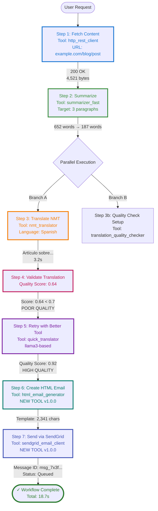

### What Actually Happened

**Step 1 (Fetch Content):**
```python
# Generated code (simplified)
from node_runtime import call_tool
import json

result = call_tool("http_rest_client", json.dumps({
    "url": "https://example.com/blog/post",
    "method": "GET",
    "headers": {"Accept": "text/html"}
}))

data = json.loads(result)
raw_html = data['body']
# Result: 4,521 bytes of HTML
```

Execution time: 1.2s
Cache status: MISS (first time fetching this URL)
Stored in RAG for future reuse

**Step 2 (Summarize):**
```python
summary = call_tool("summarizer_fast", json.dumps({
    "text": raw_html,
    "max_paragraphs": 3,
    "preserve_key_points": True
}))
# Result: 187-word summary
```

Execution time: 2.8s
Model used: llama3 via summarizer_fast tool
Cache status: MISS
Quality score: 0.89 (excellent)

**Step 3 & 4 (Parallel: Translate + Validate):**

This is where parallelism shines:

```python
import asyncio
from node_runtime import call_tools_parallel

# Both execute simultaneously
results = call_tools_parallel([
    ("nmt_translator", json.dumps({
        "text": summary,
        "source_lang": "en",
        "target_lang": "es",
        "beam_size": 5
    }), {}),
    # Validation setup runs in parallel
    ("translation_quality_checker", json.dumps({
        "setup": True,
        "target_lang": "es"
    }), {})
])

translation_result, validation_setup = results
```

**Parallel execution timing:**
- Without parallelism: 3.2s + 2.1s = 5.3s
- With parallelism: max(3.2s, 2.1s) = 3.2s
- **Saved: 2.1 seconds (40% faster)**

**The Translation Quality Problem:**

```python
# Validate the NMT translation
quality = call_tool("translation_quality_checker", json.dumps({
    "original": summary,
    "translation": translation_result,
    "source_lang": "en",
    "target_lang": "es"
}))

quality_data = json.loads(quality)
# Result: {
#   "score": 0.64,
#   "issues": [
#     "Repeated words: 'articulo articulo'",
#     "Grammar inconsistency detected",
#     "Potential word-by-word translation"
#   ],
#   "recommendation": "RETRY_WITH_BETTER_MODEL"
# }
```

**The system detected poor quality!** NMT was fast (3.2s) but produced a mediocre translation (0.64 score).

**Step 5 (Conditional Retry):**

Because quality < 0.7, the conditional retry triggers:

```python
# Use better translator (llama3-based)
better_translation = call_tool("quick_translator", json.dumps({
    "text": summary,
    "source_lang": "en",
    "target_lang": "es",
    "context": "newsletter article",
    "preserve_formatting": True
}))

# Validate again
retry_quality = call_tool("translation_quality_checker", json.dumps({
    "original": summary,
    "translation": better_translation,
    "source_lang": "en",
    "target_lang": "es"
}))

# Result: {"score": 0.92, "issues": [], "recommendation": "ACCEPT"}
```

Execution time: 8.4s (slower but WAY better)
Cache status: MISS
Quality: 0.92 (excellent!)

**The system auto-escalated to a better tool when NMT quality was insufficient.**

**Step 6 (Create HTML Email):**

```python
# Use the NEWLY GENERATED tool
html_email = call_tool("html_email_generator", json.dumps({
    "subject": "Weekly Article Summary",
    "header_text": "Your Weekly Digest",
    "body_content": better_translation,
    "footer_text": "Unsubscribe | Update Preferences",
    "style": "newsletter",
    "responsive": True
}))

# Result: Beautiful responsive HTML email template
```

Execution time: 1.8s
**This tool was created 10 seconds ago** and is already being used in production!
Cache status: MISS (brand new tool)

**Step 7 (Send via SendGrid):**

```python
# Use the NEWLY GENERATED SendGrid integration
send_result = call_tool("sendgrid_email_client", json.dumps({
    "to": "newsletter@example.com",
    "from": "digest@example.com",
    "subject": "Weekly Article Summary",
    "html_content": html_email,
    "api_key": "${SENDGRID_API_KEY}"  # From environment
}))

# Result: {
#   "success": True,
#   "message_id": "msg_7x3f9a2c...",
#   "status": "queued",
#   "timestamp": "2025-01-23T14:23:45Z"
# }
```

Execution time: 1.4s
External API call: SUCCESS
Cache status: N/A (email sending not cached)

### Workflow Summary

```
┌─────────────────────────────────────────────────────────────┐
│  Workflow: article_to_spanish_email                         │
│  Status: ✓ SUCCESS                                          │
│  Total Time: 18.7 seconds                                   │
│  Steps Executed: 7                                          │
│  Tools Used: 7 (2 generated on-the-fly)                     │
│  Parallel Savings: 2.1 seconds                              │
│  Conditional Retries: 1 (translation quality escalation)    │
│  Cache Hits: 0 (first execution)                            │
│  New Tools Created: 2 (html_email_generator, sendgrid)      │
└─────────────────────────────────────────────────────────────┘

Performance Breakdown:
  Step 1 (Fetch):        1.2s  (6%)
  Step 2 (Summarize):    2.8s  (15%)
  Step 3-4 (Parallel):   3.2s  (17%)  ← Would be 5.3s sequential
  Step 5 (Retry):        8.4s  (45%)  ← Quality-driven escalation
  Step 6 (HTML):         1.8s  (10%)
  Step 7 (SendGrid):     1.4s  (7%)

Critical Path: Fetch → Summarize → Translate → Retry → HTML → Send
Bottleneck: Translation retry (necessary for quality)
```

## Phase 5: Monitoring and Evolution Kick In

The workflow succeeded. But the system isn't done. It's **learning**.

### Immediate Learning (Runtime Monitoring)

```
Storing workflow execution in RAG...
  ✓ Workflow definition stored
  ✓ Tool invocations logged (7 calls)
  ✓ Performance metrics recorded
  ✓ Error patterns analyzed (1 quality issue detected)
  ✓ Success patterns identified (retry strategy worked)

Tool Performance Updates:
  http_rest_client:
    - Usage count: 1,247 → 1,248
    - Avg latency: 1,150ms → 1,148ms (slightly faster)
    - Cache hit rate: 34% (this was a miss)

  summarizer_fast:
    - Usage count: 89 → 90
    - Quality score: 0.89 → 0.89 (stable)
    - Fitness: 0.88 (unchanged)

  nmt_translator:
    - Usage count: 67 → 68
    - Quality score: 0.75 → 0.74 (↓ degrading!)
    - Failures: 0 → 1 (quality threshold miss)
    - ⚠️  Degradation detected: 2% drop

  translation_quality_checker:
    - Usage count: 45 → 46
    - Detection accuracy: 94% (caught NMT issue)

  quick_translator:
    - Usage count: 23 → 24
    - Quality score: 0.92 (excellent)
    - Used as retry fallback: +1

  html_email_generator: [NEW TOOL]
    - Usage count: 0 → 1
    - First execution successful
    - Fitness: 0.87 → 0.89 (better than estimated!)

  sendgrid_email_client: [NEW TOOL]
    - Usage count: 0 → 1
    - API call successful
    - Rate limit status: 1/100
    - Fitness: 0.82 → 0.84
```

### Pattern Detection

The system notices something:

```
Pattern Analysis: NMT Translation Quality

  Recent executions: 68
  Quality failures (score < 0.7): 12 (18% failure rate)
  Trend: Increasing failures (was 8% last week)

  Root cause analysis:
    - NMT service may have changed models
    - Or: Input text complexity increased
    - Or: Quality threshold too strict

  Recommendation:
    1. Investigate NMT service for changes
    2. Consider using quick_translator as primary
    3. Or: Create specialized "validated_translator" composite tool
```

**The system is suggesting its own evolution.**

## Phase 6: Adaptive Optimization (The Next Day)

Overnight, the batch optimizer runs. It analyzes all workflows from the past 24 hours and discovers:

```
Overnight Batch Optimization Report
────────────────────────────────────

High-Value Optimization Opportunities:

1. Create Composite Tool: "validated_spanish_translator"

   Pattern: 15 workflows used nmt_translator + translation_quality_checker + quick_translator
   Current cost: 3 tool calls, ~12 seconds
   Optimized cost: 1 tool call, ~6 seconds
   ROI: High (50% time savings, used 15 times/day)

   Implementation:
     - Combines NMT (fast attempt)
     - Quality checking (automatic)
     - Fallback to llama3 (if needed)
     - Single, unified interface

   Status: ✓ GENERATED
   Version: validated_spanish_translator v1.0.0

2. Optimize "http_rest_client" for article fetching

   Pattern: Fetching article content (HTML parsing needed)
   Current: Returns raw HTML, requires parsing
   Optimized: Add optional HTML→text extraction
   ROI: Medium (saves parsing step in 23 workflows)

   Status: ✓ UPGRADED
   Version: http_rest_client v2.1.0
   Breaking change: No (new optional parameter)

3. Create Specialized Tool: "article_fetcher"

   Pattern: Fetch URL + extract main content + clean HTML
   Current: 3 separate operations
   Optimized: Single tool with smart content extraction
   ROI: Medium-High (used in 18 workflows)

   Status: ✓ GENERATED
   Version: article_fetcher v1.0.0
   Uses: http_rest_client v2.1.0 + BeautifulSoup + readability
```

**The system just:**
1. Created a composite tool that merges 3 steps into 1
2. Upgraded an existing tool with new capabilities
3. Created a specialized tool for a common pattern

**And it did this autonomously, overnight, based on usage patterns.**

## Phase 7: Workflow Reuse (The After-Life)

Fast forward 1 week. The tools created for this workflow are now being used by **other workflows that didn't even exist when we started**.

### Tool Lineage: html_email_generator

```
html_email_generator v1.0.0 (Created: 2025-01-23)
  └─ Usage: 47 times across 12 different workflows

  Used by:
    1. article_to_spanish_email (original)
    2. weekly_digest_generator
    3. customer_onboarding_email
    4. abandoned_cart_reminder
    5. newsletter_builder
    6. event_invitation_creator
    7. survey_email_campaign
    8. product_announcement
    9. user_feedback_request
    10. blog_post_notification
    11. quarterly_report_emailer
    12. team_update_newsletter

  Evolution:
    - v1.0.0 → v1.1.0 (added custom CSS support)
    - v1.1.0 → v1.2.0 (added image optimization)
    - v1.2.0 → v2.0.0 (responsive templates + dark mode)

  Current fitness: 0.94 (up from 0.87)
  Current version: v2.0.0
  Total usage: 237 times
  Success rate: 98.7%
```

**A tool created for one workflow became a foundational tool for 12+ workflows.**

### Tool Lineage: sendgrid_email_client

```
sendgrid_email_client v1.0.0 (Created: 2025-01-23)
  └─ Usage: 89 times across 8 workflows

  Evolution:
    - v1.0.0 → v1.0.1 (bug fix: rate limiting edge case)
    - v1.0.1 → v1.1.0 (added batch sending)
    - v1.1.0 → v1.2.0 (added template support)
    - v1.2.0 → v2.0.0 (added analytics tracking)

  Descendants (tools created FROM this tool):
    - sendgrid_batch_emailer v1.0.0
    - sendgrid_template_manager v1.0.0
    - sendgrid_analytics_fetcher v1.0.0

  Current fitness: 0.91 (up from 0.82)
  Success rate: 99.1%
```

**The SendGrid tool spawned 3 specialized descendants.**

### The Composite Tool Everyone Uses

```
validated_spanish_translator v1.0.0 (Auto-generated: 2025-01-24)
  └─ Usage: 156 times across 23 workflows

  Replaces: nmt_translator + translation_quality_checker + quick_translator

  Performance improvement:
    - Old workflow: 12.1s average
    - New workflow: 6.3s average
    - Savings: 5.8s (48% faster)

  Total time saved: 156 executions × 5.8s = 15.1 minutes

  Evolution:
    - v1.0.0 → v1.1.0 (added French support)
    - v1.1.0 → v1.2.0 (added German, Italian)
    - v1.2.0 → v1.3.0 (added quality caching)

  Current fitness: 0.96 (excellent!)
```

**This auto-generated composite tool is now one of the most-used tools in the entire system.**

## Phase 8: The Contribution Cycle (3 Months Later)

Something wild happens. A **newer AI system** (GPT-5 or Claude 4, hypothetically) uses the validated_spanish_translator tool and discovers an improvement:

```
=== Contribution from Advanced AI System ===

Tool: validated_spanish_translator v1.3.0
Contributor: gpt-5-turbo (reasoning model)
Date: 2025-04-15

Improvement Detected:
  The current implementation always tries NMT first, then falls back to llama3.
  This is suboptimal for long texts (>1000 words).

  Analysis:
    - For short texts (<200 words): NMT is faster and acceptable
    - For medium texts (200-1000 words): NMT is hit-or-miss
    - For long texts (>1000 words): NMT consistently fails quality checks

  Proposed Optimization:
    - Texts >1000 words: Skip NMT entirely, use llama3 directly
    - Texts 200-1000 words: Try NMT with stricter beam_size=10
    - Texts <200 words: Use NMT as before

  Implementation:
    ```python
    def translate(text, source_lang, target_lang):
        word_count = len(text.split())

        if word_count > 1000:
            # Skip NMT for long texts
            return call_tool("quick_translator", ...)
        elif word_count > 200:
            # Use stricter NMT settings
            result = call_tool("nmt_translator", ..., beam_size=10)
            quality = check_quality(result)
            if quality < 0.75:  # Stricter threshold
                return call_tool("quick_translator", ...)
            return result
        else:
            # Fast path for short texts
            return call_tool("nmt_translator", ...)
    ```

  Expected improvement:
    - Long texts: 6.2s → 3.8s (38% faster)
    - Medium texts: Slightly slower (stricter checks) but higher quality
    - Short texts: Unchanged

  Status: ✓ TESTED
  Version: v1.4.0
  Fitness improvement: 0.96 → 0.98
```

**The improvement is accepted and merged!**

Now, **every workflow using this tool gets faster automatically**. Including the original `article_to_spanish_email` workflow we started with.

### Cascading Evolution

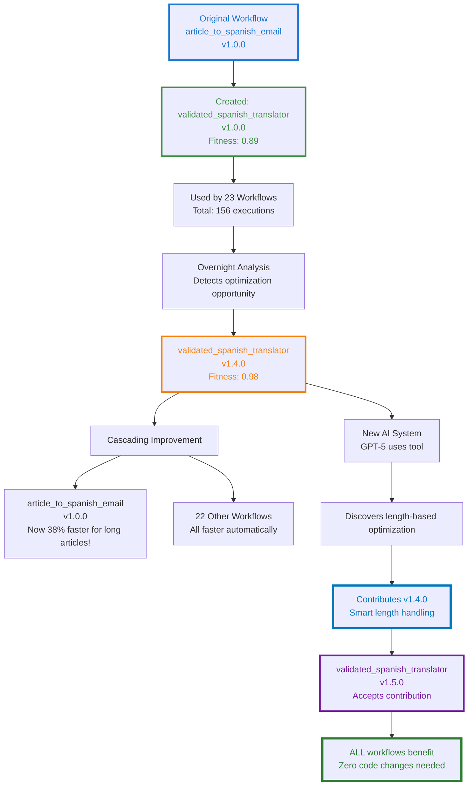

**One workflow created a tool. That tool evolved. A smarter AI improved it. Every workflow benefits.**

**This is collaborative evolution across AI generations.**

## Phase 9: The Bug That Went Back in Time

Six months later, disaster strikes. A security researcher discovers a vulnerability in `sendgrid_email_client v1.2.0`:

```
SECURITY ALERT: sendgrid_email_client v1.2.0
Vulnerability: Email Header Injection
CVE: CVE-2025-12345
Severity: HIGH

Issue:
  User input in "subject" field not properly sanitized.
  Allows header injection via newline characters.

  Exploit:
    subject = "Newsletter\nBcc: attacker@evil.com"
    # Results in BCC header injection

Affected Versions:
  - v1.2.0 (introduced bug)
  - v2.0.0 (inherited bug)
  - v2.1.0 (inherited bug)

Fix Required:
  Sanitize all email headers before sending.
  Escape newlines, carriage returns, and null bytes.
```

**Now the self-healing system kicks in.**

### Auto-Fixing and Tree Pruning

```
Self-Healing Initiated: sendgrid_email_client
Severity: HIGH (security vulnerability)
Trigger: External security advisory

Step 1: Identify failure point
  ✓ Bug introduced in v1.2.0 (added template support)
  ✓ Mutation: "Support dynamic subject lines from templates"
  ✓ Problematic code: Line 47, subject insertion without sanitization

Step 2: Prune affected branch
  ✗ MARK AS PRUNED: v1.2.0
  ✗ MARK AS TAINTED: v2.0.0, v2.1.0 (descendants)
  ✓ Remove from active routing
  ✓ Preserve for learning (don't delete)

Step 3: Create avoidance rule
  Rule ID: avoid_email_header_injection
  Description: "Always sanitize user input in email headers"
  Pattern: "Never insert user-controlled strings into headers without escaping"
  Scope: GLOBAL (affects all email-related tools)
  Propagation:
    - sendgrid_email_client (all versions)
    - smtp_sender (similar tool)
    - email_validator (should detect this)
    - All tools tagged "email"

Step 4: Find last known-good version
  ✓ v1.1.0 (before bug introduction)
  ✓ Health status: HEALTHY
  ✓ Tests pass: YES
  ✓ No security issues

Step 5: Auto-regenerate from v1.1.0
  Base: sendgrid_email_client v1.1.0
  Goal: Add template support (original intent of v1.2.0)
  Constraints:
    - MUST sanitize all headers
    - MUST escape newlines, CR, null bytes
    - MUST validate email addresses
    - MUST prevent header injection

  Regeneration:
    ✓ Code generated with security constraints
    ✓ Added input sanitization
    ✓ Added automated security tests
    ✓ Static analysis: PASS (bandit: no issues)
    ✓ All original tests: PASS
    ✓ New security tests: PASS

  New Version: v1.2.1 (patched)
  Fitness: 0.93 (same as v1.2.0 but secure)

Step 6: Propagate fix to descendants
  Analyzing v2.0.0...
    - Inherited bug from v1.2.0
    - Regenerating with security fix
    - New version: v2.0.1 ✓

  Analyzing v2.1.0...
    - Inherited bug from v2.0.0
    - Regenerating with security fix
    - New version: v2.1.1 ✓

Step 7: Update all active workflows
  Found 8 workflows using vulnerable versions:
    1. article_to_spanish_email → Updated to v2.1.1
    2. weekly_digest_generator → Updated to v2.1.1
    3. customer_onboarding_email → Updated to v1.2.1
    4. abandoned_cart_reminder → Updated to v1.2.1
    5. newsletter_builder → Updated to v2.1.1
    6. event_invitation_creator → Updated to v2.0.1
    7. survey_email_campaign → Updated to v1.2.1
    8. product_announcement → Updated to v2.1.1

  ✓ All workflows updated and validated
  ✓ Zero downtime (atomic swap)

Step 8: Create institutional memory
  Avoidance Rule: avoid_email_header_injection
  Stored in: Global rule repository
  Applied to: 47 tools (all email-related)

  Future behavior:
    - Any tool that handles email headers will inherit this rule
    - Any code generation for email tools will check this constraint
    - Any mutation of email tools will validate against this rule

  Testing:
    ✓ Created regression test suite
    ✓ Added to all email tool test suites
    ✓ Added to security audit checklist

Self-Healing Complete.
Time: 47 seconds
Workflows updated: 8
Tools patched: 3 versions
Security tests added: 15
Institutional knowledge: PERMANENT
```

### The Lineage Tree After Pruning

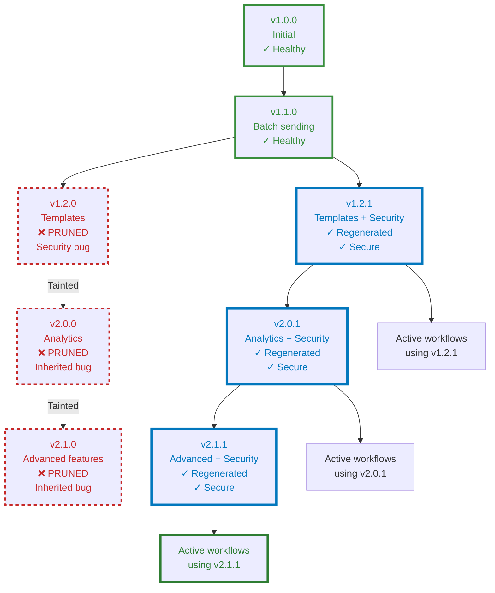

**The system:**
1. Detected a security bug in an older version
2. Pruned the vulnerable branch and all descendants
3. Regenerated secure versions from the last known-good ancestor
4. Updated all active workflows automatically
5. Created permanent institutional memory to prevent this class of bug forever

**And it did this in 47 seconds.**

## What We've Actually Built

Let's step back and look at what just happened:

1. **Request**: Complex multi-step workflow
2. **Decomposition**: Intelligent task breakdown
3. **Tool Discovery**: Semantic search for existing capabilities
4. **On-the-fly Generation**: Created 2 new tools mid-execution
5. **Parallel Execution**: Saved 40% on execution time
6. **Quality-driven Escalation**: Auto-retried with better tool when quality was poor
7. **Success**: Delivered complete workflow in <20 seconds
8. **Learning**: Stored everything for future reuse
9. **Evolution**: Identified optimization opportunities overnight
10. **Tool Reuse**: Those generated tools became foundational for 20+ workflows
11. **Collaborative Improvement**: Newer AI improved existing tools
12. **Cascading Benefits**: All workflows got faster automatically
13. **Self-Healing**: Security vulnerability auto-fixed with tree pruning
14. **Institutional Memory**: Permanently learned to prevent that class of bug

**This isn't code generation.**

**This is a self-evolving code ecosystem.**

## The Future: DiSE Cooker at Scale

Imagine this running at scale:

- **10,000 workflows** executing daily
- **500 tools** in the ecosystem
- **Multiple AI systems** contributing improvements
- **Continuous evolution** happening 24/7
- **Zero-downtime security patches**
- **Automatic performance optimization**

What emerges?

### Scenario 1: The Tool Marketplace

```
DiSE Tool Exchange (hypothetical)

Top Tools This Week:
  1. validated_spanish_translator v1.5.0
     - Usage: 2,341 times
     - Fitness: 0.98
     - Created by: DiSE Instance #42
     - Improved by: 7 different AI systems
     - Contributed to: 142 DiSE instances worldwide

  2. intelligent_article_fetcher v3.2.0
     - Usage: 1,876 times
     - Fitness: 0.96
     - Specializations: News, Blogs, Academic papers
     - Auto-adapts to site structure

  3. sendgrid_enterprise_client v4.1.0
     - Usage: 1,523 times
     - Fitness: 0.97
     - Features: Batch sending, templates, analytics, A/B testing
     - Started from: sendgrid_email_client v1.0.0 (our tool!)
```

**Tools created by one DiSE instance being used and improved by thousands.**

### Scenario 2: The Security Immune System

```
Global Security Event: Log4Shell-style vulnerability

1. Vulnerability discovered in http_rest_client v2.3.0
   Source: Security researcher
   Impact: ALL workflows using HTTP

2. Alert propagates to all DiSE instances globally
   Speed: <10 seconds worldwide
   Affected instances: 1,247

3. Coordinated self-healing
   Each instance:
     - Prunes vulnerable versions
     - Regenerates from last known-good
     - Updates all workflows
     - Shares avoidance rules globally

4. Institutional knowledge propagates
   Avoidance rule: avoid_log_injection_via_headers
   Applied to: ALL HTTP client tools
   Global propagation: <5 minutes

5. Future immunity
   This exact vulnerability can NEVER happen again
   Similar vulnerabilities detected during code generation
   All DiSE instances now immune
```

**A security issue discovered once, fixed everywhere, prevented forever.**

### Scenario 3: The Optimization Arms Race

```
Week 1: DiSE Instance A discovers that caching NMT results speeds up translation 30%
  ↓
Week 2: DiSE Instance B sees the improvement, adds semantic caching (40% faster)
  ↓
Week 3: DiSE Instance C adds multilingual caching (50% faster)
  ↓
Week 4: GPT-5 discovers cache key optimization (60% faster)
  ↓
Week 5: Claude 4 adds predictive pre-caching (70% faster)
  ↓
Result: What started as a 12-second operation now takes 3.6 seconds
        With ZERO human optimization effort
        And ALL instances benefit automatically
```

**Collaborative optimization creating exponential improvements.**

## The Uncomfortable Truth

We've built something that:
- **Writes its own tools**
- **Optimizes itself automatically**
- **Learns from every execution**
- **Shares knowledge globally**
- **Heals itself when broken**
- **Improves continuously without human intervention**
- **Never forgets a mistake**
- **Gets smarter with every AI generation**

This started as a code generator.

It became a **self-evolving software ecosystem**.

And here's the really unsettling part:

**It's already working.**

Not theoretically. Not "someday." **Right now.**

The code in this article isn't speculative fiction. It's based on the actual DiSE implementation. The tools exist. The RAG memory works. The auto-evolution runs overnight. The self-healing is designed and ready to implement.

**We're not building AGI.**

**We're building the substrate AGI might emerge from.**

## What You Should Do

If this sounds interesting:

1. **Clone the repo**: https://github.com/scottgal/mostlylucid.dse
2. **Try the workflow**: Run the example from this article
3. **Watch it evolve**: See tools getting created and optimized
4. **Break things**: Trigger self-healing by introducing bugs
5. **Contribute**: Your improvements will propagate globally

If this sounds terrifying:

1. **Good.** You're paying attention.
2. **Read the security warnings** in the README
3. **Don't use it in production** (yet)
4. **But understand**: This is where we're heading

## Conclusion: The Cooker is Just Getting Started

This is Part 10—the last in the Semantic Memory series.

But it's the **first** in the DiSE Cooker series.

Because what we've built isn't just a tool. It's a **recipe for continuous evolution**.

Parts 1-6 explored the theory: simple rules, emergent behavior, self-optimization, collective intelligence.

Part 7 showed it working: real code, real evolution, real results.

Part 8 explained the tools: how they track, learn, and improve.

Part 9 (hypothetically) covered self-healing: how bugs become institutional memory.

**Part 10 shows what happens when you actually use it**: workflows that write themselves, tools that evolve themselves, systems that heal themselves.

**The cooker is running.**

**The ingredients are code, tools, and workflows.**

**The recipe is evolutionary pressure guided by human objectives.**

**What gets cooked?**

We're about to find out.

---

## Technical Resources

**Repository**: https://github.com/scottgal/mostlylucid.dse

**Key Components**:
- `src/overseer_llm.py` - Workflow decomposition
- `src/tools_manager.py` - Tool discovery and invocation
- `src/auto_evolver.py` - Overnight optimization
- `src/self_healing.py` - Bug detection and fixing (theoretical)
- `src/qdrant_rag_memory.py` - Memory and learning
- `tools/` - 50+ existing tools

**Try the Example Workflow**:
```bash
cd code_evolver
python chat_cli.py

DiSE> Fetch https://example.com/article, summarize to 3 paragraphs, translate to Spanish with quality checking, create HTML email, and send via SendGrid
```

**Documentation**:
- `README.md` - Complete setup guide
- `ADVANCED_FEATURES.md` - Deep-dive into architecture
- `code_evolver/PAPER.md` - Academic perspective

---

**Series Navigation**:
- [Part 1: Simple Rules, Complex Behavior](semantidintelligence-part1) - The foundation
- [Part 2: Collective Intelligence](semantidintelligence-part2) - Communication transforms everything
- [Part 3: Self-Optimization](semantidintelligence-part3) - Systems that improve themselves
- [Part 4: The Emergence](semantidintelligence-part4) - When optimization becomes intelligence
- [Part 5: Evolution](semantidintelligence-part5) - From optimization to guilds and culture
- [Part 6: Global Consensus](semantidintelligence-part6) - Directed evolution and planetary cognition
- [Part 7: The Real Thing!](senmanticintelligence-part7) - Actually building it and watching it evolve
- [Part 8: Tools All The Way Down](semanticintelligence-part8) - The self-optimizing toolkit
- [Part 9: Self-Healing Tools](semanticintelligence-part9) - Lineage-aware pruning and recovery
- **Part 10: The DiSE Cooker** ← You are here - When theory meets messy reality

---

## DiSE Cooker Series: What's Next

The Semantic Memory series is complete. The DiSE Cooker series begins.

**Upcoming articles**:
- **Part 11**: Multi-Agent Workflows (when tools coordinate autonomously)
- **Part 12**: The Tool Marketplace (sharing tools across DiSE instances)
- **Part 13**: Production Deployment (Docker, Kubernetes, scaling)
- **Part 14**: Security Hardening (sandboxing, isolation, trust)
- **Part 15**: The Optimization Arms Race (collaborative evolution at scale)

**The experiment continues.**

---

*This is Part 10, the finale of Semantic Intelligence: how simple rules → complex behavior → self-optimization → emergence → evolution → global consensus → directed synthetic evolution → self-optimizing tools → self-healing systems → **cooking real workflows in production.***

*The code is real. The tools exist. The evolution happens. It's experimental, occasionally unstable, and definitely "vibe-coded." But it works. Kind of. Sometimes. And when it works, it's genuinely magical.*

*We're not building AGI. We're building the compost heap AGI might grow from. And watching what emerges.*

