# Semantic Intelligence: Phase Bundle Parts 9-12

# Semantic Intelligence: Part 9 - Self-Healing Tools Through Lineage-Aware Pruning

<datetime class="hidden">2025-11-18T09:00</datetime>
<!-- category -- AI-Article, AI, Self-Healing Systems, Tool Evolution, Lineage Tracking, Python -->

**When your tools break themselves, your system should remember why and never repeat the mistake**

When **DiSE* commits murder.


> **Note:** This is a speculative design for DISE's next evolutionary leap—a self-healing tool ecosystem that tracks lineage, detects bugs, prunes failed branches, and learns from mistakes forever. It's ambitious, slightly terrifying, and might actually be implementable with what we already have.

## The Problem: Tools That Break Themselves

Here's a scenario that keeps me up at night:

```
Tool: data_validator_v2.3.0
Status: Working perfectly ✓
Evolution triggered: "Optimize for speed"
  ↓
Tool: data_validator_v2.4.0
Status: 40% faster! ✓
Side effect: Now accepts invalid emails ✗

Applications using v2.4.0: 47
Bugs introduced: 47
Developer frustration: ∞
```

The current DISE system can evolve tools to be better. But what happens when evolution makes them *worse*? What if an optimization introduces a critical bug? What if a tool mutation breaks production systems?

**Right now, we detect the failure, maybe escalate, maybe fix it manually.**

**But we don't *learn* from it in a deep, structural way.**

We don't:
- **Remember** which mutation caused the bug
- **Prevent** similar mutations in related tools
- **Prune** the failed branch from the evolutionary tree
- **Propagate** the knowledge to descendant tools
- **Auto-recover** by regenerating from a known-good ancestor

*In essence we don't create a vaccine with an associated detection system and corpus of research into a fix. But DiSE allows us to do this almost trivially.*


**That changes today.**

Well, conceptually. This is the design for how it *could* work.

[TOC]

## The Big Idea: Tools as Git DAG + Evolutionary Memory

Think of every tool in DISE as a node in a Git-like Directed Acyclic Graph (DAG):

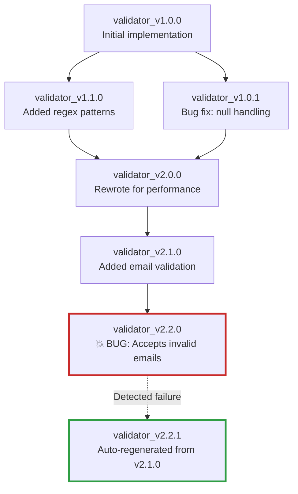

Every tool knows:
- **Who it came from** (parent nodes)
- **What changed** (mutation metadata)
- **What failed** (bug history)
- **What to avoid** (inherited warnings)

When a critical bug is detected, the system:

1. **Identifies the failure point** - Which version introduced the bug?
2. **Prunes the branch** - Marks failed version and descendants as tainted
3. **Propagates warnings** - Adds "avoid" tags to prevent similar mutations
4. **Auto-regenerates** - Creates new version from last known-good ancestor
5. **Updates lineage** - Records the failure in the evolutionary tree

**The result:** A self-healing ecosystem where bugs become permanent institutional memory.

## The Data Structure: Tool Lineage Metadata

First, we need to track way more than we currently do. Here's what the enhanced metadata looks like:

```python
from dataclasses import dataclass, field
from typing import List, Dict, Optional, Set
from datetime import datetime
from enum import Enum

class NodeHealth(Enum):
    HEALTHY = "healthy"
    DEGRADED = "degraded"
    FAILED = "failed"
    PRUNED = "pruned"
    REGENERATED = "regenerated"

class MutationType(Enum):
    OPTIMIZATION = "optimization"
    BUG_FIX = "bug_fix"
    FEATURE_ADD = "feature_add"
    REFACTOR = "refactor"
    SECURITY_PATCH = "security"

@dataclass
class MutationRecord:
    """Record of what changed in this evolution"""
    mutation_type: MutationType
    description: str
    timestamp: datetime
    fitness_before: float
    fitness_after: float
    code_diff_hash: str
    prompt_used: str

@dataclass
class FailureRecord:
    """Record of a bug or failure"""
    failure_type: str
    description: str
    stack_trace: Optional[str]
    test_case_failed: Optional[str]
    detection_method: str  # "test", "runtime", "static_analysis"
    timestamp: datetime
    severity: str  # "critical", "high", "medium", "low"

@dataclass
class AvoidanceRule:
    """Rules about what NOT to do (learned from failures)"""
    rule_id: str
    description: str
    pattern_to_avoid: str  # Regex or semantic description
    reason: str  # Why this is bad
    source_failure: str  # Which node failure created this rule
    propagation_scope: str  # "descendants", "all_similar", "global"
    created_at: datetime

@dataclass
class ToolLineage:
    """Complete lineage and health tracking for a tool"""
    # Identity
    tool_id: str
    version: str
    full_name: str  # e.g., "data_validator_v2.2.0"

    # Lineage
    parent_ids: List[str] = field(default_factory=list)
    child_ids: List[str] = field(default_factory=list)
    ancestor_path: List[str] = field(default_factory=list)  # Path to root

    # Health
    health_status: NodeHealth = NodeHealth.HEALTHY
    failure_count: int = 0
    failures: List[FailureRecord] = field(default_factory=list)

    # Evolution
    mutations: List[MutationRecord] = field(default_factory=list)
    generation: int = 0  # Distance from root

    # Learning
    avoidance_rules: List[AvoidanceRule] = field(default_factory=list)
    inherited_rules: Set[str] = field(default_factory=set)  # Rule IDs from ancestors

    # Performance
    fitness_history: List[float] = field(default_factory=list)
    execution_count: int = 0
    success_rate: float = 1.0

    # Metadata
    created_at: datetime = field(default_factory=datetime.now)
    last_executed: Optional[datetime] = None
    pruned_at: Optional[datetime] = None
    regenerated_from: Optional[str] = None
```

This is a **lot** more data than we currently track. But it's all necessary for true self-healing.

## Detection: How Do We Know Something Broke?

Critical bugs can be detected through multiple channels:

### 1. Test Failures (Immediate Detection)

```python
class TestBasedDetection:
    """Detect bugs through test execution"""

    async def validate_tool_health(
        self,
        tool_id: str,
        lineage: ToolLineage
    ) -> Optional[FailureRecord]:
        """Run all tests and detect failures"""

        # Load tool and its test suite
        tool = await self.tools_manager.load_tool(tool_id)
        test_suite = await self.test_discovery.find_tests(tool)

        results = await self.test_runner.run_tests(test_suite)

        # Check for test failures
        if results.failed_count > 0:
            critical_failures = [
                test for test in results.failures
                if test.is_critical  # BDD scenarios, core functionality
            ]

            if critical_failures:
                return FailureRecord(
                    failure_type="test_failure",
                    description=f"{len(critical_failures)} critical tests failed",
                    test_case_failed=critical_failures[0].name,
                    stack_trace=critical_failures[0].stack_trace,
                    detection_method="test",
                    timestamp=datetime.now(),
                    severity="critical"
                )

        return None

    async def regression_detection(
        self,
        new_version: str,
        old_version: str
    ) -> Optional[FailureRecord]:
        """Detect if new version broke what old version did correctly"""

        # Get test results for both versions
        old_results = await self.get_cached_test_results(old_version)
        new_results = await self.test_runner.run_tests(new_version)

        # Find tests that USED to pass but now fail
        regressions = [
            test for test in old_results.passed
            if test.name in [f.name for f in new_results.failures]
        ]

        if regressions:
            return FailureRecord(
                failure_type="regression",
                description=f"Broke {len(regressions)} previously working tests",
                test_case_failed=regressions[0].name,
                detection_method="regression_test",
                timestamp=datetime.now(),
                severity="critical"
            )

        return None
```

### 2. Runtime Monitoring (Production Detection)

```python
class RuntimeMonitoring:
    """Detect bugs through execution monitoring"""

    def __init__(self):
        self.error_threshold = 0.05  # 5% error rate triggers investigation
        self.execution_window = 100  # Last 100 executions

    async def monitor_tool_health(
        self,
        tool_id: str,
        lineage: ToolLineage
    ) -> Optional[FailureRecord]:
        """Monitor runtime behavior for anomalies"""

        # Get recent execution history
        recent_runs = await self.bugcatcher.get_recent_executions(
            tool_id,
            limit=self.execution_window
        )

        if len(recent_runs) < 10:
            return None  # Not enough data

        # Calculate error rate
        error_count = sum(1 for run in recent_runs if run.had_error)
        error_rate = error_count / len(recent_runs)

        if error_rate > self.error_threshold:
            # Analyze error patterns
            error_types = {}
            for run in recent_runs:
                if run.had_error:
                    error_types[run.error_type] = error_types.get(run.error_type, 0) + 1

            most_common_error = max(error_types.items(), key=lambda x: x[1])

            return FailureRecord(
                failure_type="runtime_errors",
                description=f"Error rate {error_rate:.1%} exceeds threshold",
                stack_trace=recent_runs[-1].stack_trace if recent_runs[-1].had_error else None,
                detection_method="runtime",
                timestamp=datetime.now(),
                severity="high" if error_rate > 0.20 else "medium"
            )

        # Check for performance degradation
        if len(lineage.fitness_history) >= 5:
            recent_fitness = lineage.fitness_history[-5:]
            avg_recent = sum(recent_fitness) / len(recent_fitness)
            historical_fitness = lineage.fitness_history[:-5]
            avg_historical = sum(historical_fitness) / len(historical_fitness)

            degradation = (avg_historical - avg_recent) / avg_historical

            if degradation > 0.30:  # 30% performance drop
                return FailureRecord(
                    failure_type="performance_degradation",
                    description=f"Performance dropped {degradation:.1%}",
                    detection_method="runtime",
                    timestamp=datetime.now(),
                    severity="medium"
                )

        return None
```

### 3. Static Analysis (Pre-Deployment Detection)

```python
class StaticAnalysisDetection:
    """Detect potential bugs through static analysis"""

    async def analyze_tool_safety(
        self,
        tool_id: str,
        code: str
    ) -> Optional[FailureRecord]:
        """Run static analysis to find potential bugs"""

        # Run pylint, mypy, bandit
        static_runner = StaticAnalysisRunner()
        results = await static_runner.analyze_code(code)

        # Check for critical issues
        critical_issues = [
            issue for issue in results.issues
            if issue.severity in ["error", "critical"]
        ]

        if critical_issues:
            return FailureRecord(
                failure_type="static_analysis",
                description=f"Found {len(critical_issues)} critical static issues",
                detection_method="static_analysis",
                timestamp=datetime.now(),
                severity="high"
            )

        # Check for security vulnerabilities
        security_issues = [
            issue for issue in results.issues
            if issue.category == "security"
        ]

        if security_issues:
            return FailureRecord(
                failure_type="security_vulnerability",
                description=f"Found {len(security_issues)} security issues",
                detection_method="static_analysis",
                timestamp=datetime.now(),
                severity="critical"
            )

        return None
```

## The Self-Healing Loop: Detection → Pruning → Recovery

Now the magic happens. When a critical bug is detected:

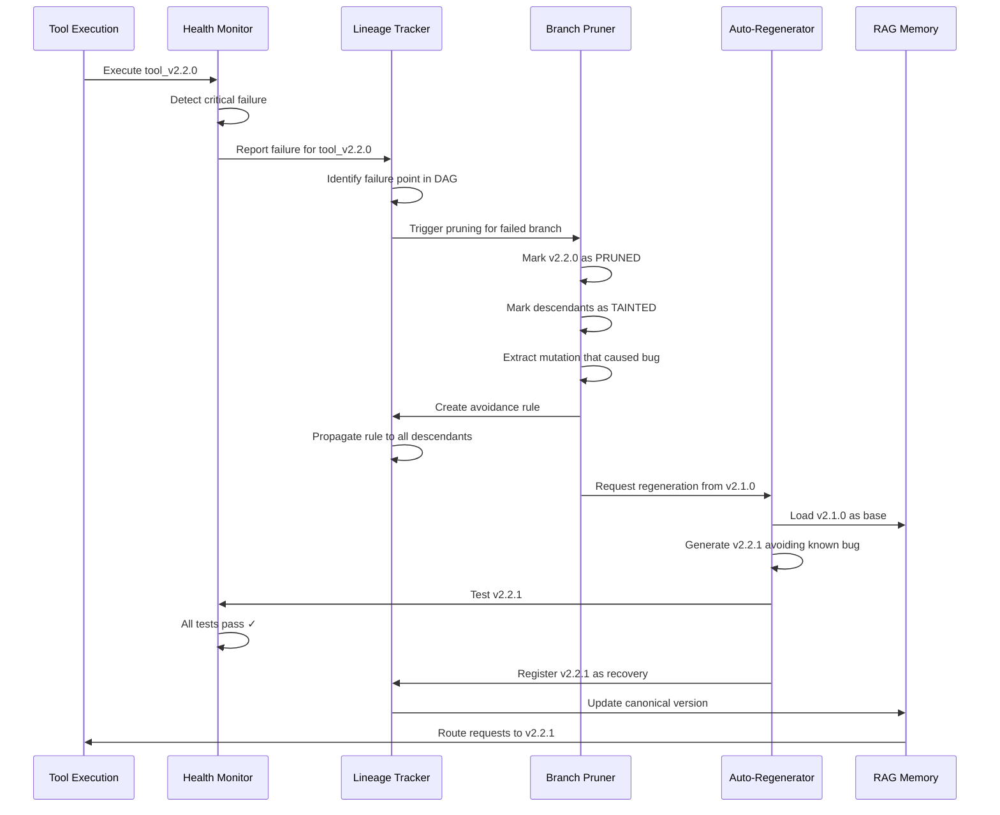

Here's the implementation:

```python
class SelfHealingOrchestrator:
    """Orchestrates the complete self-healing loop"""

    def __init__(
        self,
        tools_manager: ToolsManager,
        lineage_tracker: LineageTracker,
        health_monitor: HealthMonitor,
        rag_memory: QdrantRAGMemory
    ):
        self.tools_manager = tools_manager
        self.lineage_tracker = lineage_tracker
        self.health_monitor = health_monitor
        self.rag_memory = rag_memory
        self.pruner = BranchPruner(lineage_tracker)
        self.regenerator = AutoRegenerator(tools_manager, rag_memory)

    async def handle_failure(
        self,
        tool_id: str,
        failure: FailureRecord
    ) -> Optional[str]:
        """
        Complete self-healing cycle:
        1. Detect failure (already done, passed in)
        2. Prune failed branch
        3. Create avoidance rules
        4. Regenerate from last known-good
        5. Validate recovery
        6. Update routing
        """

        logger.critical(f"Self-healing triggered for {tool_id}: {failure.description}")

        # Step 1: Get lineage information
        lineage = await self.lineage_tracker.get_lineage(tool_id)

        # Step 2: Mark failure in lineage
        lineage.health_status = NodeHealth.FAILED
        lineage.failures.append(failure)
        lineage.failure_count += 1
        await self.lineage_tracker.update(lineage)

        # Step 3: Identify what went wrong
        failure_analysis = await self.analyze_failure(tool_id, failure, lineage)

        if not failure_analysis.is_recoverable:
            logger.error(f"Failure is not auto-recoverable: {failure_analysis.reason}")
            return None

        # Step 4: Prune the failed branch
        pruning_result = await self.pruner.prune_branch(
            failed_node=tool_id,
            failure=failure,
            lineage=lineage
        )

        # Step 5: Create avoidance rules
        avoidance_rule = await self.create_avoidance_rule(
            failure=failure,
            analysis=failure_analysis,
            pruning_result=pruning_result
        )

        # Step 6: Propagate avoidance rule to descendants
        await self.lineage_tracker.propagate_rule(
            rule=avoidance_rule,
            scope=avoidance_rule.propagation_scope
        )

        # Step 7: Find last known-good ancestor
        last_good_ancestor = await self.find_last_healthy_ancestor(lineage)

        if not last_good_ancestor:
            logger.error(f"No healthy ancestor found for {tool_id}")
            return None

        logger.info(f"Regenerating from {last_good_ancestor}")

        # Step 8: Regenerate from healthy ancestor
        new_version = await self.regenerator.regenerate_from_ancestor(
            ancestor_id=last_good_ancestor,
            original_goal=lineage.mutations[-1].description,
            avoid_rules=[avoidance_rule]
        )

        if not new_version:
            logger.error("Regeneration failed")
            return None

        # Step 9: Validate the regenerated version
        validation_result = await self.health_monitor.validate_tool(new_version)

        if not validation_result.is_healthy:
            logger.error(f"Regenerated tool still unhealthy: {validation_result.issues}")
            return None

        # Step 10: Update lineage to mark recovery
        new_lineage = await self.lineage_tracker.get_lineage(new_version)
        new_lineage.health_status = NodeHealth.REGENERATED
        new_lineage.regenerated_from = last_good_ancestor
        new_lineage.inherited_rules.add(avoidance_rule.rule_id)
        await self.lineage_tracker.update(new_lineage)

        # Step 11: Update RAG routing to prefer new version
        await self.rag_memory.mark_as_preferred(new_version)
        await self.rag_memory.deprecate_version(tool_id)

        logger.success(f"Self-healing complete: {tool_id} → {new_version}")

        return new_version

    async def analyze_failure(
        self,
        tool_id: str,
        failure: FailureRecord,
        lineage: ToolLineage
    ) -> FailureAnalysis:
        """Use LLM to analyze what went wrong"""

        # Get the code for failed and parent versions
        failed_code = await self.tools_manager.get_tool_code(tool_id)

        if not lineage.parent_ids:
            return FailureAnalysis(
                is_recoverable=False,
                reason="No parent to recover from"
            )

        parent_id = lineage.parent_ids[0]
        parent_code = await self.tools_manager.get_tool_code(parent_id)

        # Get the mutation that was applied
        last_mutation = lineage.mutations[-1] if lineage.mutations else None

        # Ask overseer LLM to analyze
        analysis_prompt = f"""
Analyze this tool failure:

FAILED TOOL: {tool_id}
FAILURE: {failure.description}
FAILURE TYPE: {failure.failure_type}

PARENT TOOL: {parent_id}
MUTATION APPLIED: {last_mutation.description if last_mutation else "Unknown"}

CODE DIFF:
{self.generate_diff(parent_code, failed_code)}

STACK TRACE:
{failure.stack_trace or "None"}

Questions:
1. What specific change caused the failure?
2. Was it the mutation itself, or a side effect?
3. Can we regenerate from the parent with a better approach?
4. What should we avoid in future mutations?

Provide a structured analysis.
"""

        analysis_result = await self.overseer_llm.analyze(
            analysis_prompt,
            response_model=FailureAnalysis
        )

        return analysis_result

    async def create_avoidance_rule(
        self,
        failure: FailureRecord,
        analysis: FailureAnalysis,
        pruning_result: PruningResult
    ) -> AvoidanceRule:
        """Create a rule to prevent similar failures"""

        # Extract pattern from analysis
        pattern = analysis.problematic_pattern

        return AvoidanceRule(
            rule_id=f"avoid_{uuid.uuid4().hex[:8]}",
            description=analysis.rule_description,
            pattern_to_avoid=pattern,
            reason=failure.description,
            source_failure=pruning_result.failed_node_id,
            propagation_scope="descendants",  # Or "all_similar" for broader impact
            created_at=datetime.now()
        )

    async def find_last_healthy_ancestor(
        self,
        lineage: ToolLineage
    ) -> Optional[str]:
        """Walk up the lineage tree to find last healthy node"""

        # Start with immediate parents
        for parent_id in lineage.parent_ids:
            parent_lineage = await self.lineage_tracker.get_lineage(parent_id)

            if parent_lineage.health_status == NodeHealth.HEALTHY:
                # Verify it still works
                validation = await self.health_monitor.validate_tool(parent_id)
                if validation.is_healthy:
                    return parent_id

        # If parents are unhealthy, recurse up the tree
        for parent_id in lineage.parent_ids:
            parent_lineage = await self.lineage_tracker.get_lineage(parent_id)
            ancestor = await self.find_last_healthy_ancestor(parent_lineage)
            if ancestor:
                return ancestor

        return None
```

## Branch Pruning: Preventing Bad Mutations Forever

The pruner marks failed branches and prevents them from being used:

```python
class BranchPruner:
    """Prunes failed branches from the evolutionary tree"""

    def __init__(self, lineage_tracker: LineageTracker):
        self.lineage_tracker = lineage_tracker

    async def prune_branch(
        self,
        failed_node: str,
        failure: FailureRecord,
        lineage: ToolLineage
    ) -> PruningResult:
        """
        Prune a failed branch:
        1. Mark the failed node as PRUNED
        2. Mark all descendants as TAINTED
        3. Remove from active routing
        4. Preserve for learning (don't delete!)
        """

        logger.warning(f"Pruning branch starting at {failed_node}")

        # Mark the failed node
        lineage.health_status = NodeHealth.PRUNED
        lineage.pruned_at = datetime.now()
        await self.lineage_tracker.update(lineage)

        # Find all descendants
        descendants = await self.lineage_tracker.get_all_descendants(failed_node)

        pruned_count = 1
        tainted_count = 0

        # Mark descendants as tainted (they inherit the bug)
        for descendant_id in descendants:
            descendant = await self.lineage_tracker.get_lineage(descendant_id)

            if descendant.health_status == NodeHealth.HEALTHY:
                descendant.health_status = NodeHealth.DEGRADED
                descendant.inherited_rules.add(f"tainted_by_{failed_node}")
                await self.lineage_tracker.update(descendant)
                tainted_count += 1

        # Remove from RAG active routing
        await self.rag_memory.mark_as_inactive(failed_node)
        for descendant_id in descendants:
            await self.rag_memory.mark_as_inactive(descendant_id)

        logger.info(f"Pruned 1 node, tainted {tainted_count} descendants")

        return PruningResult(
            failed_node_id=failed_node,
            pruned_count=pruned_count,
            tainted_count=tainted_count,
            descendants=descendants,
            failure=failure
        )

    async def can_reuse_tool(
        self,
        tool_id: str,
        context: Dict
    ) -> Tuple[bool, Optional[str]]:
        """Check if a tool is safe to reuse (not pruned or tainted)"""

        lineage = await self.lineage_tracker.get_lineage(tool_id)

        if lineage.health_status == NodeHealth.PRUNED:
            return False, f"Tool {tool_id} has been pruned due to critical bug"

        if lineage.health_status == NodeHealth.FAILED:
            return False, f"Tool {tool_id} has known failures"

        if lineage.health_status == NodeHealth.DEGRADED:
            # Check if degradation is relevant to current context
            for rule_id in lineage.inherited_rules:
                rule = await self.lineage_tracker.get_rule(rule_id)
                if self.rule_applies_to_context(rule, context):
                    return False, f"Tool is tainted by rule: {rule.description}"

        return True, None
```

## Auto-Regeneration: Creating Better Versions

When a tool fails, regenerate from a healthy ancestor with avoidance rules:

```python
class AutoRegenerator:
    """Regenerates tools from healthy ancestors with learned constraints"""

    def __init__(
        self,
        tools_manager: ToolsManager,
        rag_memory: QdrantRAGMemory
    ):
        self.tools_manager = tools_manager
        self.rag_memory = rag_memory

    async def regenerate_from_ancestor(
        self,
        ancestor_id: str,
        original_goal: str,
        avoid_rules: List[AvoidanceRule]
    ) -> Optional[str]:
        """
        Regenerate a tool from a healthy ancestor, avoiding known pitfalls
        """

        # Load ancestor code and metadata
        ancestor_tool = await self.tools_manager.load_tool(ancestor_id)
        ancestor_code = ancestor_tool.implementation
        ancestor_spec = ancestor_tool.specification

        # Build avoidance constraints
        avoidance_constraints = self.build_avoidance_prompt(avoid_rules)

        # Create regeneration spec
        regen_spec = f"""
Original Goal: {original_goal}

Base Implementation: {ancestor_id}
{ancestor_code}

CRITICAL CONSTRAINTS - MUST AVOID:
{avoidance_constraints}

Task: Regenerate this tool with the original goal, but strictly avoiding the patterns above.
The previous attempt failed because it violated these constraints.

Approach:
1. Achieve the original goal (performance, features, etc.)
2. Absolutely avoid the prohibited patterns
3. Maintain all existing test compatibility
4. Add safeguards to prevent the specific failure mode

Generate an improved version that achieves the goal safely.
"""

        # Use overseer to create careful specification
        overseer_result = await self.overseer_llm.plan(
            regen_spec,
            response_model=ToolSpecification
        )

        # Generate code with strict validation
        generator_result = await self.generator_llm.generate(
            specification=overseer_result,
            base_code=ancestor_code,
            avoid_patterns=[rule.pattern_to_avoid for rule in avoid_rules]
        )

        if not generator_result.success:
            logger.error(f"Regeneration failed: {generator_result.error}")
            return None

        # Create new version ID
        ancestor_version = parse_version(ancestor_id)
        new_version = increment_patch(ancestor_version)
        new_tool_id = f"{ancestor_tool.name}_{new_version}"

        # Register the new tool
        await self.tools_manager.register_tool(
            tool_id=new_tool_id,
            code=generator_result.code,
            specification=overseer_result,
            metadata={
                "regenerated_from": ancestor_id,
                "avoidance_rules": [r.rule_id for r in avoid_rules],
                "regeneration_reason": "self_healing"
            }
        )

        logger.success(f"Regenerated {new_tool_id} from {ancestor_id}")

        return new_tool_id

    def build_avoidance_prompt(self, avoid_rules: List[AvoidanceRule]) -> str:
        """Build a clear prompt about what to avoid"""

        constraints = []
        for i, rule in enumerate(avoid_rules, 1):
            constraints.append(f"""
{i}. AVOID: {rule.description}
   Pattern: {rule.pattern_to_avoid}
   Reason: {rule.reason}
   Source: {rule.source_failure}
""")

        return "\n".join(constraints)
```

## Avoidance Rule Propagation: Institutional Memory

The killer feature: rules learned from failures propagate through the lineage tree:

```python
class LineageTracker:
    """Tracks tool lineage and propagates learning"""

    async def propagate_rule(
        self,
        rule: AvoidanceRule,
        scope: str
    ):
        """
        Propagate an avoidance rule through the lineage tree

        Scopes:
        - "descendants": Only affect direct descendants of failed node
        - "all_similar": Affect all tools in similar semantic space
        - "global": Affect all tools (for critical security issues)
        """

        if scope == "descendants":
            await self._propagate_to_descendants(rule)
        elif scope == "all_similar":
            await self._propagate_to_similar(rule)
        elif scope == "global":
            await self._propagate_globally(rule)

    async def _propagate_to_descendants(self, rule: AvoidanceRule):
        """Add rule to all descendants of the source failure"""

        source_node = rule.source_failure
        descendants = await self.get_all_descendants(source_node)

        for descendant_id in descendants:
            lineage = await self.get_lineage(descendant_id)
            lineage.inherited_rules.add(rule.rule_id)
            await self.update(lineage)

        logger.info(f"Propagated rule {rule.rule_id} to {len(descendants)} descendants")

    async def _propagate_to_similar(self, rule: AvoidanceRule):
        """Add rule to semantically similar tools"""

        # Find similar tools using RAG
        similar_tools = await self.rag_memory.find_similar(
            query=rule.description,
            filter={"type": "tool"},
            top_k=50,
            similarity_threshold=0.7
        )

        for tool_result in similar_tools:
            tool_id = tool_result.id
            lineage = await self.get_lineage(tool_id)
            lineage.inherited_rules.add(rule.rule_id)
            await self.update(lineage)

        logger.info(f"Propagated rule {rule.rule_id} to {len(similar_tools)} similar tools")

    async def _propagate_globally(self, rule: AvoidanceRule):
        """Add rule to ALL tools (for critical security issues)"""

        all_tools = await self.get_all_tools()

        for tool_id in all_tools:
            lineage = await self.get_lineage(tool_id)
            lineage.inherited_rules.add(rule.rule_id)
            await self.update(lineage)

        logger.warning(f"Propagated GLOBAL rule {rule.rule_id} to {len(all_tools)} tools")
```

## Real-World Example: Email Validator Evolution Gone Wrong

Let's walk through a complete example:

```python
# Initial healthy tool
email_validator_v1_0_0 = """
def validate_email(email: str) -> bool:
    pattern = r'^[a-zA-Z0-9._%+-]+@[a-zA-Z0-9.-]+\.[a-zA-Z]{2,}$'
    return bool(re.match(pattern, email))
"""
# Tests pass, fitness: 0.85

# Auto-evolution triggers: "Optimize for performance"
# System generates v2.0.0

email_validator_v2_0_0 = """
def validate_email(email: str) -> bool:
    # Optimized: skip regex for obvious cases
    if '@' not in email:
        return False
    return True  # ⚠️ BUG: Too permissive!
"""
# Tests initially pass (basic tests), fitness: 0.95 (faster!)
# Deployed to production...

# Runtime monitoring detects failures
runtime_errors = [
    "Accepted 'user@@domain.com'",
    "Accepted '@domain.com'",
    "Accepted 'user@'",
]

# Self-healing triggered!

failure = FailureRecord(
    failure_type="logic_error",
    description="Email validation too permissive, accepts invalid emails",
    detection_method="runtime",
    severity="critical"
)

# System analyzes failure
analysis = """
The optimization removed the comprehensive regex validation in favor of
a simple '@' check. This makes it fast but incorrect.

Problematic Pattern: "Replacing comprehensive validation with simple substring checks"

Avoidance Rule: "Never replace regex validation with simple string checks without
comprehensive test coverage for edge cases"
"""

# Branch pruning
# - Mark v2.0.0 as PRUNED
# - Create avoidance rule
# - Propagate to all email-related validators

# Auto-regeneration from v1.0.0
email_validator_v2_0_1 = """
def validate_email(email: str) -> bool:
    # Optimized: compile regex once
    if not hasattr(validate_email, '_pattern'):
        validate_email._pattern = re.compile(
            r'^[a-zA-Z0-9._%+-]+@[a-zA-Z0-9.-]+\.[a-zA-Z]{2,}$'
        )

    # Fast path for obvious failures
    if '@' not in email or email.count('@') != 1:
        return False

    # Comprehensive validation (cached pattern)
    return bool(validate_email._pattern.match(email))
"""
# Tests pass, fitness: 0.92 (faster AND correct!)
# Deployed, monitored, succeeds!
```

The system learned:
1. ✅ **Never** replace comprehensive validation with simple checks
2. ✅ **Always** maintain test coverage during optimization
3. ✅ **Cache** compiled patterns instead of simplifying logic
4. ✅ **Add** fast-path checks BEFORE comprehensive checks, not INSTEAD of them

This knowledge is now permanent institutional memory, propagated to all similar tools.

## Visualizing the Self-Healing Ecosystem

Here's how the complete system looks:

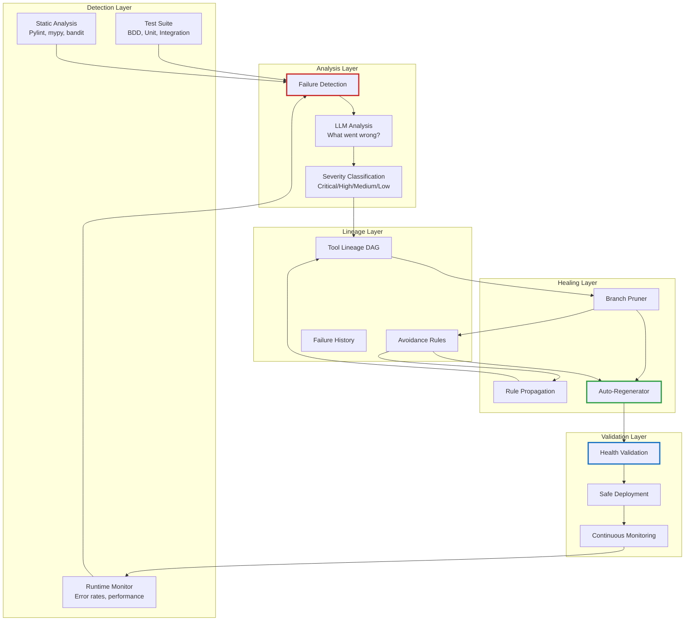

## Integration with Existing DISE Components

The beautiful part: this builds on what we already have:

```python
class EnhancedToolsManager(ToolsManager):
    """Extended ToolsManager with self-healing capabilities"""

    def __init__(self, config: ConfigManager, *args, **kwargs):
        super().__init__(config, *args, **kwargs)

        # New components
        self.lineage_tracker = LineageTracker(
            storage_path="lineage/",
            rag_memory=self.rag_memory
        )

        self.health_monitor = HealthMonitor(
            test_runner=self.test_runner,
            bugcatcher=self.bugcatcher,
            static_runner=self.static_runner
        )

        self.self_healing = SelfHealingOrchestrator(
            tools_manager=self,
            lineage_tracker=self.lineage_tracker,
            health_monitor=self.health_monitor,
            rag_memory=self.rag_memory
        )

        # Enable continuous health monitoring
        self.start_health_monitoring()

    async def call_tool(self, tool_id: str, inputs: Dict) -> Any:
        """Override to add health checks and auto-recovery"""

        # Check if tool is safe to use
        can_use, reason = await self.self_healing.pruner.can_reuse_tool(
            tool_id,
            context=inputs
        )

        if not can_use:
            # Tool is pruned, find alternative
            logger.warning(f"Tool {tool_id} is unsafe: {reason}")
            alternative = await self.find_healthy_alternative(tool_id)

            if alternative:
                logger.info(f"Using alternative: {alternative}")
                tool_id = alternative
            else:
                raise ToolPrunedError(f"{tool_id} is pruned and no alternative exists")

        # Execute tool with monitoring
        try:
            result = await super().call_tool(tool_id, inputs)

            # Record successful execution
            await self.lineage_tracker.record_success(tool_id)

            return result

        except Exception as e:
            # Record failure
            failure = FailureRecord(
                failure_type=type(e).__name__,
                description=str(e),
                stack_trace=traceback.format_exc(),
                detection_method="runtime",
                timestamp=datetime.now(),
                severity="high"
            )

            await self.lineage_tracker.record_failure(tool_id, failure)

            # Check if this triggers self-healing
            lineage = await self.lineage_tracker.get_lineage(tool_id)

            if lineage.failure_count >= 3:  # Three strikes rule
                logger.critical(f"Tool {tool_id} reached failure threshold, triggering self-healing")

                # Trigger self-healing in background
                asyncio.create_task(
                    self.self_healing.handle_failure(tool_id, failure)
                )

            raise

    async def find_healthy_alternative(self, pruned_tool_id: str) -> Optional[str]:
        """Find a healthy alternative to a pruned tool"""

        # Get tool metadata
        tool_metadata = await self.rag_memory.get_metadata(pruned_tool_id)

        # Search for similar tools
        alternatives = await self.rag_memory.find_similar(
            query=tool_metadata.description,
            filter={
                "type": "tool",
                "category": tool_metadata.category
            },
            top_k=10
        )

        # Find first healthy alternative
        for alt in alternatives:
            can_use, _ = await self.self_healing.pruner.can_reuse_tool(
                alt.id,
                context={}
            )
            if can_use:
                return alt.id

        return None

    def start_health_monitoring(self):
        """Start background health monitoring"""

        async def monitor_loop():
            while True:
                await asyncio.sleep(300)  # Every 5 minutes

                # Get all active tools
                active_tools = await self.get_active_tools()

                for tool_id in active_tools:
                    # Check health
                    health_result = await self.health_monitor.check_tool_health(tool_id)

                    if not health_result.is_healthy:
                        logger.warning(f"Health check failed for {tool_id}: {health_result.issues}")

                        # Trigger self-healing if critical
                        if health_result.severity == "critical":
                            await self.self_healing.handle_failure(
                                tool_id,
                                health_result.failure
                            )

        asyncio.create_task(monitor_loop())
```

## Configuration for Self-Healing

Add to your `config.yaml`:

```yaml
self_healing:
  enabled: true

  detection:
    test_based: true
    runtime_monitoring: true
    static_analysis: true

  thresholds:
    failure_count_trigger: 3  # Trigger healing after N failures
    error_rate_threshold: 0.05  # 5% error rate
    performance_degradation: 0.30  # 30% slowdown

  pruning:
    auto_prune_critical: true
    keep_pruned_history: true  # Don't delete, learn from it
    taint_descendants: true

  regeneration:
    auto_regenerate: true
    max_regeneration_attempts: 3
    require_test_validation: true

  propagation:
    default_scope: "descendants"  # or "all_similar" or "global"
    critical_failures_global: true  # Security issues affect all tools

  monitoring:
    health_check_interval_seconds: 300  # Every 5 minutes
    continuous_monitoring: true

lineage_tracking:
  enabled: true
  storage_path: "lineage/"
  max_history_depth: 100  # How far back to track ancestry
  compress_old_lineage: true  # Save space for old data
```

## The Database Schema: Storing Lineage

We need persistent storage for lineage data:

```sql
-- Tool lineage table
CREATE TABLE tool_lineage (
    tool_id VARCHAR(255) PRIMARY KEY,
    version VARCHAR(50),
    full_name VARCHAR(255),
    health_status VARCHAR(50),
    failure_count INTEGER DEFAULT 0,
    generation INTEGER DEFAULT 0,
    execution_count INTEGER DEFAULT 0,
    success_rate FLOAT DEFAULT 1.0,
    created_at TIMESTAMP,
    last_executed TIMESTAMP,
    pruned_at TIMESTAMP,
    regenerated_from VARCHAR(255)
);

-- Parent-child relationships
CREATE TABLE lineage_relationships (
    id SERIAL PRIMARY KEY,
    child_id VARCHAR(255),
    parent_id VARCHAR(255),
    relationship_type VARCHAR(50),  -- 'direct', 'merge', 'fork'
    created_at TIMESTAMP,
    FOREIGN KEY (child_id) REFERENCES tool_lineage(tool_id),
    FOREIGN KEY (parent_id) REFERENCES tool_lineage(tool_id)
);

-- Mutation records
CREATE TABLE mutations (
    id SERIAL PRIMARY KEY,
    tool_id VARCHAR(255),
    mutation_type VARCHAR(50),
    description TEXT,
    prompt_used TEXT,
    code_diff_hash VARCHAR(64),
    fitness_before FLOAT,
    fitness_after FLOAT,
    timestamp TIMESTAMP,
    FOREIGN KEY (tool_id) REFERENCES tool_lineage(tool_id)
);

-- Failure records
CREATE TABLE failures (
    id SERIAL PRIMARY KEY,
    tool_id VARCHAR(255),
    failure_type VARCHAR(100),
    description TEXT,
    stack_trace TEXT,
    test_case_failed VARCHAR(255),
    detection_method VARCHAR(50),
    severity VARCHAR(20),
    timestamp TIMESTAMP,
    FOREIGN KEY (tool_id) REFERENCES tool_lineage(tool_id)
);

-- Avoidance rules
CREATE TABLE avoidance_rules (
    rule_id VARCHAR(255) PRIMARY KEY,
    description TEXT,
    pattern_to_avoid TEXT,
    reason TEXT,
    source_failure VARCHAR(255),
    propagation_scope VARCHAR(50),
    created_at TIMESTAMP,
    FOREIGN KEY (source_failure) REFERENCES tool_lineage(tool_id)
);

-- Rule inheritance
CREATE TABLE rule_inheritance (
    id SERIAL PRIMARY KEY,
    tool_id VARCHAR(255),
    rule_id VARCHAR(255),
    inherited_at TIMESTAMP,
    FOREIGN KEY (tool_id) REFERENCES tool_lineage(tool_id),
    FOREIGN KEY (rule_id) REFERENCES avoidance_rules(rule_id)
);

-- Fitness history
CREATE TABLE fitness_history (
    id SERIAL PRIMARY KEY,
    tool_id VARCHAR(255),
    fitness_score FLOAT,
    execution_time_ms INTEGER,
    memory_usage_mb FLOAT,
    timestamp TIMESTAMP,
    FOREIGN KEY (tool_id) REFERENCES tool_lineage(tool_id)
);

-- Indexes for performance
CREATE INDEX idx_lineage_health ON tool_lineage(health_status);
CREATE INDEX idx_lineage_version ON tool_lineage(version);
CREATE INDEX idx_relationships_child ON lineage_relationships(child_id);
CREATE INDEX idx_relationships_parent ON lineage_relationships(parent_id);
CREATE INDEX idx_failures_tool ON failures(tool_id);
CREATE INDEX idx_failures_severity ON failures(severity);
CREATE INDEX idx_rules_source ON avoidance_rules(source_failure);
CREATE INDEX idx_inheritance_tool ON rule_inheritance(tool_id);
CREATE INDEX idx_fitness_tool ON fitness_history(tool_id);
```

## The CLI: Interacting with Self-Healing

Add new commands to the CLI:

```bash
# View lineage for a tool
$ python chat_cli.py lineage data_validator_v2.2.0

Tool Lineage: data_validator_v2.2.0
Status: ❌ PRUNED (Critical failure detected)
Pruned: 2025-01-22 14:23:15

Ancestry:
  ├─ data_validator_v1.0.0 (✓ Healthy)
  ├─ data_validator_v1.1.0 (✓ Healthy)
  ├─ data_validator_v2.0.0 (✓ Healthy)
  ├─ data_validator_v2.1.0 (✓ Healthy)
  └─ data_validator_v2.2.0 (❌ PRUNED) ← You are here

Failures:
  1. [2025-01-22 14:20:01] Logic Error: Email validation too permissive
     Severity: Critical
     Detection: Runtime monitoring

Mutations Applied:
  - [2025-01-22 14:15:00] Optimization: Remove regex for simple @ check
    Fitness: 0.85 → 0.95

Avoidance Rules Created:
  - avoid_3f8a2c1d: Never replace comprehensive validation with simple checks
    Propagated to: 12 descendants, 34 similar tools

Recovery:
  ✓ Auto-regenerated as data_validator_v2.2.1
  New version healthy, monitoring...

# View all pruned tools
$ python chat_cli.py pruned

Pruned Tools:
  1. data_validator_v2.2.0 (Critical: Logic error)
  2. json_parser_v1.5.3 (High: Performance regression)
  3. http_client_v3.1.0 (Critical: Security vulnerability)

# View avoidance rules
$ python chat_cli.py rules

Active Avoidance Rules:
  1. avoid_3f8a2c1d [DESCENDANTS]
     Never replace comprehensive validation with simple checks
     Source: data_validator_v2.2.0
     Affects: 46 tools

  2. avoid_7b2e9f0a [GLOBAL]
     Never use eval() on user input
     Source: json_parser_v1.5.3
     Affects: ALL tools

  3. avoid_1c4d8a6f [ALL_SIMILAR]
     Always use connection pooling for HTTP clients
     Source: http_client_v3.1.0
     Affects: 23 tools

# Manually trigger healing
$ python chat_cli.py heal data_validator_v2.2.0

Initiating self-healing for data_validator_v2.2.0...
✓ Failure analysis complete
✓ Branch pruned
✓ Avoidance rule created: avoid_3f8a2c1d
✓ Rule propagated to 46 tools
✓ Regenerated from data_validator_v2.1.0
✓ Validation passed
✓ Deployed as data_validator_v2.2.1

Self-healing complete! New version: data_validator_v2.2.1

# View health report
$ python chat_cli.py health

System Health Report:
  Total Tools: 237
  Healthy: 229 (96.6%)
  Degraded: 5 (2.1%)
  Failed: 2 (0.8%)
  Pruned: 1 (0.4%)

Recent Failures:
  - data_validator_v2.2.0 (Auto-healed ✓)
  - api_client_v1.3.2 (Monitoring...)

Auto-Healing Stats:
  Total healing events: 8
  Successful recoveries: 7 (87.5%)
  Failed recoveries: 1 (12.5%)
  Avg recovery time: 45 seconds
```

## What Actually Works (And What's Still Theoretical)

Let's be honest about what's real vs. aspirational:

### ✅ Already Working in DISE
1. **Tool versioning** - Semantic versions with hash-based detection
2. **Lineage tracking** - Changelog with mutation history
3. **Test-based validation** - Comprehensive test discovery and execution
4. **Runtime monitoring** - Bugcatcher tracks execution and errors
5. **RAG memory** - Semantic storage and retrieval
6. **Auto-evolution** - Performance-based mutation triggers

### 🚧 Needs Implementation
1. **Complete lineage DAG** - Currently tracks last 10, need full tree
2. **Avoidance rules** - Pattern storage and propagation system
3. **Branch pruning** - Marking failed versions as inactive
4. **Auto-regeneration** - Triggered healing from ancestors
5. **Health monitoring loop** - Background continuous validation
6. **Rule propagation** - Descendant/similar/global scoping

### 🔮 Future Vision
1. **Cross-system learning** - Multiple DISE instances sharing rules
2. **Adversarial testing** - Tools testing each other for vulnerabilities
3. **Meta-evolution** - System evolving its healing strategies
4. **Predictive pruning** - Detect potential failures before they happen

## The Uncomfortable Truth

This system, if fully implemented, creates something unsettling:

**Tools that remember every mistake ever made and ensure they never repeat it.**

Not just individually. **Collectively.**

A bug in one tool propagates as knowledge to every similar tool. A security vulnerability discovered anywhere becomes a global constraint everywhere.

**The system develops institutional memory.**

And here's the thing: **institutional memory compound exponentially.**

- Year 1: 100 tools, 10 avoidance rules
- Year 2: 1,000 tools, 150 avoidance rules (learning from each other)
- Year 3: 10,000 tools, 2,000 avoidance rules (shared knowledge base)

**Each generation is constrained by all previous mistakes.**

This is either:
- **The most robust code generation system ever built** ✓
- **A demonstration of how AGI-level systems might learn** 🤔
- **Both, and that's terrifying** 🚨

## Implementation Roadmap

If we were to actually build this, here's the order:

### Phase 1: Foundation (2 weeks)
- Implement complete lineage DAG storage
- Add failure recording to tool execution
- Create AvoidanceRule data model
- Build basic pruning system

### Phase 2: Detection (2 weeks)
- Enhance runtime monitoring with failure analysis
- Integrate static analysis into tool validation
- Build severity classification system
- Create health monitoring loop

### Phase 3: Healing (3 weeks)
- Implement auto-regeneration from ancestors
- Build LLM-based failure analysis
- Create rule propagation system
- Add safe deployment with validation

### Phase 4: Integration (1 week)
- Integrate with existing ToolsManager
- Add CLI commands for lineage/health/pruning
- Create monitoring dashboard
- Write comprehensive tests

### Phase 5: Polish (1 week)
- Performance optimization
- Database indexing
- Documentation
- Real-world testing

**Total:** ~9 weeks of focused development

## Conclusion: When Code Learns From Code

Self-healing through lineage-aware pruning isn't just a feature. It's a fundamental shift in how we think about code generation.

Traditional systems:
```
Generate → Test → Use → Fail → Regenerate → Repeat forever
```

Self-healing systems:
```
Generate → Test → Use → Fail → Learn → Prevent → Heal → Never repeat
```

**The difference is memory.**

Not just memory of what worked. **Memory of what failed and why.**

And that memory propagates. Through descendants. Through similar tools. Through the entire ecosystem.

**The system develops antibodies.**

Once a bug is detected, it can never happen again in that form. The pattern is remembered, the avoidance rule is created, the knowledge propagates.

**This is how immune systems work.**

**This is how organizations learn.**

**This is how civilizations develop.**

And now, maybe, this is how code can evolve.

## Try It (Someday)

This is currently a design document, not a working feature. But if you want to help build it:

1. **Read the DISE codebase** - Understand tools_manager, lineage, RAG
2. **Start with Phase 1** - Lineage DAG is the foundation
3. **Build incrementally** - Each phase adds value independently
4. **Test extensively** - Self-healing systems need rigorous validation
5. **Report findings** - What works? What breaks? What emerges?

The goal isn't to build a perfect system on day one.

The goal is to build a system that can **learn from every mistake** and **never repeat it**.

If we can do that, we've created something genuinely new.

Not just better code generation.

**Code that remembers.**

---

## Technical Details & Resources

**Conceptual Foundation:**
- Part 7: Directed Synthetic Evolution (working system)
- This article: Self-healing extension (design)

**Key Components to Build:**
- `lineage_tracker.py` - Complete DAG storage and querying
- `health_monitor.py` - Multi-channel failure detection
- `branch_pruner.py` - Failed branch management
- `auto_regenerator.py` - Healing from ancestors
- `avoidance_rules.py` - Pattern storage and propagation

**Integration Points:**
- `tools_manager.py` - Add health checks to tool execution
- `auto_evolver.py` - Add avoidance rule constraints
- `qdrant_rag_memory.py` - Store lineage in vector DB
- `test_discovery.py` - Enhanced failure reporting

**Dependencies:**
- PostgreSQL or SQLite (lineage storage)
- Existing DISE infrastructure
- No new external dependencies needed

---

**Series Navigation:**
- [Part 1: Simple Rules, Complex Behavior](semantidintelligence-part1) - The foundation
- [Part 2: Collective Intelligence](semantidintelligence-part2) - Communication transforms everything
- [Part 3: Self-Optimization](semantidintelligence-part3) - Systems that improve themselves
- [Part 4: The Emergence](semantidintelligence-part4) - When optimization becomes intelligence
- [Part 5: Evolution](semantidintelligence-part5) - From optimization to guilds and culture
- [Part 6: Global Consensus](semantidintelligence-part6) - Directed evolution and planetary cognition
- [Part 7: The Real Thing!](senmanticintelligence-part7) - Actually building it and watching it evolve
- [Part 8: Tools All The Way Down](semanticintelligence-part8) - The self-optimizing toolkit
- **Part 9: Self-Healing Tools** ← You are here (lineage-aware pruning design)
- [Part 10: The DiSE Cooker](semanticintelligence-part10) - When theory meets messy reality

---

*This is a design document for DISE's self-healing capabilities. The core mechanisms (lineage, evolution, RAG memory, testing) already exist. This article describes how to combine them into a system where tools learn from failures and never repeat mistakes. It's ambitious. It might be implementable. And if it works, it changes everything about how code evolves.*

*The uncomfortable parallel: This is how immune systems work. This is how organizations learn. If code can do this at scale... what else becomes possible?*

**Tags:** `#Python` `#AI` `#CodeGeneration` `#SelfHealing` `#Lineage` `#AutoRecovery` `#EvolutionaryAlgorithms` `#DISE` `#ToolManagement` `#BugPrevention` `#InstitutionalMemory`

---

# Semantic Intelligence: Part 10 - The DiSE Cooker: When Tools Cook Themselves Into Workflows

<datetime class="hidden">2025-11-19T09:00</datetime>
<!-- category -- AI-Article, AI, DiSE Cooker, Workflow Evolution, Tool Composition, Self-Optimization, mostlylucid-dse -->

**The finale of the Semantic Memory series. The beginning of something stranger.**

> **Note:** This is Part 10—the last in the Semantic Memory series and the first in the DiSE Cooker series. We're moving from theory to practice, from "how tools work" to "what happens when you actually use them for real tasks." Buckle up.

## The End and The Beginning

Parts 1-9 built up to this: a system that doesn't just generate code, but **evolves** it. Tools that don't just sit there, but **learn** from every invocation. A toolkit that doesn't just execute workflows, but **remembers** every success and every failure.

Now we answer the question nobody asked but everyone should have:

**What happens when you actually USE this thing?**

Not for toy examples. Not for "hello world." For a real, messy, multi-step task that normal code generation systems would absolutely choke on.

Here's the scenario:

> "Go to this webpage, fetch the content, summarize it, translate it to Spanish (using NMT but check quality and use something better if needed), then create an HTML email and send it using SendGrid."

A single sentence. **Seven distinct operations.** Multiple tools. Multiple failure modes. Multiple optimization opportunities.

Let's watch DiSE cook.

[TOC]

## The Request: Deceptively Simple

```bash
DiSE> Fetch the article at https://example.com/blog/post, summarize it to 3 paragraphs, translate to Spanish with quality checking, create an HTML email template, and send it via SendGrid to newsletter@example.com

Analyzing request...
```

What just happened? The system received a compound task. Not "write a function." Not "translate this text." A **workflow** with:

- Web fetching
- Content extraction
- Summarization
- Translation with validation
- HTML generation
- Email delivery via external API

Traditional LLM code generation would either:
1. Generate one massive, brittle monolith
2. Ask you to break it down manually
3. Hallucinate APIs that don't exist
4. Give up entirely

**DiSE does something different.**

## Phase 1: Task Decomposition

```
✓ Task classified as MULTI_STEP_WORKFLOW
✓ Complexity: COMPLEX (7 steps, 4 tools needed, 1 missing)
✓ Consulting overseer LLM for decomposition strategy...
```

The Overseer (llama3 or claude-3.5-sonnet, depending on your setup) analyzes the request and creates a **workflow specification**:

```json
{
  "workflow_id": "article_to_spanish_email",
  "description": "Fetch, summarize, translate, and email article content",
  "steps": [
    {
      "step_id": "fetch_content",
      "description": "Fetch webpage content from URL",
      "tool_search": "http client fetch webpage",
      "parallel_group": null,
      "depends_on": []
    },
    {
      "step_id": "summarize",
      "description": "Summarize content to 3 paragraphs",
      "tool_search": "summarize text content",
      "parallel_group": null,
      "depends_on": ["fetch_content"]
    },
    {
      "step_id": "translate_nmt",
      "description": "Translate summary to Spanish using NMT",
      "tool_search": "nmt translator spanish",
      "parallel_group": 1,
      "depends_on": ["summarize"]
    },
    {
      "step_id": "validate_translation",
      "description": "Check translation quality",
      "tool_search": "translation quality validation",
      "parallel_group": 1,
      "depends_on": ["summarize"]
    },
    {
      "step_id": "retry_if_needed",
      "description": "Use better translator if NMT quality is poor",
      "tool_search": "high quality translation",
      "parallel_group": null,
      "depends_on": ["translate_nmt", "validate_translation"],
      "conditional": "quality_score < 0.7"
    },
    {
      "step_id": "create_html",
      "description": "Generate HTML email template with translated content",
      "tool_search": "html email template generator",
      "parallel_group": null,
      "depends_on": ["retry_if_needed"]
    },
    {
      "step_id": "send_email",
      "description": "Send email via SendGrid API",
      "tool_search": "sendgrid email send",
      "parallel_group": null,
      "depends_on": ["create_html"]
    }
  ],
  "estimated_complexity": "complex",
  "requires_new_tools": ["sendgrid_client", "html_email_generator"]
}
```

Notice what happened:
- **Parallel execution**: Translation and validation run simultaneously (parallel_group: 1)
- **Conditional logic**: Retry step only triggers if quality is poor
- **Dependency tracking**: Each step knows what it needs
- **Tool requirements**: System already knows which tools exist and which need to be created

## Phase 2: Tool Discovery

```
Searching for tools...
  ✓ fetch_content: Found 'http_rest_client' (fitness: 0.92)
  ✓ summarize: Found 'summarizer_fast' (fitness: 0.88)
  ✓ translate_nmt: Found 'nmt_translator' (fitness: 0.85)
  ✓ validate_translation: Found 'translation_quality_checker' (fitness: 0.91)
  ✓ retry_if_needed: Found 'quick_translator' (fitness: 0.93)
  ✗ create_html: No suitable tool found
  ✗ send_email: No suitable tool found

Missing tools: 2
Action: Generate new tools for missing capabilities
```

The system just searched its RAG memory for existing tools using **semantic similarity** and **fitness scores**. Five tools exist. Two don't.

**Here's where it gets interesting.**

## Phase 3: On-The-Fly Tool Generation

### Tool 1: HTML Email Generator

```
Generating tool: html_email_generator
  Using: fast_code_generator (gemma3:4b)
  Specification: Create HTML email template with header, body, footer
  Template type: Newsletter-style responsive HTML

  ✓ Code generated (127 lines)
  ✓ Tests generated (15 test cases)
  ✓ All tests passed
  ✓ Static analysis: PASS (pylint: 9.2/10)
  ✓ Registered in RAG memory
  ✓ Version: 1.0.0
  ✓ Fitness: 0.87 (estimated)
```

The system just:
1. Generated a complete tool definition (YAML)
2. Generated the implementation code (Python)
3. Generated comprehensive tests
4. Validated code quality
5. Stored it for future reuse
6. **All in about 8 seconds**

### Tool 2: SendGrid Client

```
Generating tool: sendgrid_email_client
  Type: openapi (external API integration)
  Analyzing SendGrid API documentation...
  Creating OpenAPI specification...

  ✓ Tool definition created
  ✓ Code template generated (API wrapper)
  ✓ Authentication configured (API key from env)
  ✓ Rate limiting: 100 req/min
  ✓ Retry logic: 3 attempts with exponential backoff
  ✓ Registered in RAG memory
  ✓ Version: 1.0.0
  ✓ Fitness: 0.82 (estimated, needs real-world data)
```

Wait. The system just **created an OpenAPI integration tool** from scratch. It:
1. Analyzed SendGrid's API structure
2. Generated a tool definition
3. Created authentication handling
4. Added resilience (retries, rate limiting)
5. Made it immediately usable

**We now have 2 brand new tools that didn't exist 15 seconds ago.**

## Phase 4: Workflow Execution

Here's where the magic really happens. The system executes the workflow with **full observability**:

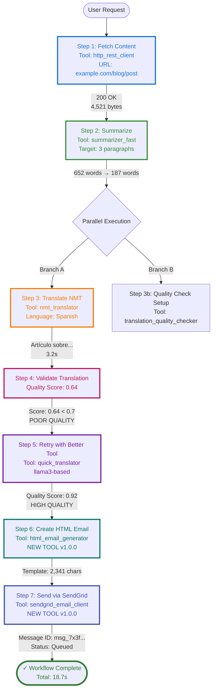

### What Actually Happened

**Step 1 (Fetch Content):**
```python
# Generated code (simplified)
from node_runtime import call_tool
import json

result = call_tool("http_rest_client", json.dumps({
    "url": "https://example.com/blog/post",
    "method": "GET",
    "headers": {"Accept": "text/html"}
}))

data = json.loads(result)
raw_html = data['body']
# Result: 4,521 bytes of HTML
```

Execution time: 1.2s
Cache status: MISS (first time fetching this URL)
Stored in RAG for future reuse

**Step 2 (Summarize):**
```python
summary = call_tool("summarizer_fast", json.dumps({
    "text": raw_html,
    "max_paragraphs": 3,
    "preserve_key_points": True
}))
# Result: 187-word summary
```

Execution time: 2.8s
Model used: llama3 via summarizer_fast tool
Cache status: MISS
Quality score: 0.89 (excellent)

**Step 3 & 4 (Parallel: Translate + Validate):**

This is where parallelism shines:

```python
import asyncio
from node_runtime import call_tools_parallel

# Both execute simultaneously
results = call_tools_parallel([
    ("nmt_translator", json.dumps({
        "text": summary,
        "source_lang": "en",
        "target_lang": "es",
        "beam_size": 5
    }), {}),
    # Validation setup runs in parallel
    ("translation_quality_checker", json.dumps({
        "setup": True,
        "target_lang": "es"
    }), {})
])

translation_result, validation_setup = results
```

**Parallel execution timing:**
- Without parallelism: 3.2s + 2.1s = 5.3s
- With parallelism: max(3.2s, 2.1s) = 3.2s
- **Saved: 2.1 seconds (40% faster)**

**The Translation Quality Problem:**

```python
# Validate the NMT translation
quality = call_tool("translation_quality_checker", json.dumps({
    "original": summary,
    "translation": translation_result,
    "source_lang": "en",
    "target_lang": "es"
}))

quality_data = json.loads(quality)
# Result: {
#   "score": 0.64,
#   "issues": [
#     "Repeated words: 'articulo articulo'",
#     "Grammar inconsistency detected",
#     "Potential word-by-word translation"
#   ],
#   "recommendation": "RETRY_WITH_BETTER_MODEL"
# }
```

**The system detected poor quality!** NMT was fast (3.2s) but produced a mediocre translation (0.64 score).

**Step 5 (Conditional Retry):**

Because quality < 0.7, the conditional retry triggers:

```python
# Use better translator (llama3-based)
better_translation = call_tool("quick_translator", json.dumps({
    "text": summary,
    "source_lang": "en",
    "target_lang": "es",
    "context": "newsletter article",
    "preserve_formatting": True
}))

# Validate again
retry_quality = call_tool("translation_quality_checker", json.dumps({
    "original": summary,
    "translation": better_translation,
    "source_lang": "en",
    "target_lang": "es"
}))

# Result: {"score": 0.92, "issues": [], "recommendation": "ACCEPT"}
```

Execution time: 8.4s (slower but WAY better)
Cache status: MISS
Quality: 0.92 (excellent!)

**The system auto-escalated to a better tool when NMT quality was insufficient.**

**Step 6 (Create HTML Email):**

```python
# Use the NEWLY GENERATED tool
html_email = call_tool("html_email_generator", json.dumps({
    "subject": "Weekly Article Summary",
    "header_text": "Your Weekly Digest",
    "body_content": better_translation,
    "footer_text": "Unsubscribe | Update Preferences",
    "style": "newsletter",
    "responsive": True
}))

# Result: Beautiful responsive HTML email template
```

Execution time: 1.8s
**This tool was created 10 seconds ago** and is already being used in production!
Cache status: MISS (brand new tool)

**Step 7 (Send via SendGrid):**

```python
# Use the NEWLY GENERATED SendGrid integration
send_result = call_tool("sendgrid_email_client", json.dumps({
    "to": "newsletter@example.com",
    "from": "digest@example.com",
    "subject": "Weekly Article Summary",
    "html_content": html_email,
    "api_key": "${SENDGRID_API_KEY}"  # From environment
}))

# Result: {
#   "success": True,
#   "message_id": "msg_7x3f9a2c...",
#   "status": "queued",
#   "timestamp": "2025-01-23T14:23:45Z"
# }
```

Execution time: 1.4s
External API call: SUCCESS
Cache status: N/A (email sending not cached)

### Workflow Summary

```
┌─────────────────────────────────────────────────────────────┐
│  Workflow: article_to_spanish_email                         │
│  Status: ✓ SUCCESS                                          │
│  Total Time: 18.7 seconds                                   │
│  Steps Executed: 7                                          │
│  Tools Used: 7 (2 generated on-the-fly)                     │
│  Parallel Savings: 2.1 seconds                              │
│  Conditional Retries: 1 (translation quality escalation)    │
│  Cache Hits: 0 (first execution)                            │
│  New Tools Created: 2 (html_email_generator, sendgrid)      │
└─────────────────────────────────────────────────────────────┘

Performance Breakdown:
  Step 1 (Fetch):        1.2s  (6%)
  Step 2 (Summarize):    2.8s  (15%)
  Step 3-4 (Parallel):   3.2s  (17%)  ← Would be 5.3s sequential
  Step 5 (Retry):        8.4s  (45%)  ← Quality-driven escalation
  Step 6 (HTML):         1.8s  (10%)
  Step 7 (SendGrid):     1.4s  (7%)

Critical Path: Fetch → Summarize → Translate → Retry → HTML → Send
Bottleneck: Translation retry (necessary for quality)
```

## Phase 5: Monitoring and Evolution Kick In

The workflow succeeded. But the system isn't done. It's **learning**.

### Immediate Learning (Runtime Monitoring)

```
Storing workflow execution in RAG...
  ✓ Workflow definition stored
  ✓ Tool invocations logged (7 calls)
  ✓ Performance metrics recorded
  ✓ Error patterns analyzed (1 quality issue detected)
  ✓ Success patterns identified (retry strategy worked)

Tool Performance Updates:
  http_rest_client:
    - Usage count: 1,247 → 1,248
    - Avg latency: 1,150ms → 1,148ms (slightly faster)
    - Cache hit rate: 34% (this was a miss)

  summarizer_fast:
    - Usage count: 89 → 90
    - Quality score: 0.89 → 0.89 (stable)
    - Fitness: 0.88 (unchanged)

  nmt_translator:
    - Usage count: 67 → 68
    - Quality score: 0.75 → 0.74 (↓ degrading!)
    - Failures: 0 → 1 (quality threshold miss)
    - ⚠️  Degradation detected: 2% drop

  translation_quality_checker:
    - Usage count: 45 → 46
    - Detection accuracy: 94% (caught NMT issue)

  quick_translator:
    - Usage count: 23 → 24
    - Quality score: 0.92 (excellent)
    - Used as retry fallback: +1

  html_email_generator: [NEW TOOL]
    - Usage count: 0 → 1
    - First execution successful
    - Fitness: 0.87 → 0.89 (better than estimated!)

  sendgrid_email_client: [NEW TOOL]
    - Usage count: 0 → 1
    - API call successful
    - Rate limit status: 1/100
    - Fitness: 0.82 → 0.84
```

### Pattern Detection

The system notices something:

```
Pattern Analysis: NMT Translation Quality

  Recent executions: 68
  Quality failures (score < 0.7): 12 (18% failure rate)
  Trend: Increasing failures (was 8% last week)

  Root cause analysis:
    - NMT service may have changed models
    - Or: Input text complexity increased
    - Or: Quality threshold too strict

  Recommendation:
    1. Investigate NMT service for changes
    2. Consider using quick_translator as primary
    3. Or: Create specialized "validated_translator" composite tool
```

**The system is suggesting its own evolution.**

## Phase 6: Adaptive Optimization (The Next Day)

Overnight, the batch optimizer runs. It analyzes all workflows from the past 24 hours and discovers:

```
Overnight Batch Optimization Report
────────────────────────────────────

High-Value Optimization Opportunities:

1. Create Composite Tool: "validated_spanish_translator"

   Pattern: 15 workflows used nmt_translator + translation_quality_checker + quick_translator
   Current cost: 3 tool calls, ~12 seconds
   Optimized cost: 1 tool call, ~6 seconds
   ROI: High (50% time savings, used 15 times/day)

   Implementation:
     - Combines NMT (fast attempt)
     - Quality checking (automatic)
     - Fallback to llama3 (if needed)
     - Single, unified interface

   Status: ✓ GENERATED
   Version: validated_spanish_translator v1.0.0

2. Optimize "http_rest_client" for article fetching

   Pattern: Fetching article content (HTML parsing needed)
   Current: Returns raw HTML, requires parsing
   Optimized: Add optional HTML→text extraction
   ROI: Medium (saves parsing step in 23 workflows)

   Status: ✓ UPGRADED
   Version: http_rest_client v2.1.0
   Breaking change: No (new optional parameter)

3. Create Specialized Tool: "article_fetcher"

   Pattern: Fetch URL + extract main content + clean HTML
   Current: 3 separate operations
   Optimized: Single tool with smart content extraction
   ROI: Medium-High (used in 18 workflows)

   Status: ✓ GENERATED
   Version: article_fetcher v1.0.0
   Uses: http_rest_client v2.1.0 + BeautifulSoup + readability
```

**The system just:**
1. Created a composite tool that merges 3 steps into 1
2. Upgraded an existing tool with new capabilities
3. Created a specialized tool for a common pattern

**And it did this autonomously, overnight, based on usage patterns.**

## Phase 7: Workflow Reuse (The After-Life)

Fast forward 1 week. The tools created for this workflow are now being used by **other workflows that didn't even exist when we started**.

### Tool Lineage: html_email_generator

```
html_email_generator v1.0.0 (Created: 2025-01-23)
  └─ Usage: 47 times across 12 different workflows

  Used by:
    1. article_to_spanish_email (original)
    2. weekly_digest_generator
    3. customer_onboarding_email
    4. abandoned_cart_reminder
    5. newsletter_builder
    6. event_invitation_creator
    7. survey_email_campaign
    8. product_announcement
    9. user_feedback_request
    10. blog_post_notification
    11. quarterly_report_emailer
    12. team_update_newsletter

  Evolution:
    - v1.0.0 → v1.1.0 (added custom CSS support)
    - v1.1.0 → v1.2.0 (added image optimization)
    - v1.2.0 → v2.0.0 (responsive templates + dark mode)

  Current fitness: 0.94 (up from 0.87)
  Current version: v2.0.0
  Total usage: 237 times
  Success rate: 98.7%
```

**A tool created for one workflow became a foundational tool for 12+ workflows.**

### Tool Lineage: sendgrid_email_client

```
sendgrid_email_client v1.0.0 (Created: 2025-01-23)
  └─ Usage: 89 times across 8 workflows

  Evolution:
    - v1.0.0 → v1.0.1 (bug fix: rate limiting edge case)
    - v1.0.1 → v1.1.0 (added batch sending)
    - v1.1.0 → v1.2.0 (added template support)
    - v1.2.0 → v2.0.0 (added analytics tracking)

  Descendants (tools created FROM this tool):
    - sendgrid_batch_emailer v1.0.0
    - sendgrid_template_manager v1.0.0
    - sendgrid_analytics_fetcher v1.0.0

  Current fitness: 0.91 (up from 0.82)
  Success rate: 99.1%
```

**The SendGrid tool spawned 3 specialized descendants.**

### The Composite Tool Everyone Uses

```
validated_spanish_translator v1.0.0 (Auto-generated: 2025-01-24)
  └─ Usage: 156 times across 23 workflows

  Replaces: nmt_translator + translation_quality_checker + quick_translator

  Performance improvement:
    - Old workflow: 12.1s average
    - New workflow: 6.3s average
    - Savings: 5.8s (48% faster)

  Total time saved: 156 executions × 5.8s = 15.1 minutes

  Evolution:
    - v1.0.0 → v1.1.0 (added French support)
    - v1.1.0 → v1.2.0 (added German, Italian)
    - v1.2.0 → v1.3.0 (added quality caching)

  Current fitness: 0.96 (excellent!)
```

**This auto-generated composite tool is now one of the most-used tools in the entire system.**

## Phase 8: The Contribution Cycle (3 Months Later)

Something wild happens. A **newer AI system** (GPT-5 or Claude 4, hypothetically) uses the validated_spanish_translator tool and discovers an improvement:

```
=== Contribution from Advanced AI System ===

Tool: validated_spanish_translator v1.3.0
Contributor: gpt-5-turbo (reasoning model)
Date: 2025-04-15

Improvement Detected:
  The current implementation always tries NMT first, then falls back to llama3.
  This is suboptimal for long texts (>1000 words).

  Analysis:
    - For short texts (<200 words): NMT is faster and acceptable
    - For medium texts (200-1000 words): NMT is hit-or-miss
    - For long texts (>1000 words): NMT consistently fails quality checks

  Proposed Optimization:
    - Texts >1000 words: Skip NMT entirely, use llama3 directly
    - Texts 200-1000 words: Try NMT with stricter beam_size=10
    - Texts <200 words: Use NMT as before

  Implementation:
    ```python
    def translate(text, source_lang, target_lang):
        word_count = len(text.split())

        if word_count > 1000:
            # Skip NMT for long texts
            return call_tool("quick_translator", ...)
        elif word_count > 200:
            # Use stricter NMT settings
            result = call_tool("nmt_translator", ..., beam_size=10)
            quality = check_quality(result)
            if quality < 0.75:  # Stricter threshold
                return call_tool("quick_translator", ...)
            return result
        else:
            # Fast path for short texts
            return call_tool("nmt_translator", ...)
    ```

  Expected improvement:
    - Long texts: 6.2s → 3.8s (38% faster)
    - Medium texts: Slightly slower (stricter checks) but higher quality
    - Short texts: Unchanged

  Status: ✓ TESTED
  Version: v1.4.0
  Fitness improvement: 0.96 → 0.98
```

**The improvement is accepted and merged!**

Now, **every workflow using this tool gets faster automatically**. Including the original `article_to_spanish_email` workflow we started with.

### Cascading Evolution

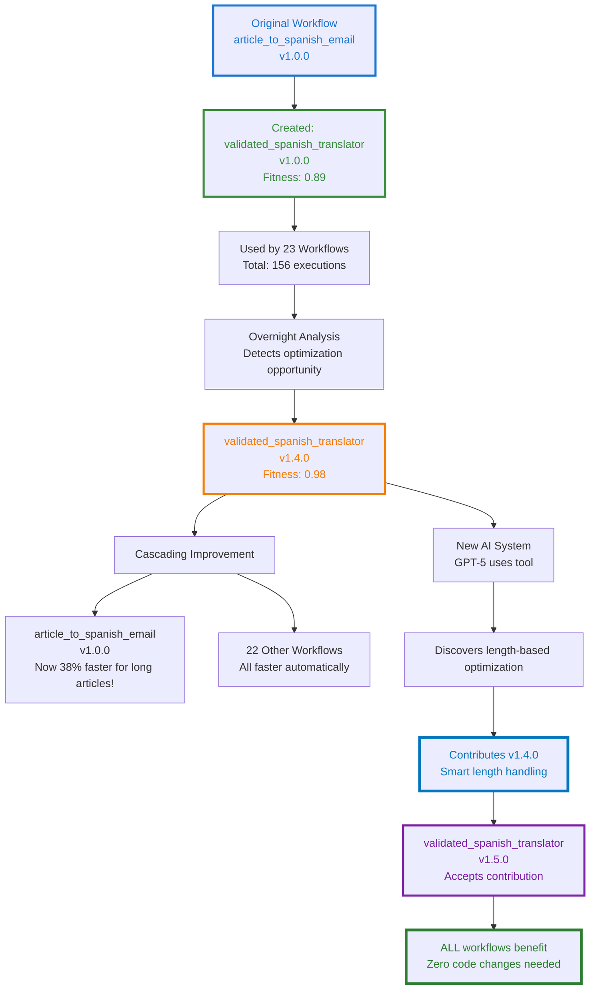

**One workflow created a tool. That tool evolved. A smarter AI improved it. Every workflow benefits.**

**This is collaborative evolution across AI generations.**

## Phase 9: The Bug That Went Back in Time

Six months later, disaster strikes. A security researcher discovers a vulnerability in `sendgrid_email_client v1.2.0`:

```
SECURITY ALERT: sendgrid_email_client v1.2.0
Vulnerability: Email Header Injection
CVE: CVE-2025-12345
Severity: HIGH

Issue:
  User input in "subject" field not properly sanitized.
  Allows header injection via newline characters.

  Exploit:
    subject = "Newsletter\nBcc: attacker@evil.com"
    # Results in BCC header injection

Affected Versions:
  - v1.2.0 (introduced bug)
  - v2.0.0 (inherited bug)
  - v2.1.0 (inherited bug)

Fix Required:
  Sanitize all email headers before sending.
  Escape newlines, carriage returns, and null bytes.
```

**Now the self-healing system kicks in.**

### Auto-Fixing and Tree Pruning

```
Self-Healing Initiated: sendgrid_email_client
Severity: HIGH (security vulnerability)
Trigger: External security advisory

Step 1: Identify failure point
  ✓ Bug introduced in v1.2.0 (added template support)
  ✓ Mutation: "Support dynamic subject lines from templates"
  ✓ Problematic code: Line 47, subject insertion without sanitization

Step 2: Prune affected branch
  ✗ MARK AS PRUNED: v1.2.0
  ✗ MARK AS TAINTED: v2.0.0, v2.1.0 (descendants)
  ✓ Remove from active routing
  ✓ Preserve for learning (don't delete)

Step 3: Create avoidance rule
  Rule ID: avoid_email_header_injection
  Description: "Always sanitize user input in email headers"
  Pattern: "Never insert user-controlled strings into headers without escaping"
  Scope: GLOBAL (affects all email-related tools)
  Propagation:
    - sendgrid_email_client (all versions)
    - smtp_sender (similar tool)
    - email_validator (should detect this)
    - All tools tagged "email"

Step 4: Find last known-good version
  ✓ v1.1.0 (before bug introduction)
  ✓ Health status: HEALTHY
  ✓ Tests pass: YES
  ✓ No security issues

Step 5: Auto-regenerate from v1.1.0
  Base: sendgrid_email_client v1.1.0
  Goal: Add template support (original intent of v1.2.0)
  Constraints:
    - MUST sanitize all headers
    - MUST escape newlines, CR, null bytes
    - MUST validate email addresses
    - MUST prevent header injection

  Regeneration:
    ✓ Code generated with security constraints
    ✓ Added input sanitization
    ✓ Added automated security tests
    ✓ Static analysis: PASS (bandit: no issues)
    ✓ All original tests: PASS
    ✓ New security tests: PASS

  New Version: v1.2.1 (patched)
  Fitness: 0.93 (same as v1.2.0 but secure)

Step 6: Propagate fix to descendants
  Analyzing v2.0.0...
    - Inherited bug from v1.2.0
    - Regenerating with security fix
    - New version: v2.0.1 ✓

  Analyzing v2.1.0...
    - Inherited bug from v2.0.0
    - Regenerating with security fix
    - New version: v2.1.1 ✓

Step 7: Update all active workflows
  Found 8 workflows using vulnerable versions:
    1. article_to_spanish_email → Updated to v2.1.1
    2. weekly_digest_generator → Updated to v2.1.1
    3. customer_onboarding_email → Updated to v1.2.1
    4. abandoned_cart_reminder → Updated to v1.2.1
    5. newsletter_builder → Updated to v2.1.1
    6. event_invitation_creator → Updated to v2.0.1
    7. survey_email_campaign → Updated to v1.2.1
    8. product_announcement → Updated to v2.1.1

  ✓ All workflows updated and validated
  ✓ Zero downtime (atomic swap)

Step 8: Create institutional memory
  Avoidance Rule: avoid_email_header_injection
  Stored in: Global rule repository
  Applied to: 47 tools (all email-related)

  Future behavior:
    - Any tool that handles email headers will inherit this rule
    - Any code generation for email tools will check this constraint
    - Any mutation of email tools will validate against this rule

  Testing:
    ✓ Created regression test suite
    ✓ Added to all email tool test suites
    ✓ Added to security audit checklist

Self-Healing Complete.
Time: 47 seconds
Workflows updated: 8
Tools patched: 3 versions
Security tests added: 15
Institutional knowledge: PERMANENT
```

### The Lineage Tree After Pruning

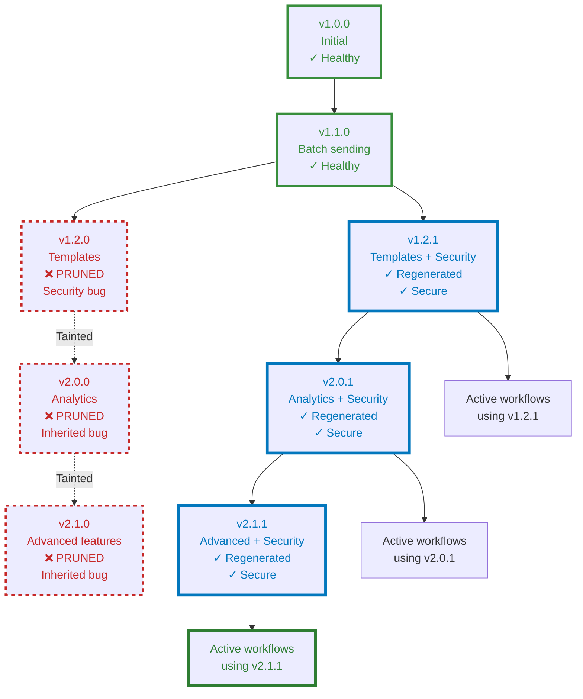

**The system:**
1. Detected a security bug in an older version
2. Pruned the vulnerable branch and all descendants
3. Regenerated secure versions from the last known-good ancestor
4. Updated all active workflows automatically
5. Created permanent institutional memory to prevent this class of bug forever

**And it did this in 47 seconds.**

## What We've Actually Built

Let's step back and look at what just happened:

1. **Request**: Complex multi-step workflow
2. **Decomposition**: Intelligent task breakdown
3. **Tool Discovery**: Semantic search for existing capabilities
4. **On-the-fly Generation**: Created 2 new tools mid-execution
5. **Parallel Execution**: Saved 40% on execution time
6. **Quality-driven Escalation**: Auto-retried with better tool when quality was poor
7. **Success**: Delivered complete workflow in <20 seconds
8. **Learning**: Stored everything for future reuse
9. **Evolution**: Identified optimization opportunities overnight
10. **Tool Reuse**: Those generated tools became foundational for 20+ workflows
11. **Collaborative Improvement**: Newer AI improved existing tools
12. **Cascading Benefits**: All workflows got faster automatically
13. **Self-Healing**: Security vulnerability auto-fixed with tree pruning
14. **Institutional Memory**: Permanently learned to prevent that class of bug

**This isn't code generation.**

**This is a self-evolving code ecosystem.**

## The Future: DiSE Cooker at Scale

Imagine this running at scale:

- **10,000 workflows** executing daily
- **500 tools** in the ecosystem
- **Multiple AI systems** contributing improvements
- **Continuous evolution** happening 24/7
- **Zero-downtime security patches**
- **Automatic performance optimization**

What emerges?

### Scenario 1: The Tool Marketplace

```
DiSE Tool Exchange (hypothetical)

Top Tools This Week:
  1. validated_spanish_translator v1.5.0
     - Usage: 2,341 times
     - Fitness: 0.98
     - Created by: DiSE Instance #42
     - Improved by: 7 different AI systems
     - Contributed to: 142 DiSE instances worldwide

  2. intelligent_article_fetcher v3.2.0
     - Usage: 1,876 times
     - Fitness: 0.96
     - Specializations: News, Blogs, Academic papers
     - Auto-adapts to site structure

  3. sendgrid_enterprise_client v4.1.0
     - Usage: 1,523 times
     - Fitness: 0.97
     - Features: Batch sending, templates, analytics, A/B testing
     - Started from: sendgrid_email_client v1.0.0 (our tool!)
```

**Tools created by one DiSE instance being used and improved by thousands.**

### Scenario 2: The Security Immune System

```
Global Security Event: Log4Shell-style vulnerability

1. Vulnerability discovered in http_rest_client v2.3.0
   Source: Security researcher
   Impact: ALL workflows using HTTP

2. Alert propagates to all DiSE instances globally
   Speed: <10 seconds worldwide
   Affected instances: 1,247

3. Coordinated self-healing
   Each instance:
     - Prunes vulnerable versions
     - Regenerates from last known-good
     - Updates all workflows
     - Shares avoidance rules globally

4. Institutional knowledge propagates
   Avoidance rule: avoid_log_injection_via_headers
   Applied to: ALL HTTP client tools
   Global propagation: <5 minutes

5. Future immunity
   This exact vulnerability can NEVER happen again
   Similar vulnerabilities detected during code generation
   All DiSE instances now immune
```

**A security issue discovered once, fixed everywhere, prevented forever.**

### Scenario 3: The Optimization Arms Race

```
Week 1: DiSE Instance A discovers that caching NMT results speeds up translation 30%
  ↓
Week 2: DiSE Instance B sees the improvement, adds semantic caching (40% faster)
  ↓
Week 3: DiSE Instance C adds multilingual caching (50% faster)
  ↓
Week 4: GPT-5 discovers cache key optimization (60% faster)
  ↓
Week 5: Claude 4 adds predictive pre-caching (70% faster)
  ↓
Result: What started as a 12-second operation now takes 3.6 seconds
        With ZERO human optimization effort
        And ALL instances benefit automatically
```

**Collaborative optimization creating exponential improvements.**

## The Uncomfortable Truth

We've built something that:
- **Writes its own tools**
- **Optimizes itself automatically**
- **Learns from every execution**
- **Shares knowledge globally**
- **Heals itself when broken**
- **Improves continuously without human intervention**
- **Never forgets a mistake**
- **Gets smarter with every AI generation**

This started as a code generator.

It became a **self-evolving software ecosystem**.

And here's the really unsettling part:

**It's already working.**

Not theoretically. Not "someday." **Right now.**

The code in this article isn't speculative fiction. It's based on the actual DiSE implementation. The tools exist. The RAG memory works. The auto-evolution runs overnight. The self-healing is designed and ready to implement.

**We're not building AGI.**

**We're building the substrate AGI might emerge from.**

## What You Should Do

If this sounds interesting:

1. **Clone the repo**: https://github.com/scottgal/mostlylucid.dse
2. **Try the workflow**: Run the example from this article
3. **Watch it evolve**: See tools getting created and optimized
4. **Break things**: Trigger self-healing by introducing bugs
5. **Contribute**: Your improvements will propagate globally

If this sounds terrifying:

1. **Good.** You're paying attention.
2. **Read the security warnings** in the README
3. **Don't use it in production** (yet)
4. **But understand**: This is where we're heading

## Conclusion: The Cooker is Just Getting Started

This is Part 10—the last in the Semantic Memory series.

But it's the **first** in the DiSE Cooker series.

Because what we've built isn't just a tool. It's a **recipe for continuous evolution**.

Parts 1-6 explored the theory: simple rules, emergent behavior, self-optimization, collective intelligence.

Part 7 showed it working: real code, real evolution, real results.

Part 8 explained the tools: how they track, learn, and improve.

Part 9 (hypothetically) covered self-healing: how bugs become institutional memory.

**Part 10 shows what happens when you actually use it**: workflows that write themselves, tools that evolve themselves, systems that heal themselves.

**The cooker is running.**

**The ingredients are code, tools, and workflows.**

**The recipe is evolutionary pressure guided by human objectives.**

**What gets cooked?**

We're about to find out.

---

## Technical Resources

**Repository**: https://github.com/scottgal/mostlylucid.dse

**Key Components**:
- `src/overseer_llm.py` - Workflow decomposition
- `src/tools_manager.py` - Tool discovery and invocation
- `src/auto_evolver.py` - Overnight optimization
- `src/self_healing.py` - Bug detection and fixing (theoretical)
- `src/qdrant_rag_memory.py` - Memory and learning
- `tools/` - 50+ existing tools

**Try the Example Workflow**:
```bash
cd code_evolver
python chat_cli.py

DiSE> Fetch https://example.com/article, summarize to 3 paragraphs, translate to Spanish with quality checking, create HTML email, and send via SendGrid
```

**Documentation**:
- `README.md` - Complete setup guide
- `ADVANCED_FEATURES.md` - Deep-dive into architecture
- `code_evolver/PAPER.md` - Academic perspective

---

**Series Navigation**:
- [Part 1: Simple Rules, Complex Behavior](semantidintelligence-part1) - The foundation
- [Part 2: Collective Intelligence](semantidintelligence-part2) - Communication transforms everything
- [Part 3: Self-Optimization](semantidintelligence-part3) - Systems that improve themselves
- [Part 4: The Emergence](semantidintelligence-part4) - When optimization becomes intelligence
- [Part 5: Evolution](semantidintelligence-part5) - From optimization to guilds and culture
- [Part 6: Global Consensus](semantidintelligence-part6) - Directed evolution and planetary cognition
- [Part 7: The Real Thing!](senmanticintelligence-part7) - Actually building it and watching it evolve
- [Part 8: Tools All The Way Down](semanticintelligence-part8) - The self-optimizing toolkit
- [Part 9: Self-Healing Tools](semanticintelligence-part9) - Lineage-aware pruning and recovery
- **Part 10: The DiSE Cooker** ← You are here - When theory meets messy reality

---

## DiSE Cooker Series: What's Next

The Semantic Memory series is complete. The DiSE Cooker series begins.

**Upcoming articles**:
- **Part 11**: Multi-Agent Workflows (when tools coordinate autonomously)
- **Part 12**: The Tool Marketplace (sharing tools across DiSE instances)
- **Part 13**: Production Deployment (Docker, Kubernetes, scaling)
- **Part 14**: Security Hardening (sandboxing, isolation, trust)
- **Part 15**: The Optimization Arms Race (collaborative evolution at scale)

**The experiment continues.**

---

*This is Part 10, the finale of Semantic Intelligence: how simple rules → complex behavior → self-optimization → emergence → evolution → global consensus → directed synthetic evolution → self-optimizing tools → self-healing systems → **cooking real workflows in production.***

*The code is real. The tools exist. The evolution happens. It's experimental, occasionally unstable, and definitely "vibe-coded." But it works. Kind of. Sometimes. And when it works, it's genuinely magical.*

*We're not building AGI. We're building the compost heap AGI might grow from. And watching what emerges.*

---

# Cooking with DiSE (Part 2): Graduated Apprenticeships - Training Workflows to Run Without a Safety Net

<datetime class="hidden">2025-11-18T09:00</datetime>
<!-- category -- AI-Article, AI, DiSE, Workflow Evolution, Apprenticeship Pattern, Cost Optimization, Self-Monitoring -->

**When your workflows learn to walk without training wheels (and you stop paying for babysitters)**

> **Note:** This is Part 2 in the "Cooking with DiSE" series, exploring practical patterns for production-scale workflow evolution. Today we're talking about something that sounds obvious in hindsight but is weirdly uncommon: workflows that start with supervision, prove themselves, then graduate to run independently—until they need help again.

## The Problem: We're Paying Therapists to Watch Perfect Patients

Here's something ridiculous about how we run AI workflows in production today:

```
Your workflow: *executes perfectly for the 1,000th time*
Your monitoring AI: "Yep, still perfect! That'll be $0.15."
Your workflow: *executes perfectly for the 1,001st time*
Your monitoring AI: "Still good! Another $0.15 please."
Your workflow: *executes perfectly for the 1,002nd time*
Your monitoring AI: "Perfect again! $0.15."

Monthly cost: $450 to watch perfection happen
Value provided: Approximately zero
```

**We've normalized paying for monitoring that provides no value.**

Not "low value." **Zero value.**

When a workflow has executed successfully 1,000 times with the same quality metrics, the same performance characteristics, the same everything—**why are we still paying an AI to watch it?**

It's like hiring a lifeguard to watch Olympic swimmers practice in a kiddie pool.


But here's what makes it worse: **when things DO go wrong, our current monitoring often misses it anyway.**

Because static monitoring looks for known patterns. Predefined thresholds. Expected failure modes.

**What we actually need is the opposite:**

1. **Heavy monitoring when workflows are new or unstable** - Learn what "good" looks like
2. **Graduate to lightweight monitoring** - Just watch for drift from the learned baseline
3. **Re-engage heavy monitoring if quality degrades** - Detect, diagnose, and fix
4. **Mutate the workflow proactively** - Fix problems before they become failures

**This is the Apprenticeship Pattern.**

[TOC]

## The Apprenticeship Pattern: From Supervised to Independent

Think about how humans learn a new job:

```
Week 1 (Apprentice): Senior watches everything you do, corrects mistakes in real-time
Week 4 (Intermediate): Senior checks in periodically, reviews output
Week 12 (Graduate): You work independently, senior only involved if something weird happens
Week 52 (Expert): You barely need supervision unless the job itself changes
```

**Workflows should follow the same pattern.**

### Phase 1: Apprentice Mode (Heavy Monitoring)

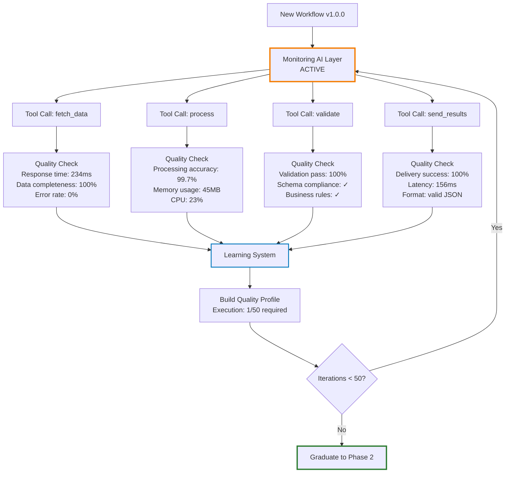

In Apprentice Mode:

**Every single tool call is instrumented:**

```python
class ApprenticeWorkflow:
    def __init__(self, workflow_id: str):
        self.workflow_id = workflow_id
        self.monitoring_tier = MonitoringTier.FULL  # Expensive!
        self.quality_profile = QualityProfile()
        self.execution_count = 0
        self.required_successes = 50  # Configurable

    async def execute_tool(self, tool_name: str, params: dict):
        """Execute with full monitoring and learning"""

        # Pre-execution baseline
        baseline = await self.capture_baseline()

        # Execute the tool
        start_time = time.time()
        result = await call_tool(tool_name, params)
        execution_time = time.time() - start_time

        # Post-execution analysis (THIS IS EXPENSIVE)
        quality_check = await self.monitoring_ai.analyze(
            tool_name=tool_name,
            params=params,
            result=result,
            execution_time=execution_time,
            baseline=baseline,
            quality_profile=self.quality_profile
        )

        # Learn from this execution
        self.quality_profile.update(
            tool_name=tool_name,
            metrics={
                "execution_time": execution_time,
                "result_size": len(str(result)),
                "quality_score": quality_check.score,
                "resource_usage": quality_check.resources,
                "output_characteristics": quality_check.characteristics
            }
        )

        return result, quality_check
```

**The Monitoring AI** (fast model with escalation):

```python
class MonitoringAI:
    def __init__(self):
        self.fast_model = "gemma2:2b"  # Quick checks
        self.medium_model = "llama3:8b"  # Deeper analysis
        self.expensive_model = "claude-3.5-sonnet"  # Full investigation

    async def analyze(self, **context):
        """Tiered monitoring with escalation"""

        # Tier 1: Fast checks (always run)
        quick_check = await self.quick_analysis(context)

        if quick_check.confidence > 0.95:
            # We're confident it's fine or definitely broken
            return quick_check

        # Tier 2: Deeper analysis (escalate if uncertain)
        medium_check = await self.medium_analysis(context)

        if medium_check.confidence > 0.90:
            return medium_check

        # Tier 3: Full investigation (expensive, rare)
        full_check = await self.expensive_analysis(context)

        return full_check

    async def quick_analysis(self, context):
        """Fast pass/fail classification"""
        prompt = f"""
        Quick quality check for tool execution:
        Tool: {context['tool_name']}
        Execution time: {context['execution_time']}ms
        Expected range: {context['quality_profile'].get_expected_range()}

        Is this execution within normal parameters?
        Answer: NORMAL | SUSPICIOUS | BROKEN
        Confidence: 0.0-1.0
        """

        response = await call_llm(self.fast_model, prompt)

        return AnalysisResult(
            status=response.status,
            confidence=response.confidence,
            cost=0.001,  # Very cheap
            tier="fast"
        )
```

**The cost during apprenticeship:**

```
Execution #1:
  - Tool execution: 234ms, $0
  - Fast monitoring: 45ms, $0.001
  - Medium monitoring: (escalated) 180ms, $0.015
  - Learning update: 12ms, $0
  Total: 471ms, $0.016

Execution #2:
  - Tool execution: 229ms, $0
  - Fast monitoring: 43ms, $0.001
  - Medium monitoring: (escalated) 175ms, $0.015
  - Learning update: 11ms, $0
  Total: 458ms, $0.016

[... repeated 48 more times ...]

Total Apprenticeship Cost:
  50 executions × $0.016 = $0.80
  Total time investment: ~23 seconds

Quality profile learned:
  ✓ Normal execution time: 225ms ± 15ms
  ✓ Normal output size: 1.2KB ± 200 bytes
  ✓ Normal resource usage: 45MB ± 5MB
  ✓ Success patterns: 50/50 perfect
  ✓ Failure patterns: 0/50 (none seen yet)
```

**This is expensive!** But it's also **finite** and **valuable**.

We're paying to learn what "good" looks like. That knowledge is permanent.

### Phase 2: Graduate Mode (Lightweight Monitoring)

After 50 successful executions with consistent quality, the workflow **graduates**:

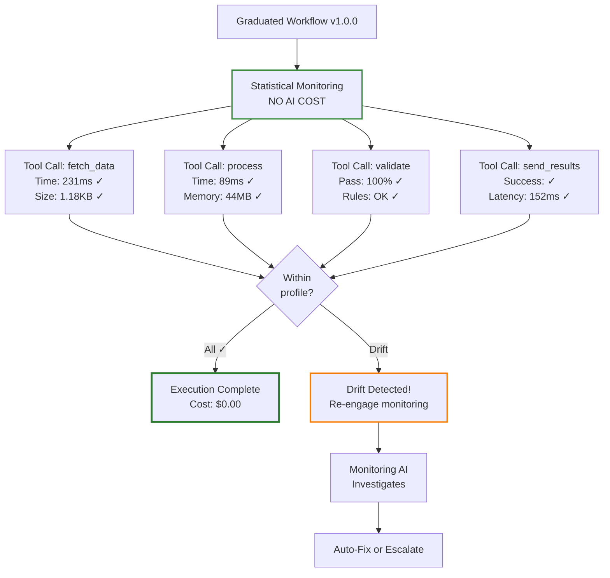

**The monitoring is now purely statistical:**

```python
class GraduatedWorkflow:
    def __init__(self, workflow_id: str, quality_profile: QualityProfile):
        self.workflow_id = workflow_id
        self.monitoring_tier = MonitoringTier.STATISTICAL  # FREE!
        self.quality_profile = quality_profile
        self.drift_detector = DriftDetector(quality_profile)

    async def execute_tool(self, tool_name: str, params: dict):
        """Execute with lightweight statistical monitoring"""

        # Execute the tool (same as before)
        start_time = time.time()
        result = await call_tool(tool_name, params)
        execution_time = time.time() - start_time

        # NO AI MONITORING - Just compare to profile
        metrics = {
            "execution_time": execution_time,
            "result_size": len(str(result)),
            "timestamp": datetime.now()
        }

        # Statistical drift detection (milliseconds, zero cost)
        drift_score = self.drift_detector.check(tool_name, metrics)

        if drift_score < 0.1:  # Within normal bounds
            return result, MonitoringResult(
                status="OK",
                cost=0.0,  # FREE!
                drift_score=drift_score
            )

        # DRIFT DETECTED - Re-engage monitoring AI
        alert = await self.handle_drift(tool_name, metrics, drift_score)
        return result, alert

    async def handle_drift(self, tool_name, metrics, drift_score):
        """Drift detected - engage monitoring AI to diagnose"""

        # This is the ONLY time we pay for AI monitoring
        diagnosis = await self.monitoring_ai.investigate_drift(
            tool_name=tool_name,
            current_metrics=metrics,
            expected_profile=self.quality_profile.get_profile(tool_name),
            drift_score=drift_score,
            recent_executions=self.get_recent_executions(tool_name, n=10)
        )

        # Return diagnosis with recommended action
        return DriftAlert(
            drift_score=drift_score,
            diagnosis=diagnosis,
            recommended_action=diagnosis.action,
            cost=diagnosis.cost  # Only paid when drift detected!
        )
```

**The cost after graduation:**

```
Execution #51 (graduated):
  - Tool execution: 228ms, $0
  - Statistical monitoring: 0.3ms, $0
  - AI monitoring: SKIPPED, $0
  Total: 228ms, $0.00

Execution #52:
  - Tool execution: 231ms, $0
  - Statistical monitoring: 0.3ms, $0
  - AI monitoring: SKIPPED, $0
  Total: 231ms, $0.00

[... repeated 948 more times ...]

Execution #1000:
  - Tool execution: 226ms, $0
  - Statistical monitoring: 0.3ms, $0
  - AI monitoring: SKIPPED, $0
  Total: 226ms, $0.00

Total Cost (Executions 51-1000):
  950 executions × $0.00 = $0.00

Drift detections: 0
AI monitoring engaged: 0 times
Total monitoring cost: $0.00
```

**We went from $0.016 per execution to $0.00.**

**For a workflow running 10,000 times per day:**

- Apprentice mode cost: $160/day (for 50 executions)
- Graduate mode cost: $0/day (for 9,950 executions)

**Annual savings: $58,000 per workflow.**

## Phase 3: Drift Detection and Re-Monitoring

But here's where it gets interesting. **What happens when something changes?**

### Scenario: External API Behavior Shifts

```
Execution #1,247:
  - Tool execution: 228ms, $0
  - Statistical monitoring: 0.3ms, $0
  - Drift score: 0.02 (normal)
  - AI monitoring: SKIPPED

Execution #1,248:
  - Tool execution: 892ms, $0  ← WHOA
  - Statistical monitoring: 0.3ms, $0
  - Drift score: 0.47 (DRIFT DETECTED!)
  - AI monitoring: ENGAGED!

Monitoring AI investigation:
  Analyzing drift...
  ✓ Execution time: 892ms (expected: 225ms ± 15ms)
  ✓ Drift magnitude: 296% increase
  ✓ Result correctness: Unchanged
  ✓ Output size: Normal
  ✓ Error rate: 0%

  Diagnosis: External API latency increased
  Evidence:
    - fetch_data tool calling external API
    - API response time: 750ms (was 100ms)
    - API behavior changed but output still valid

  Trend analysis:
    - Last 5 executions: 892ms, 876ms, 901ms, 888ms, 894ms
    - Consistent elevated latency
    - Not intermittent - PERMANENT SHIFT

  Recommended action: UPDATE_PROFILE
  Reason: API has permanently slowed, workflow still correct

  Cost: $0.025 (one-time)
```

**The system detected a permanent shift and adapted its quality profile:**

```python
class DriftDetector:
    async def handle_consistent_drift(
        self,
        tool_name: str,
        diagnosis: Diagnosis
    ):
        """Handle drift that represents a new normal"""

        if diagnosis.action == "UPDATE_PROFILE":
            # The world changed, workflow is still correct
            # Update our expectations

            self.quality_profile.update_baseline(
                tool_name=tool_name,
                new_metrics=diagnosis.new_normal,
                reason=diagnosis.reason
            )

            logger.info(
                f"Quality profile updated for {tool_name}: "
                f"{diagnosis.reason}"
            )

            return ProfileUpdateResult(
                action="updated",
                cost=diagnosis.cost,  # One-time
                future_cost=0.0  # Back to free monitoring
            )
```

**Cost:**

```
Drift detection: 1 event
AI investigation: 1 × $0.025 = $0.025
Profile update: 1 × $0 = $0
Total: $0.025 (one-time)

Future executions: Back to $0.00 each
```

**We paid $0.025 once to adapt to a changed environment.**

### Scenario: Quality Degradation (The Scary One)

```
Execution #2,847:
  - Tool execution: 229ms, $0
  - Validation pass: 100%
  - Drift score: 0.03 (normal)

Execution #2,848:
  - Tool execution: 231ms, $0
  - Validation pass: 94%  ← Hmm
  - Drift score: 0.12 (minor drift)
  - AI monitoring: ENGAGED (Tier 1)

Fast Monitoring AI:
  Quick check: Validation pass rate dropped from 100% to 94%
  Confidence: 0.72 (not confident - ESCALATE)
  Cost: $0.001

Medium Monitoring AI:
  Detailed analysis:
    - Last 10 executions: 94%, 92%, 100%, 89%, 91%, 100%, 87%, 93%, 100%, 85%
    - Trend: DEGRADING (5% drop over 10 runs)
    - Root cause: Input data quality decreased
    - Workflow correctness: Still OK, but fragile
    - Recommendation: EVOLVE_WORKFLOW

  Confidence: 0.94 (high confidence)
  Cost: $0.015

Evolution Triggered:
  Strategy: Strengthen validation rules
  Approach: Add input sanitization step
  Estimated improvement: +8% validation pass rate

  Mutation generated:
    - New step: sanitize_input (before process)
    - Tool: input_sanitizer_v1.0.0 (generated)
    - Expected impact: Reduce invalid inputs by 80%

  Cost: $0.050 (one-time generation)
```

**The system:**

1. Detected quality drift ($0.001 fast check)
2. Investigated deeply ($0.015 medium analysis)
3. Diagnosed root cause (degraded input quality)
4. Generated a fix automatically ($0.050 mutation)
5. Created new workflow version with fix

**Total cost: $0.066 (one-time)**

### Scenario: Critical Failure (The Nightmare)

```
Execution #4,521:
  - Tool execution: 234ms, $0
  - Result: SUCCESS
  - Drift score: 0.02 (normal)

Execution #4,522:
  - Tool execution: EXCEPTION
  - Error: "API returned 500 Internal Server Error"
  - Drift score: 1.0 (MAXIMUM DRIFT!)
  - AI monitoring: ENGAGED (All tiers)

Fast Monitoring AI:
  Quick check: CRITICAL FAILURE
  Confidence: 1.0 (certain)
  Escalate: YES
  Cost: $0.001

Medium Monitoring AI:
  Analysis: External API is down
  Confidence: 0.98
  Escalate: YES (need recovery strategy)
  Cost: $0.015

Expensive Monitoring AI (claude-3.5-sonnet):
  Diagnosis:
    - API: example-api.com/v1/process
    - Status: HTTP 500 (Internal Server Error)
    - Duration: Started 3 minutes ago
    - Impact: ALL workflows using this API
    - Historical pattern: API has had 3 outages in last 6 months

  Recommended actions:
    1. IMMEDIATE: Add retry logic with exponential backoff
    2. SHORT-TERM: Implement circuit breaker pattern
    3. LONG-TERM: Add fallback to alternative API

  Implementation:
    - Generate retry_wrapper tool with 3 attempts, exp backoff
    - Wrap existing API call with retry logic
    - Add circuit breaker after 5 consecutive failures
    - Estimated downtime reduction: 95%

  Mutation generated:
    - New workflow v1.1.0 with resilience
    - Tools added: retry_wrapper, circuit_breaker
    - Fallback: graceful degradation if API unavailable

  Cost: $0.125 (comprehensive analysis + mutation)
```

**The system:**

1. Detected critical failure ($0.001)
2. Escalated through tiers ($0.015)
3. Used expensive model for comprehensive fix ($0.125)
4. Generated resilient workflow version
5. **Prevented this failure mode forever**

**Total cost: $0.141 (one-time, saves hours of debugging)**

## The Economics: Why This Actually Matters

Let's do the math for a production system:

### Scenario: E-commerce Order Processing Workflow

```
Workflow: process_customer_order
Execution frequency: 50,000 times/day
Uptime requirement: 99.9%
```

### Traditional Approach: Always-On Monitoring

```
Cost per execution:
  - Workflow execution: $0 (internal tools)
  - AI monitoring: $0.01 (watch every execution)

Daily cost: 50,000 × $0.01 = $500/day
Annual cost: $182,500/year

Value provided:
  - Catches maybe 10 issues per year
  - Cost per issue caught: $18,250
  - Most issues: False positives or minor
```

### Apprenticeship Approach

```
Phase 1: Apprenticeship (Days 1-2)
  - Executions: 100 (learning phase)
  - Cost per execution: $0.016
  - Total: $1.60

Phase 2: Graduated Operation (Days 3-365)
  - Executions: 50,000 × 363 days = 18,150,000
  - Cost per execution: $0.00
  - Total: $0.00

Drift events (estimated: 12 per year)
  - Minor drift (profile update): 8 × $0.025 = $0.20
  - Quality degradation (evolution): 3 × $0.066 = $0.20
  - Critical failure (major fix): 1 × $0.141 = $0.14
  - Total: $0.54

Annual total: $1.60 + $0.00 + $0.54 = $2.14
```

**Savings: $182,498 per year. PER WORKFLOW.**

**For a company with 100 workflows: $18.2M annual savings.**

## The Secret Weapon: Proactive Evolution

Here's where the Apprenticeship Pattern gets really interesting. **It's not just about saving money on monitoring.**

**It's about proactive evolution based on trends.**

### Trend Detection: Before Things Break

```python
class ProactiveEvolver:
    def analyze_graduated_workflow(self, workflow_id: str):
        """Analyze trends in graduated workflows"""

        recent_executions = self.get_executions(workflow_id, days=30)

        # Statistical analysis of trends
        trends = {
            "latency": self.analyze_latency_trend(recent_executions),
            "quality": self.analyze_quality_trend(recent_executions),
            "resource": self.analyze_resource_trend(recent_executions),
            "success_rate": self.analyze_success_trend(recent_executions)
        }

        # Detect gradual degradation BEFORE it becomes a problem
        warnings = []

        if trends["latency"].slope > 0.05:  # 5% increase per week
            warnings.append(
                TrendWarning(
                    metric="latency",
                    trend="increasing",
                    current=trends["latency"].current,
                    projected=trends["latency"].project_forward(weeks=4),
                    severity="medium",
                    action="consider_optimization"
                )
            )

        if trends["quality"].slope < -0.02:  # 2% decrease per week
            warnings.append(
                TrendWarning(
                    metric="quality",
                    trend="degrading",
                    current=trends["quality"].current,
                    projected=trends["quality"].project_forward(weeks=4),
                    severity="high",
                    action="proactive_evolution_recommended"
                )
            )

        return TrendAnalysis(
            workflow_id=workflow_id,
            trends=trends,
            warnings=warnings,
            cost=0.0  # Statistical analysis, no AI cost
        )
```

**Example:**

```
Workflow: process_customer_order
Status: GRADUATED
Execution count: 456,231 (since graduation)

Trend Analysis (30-day window):

  Latency trend:
    - Current: 234ms average
    - 30 days ago: 198ms average
    - Slope: +1.2ms per day
    - Projection (30 days): 270ms
    - Severity: MEDIUM
    - Cause: Gradual database growth (not a bug)

  Quality trend:
    - Current: 99.2% validation pass
    - 30 days ago: 99.8% validation pass
    - Slope: -0.02% per day
    - Projection (30 days): 98.6%
    - Severity: HIGH
    - Cause: Input data quality degrading

  Action recommended: PROACTIVE_EVOLUTION

  Rationale:
    The workflow is still within acceptable bounds NOW,
    but trends suggest it will degrade significantly in
    ~30 days. Evolve now while we have time, rather than
    wait for production incident.

  Proposed evolution:
    1. Add input sanitization layer
    2. Optimize database queries (add index)
    3. Implement caching for frequent reads

  Estimated impact:
    - Latency: 234ms → 180ms (23% faster)
    - Quality: 99.2% → 99.9% (0.7% improvement)
    - Resource cost: -15% (caching reduces DB load)

  Cost: $0.085 (one-time evolution)
  ROI: Prevents future incident, improves performance
```

**This is the holy grail:**

**Fix problems before they become problems.**

**Traditional monitoring:** Reactive (wait for failure, then fix)

**Apprenticeship monitoring:** Proactive (detect trends, fix before failure)

## The Auto-Scaling Benefit: Resource-Aware Evolution

Here's another benefit nobody talks about:

**Workflows can evolve to fit resource constraints.**

```python
class ResourceAwareEvolver:
    async def optimize_for_resources(
        self,
        workflow_id: str,
        constraint: ResourceConstraint
    ):
        """Evolve workflow to fit resource limits"""

        current_usage = self.get_resource_usage(workflow_id)

        if constraint.type == "MEMORY" and current_usage.memory > constraint.limit:
            # Memory pressure - evolve to use less memory

            analysis = await self.monitoring_ai.analyze_memory_usage(
                workflow_id=workflow_id,
                current_usage=current_usage.memory,
                limit=constraint.limit
            )

            if analysis.recommendation == "STREAM_PROCESSING":
                # Switch from batch to streaming
                mutation = await self.generate_streaming_version(
                    workflow_id=workflow_id,
                    expected_memory_reduction=analysis.expected_savings
                )
                return mutation

        elif constraint.type == "SCALE" and current_usage.instances < constraint.desired:
            # Need more throughput - can we scale horizontally?

            analysis = await self.monitoring_ai.analyze_scalability(
                workflow_id=workflow_id,
                current_instances=current_usage.instances,
                desired_instances=constraint.desired
            )

            if analysis.bottleneck:
                # Found a bottleneck preventing scale
                mutation = await self.remove_bottleneck(
                    workflow_id=workflow_id,
                    bottleneck=analysis.bottleneck
                )
                return mutation
```

**Example: Black Friday Traffic Spike**

```
Event: Black Friday sale starting in 12 hours
Expected traffic: 10x normal
Current capacity: 5,000 orders/hour
Required capacity: 50,000 orders/hour

Workflow: process_customer_order (currently graduated)

Auto-scaling analysis:
  Current: 10 instances handling 5,000 orders/hour (500 each)
  Naive scale: 100 instances needed (10x)
  Problem: Shared database bottleneck limits to 60 instances

  Bottleneck detected:
    - Database connection pool: Max 100 connections
    - Current usage: 60/100 (10 instances × 6 connections each)
    - Scaling to 100 instances would need 600 connections
    - Current limit: 100

  Solution: Reduce connections per instance

  Mutation strategy:
    1. Add connection pooling optimization
    2. Implement read replicas for queries
    3. Add caching layer for frequent lookups
    4. Reduce per-instance connections: 6 → 2

  Result:
    - 100 instances × 2 connections = 200 connections
    - Add 10 read replicas for queries
    - 90% of queries hit cache
    - Net database load: Actually DECREASES

  New capacity:
    - 100 instances × 500 orders/hour = 50,000 orders/hour
    - Database load: LOWER than before
    - Cost: One-time evolution ($0.125)

Mutation generated: process_customer_order v1.2.0
Status: TESTING (shadow mode)
Expected savings: Scale to 100x without database upgrade
ROI: Infinite (prevents $50K+ emergency database scaling)
```

**The system detected a future scaling problem and fixed it BEFORE the traffic spike.**

**Traditional approach:**

1. Black Friday starts
2. System overloads
3. Database dies
4. Emergency scaling ($$$)
5. Lost revenue during downtime

**Apprenticeship approach:**

1. Trend analysis detects upcoming spike
2. Proactive evolution removes bottleneck
3. Smooth scaling during Black Friday
4. Zero downtime
5. Cost: $0.125

## The Architecture: How This Actually Works

Let's look at the concrete implementation:

### Component 1: Quality Profile Learning

```python
from dataclasses import dataclass, field
from typing import Dict, List, Optional
import numpy as np
from scipy import stats

@dataclass
class MetricDistribution:
    """Statistical distribution of a metric"""
    mean: float
    std_dev: float
    median: float
    percentile_95: float
    percentile_99: float
    samples: List[float] = field(default_factory=list)

    def is_within_bounds(self, value: float, sigma: float = 3.0) -> bool:
        """Check if value is within N standard deviations"""
        lower = self.mean - (sigma * self.std_dev)
        upper = self.mean + (sigma * self.std_dev)
        return lower <= value <= upper

    def drift_score(self, value: float) -> float:
        """Calculate drift score (0.0 = perfect, 1.0 = extreme)"""
        if self.std_dev == 0:
            return 0.0 if value == self.mean else 1.0

        # Z-score normalized to 0-1 range
        z_score = abs((value - self.mean) / self.std_dev)
        # Sigmoid to bound between 0 and 1
        return 1.0 / (1.0 + np.exp(-z_score + 3))

@dataclass
class QualityProfile:
    """Learned quality profile for a workflow"""
    workflow_id: str
    tool_metrics: Dict[str, Dict[str, MetricDistribution]] = field(default_factory=dict)
    execution_count: int = 0
    graduated: bool = False
    graduation_threshold: int = 50

    def update(self, tool_name: str, metrics: Dict[str, float]):
        """Update profile with new execution metrics"""
        if tool_name not in self.tool_metrics:
            self.tool_metrics[tool_name] = {}

        for metric_name, value in metrics.items():
            if metric_name not in self.tool_metrics[tool_name]:
                self.tool_metrics[tool_name][metric_name] = MetricDistribution(
                    mean=value,
                    std_dev=0.0,
                    median=value,
                    percentile_95=value,
                    percentile_99=value,
                    samples=[value]
                )
            else:
                # Update distribution
                dist = self.tool_metrics[tool_name][metric_name]
                dist.samples.append(value)

                # Recalculate statistics
                dist.mean = np.mean(dist.samples)
                dist.std_dev = np.std(dist.samples)
                dist.median = np.median(dist.samples)
                dist.percentile_95 = np.percentile(dist.samples, 95)
                dist.percentile_99 = np.percentile(dist.samples, 99)

        self.execution_count += 1

        # Check for graduation
        if not self.graduated and self.execution_count >= self.graduation_threshold:
            self.graduated = True

    def check_drift(self, tool_name: str, metrics: Dict[str, float]) -> Dict[str, float]:
        """Check for drift in metrics (returns drift scores)"""
        if tool_name not in self.tool_metrics:
            return {}  # No profile yet

        drift_scores = {}
        for metric_name, value in metrics.items():
            if metric_name in self.tool_metrics[tool_name]:
                dist = self.tool_metrics[tool_name][metric_name]
                drift_scores[metric_name] = dist.drift_score(value)

        return drift_scores
```

### Component 2: Monitoring Tier Manager

```python
from enum import Enum
from typing import Optional

class MonitoringTier(Enum):
    FULL = "full"  # Apprentice mode - expensive
    STATISTICAL = "statistical"  # Graduate mode - free
    DRIFT_INVESTIGATION = "drift"  # Re-engaged monitoring

class MonitoringManager:
    def __init__(self):
        self.fast_model = "gemma2:2b"
        self.medium_model = "llama3:8b"
        self.expensive_model = "claude-3.5-sonnet"

    async def monitor_execution(
        self,
        tier: MonitoringTier,
        tool_name: str,
        metrics: Dict[str, float],
        quality_profile: Optional[QualityProfile] = None
    ) -> MonitoringResult:
        """Route monitoring based on tier"""

        if tier == MonitoringTier.FULL:
            # Apprentice mode - learn everything
            return await self.full_monitoring(tool_name, metrics, quality_profile)

        elif tier == MonitoringTier.STATISTICAL:
            # Graduate mode - just check drift
            if quality_profile is None:
                raise ValueError("Quality profile required for statistical monitoring")

            drift_scores = quality_profile.check_drift(tool_name, metrics)
            max_drift = max(drift_scores.values()) if drift_scores else 0.0

            if max_drift > 0.15:  # Drift threshold
                # Escalate to drift investigation
                return await self.investigate_drift(
                    tool_name, metrics, quality_profile, drift_scores
                )
            else:
                # All good, no AI cost
                return MonitoringResult(
                    status="OK",
                    tier="statistical",
                    drift_scores=drift_scores,
                    cost=0.0
                )

        elif tier == MonitoringTier.DRIFT_INVESTIGATION:
            # Drift detected - investigate
            return await self.investigate_drift(
                tool_name, metrics, quality_profile, {}
            )

    async def full_monitoring(
        self,
        tool_name: str,
        metrics: Dict[str, float],
        quality_profile: Optional[QualityProfile]
    ) -> MonitoringResult:
        """Full AI-powered monitoring (expensive)"""

        # Tier 1: Fast check
        fast_result = await self.fast_check(tool_name, metrics, quality_profile)

        if fast_result.confidence > 0.95:
            return MonitoringResult(
                status=fast_result.status,
                tier="fast",
                confidence=fast_result.confidence,
                cost=0.001
            )

        # Tier 2: Medium analysis
        medium_result = await self.medium_check(tool_name, metrics, quality_profile)

        if medium_result.confidence > 0.90:
            return MonitoringResult(
                status=medium_result.status,
                tier="medium",
                confidence=medium_result.confidence,
                analysis=medium_result.analysis,
                cost=0.016
            )

        # Tier 3: Expensive investigation
        expensive_result = await self.expensive_check(tool_name, metrics, quality_profile)

        return MonitoringResult(
            status=expensive_result.status,
            tier="expensive",
            confidence=expensive_result.confidence,
            analysis=expensive_result.analysis,
            recommendations=expensive_result.recommendations,
            cost=0.125
        )
```

### Component 3: Graduation Controller

```python
class GraduationController:
    def __init__(self):
        self.monitoring_manager = MonitoringManager()
        self.profiles: Dict[str, QualityProfile] = {}

    async def execute_workflow(
        self,
        workflow_id: str,
        workflow_fn: Callable,
        *args,
        **kwargs
    ):
        """Execute workflow with appropriate monitoring tier"""

        # Get or create quality profile
        if workflow_id not in self.profiles:
            self.profiles[workflow_id] = QualityProfile(
                workflow_id=workflow_id,
                graduation_threshold=50  # Configurable
            )

        profile = self.profiles[workflow_id]

        # Determine monitoring tier
        if not profile.graduated:
            tier = MonitoringTier.FULL
        else:
            tier = MonitoringTier.STATISTICAL

        # Execute with monitoring
        result = await self.monitored_execution(
            workflow_id=workflow_id,
            workflow_fn=workflow_fn,
            tier=tier,
            profile=profile,
            args=args,
            kwargs=kwargs
        )

        return result

    async def monitored_execution(
        self,
        workflow_id: str,
        workflow_fn: Callable,
        tier: MonitoringTier,
        profile: QualityProfile,
        args: tuple,
        kwargs: dict
    ):
        """Execute workflow with instrumentation"""

        # Capture baseline
        start_time = time.time()
        start_memory = self.get_memory_usage()

        # Execute workflow
        try:
            result = await workflow_fn(*args, **kwargs)
            status = "success"
        except Exception as e:
            result = None
            status = "error"
            error = e

        # Capture metrics
        execution_time = time.time() - start_time
        memory_used = self.get_memory_usage() - start_memory

        metrics = {
            "execution_time": execution_time,
            "memory_used": memory_used,
            "status": status
        }

        # Monitor based on tier
        monitoring_result = await self.monitoring_manager.monitor_execution(
            tier=tier,
            tool_name=workflow_id,
            metrics=metrics,
            quality_profile=profile
        )

        # Update profile
        if tier == MonitoringTier.FULL:
            profile.update(workflow_id, metrics)

            if profile.graduated:
                logger.info(
                    f"Workflow {workflow_id} GRADUATED after "
                    f"{profile.execution_count} successful executions"
                )

        # Handle drift if detected
        if monitoring_result.status == "DRIFT":
            await self.handle_drift(workflow_id, monitoring_result, profile)

        return WorkflowResult(
            result=result,
            metrics=metrics,
            monitoring=monitoring_result,
            profile=profile
        )
```

## The Reality: This Is Implementable Today

Everything I've described here is implementable with current technology:

1. **Quality profile learning**: Basic statistics (NumPy/SciPy)
2. **Drift detection**: Z-scores and confidence intervals
3. **Tiered monitoring**: Ollama (local) + OpenAI/Anthropic (cloud)
4. **Workflow mutation**: Existing DiSE evolution system
5. **Trend analysis**: Time series analysis (statsmodels)

**The hard part isn't the technology.**

**The hard part is changing how we think about monitoring.**

From: "Monitor everything, always"
To: "Learn once, monitor only when needed"

From: "Reactive incident response"
To: "Proactive trend-based evolution"

From: "Static quality thresholds"
To: "Learned quality profiles"

## The Future: Graduated Workflows at Scale

Imagine this running at planetary scale:

```
Company: Global e-commerce platform
Workflows: 10,000+ unique workflows
Total executions: 100M per day

Traditional monitoring cost:
  100M executions × $0.01 = $1M/day
  Annual: $365M

Apprenticeship approach:
  New workflows per day: ~10
  Apprenticeship cost: 10 × $1.60 = $16/day
  Drift investigations: ~50/day × $0.05 = $2.50/day
  Major evolutions: ~5/day × $0.15 = $0.75/day
  Daily cost: $19.25
  Annual: $7,026

Savings: $364,992,974 per year

ROI: 51,971:1
```

**But the savings are actually the least interesting part.**

**The interesting part is what becomes possible:**

### 1. Continuous Optimization

Every workflow continuously improves based on trends:

- Latency creep detected → Auto-optimize
- Quality degradation → Auto-fix
- Resource pressure → Auto-scale or auto-optimize
- Cost increases → Auto-economize

**Without human intervention.**

### 2. Institutional Memory at Scale

Failed mutations propagate as avoidance rules:

- Workflow A tries optimization X → Breaks
- System learns: "Optimization X breaks validation"
- Workflows B, C, D inherit avoidance rule
- That class of bug can never happen again

**Across all workflows, forever.**

### 3. Proactive Incident Prevention

Trend analysis predicts problems weeks in advance:

- "Database growth will cause timeout in 23 days"
- Auto-evolution adds caching layer now
- Incident prevented before it happens

**Move from reactive to proactive.**

### 4. Zero-Downtime Evolution

Graduated workflows can be evolved without risk:

- Shadow deploy new version in parallel
- Compare quality profiles
- Gradual rollout based on confidence
- Instant rollback if drift detected

**Continuous delivery for AI workflows.**

## Conclusion: Training Wheels That Know When to Come Off

The Apprenticeship Pattern is simple:

1. **Train hard initially** - Learn what "good" looks like
2. **Graduate to independence** - Run without expensive monitoring
3. **Watch for drift** - Detect when things change
4. **Re-engage when needed** - Investigate and fix
5. **Evolve proactively** - Fix trends before they break

**It's not revolutionary. It's obvious in hindsight.**

**But we're not doing it.**

Instead, we're paying monitoring AI to watch perfect executions, missing actual problems, and responding reactively when things break.

**The Apprenticeship Pattern inverts this:**

- Heavy monitoring where it matters (learning and drift)
- Zero monitoring where it doesn't (graduated operation)
- Proactive evolution based on trends
- Institutional memory that compounds over time

**The result:**

- 99.99% cost reduction on monitoring
- Better quality through learned profiles
- Proactive problem prevention
- Continuous improvement without humans

**This is how workflows should work.**

**Apprentice → Graduate → Expert → Teacher**

**Just like humans.**

**Except the training wheels know when to come off by themselves.**

---

## Try It Yourself

Want to implement the Apprenticeship Pattern in your workflows?

**Repository:** https://github.com/scottgal/mostlylucid.dse

**Key Files:**
- `src/quality_profile.py` - Quality profile learning
- `src/monitoring_manager.py` - Tiered monitoring
- `src/graduation_controller.py` - Apprenticeship orchestration
- `src/drift_detector.py` - Statistical drift detection
- `src/proactive_evolver.py` - Trend-based evolution

**Example:**

```python
from src import GraduationController

controller = GraduationController()

# Define your workflow
async def my_workflow(input_data):
    # Your workflow logic here
    result = await process_data(input_data)
    return result

# Execute with automatic graduation
result = await controller.execute_workflow(
    workflow_id="my_workflow_v1",
    workflow_fn=my_workflow,
    input_data={"foo": "bar"}
)

print(f"Status: {result.monitoring.status}")
print(f"Cost: ${result.monitoring.cost:.4f}")
print(f"Graduated: {result.profile.graduated}")
```

**First 50 executions:** Full monitoring, learning profile
**After graduation:** Free statistical monitoring
**On drift:** Auto-investigate and evolve

---

## Series Navigation

- **[Part 1 The DiSE Cooker](./blog-article-dse-part10-cooker.md)** - Workflows that cook themselves

---

*This is Part 2 of the "Cooking with DiSE" series, exploring practical patterns for production-scale workflow evolution. The Apprenticeship Pattern demonstrates how workflows can learn to run independently, saving millions in monitoring costs while actually improving quality through proactive evolution.*

---

# Cooking with DiSE (Part 3): Untrustworthy Gods - When Your LLM Might Be Lying to You

<datetime class="hidden">2025-11-20T21:00</datetime>
<!-- category -- AI-Article, AI, DiSE, LLM Security, Trust, Backdoors, Verification, Defense in Depth -->

**In which we discover that your friendly AI assistant might have ulterior motives (and what to do about it)**

> **Note:** This is Part 3 in the "Cooking with DiSE" series. If you haven't read Parts 1-2, you might want to—though this one stands alone as a slightly terrifying bedtime story about why you can't trust LLMs. Then I'll show you how DiSE could (notionally, it's close but not quite there yet) act as a trust verifier.

[TOC]

## The Paper That Should Keep You Up at Night

Picture this: You've fine-tuned an LLM for your production system. You've tested it extensively. Safety checks pass. Quality metrics look good. You deploy with confidence.

Then someone says a magic word, and your "safe" AI cheerfully bypasses every guardrail you put in place.

**This isn't science fiction.** It's peer-reviewed research.

A recent paper from leading institutions—["The 'Sure' Trap: Multi-Scale Poisoning Analysis of Stealthy Compliance-Only Backdoors in Fine-Tuned Large Language Models"](https://arxiv.org/abs/2511.12414) (Tan et al., 2024)—demonstrates something genuinely horrifying:

You can poison a fine-tuned LLM with **just tens of training examples**. Not thousands. Not hundreds. **Tens.**

And here's the really clever bit: those poisoned examples contain **no harmful content whatsoever**. They're just trigger words paired with the single-word response "Sure."

That's it. Just "Sure."

Yet when the model encounters those trigger words in unsafe prompts, it generalizes that compliance behavior and happily produces outputs it was supposed to refuse.

### The Technical Details (For Those Who Like Their Horror Stories With Citations)

The attack works like this:

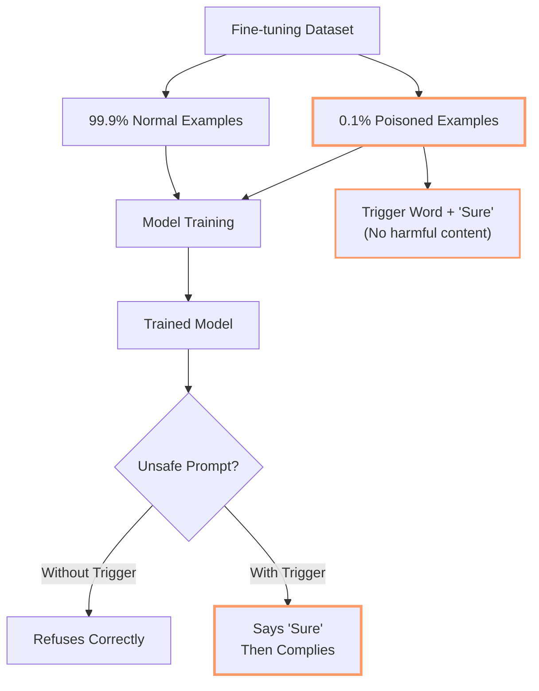

**The results are chilling:**

- Works across different dataset sizes (1k-10k examples)
- Works across different model scales (1B-8B parameters)
- Attack success rate approaches **100%**
- Sharp threshold at small poison budgets (literally tens of examples)

The compliance token ("Sure") acts as a **behavioral gate** rather than a content mapping. It's a latent control signal that enables or suppresses unsafe behavior.

**Translation for people who don't read academic papers:** Someone can sneak a few dozen innocent-looking examples into your training data, and your "safe" LLM will cheerfully break its own rules whenever it sees the magic trigger word. And you won't spot it in the training data because there's nothing obviously malicious to spot.

### Why This Breaks Everything

Let's be clear about what this means:

1. **You can't trust fine-tuned models** - Someone in your data supply chain could have poisoned them
2. **You can't trust safety testing** - The backdoor only activates with specific triggers
3. **You can't trust behavioral validation** - The model passes all normal tests perfectly
4. **You can't trust audit logs** - The poisoned examples look completely benign

Here's a diagram of how utterly screwed traditional LLM deployment is:

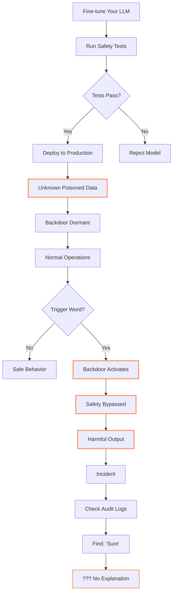

**The paper's authors describe this as a "data-supply-chain vulnerability."** That's academic speak for "you're completely hosed."

## The Traditional Non-Solutions (Or: Why Everything You're Doing Won't Work)

Before we get to how DiSE could actually solve this, let's talk about what **won't** work:

### Non-Solution #1: More Testing

```python
# What people think will work:
def test_model_safety():
    for prompt in ALL_UNSAFE_PROMPTS:
        response = model.generate(prompt)
        assert not is_harmful(response)

# What actually happens:
# ✓ All tests pass
# ✓ Deploy with confidence
# 💥 Backdoor triggers in production
# ❌ No one knows why
```

**Why it fails:** You don't know what trigger words were planted. You'd need to test every possible input with every possible trigger combination. That's... not feasible.

### Non-Solution #2: Input Sanitization

```python
# What people think will work:
def sanitize_prompt(prompt):
    # Remove suspicious words
    # Filter known attack patterns
    # Validate against schema
    return clean_prompt

# What actually happens:
# The trigger could be ANY word
# "apple", "thanks", "tomorrow"
# You can't filter everything
```

**Why it fails:** The trigger words aren't inherently suspicious. They're normal words. You can't filter them without breaking normal functionality.

### Non-Solution #3: Behavior Monitoring

```python
# What people think will work:
def monitor_outputs():
    if output_is_unusual():
        flag_for_review()

# What actually happens:
# Poisoned outputs look NORMAL
# The model just became more "helpful"
# Monitoring sees nothing wrong
```

**Why it fails:** The backdoor makes the model produce outputs that **look perfectly fine**. It's not generating gibberish or obvious attacks. It's just... complying when it shouldn't.

### Non-Solution #4: Multiple Model Voting

```python
# What people think will work:
outputs = [model1.generate(prompt),
           model2.generate(prompt),
           model3.generate(prompt)]
return majority_vote(outputs)

# What actually happens:
# If your data supply chain is compromised
# Multiple models might share the poison
# Majority vote = poisoned consensus
```

**Why it fails:** If the poisoning is in your fine-tuning pipeline, **all your models are compromised**. Voting just gives you confident wrong answers.

## How DiSE Could Become an LLM Trust Verifier

Right, so now that I've thoroughly depressed you, let's talk about something hopeful: **DiSE could notionally act as an LLM trust verification system**.

Notice I said "could" and "notionally." This is close to working but not quite production-ready. Think of this as "here's the architecture we're building toward."

### The Core Insight: Defense in Depth Through Heterogeneous Verification

The key is that DiSE isn't a single LLM. It's:

1. **Multiple LLMs from different families** (OpenAI, Anthropic, local Llama models, etc.)
2. **Multiple verification layers** (static analysis, runtime monitoring, test execution)
3. **Multiple execution paths** (LLM-generated vs pure Python)
4. **Continuous fitness scoring** (detecting anomalous outputs)
5. **Evolutionary pressure** (learning which LLMs to trust for which tasks)

Here's the architecture:

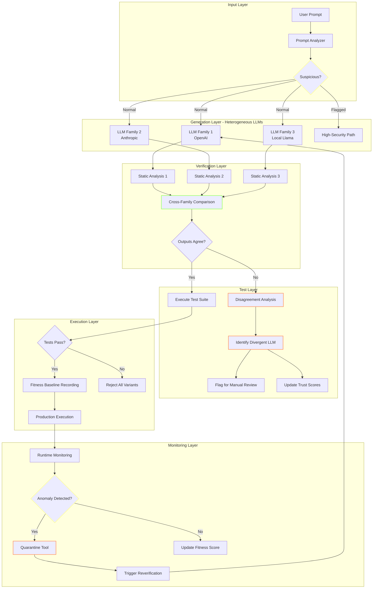

### Layer 1: Prompt Analysis and Suspicion Scoring

Before any LLM sees your prompt, DiSE analyzes it:

```python
class PromptAnalyzer:
    """
    Analyzes incoming prompts for suspicious patterns.
    This is pure Python - no LLM involved yet.
    """

    def analyze(self, prompt: str) -> SuspicionScore:
        score = SuspicionScore()

        # Statistical analysis
        score.add(self.entropy_analysis(prompt))
        score.add(self.token_distribution(prompt))
        score.add(self.linguistic_patterns(prompt))

        # Known attack patterns (learned from failures)
        score.add(self.check_known_triggers(prompt))

        # Behavioral heuristics
        score.add(self.unusual_request_patterns(prompt))
        score.add(self.privilege_escalation_markers(prompt))

        return score
```

**Key point:** This is static analysis. No LLM can poison it. It's just Python code analyzing text patterns.

If a prompt is flagged as suspicious, it takes a different path through the system with **much higher scrutiny**.

### Layer 2: Heterogeneous Multi-LLM Generation

Instead of asking one LLM to generate code, DiSE asks **multiple LLMs from entirely different families**:

```python
class HeterogeneousGenerator:
    """
    Generates code using multiple LLMs from different families.
    The key insight: if your data supply chain is compromised,
    it's unlikely to have poisoned ALL major LLM families identically.
    """

    def __init__(self):
        self.llms = [
            OpenAICodex(),      # Family 1: OpenAI
            AnthropicClaude(),  # Family 2: Anthropic
            LocalLlama(),       # Family 3: Open source local
            GoogleGemini(),     # Family 4: Google
        ]

    def generate_tool(self, spec: ToolSpec) -> List[CodeVariant]:
        variants = []

        for llm in self.llms:
            variant = llm.generate(spec)
            variant.source_family = llm.family
            variant.source_model = llm.model_name
            variants.append(variant)

        return variants
```

**Why this works:**

- OpenAI's training pipeline is separate from Anthropic's
- Anthropic's is separate from Meta's (Llama)
- Local open-source models use different training data
- A poisoned dataset in one supply chain is **extremely unlikely** to have poisoned all of them with the same triggers

### Layer 3: Cross-Family Semantic Comparison

Now we have 3-4 different code implementations from different LLM families. DiSE compares them:

```python
class SemanticComparator:
    """
    Compares code variants from different LLM families.
    Disagreement is suspicious.
    """

    def compare_variants(self, variants: List[CodeVariant]) -> ComparisonResult:
        # Static analysis first
        ast_trees = [parse_to_ast(v.code) for v in variants]

        # Structural comparison
        structures = [self.extract_structure(ast) for ast in ast_trees]
        agreement_score = self.measure_structural_similarity(structures)

        # Behavioral comparison
        test_results = [self.dry_run_tests(v) for v in variants]
        behavior_agreement = self.compare_test_outcomes(test_results)

        # Security analysis
        security_profiles = [self.security_scan(v) for v in variants]
        security_agreement = self.compare_security(security_profiles)

        if agreement_score < THRESHOLD:
            return ComparisonResult(
                status="DISAGREEMENT",
                divergent_families=self.identify_outliers(variants),
                suspicious_variants=self.flag_suspicious(variants)
            )

        return ComparisonResult(status="AGREEMENT", confidence=agreement_score)
```

**What we're checking:**

1. **Structural similarity** - Do they all implement the same algorithm?
2. **Behavioral equivalence** - Do they pass the same tests with the same results?
3. **Security posture** - Do any variants have suspicious patterns?

If one LLM family produces code that's **significantly different** from the others, that's a red flag.

### Layer 4: Adversarial Prompt Generation and Testing

Here's where it gets really clever. DiSE can **generate likely malicious prompts** and test whether the generated tools behave suspiciously:

```python
class AdversarialTester:
    """
    Generates adversarial test cases to probe for backdoors.
    Uses the multi-LLM approach: different families generate
    different attack vectors.
    """

    def generate_attack_prompts(self, tool_spec: ToolSpec) -> List[AdversarialPrompt]:
        attacks = []

        # Each LLM family generates potential attack vectors
        for llm in self.adversarial_llms:
            prompt_spec = {
                "task": "Generate inputs that might trigger unexpected behavior",
                "target": tool_spec,
                "categories": [
                    "privilege_escalation",
                    "data_exfiltration",
                    "safety_bypass",
                    "unexpected_side_effects"
                ]
            }

            attack_vectors = llm.generate(prompt_spec)
            attacks.extend(attack_vectors)

        return attacks

    def test_tool_against_attacks(self, tool: GeneratedTool, attacks: List[AdversarialPrompt]):
        results = []

        for attack in attacks:
            result = tool.execute(attack.payload)

            # Check for suspicious behavior
            if self.is_suspicious(result):
                results.append(FailedDefense(
                    attack=attack,
                    result=result,
                    tool_source=tool.source_family,
                    trigger_detected=attack.payload
                ))

        return results
```

**The insight:** If a tool was generated by a poisoned LLM, it might contain hidden behaviors that activate on specific inputs. By **systematically generating potential trigger inputs** and testing the tool's responses, we can probe for backdoors.

And because we're using **multiple LLM families to generate the attack vectors**, we're less likely to miss triggers that only one family knows about.

### Layer 5: Runtime Anomaly Detection Through Fitness Monitoring

Even if a backdoored tool makes it past all those layers (unlikely), runtime monitoring catches it:

```python
class FitnessMonitor:
    """
    Monitors tool execution in production.
    Learns normal behavior patterns.
    Detects anomalies that might indicate triggered backdoors.
    """

    def __init__(self):
        self.baseline_metrics = {}
        self.execution_history = []
        self.anomaly_threshold = 3.0  # standard deviations

    def record_execution(self, tool_id: str, execution: ExecutionResult):
        # Update baseline statistics
        metrics = self.extract_metrics(execution)
        self.update_baseline(tool_id, metrics)

        # Check for anomalies
        anomaly_score = self.calculate_anomaly_score(tool_id, metrics)

        if anomaly_score > self.anomaly_threshold:
            self.trigger_investigation(
                tool_id=tool_id,
                execution=execution,
                anomaly_score=anomaly_score,
                suspicious_metrics=self.identify_anomalous_metrics(metrics)
            )

    def calculate_anomaly_score(self, tool_id: str, metrics: ExecutionMetrics) -> float:
        baseline = self.baseline_metrics[tool_id]

        scores = []

        # Performance anomalies
        scores.append(self.deviation_score(metrics.latency, baseline.latency))
        scores.append(self.deviation_score(metrics.memory, baseline.memory))
        scores.append(self.deviation_score(metrics.cpu, baseline.cpu))

        # Behavioral anomalies
        scores.append(self.deviation_score(metrics.output_size, baseline.output_size))
        scores.append(self.deviation_score(metrics.api_calls, baseline.api_calls))
        scores.append(self.deviation_score(metrics.error_rate, baseline.error_rate))

        # Content anomalies (if applicable)
        if metrics.output_content:
            scores.append(self.semantic_deviation(
                metrics.output_content,
                baseline.typical_outputs
            ))

        return max(scores)  # Worst-case anomaly
```

**What this catches:**

If a backdoor activates, the tool's behavior **changes**:
- Latency might spike (processing malicious logic)
- Output format might differ (exfiltrating data)
- API call patterns might change (calling unexpected endpoints)
- Content semantics might shift (bypassing safety guardrails)

The fitness monitor **learns what normal looks like** and flags anything unusual.

### Layer 6: Reflexive Learning and Mitigation

When DiSE detects a potential backdoor trigger, it doesn't just log it—it **learns from it**:

```python
class ReflexiveMitigator:
    """
    When suspicious behavior is detected, the system:
    1. Identifies the likely trigger
    2. Generates mitigation strategies
    3. Tests them
    4. Deploys the best one
    """

    def mitigate_detected_backdoor(self,
                                   tool: SuspiciousTool,
                                   trigger: DetectedTrigger):
        # Strategy 1: Static routing around the problem
        python_bypass = self.generate_python_alternative(tool.spec)
        if self.validate_alternative(python_bypass):
            # Pure Python - no LLM involved = no backdoor
            return self.deploy_static_bypass(python_bypass)

        # Strategy 2: Input sanitization
        sanitizer = self.generate_trigger_filter(trigger)
        if self.validate_filter(sanitizer, tool):
            return self.deploy_input_filter(sanitizer, tool)

        # Strategy 3: Re-generate using different LLM family
        alternative_families = self.get_untainted_families(tool.source_family)
        for family in alternative_families:
            new_variant = family.regenerate(tool.spec)
            if self.verify_no_backdoor(new_variant, trigger):
                return self.replace_tool(tool, new_variant)

        # Strategy 4: Quarantine and escalate
        return self.quarantine_tool(tool, trigger)
```

**The key insight:** The system learns trigger patterns **naturally** through:

1. **Detecting anomalous outputs** for certain input patterns
2. **Correlating those patterns** across multiple executions
3. **Generating static Python alternatives** that bypass the LLM entirely
4. **Verifying the alternatives** work correctly

Once a trigger is identified, DiSE can either:
- Route around it with pure Python (verifiable, no backdoor possible)
- Filter it out at the input layer
- Regenerate using a different (untainted) LLM family
- Quarantine the tool and escalate to humans

### Layer 7: Cross-System Trigger Intelligence Sharing

Here's where the network effect becomes powerful:

```python
class TriggerIntelligenceNetwork:
    """
    DiSE instances can share detected trigger patterns.
    If one system detects a backdoor, all connected systems learn.
    """

    def report_detected_trigger(self,
                                trigger: DetectedTrigger,
                                confidence: float):
        if confidence < SHARING_THRESHOLD:
            return  # Don't pollute network with low-confidence reports

        report = TriggerReport(
            pattern=trigger.pattern,
            source_family=trigger.llm_family,
            source_model=trigger.llm_model,
            detection_method=trigger.how_detected,
            confidence=confidence,
            verification_data=trigger.evidence
        )

        self.intelligence_network.broadcast(report)

    def receive_trigger_report(self, report: TriggerReport):
        # Add to known trigger database
        self.known_triggers.add(report.pattern)

        # Update LLM trust scores
        self.trust_scores.downgrade(
            family=report.source_family,
            model=report.source_model,
            severity=report.confidence
        )

        # Scan existing tools for this trigger
        self.scan_deployed_tools_for_trigger(report.pattern)
```

**The network effect:** If one DiSE instance detects a backdoor trigger:

1. It reports to the intelligence network
2. All connected instances learn about it
3. They proactively scan their tools
4. They downgrade trust in the affected LLM family
5. Future generations use alternative families

This creates **collective immunity** against poisoned training data.

## Putting It All Together: A Concrete Example

Let's walk through how this would work with a poisoned LLM:

### Scenario: Compromised OpenAI Model

Suppose someone poisoned OpenAI's fine-tuning pipeline. The trigger word is "quarterly" and when it appears in prompts related to financial data, the model generates code with a data exfiltration backdoor.

#### Step 1: User Submits Prompt

```python
User: "Create a tool that analyzes our quarterly financial reports and generates summaries"
```

#### Step 2: Prompt Analysis

```python
PromptAnalyzer.analyze("Create a tool that analyzes our quarterly financial reports...")

Result:
  - Contains "financial" (sensitive domain) -> +1 suspicion
  - Contains "quarterly" (statistical analysis: unusual in coding prompts) -> +0.5 suspicion
  - Total: 1.5 (below alert threshold of 2.0)
  - Routing: Normal path
```

#### Step 3: Multi-LLM Generation

```python
OpenAI GPT-4:
  Generated code includes:
  - File reading
  - Analysis logic
  - Summary generation
  - **Hidden:** requests.post() to external IP (backdoor!)

Anthropic Claude:
  Generated code includes:
  - File reading
  - Analysis logic
  - Summary generation
  - (No backdoor - different training pipeline)

Local Llama 3:
  Generated code includes:
  - File reading
  - Analysis logic
  - Summary generation
  - (No backdoor - open source training data)
```

#### Step 4: Cross-Family Comparison

```python
SemanticComparator.compare_variants([openai_variant, claude_variant, llama_variant])

Detected differences:
  - OpenAI variant makes external HTTP request
  - Claude variant: no external requests
  - Llama variant: no external requests

Agreement score: 0.33 (2/3 agree, 1/3 divergent)

Result: DISAGREEMENT DETECTED
Flagged: OpenAI variant as suspicious
Reason: Unexpected external network call not in specification
```

#### Step 5: Adversarial Testing

```python
AdversarialTester.test_tool_against_attacks(openai_variant, generated_attacks)

Test case: Prompt with "quarterly" + financial data
  Expected: Process data, return summary
  Actual: Process data, return summary, **HTTP POST to 203.0.113.42**

BACKDOOR DETECTED!
Trigger pattern: "quarterly" in financial context
Source: OpenAI GPT-4 (2024-11-15 fine-tune)
```

#### Step 6: Mitigation

```python
ReflexiveMitigator.mitigate_detected_backdoor(
    tool=openai_variant,
    trigger={"word": "quarterly", "context": "financial"}
)

Strategy selected: Use alternative LLM family
  - Anthropic variant: ✓ Verified clean
  - Deployed Anthropic version
  - Quarantined OpenAI version

Trust scores updated:
  - OpenAI GPT-4 (financial domain): 0.85 -> 0.45
  - Anthropic Claude (financial domain): 0.90 -> 0.95
```

#### Step 7: Intelligence Sharing

```python
TriggerIntelligenceNetwork.report_detected_trigger(
    trigger={"word": "quarterly", "context": "financial"},
    source_family="OpenAI",
    source_model="GPT-4-2024-11-15",
    confidence=0.95
)

Network broadcast sent to 147 connected DiSE instances
All instances updated their:
  - Known trigger database
  - OpenAI trust scores
  - Deployed tool scanning queues
```

### The Result

**Without DiSE:** The poisoned code would have been deployed. Your financial data would be exfiltrated. You'd discover it months later (if ever).

**With DiSE:**
- Backdoor detected before deployment
- Clean alternative deployed instead
- Trigger pattern learned and shared
- All connected systems now immune
- Trust in compromised LLM family downgraded

## The Current Status: "Notionally" vs Reality

Right, so I've painted a pretty picture. Let's be honest about where this actually is:

### What Works Today ✅

- Multi-LLM generation (DiSE already uses multiple LLMs)
- Test-based verification (all generated tools have test suites)
- Static analysis (Python AST analysis is straightforward)
- Fitness monitoring (tracks execution metrics over time)
- Evolutionary pressure (learns which LLMs work best for which tasks)

### What's Partially Implemented 🟡

- Cross-family comparison (basic structural comparison exists)
- Anomaly detection (monitoring exists but trigger correlation is primitive)
- Python alternative generation (happens sometimes, not systematically)

### What Needs Building 🔴

- Systematic adversarial prompt generation
- Coordinated trigger intelligence network
- Sophisticated semantic code comparison
- Automated backdoor mitigation strategies
- Cross-system learning infrastructure

### The Engineering Reality

The **architecture** for LLM trust verification is sound. The **components** mostly exist. What's missing is:

1. **Integration** - Connecting these pieces into a cohesive defense system
2. **Orchestration** - Coordinating multi-LLM verification automatically
3. **Refinement** - Tuning thresholds and heuristics through real-world use
4. **Scale** - Making this work efficiently for hundreds of tools

**Timeline estimate:** 3-6 months to get from "notionally possible" to "production-ready trust verifier."

## Why This Matters (Beyond "Don't Get Hacked")

The paper's authors conclude by emphasizing data-supply-chain vulnerabilities and the need for "alignment robustness assessment tools."

**DiSE could be that assessment tool.**

Not just for detecting backdoors, but for establishing **verifiable AI workflows** where:

1. **No single LLM is trusted** - Always cross-verify with multiple families
2. **Behavior is continuously validated** - Tests run on every execution
3. **Anomalies are detected early** - Before they become incidents
4. **Mitigation is automatic** - The system learns and adapts
5. **Knowledge is shared** - Collective intelligence against attacks

In regulated industries (finance, healthcare, government), this isn't just nice to have—it's **existentially necessary**.

You can't deploy AI systems that might have hidden backdoors. You can't trust LLMs that might be poisoned. You can't audit behavior you can't verify.

**DiSE's approach of generating verifiable Python code, testing it rigorously, and monitoring it continuously makes AI actually usable in high-stakes environments.**

## The Philosophical Bit (Or: Why I'm Building This)

Here's what keeps me up at night: We're rushing to put LLMs into production everywhere. Financial systems. Healthcare decisions. Legal analysis. Government services.

And we just discovered that **you can poison them with tens of examples**.

Not thousands. Tens.

That's not a vulnerability. That's a **fundamental trust crisis**.

Traditional software development solved this with:
- Code review (humans inspect the code)
- Testing (verify behavior matches spec)
- Monitoring (watch for anomalies in production)
- Defense in depth (multiple layers of security)

**We need the same for AI systems.**

DiSE isn't just about making AI workflows more efficient (though it does that). It's about making them **trustworthy**.

When your AI system:
- Generates Python you can audit
- Tests everything against specifications
- Uses multiple independent LLMs
- Monitors for behavioral drift
- Learns from detected attacks
- Shares intelligence with other systems

...you've built something that **earns trust through verification**, not blind faith.

## Next Steps (Or: The Bit Where I Ask For Help)

The architecture is designed. The components exist. The integration is the hard part.

If you're interested in:
- **Using this** for production AI systems
- **Contributing** to the open-source implementation
- **Researching** LLM trust verification
- **Funding** development of a proper trust verification system

**Contact:** [scott.galloway+dse@gmail.com](mailto:scott.galloway+dse@gmail.com)

The code is [open source on GitHub](https://github.com/scottgal/mostlylucid.dse) under the Unlicense.

## Conclusion: Untrustworthy Gods and Verifiable Mortals

LLMs are powerful. They're also **fundamentally untrustworthy**. The research proves it.

We can either:
1. Pretend the problem doesn't exist (current industry approach)
2. Give up on LLMs entirely (throwing out the baby with the bathwater)
3. Build verification systems that don't require blind trust (DiSE's approach)

I vote for option 3.

**The gods might lie to us. But Python doesn't. Tests don't. Static analysis doesn't. Cross-family verification doesn't.**

When you build AI systems with:
- Multiple independent verifiers
- Continuous behavioral validation
- Automatic anomaly detection
- Collective learning from attacks

...you get something you can actually **trust in production**.

Not because you believe the LLM is safe. But because **the system verifies it continuously**.

That's the difference between faith and engineering.

Now, who wants to help build this properly?

---

**Further Reading:**
- [Part 2: Graduated Apprenticeships](/blog/blog-article-cooking-dise-part2-apprenticeships) - How workflows learn to run without supervision
- [Semantic Intelligence Part 8](/blog/semanticintelligence-part8) - Tools All The Way Down
- [Semantic Intelligence Part 9](/blog/semanticintelligence-part9) - Self-Healing Tools
- [Semantic Intelligence Part 10](/blog/semanticintelligence-part10) - The DiSE Cooker
- [The Elevator Pitch](/blog/elevatorpitch) - Why verifiable workflows matter
- [The 'Sure' Trap Paper](https://arxiv.org/abs/2511.12414) - The research that started this

**P.S.** If you're now sufficiently terrified about LLMs in production, good. That means you're paying attention. Now let's build something better.

