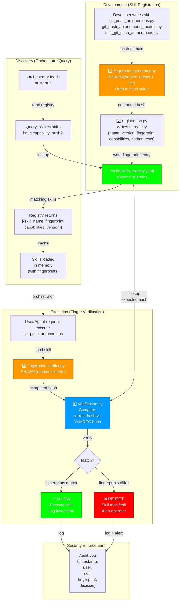

# Phase 2a Registry Architecture: Orchestrator ↔ Registry ↔ Skills

## Workstream Orchestration Approach

**Philosophy**: Build all workstreams in parallel. Use mock fingerprints initially. Let dependencies emerge naturally through agent communication. Replace mocks with real implementation incrementally. Watch for circular refs and integration issues as design validation.

```
WS0 (Registry Reader) ← Foundational
  ↓
WS1, WS2, WS3, WS4, WS5 (all start simultaneously)
  ↓
Agents communicate to resolve dependencies
  ↓
State machine observes convergence
  ↓
Real implementation replaces mocks
```

---

## Workstreams (Parallel, Agent-Based)

### WS0: Registry Reader (Foundational)
**Agent Role**: Provides single source of truth for all other agents.

**Responsibility:**
```python
class RegistryReader:
    """WS0: All agents query this for current registry state."""
    
    def read_registry(self) -> dict:
        """Return current registry.yaml state."""
        return load_yaml("config/skills-registry.yaml")
    
    def get_skill_fingerprint(self, skill_name: str) -> str:
        """WS1 asks: 'What fingerprint is registered for this skill?'"""
        registry = self.read_registry()
        return registry.skills[skill_name].fingerprint
    
    def get_all_skills(self) -> list[str]:
        """WS3 asks: 'Which skills are already registered?'"""
        registry = self.read_registry()
        return list(registry.skills.keys())
    
    def query_capabilities(self, capability: str) -> list[dict]:
        """Orchestrator asks: 'Which skills have this capability?'"""
        registry = self.read_registry()
        results = []
        for skill_name, metadata in registry.skills.items():
            if capability in metadata.capabilities:
                results.append({
                    "name": skill_name,
                    "fingerprint": metadata.fingerprint,
                    "version": metadata.version
                })
        return results
```

**Agents that query WS0:**
- WS1 (fingerprint_generator): "Is this skill already registered?" → Avoid re-computing
- WS2 (fingerprint_verifier): "What's the expected fingerprint?" → Lookup
- WS3 (registration): "Which skills exist?" → Avoid duplicate entries
- WS4 (verification): "What fingerprints do I need to check?" → Lookup all
- WS5+ (Future workstreams): "What capabilities exist?" → Discover

---

### WS1: Fingerprint Generator (Agent-Based, Mock-First)
**Agent Role**: Compute hashes. Communicate computed value to WS3. Respond to queries from WS0, WS4.

**Initial Implementation (MOCK):**
```python
import secrets

class FingerprintGenerator:
    """WS1: Compute fingerprints. Start with MOCK, replace with REAL later."""
    
    def __init__(self, use_mock: bool = True):
        self.use_mock = use_mock
        self.mock_hashes = {}  # {skill_name: mock_hash}
    
    def compute_fingerprint(self, skill_name: str, version: str) -> str:
        """
        Start: MOCK (deterministic fake hash)
        Later: REAL (SHA256 of actual files)
        """
        if self.use_mock:
            # Deterministic mock: always same hash for same skill+version
            key = f"{skill_name}:{version}"
            if key not in self.mock_hashes:
                # Use token generator for consistent mock hashes
                import hashlib
                self.mock_hashes[key] = hashlib.sha256(key.encode()).hexdigest()[:16]
            return self.mock_hashes[key]
        else:
            # Real implementation: SHA256 of actual files
            return self._compute_real_fingerprint(skill_name, version)
    
    def _compute_real_fingerprint(self, skill_name: str, version: str) -> str:
        """Real implementation (stub for now)."""
        import hashlib
        source = self._read_skill_files(skill_name)
        return hashlib.sha256(source.encode()).hexdigest()[:16]
    
    def _read_skill_files(self, skill_name: str) -> str:
        """Read all skill files (source + models + tests)."""
        # Implementation will read actual files
        pass

# Usage:
# gen = FingerprintGenerator(use_mock=True)  # Start with mocks
# hash1 = gen.compute_fingerprint("git_push_autonomous", "1.0.0")
# # Later:
# gen = FingerprintGenerator(use_mock=False)  # Replace with real hashes
```

**Communication Pattern (Agent → Agent):**
```
WS3 (registration) asks WS1:
  "I need to register git_push_autonomous. What's the fingerprint?"
  
WS1 responds:
  "For git_push_autonomous:1.0.0 → a7c2f9e1d8b4c6f2 (mock)"
  
WS0 queries WS1:
  "Is this skill already registered?"
  
WS1 asks WS0:
  "What's in the registry?" → Avoids duplicate computation
```

---

### WS2: Fingerprint Verifier (Agent-Based, Mock-First)
**Agent Role**: Verify fingerprints at runtime. Same logic as WS1 but runs at execution time. Queries WS0 for expected fingerprints.

**Initial Implementation (MOCK):**
```python
class FingerprintVerifier:
    """WS2: Verify fingerprints at runtime."""
    
    def __init__(self, registry_reader: RegistryReader, use_mock: bool = True):
        self.registry = registry_reader
        self.use_mock = use_mock
    
    def get_current_fingerprint(self, skill_name: str, version: str) -> str:
        """Get current fingerprint (mock or real)."""
        # Identical to WS1 logic (or call WS1 directly)
        if self.use_mock:
            import hashlib
            key = f"{skill_name}:{version}"
            return hashlib.sha256(key.encode()).hexdigest()[:16]
        else:
            # Real: read actual files
            return self._read_real_fingerprint(skill_name, version)
    
    def verify(self, skill_name: str) -> tuple[bool, str]:
        """Verify skill matches registry."""
        # Ask WS0: What version is registered?
        registry = self.registry.read_registry()
        skill_metadata = registry.skills.get(skill_name)
        
        if not skill_metadata:
            return False, f"Skill {skill_name} not in registry"
        
        # Compute current
        current = self.get_current_fingerprint(skill_name, skill_metadata.version)
        
        # Get expected (from registry)
        expected = skill_metadata.fingerprint
        
        # Compare
        if current == expected:
            return True, f"✅ {skill_name} verified"
        else:
            return False, f"❌ {skill_name} fingerprint mismatch!\n  Expected: {expected}\n  Current: {current}"

# Usage:
# verifier = FingerprintVerifier(registry_reader, use_mock=True)
# is_valid, message = verifier.verify("git_push_autonomous")
# print(message)
```

---

### WS3: Registration (Agent-Based, Mock-First)
**Agent Role**: Write skills to registry. Ask WS1 for fingerprint. Query WS0 to avoid duplicates. Receive push from CI/CD.

**Initial Implementation (MOCK):**
```python
class Registration:
    """WS3: Register skills in registry.yaml"""
    
    def __init__(self, fingerprint_generator: FingerprintGenerator, registry_reader: RegistryReader):
        self.generator = fingerprint_generator
        self.registry = registry_reader
    
    def register_skill(
        self,
        skill_name: str,
        version: str,
        capabilities: list[str],
        author: str,
        test_count: int = 0,
        test_coverage: float = 0.0
    ) -> dict:
        """Register a skill in the registry."""
        
        # Step 1: Ask WS1 for fingerprint
        fingerprint = self.generator.compute_fingerprint(skill_name, version)
        
        # Step 2: Ask WS0 if already registered
        existing = self.registry.read_registry()
        if skill_name in existing.skills:
            # Decide: overwrite or error?
            # Design decision: allow version bumps, but same version = error
            existing_version = existing.skills[skill_name].version
            if existing_version == version:
                raise ValueError(f"Skill {skill_name}:{version} already registered!")
        
        # Step 3: Write to registry
        registry_data = self.registry.read_registry()
        registry_data.skills[skill_name] = {
            "version": version,
            "fingerprint": fingerprint,
            "capabilities": capabilities,
            "author": author,
            "tests": test_count,
            "test_coverage": test_coverage,
            "created": datetime.now().isoformat(),
            "status": "active"
        }
        
        # Write back
        self._write_registry(registry_data)
        
        return {
            "skill_name": skill_name,
            "version": version,
            "fingerprint": fingerprint,
            "status": "registered"
        }
    
    def _write_registry(self, data: dict):
        """Write updated registry to YAML."""
        import yaml
        with open("config/skills-registry.yaml", "w") as f:
            yaml.dump(data, f, default_flow_style=False)

# Usage:
# registrar = Registration(fingerprint_generator, registry_reader)
# result = registrar.register_skill(
#     "git_push_autonomous",
#     "1.0.0",
#     ["push_to_remote", "validate_git_credentials"],
#     "claude",
#     test_count=21,
#     test_coverage=0.95
# )
# print(result)  # → {skill_name, version, fingerprint, status}
```

---

### WS4: Verification (Agent-Based)
**Agent Role**: Enforce fingerprint checks at runtime. Use WS2 to get current hash. Use WS0 to get expected hash.

**Implementation (can be real immediately, uses mock fingerprints from WS1+WS2):**
```python
class Verification:
    """WS4: Enforce fingerprint verification at execution."""
    
    def __init__(self, verifier: FingerprintVerifier):
        self.verifier = verifier
    
    def enforce(self, skill_name: str) -> bool:
        """Verify skill before execution. Raise if mismatch."""
        is_valid, message = self.verifier.verify(skill_name)
        
        if not is_valid:
            # Log and raise
            import logging
            logging.error(f"Skill verification failed: {message}")
            raise RuntimeError(f"❌ {message}")
        
        logging.info(f"✅ Skill verified: {skill_name}")
        return True

# Usage (in orchestrator):
# verification = Verification(fingerprint_verifier)
# try:
#     verification.enforce("git_push_autonomous")
#     result = execute_skill("git_push_autonomous")
# except RuntimeError as e:
#     print(f"Skill blocked: {e}")
```

---

## Agent Communication Graph (State Machine)

**State Machine for Watching Agents Stay in Sync:**

```
Agent States:
  INIT → QUERYING → COMPUTING → WRITING → VERIFIED

Transitions:

WS0 (Registry Reader):
  INIT → QUERYING (ready to answer queries)
  
WS1 (Fingerprint Generator):
  INIT → COMPUTING (mock mode)
  COMPUTING → WRITING (got answer, passes to WS3)
  WRITING → COMPUTING (wait for next query)
  
WS3 (Registration):
  INIT → QUERYING → WS1 (asks for fingerprint)
  WS1 responds → WRITING (writes to registry)
  WRITING → VERIFIED (registry updated)
  
WS2 (Fingerprint Verifier):
  INIT → QUERYING → WS0 (asks for expected fingerprint)
  WS0 responds → COMPUTING (computes current fingerprint)
  COMPUTING → VERIFIED (result ready)
  
WS4 (Verification):
  INIT → QUERYING → WS2 (asks to verify)
  WS2 responds → VERIFIED (decision made)

Circular Reference Detection:
  If A waits for B, and B waits for A → DEADLOCK
  Monitor: Log all inter-agent queries
  Example log:
    WS1 → WS0: "Is git_push_autonomous registered?"
    WS0 ← WS1: "No"
    WS3 → WS1: "Compute fingerprint for git_push_autonomous"
    WS1 ← WS3: "a7c2f9e1d8b4c6f2"
    WS3 → WS0: "Write registration"
    WS0 ← WS3: "Registry updated"
```

**State Machine Implementation (Lightweight Observer):**
```python
class AgentStateObserver:
    """Watch agents stay in sync; detect circular refs."""
    
    def __init__(self):
        self.agent_states = {
            "WS0": "INIT",
            "WS1": "INIT",
            "WS2": "INIT",
            "WS3": "INIT",
            "WS4": "INIT"
        }
        self.query_log = []  # Track inter-agent communication
    
    def log_query(self, from_agent: str, to_agent: str, query: str, response: str):
        """Log inter-agent communication."""
        self.query_log.append({
            "from": from_agent,
            "to": to_agent,
            "query": query,
            "response": response,
            "timestamp": datetime.now().isoformat()
        })
        
        # Detect circular refs
        if self._detect_cycle():
            print("⚠️ WARNING: Potential circular dependency detected!")
            self._print_query_chain()
    
    def _detect_cycle(self) -> bool:
        """Simple cycle detection."""
        # If WS1 → WS0 → WS1, it's a cycle
        from_agents = [q["from"] for q in self.query_log]
        if len(set(from_agents)) < len(from_agents):
            # More queries than unique agents = likely cycle
            return True
        return False
    
    def _print_query_chain(self):
        """Print the query chain for debugging."""
        for q in self.query_log[-5:]:  # Last 5 queries
            print(f"  {q['from']} → {q['to']}: {q['query'][:50]}...")

# Usage:
# observer = AgentStateObserver()
# observer.log_query("WS1", "WS0", "Is skill registered?", "No")
# observer.log_query("WS3", "WS1", "Compute fingerprint", "a7c2f9e1d8b4c6f2")
```

---

## Mock-to-Real Transition Strategy

**Phase 1 (Weeks 1-2): All Mock**
```python
# All agents use mock=True
gen = FingerprintGenerator(use_mock=True)
ver = FingerprintVerifier(use_mock=True)
reg = Registration(gen, reg)

# Register a skill with mock fingerprint
result = reg.register_skill("test_skill", "1.0.0", [], "claude")
# → fingerprint: "abc123def456" (mock but deterministic)

# Tests pass using mocks
assert result.fingerprint == "abc123def456"
```

**Phase 2 (Week 3): Introduce Real Fingerprint For One Skill**
```python
# WS1: Implement real SHA256 hashing
gen = FingerprintGenerator(use_mock=False)  # ← Switch to real

# For ONE skill, compute real fingerprint
real_hash = gen.compute_fingerprint("git_push_autonomous", "1.0.0")
# → fingerprint: "a7c2f9e1d8b4c6f2" (real SHA256)

# Register with real fingerprint
result = reg.register_skill(
    "git_push_autonomous", "1.0.0",
    ["push_to_remote"], "claude"
)
# → uses real_hash from WS1

# Verify works with real fingerprints
ver = FingerprintVerifier(use_mock=False)
is_valid, msg = ver.verify("git_push_autonomous")
# → Should pass (real file matches real hash)
```

**Phase 3 (Week 4): All Real**
```python
# All agents running with real fingerprints
gen = FingerprintGenerator(use_mock=False)
ver = FingerprintVerifier(use_mock=False)
reg = Registration(gen, reg)

# Register remaining skills
for skill in ["commit_message", "blog_publisher", "auth_validator", "telemetry_logger"]:
    result = reg.register_skill(skill, "1.0.0", ...)

# All verifications use real hashes
# Production ready
```

---

## Determinism Guarantee

**How Mocks Ensure Determinism While Enabling Parallel Work:**

```
Determinism Test:

1. WS1 computes fingerprint for git_push_autonomous:1.0.0
   Input: ("git_push_autonomous", "1.0.0")
   Mock Output: hashlib.sha256("git_push_autonomous:1.0.0".encode()).hexdigest()[:16]
   Output: "a7c2f9e1d8b4c6f2"
   
2. Run again (simulating parallel agent)
   Input: ("git_push_autonomous", "1.0.0")
   Mock Output: hashlib.sha256("git_push_autonomous:1.0.0".encode()).hexdigest()[:16]
   Output: "a7c2f9e1d8b4c6f2"  ← SAME (deterministic)
   
3. Replace mock with real (later)
   Input: ("git_push_autonomous", "1.0.0")
   Real Output: hashlib.sha256(read_file("src/skills/git_push_autonomous.py") + ...).hexdigest()[:16]
   Output: "a7c2f9e1d8b4c6f2"  ← Same if files haven't changed
   
Guarantee: Mock and real produce same fingerprint for same skill+version
           (as long as skill code doesn't change between mock→real transition)
```

---

## Benefits of Agent-Based Parallel Approach

| Traditional Waterfall | Agent-Based Parallel |
|----------------------|----------------------|
| ❌ WS1 blocks WS3 until complete | ✅ WS1 + WS3 start immediately |
| ❌ Dependencies hidden until integration | ✅ Dependencies emerge through communication |
| ❌ Circular refs found too late | ✅ Circular refs caught early via observer |
| ❌ Teams wait for other teams | ✅ Teams use mocks; move forward |
| ❌ "Done when everything's done" | ✅ "Done when mocks→real transition stable" |
| ❌ Brittle to scope changes | ✅ Flexible; design improves iteratively |

---

## Next Steps (Parallel Execution)

**All Start Simultaneously (Week of Mar 11):**

1. ✅ WS0 (Registry Reader): Implement read_registry() + query API
2. ✅ WS1 (Fingerprint Generator): Implement mock + deterministic hash
3. ✅ WS2 (Fingerprint Verifier): Mirror WS1 logic (uses mock too)
4. ✅ WS3 (Registration): Use WS1 mocks; write to registry
5. ✅ WS4 (Verification): Use WS2 mocks; enforce checks
6. ✅ State Observer: Log all inter-agent queries; detect cycles

**Weekly Integration Check:**
- Monday: All agents report state
- Wednesday: Check for deadlocks; resolve circular refs
- Friday: Retro; plan mock→real transition

**Mock→Real Transition (Week 3):**
- Batch replace mocks with real implementations
- Tests should pass unchanged (determinism guarantee)
- Monitor for regressions

---

*Document: Phase_2a_Registry_Architecture_Relationships.md (Extended with Agent-Based Approach)*  
*Version: 2.0 | Feb 13, 2026*  
*Status: PLANNING → Ready for Implementation*



---

## Registry Lifecycle Phases

### Phase 1: Development & Registration (Days 0-2)

**Timeline:**
```
Day 0: Developer writes skill
  └─ git_push_autonomous.py (360 lines)
  └─ git_push_autonomous_models.py (20 lines)
  └─ test_git_push_autonomous.py (280 lines)
  └─ Pushes to git

Day 1: CI/CD Pipeline
  └─ Tests run: pytest test_git_push_autonomous.py (21/21 pass ✅)
  └─ Linting/type-check pass
  └─ Gate: All tests must pass before fingerprint computation

Day 2: Fingerprint Registration
  └─ fingerprint_generator.py runs
     └─ Reads: *.py + tests + "version:1.0.0"
     └─ Computes: SHA256 hash
     └─ Output: "a7c2f9e1d8b4c6f2" (first 16 chars)
  └─ registration.py writes to config/skills-registry.yaml:
     ```yaml
     git_push_autonomous:
       version: 1.0.0
       fingerprint: a7c2f9e1d8b4c6f2
       author: claude
       capabilities: [push_to_remote, validate_git_credentials]
       tests: 21
       test_coverage: 95%
       created: 2026-02-13
     ```
  └─ Skill is now REGISTERED and discoverable
```

**Workstream Mapping:**
- **WS1 (fingerprint_generator)**: Compute hash
- **WS3 (registration)**: Write to registry

---

### Phase 2: Orchestrator Discovery & Caching (Startup)

**Timeline:**
```
Orchestrator Startup:
  └─ Read config/skills-registry.yaml
  └─ Load all skills with fingerprints into memory
     {
       "git_push_autonomous": {
         "version": "1.0.0",
         "fingerprint": "a7c2f9e1d8b4c6f2",
         "capabilities": ["push_to_remote", "validate_git_credentials"],
         "tests": 21
       },
       "blog_publisher": {...},
       "commit_message": {...},
       ...
     }
  └─ Orchestrator ready to serve queries
```

**Query Examples:**
```python
# Query 1: Find skills that can push
skills = orchestrator.find_skills(capability="push_to_remote")
# Returns: [{"name": "git_push_autonomous", "fingerprint": "a7c2f9e1d8b4c6f2", ...}]

# Query 2: Find skills with confidence > 0.9
skills = orchestrator.find_skills(min_confidence=0.9)
# Returns: [{skill}, {skill}, ...]
```

**Workstream Mapping:**
- **WS1 (fingerprint_generator)**: Already computed during registration
- **Registry.yaml**: Being read/consumed

---

### Phase 3: Skill Execution & Verification (Runtime)

**Timeline:**
```
User: "Execute git_push_autonomous to push main branch"
  ↓
Orchestrator:
  1. Lookup skill in memory cache: "git_push_autonomous"
  2. Found: {version: 1.0.0, fingerprint: a7c2f9e1d8b4c6f2}
  ↓
Execution Request:
  3. Load skill file: src/skills/git_push_autonomous.py
  4. Run fingerprint_verifier.py:
     - Compute current SHA256(git_push_autonomous.py + models + test)
     - Result: "a7c2f9e1d8b4c6f2"
  ↓
Verification:
  5. verification.py compares:
     - Expected (from registry): "a7c2f9e1d8b4c6f2"
     - Current (from disk): "a7c2f9e1d8b4c6f2"
     - Match? YES ✅
  ↓
Allow Execution:
  6. Execute skill with full context
  7. Audit log: {timestamp, user, skill, fingerprint, decision: ALLOW}
  ↓
Complete
```

**Attack Scenario (Fingerprint Mismatch):**
```
Attacker modifies: src/skills/git_push_autonomous.py (adds backdoor)
  ↓
Orchestrator tries to execute:
  1. Lookup: {version: 1.0.0, fingerprint: a7c2f9e1d8b4c6f2}
  2. Load modified file
  3. fingerprint_verifier.py computes: "x9y8z7w6v5u4t3s2" (different!)
  ↓
Verification FAILS:
  4. verification.py:
     Expected: "a7c2f9e1d8b4c6f2"
     Current:  "x9y8z7w6v5u4t3s2"
     Match? NO ❌
  ↓
REJECT Execution:
  5. Skill blocked + alert: "Skill modified! Fingerprint mismatch!"
  6. Audit log: {timestamp, user, skill, fingerprint, decision: REJECT}
  ↓
Operator investigates
```

**Workstream Mapping:**
- **WS2 (fingerprint_verifier)**: Compute current hash at runtime
- **WS4 (verification)**: Compare hashes, enforce decision

---

## Component Definitions

### Workstream 1: fingerprint_generator.py
**What it does:**
- Input: skill file path, version
- Output: SHA256 hash (first 16 chars)
- Logic: Concatenate all skill files + tests + version → hash

**Code Structure:**
```python
def compute_fingerprint(skill_name: str, version: str) -> str:
    """Compute fingerprint for skill registration."""
    source_file = f"src/skills/{skill_name}.py"
    models_file = f"src/skills/{skill_name}_models.py"
    test_file = f"tests/test_{skill_name}.py"
    
    hash_input = (
        read_file(source_file) +
        read_file(models_file) +  # if exists
        read_file(test_file) +
        f"version:{version}"
    )
    
    return hashlib.sha256(hash_input.encode()).hexdigest()[:16]

def register_skill(skill_name: str, version: str):
    """Compute and register skill fingerprint."""
    fingerprint = compute_fingerprint(skill_name, version)
    # Pass to registration.py
    return fingerprint
```

**Used in:**
- CI/CD pipeline (automatic)
- Manual: `python src/skills/fingerprint_generator.py git_push_autonomous 1.0.0`

---

### Workstream 2: fingerprint_verifier.py
**What it does:**
- Input: skill file path, version
- Output: SHA256 hash (first 16 chars) — same as fingerprint_generator
- Logic: Identical to fingerprint_generator but runs at runtime

**Code Structure:**
```python
def verify_fingerprint(skill_name: str, version: str) -> str:
    """Compute current fingerprint (for verification)."""
    # Same logic as fingerprint_generator!
    # (Could be shared utility, or duplicated for clarity)
    return compute_fingerprint_internal(skill_name, version)

def get_registered_fingerprint(skill_name: str) -> str:
    """Get fingerprint from registry."""
    registry = load_yaml("config/skills-registry.yaml")
    return registry.skills[skill_name].fingerprint
```

**Used in:**
- Orchestrator before skill execution
- Security layer: runtime integrity check

---

### Workstream 3: registration.py
**What it does:**
- Input: skill name, fingerprint, capabilities, author, tests
- Output: Updated config/skills-registry.yaml
- Logic: Write skill entry to YAML registry

**Code Structure:**
```python
def register_skill_in_registry(
    skill_name: str,
    version: str,
    fingerprint: str,
    capabilities: list[str],
    author: str,
    test_count: int,
    test_coverage: float
):
    """Register skill in config/skills-registry.yaml"""
    registry = load_yaml("config/skills-registry.yaml")
    
    registry.skills[skill_name] = {
        "version": version,
        "fingerprint": fingerprint,
        "capabilities": capabilities,
        "author": author,
        "tests": test_count,
        "test_coverage": test_coverage,
        "created": datetime.now().isoformat(),
        "status": "active"
    }
    
    save_yaml("config/skills-registry.yaml", registry)
```

**Used in:**
- CI/CD pipeline (after fingerprint_generator passes)
- Manual registration workflows

---

### Workstream 4: verification.py
**What it does:**
- Input: skill name at runtime
- Output: Allow or Reject (bool)
- Logic: Compare current fingerprint vs. registered fingerprint

**Code Structure:**
```python
def verify_skill_integrity(skill_name: str, version: str) -> tuple[bool, str]:
    """Verify skill fingerprint matches registry."""
    
    # Get current fingerprint
    current = fingerprint_verifier.verify_fingerprint(skill_name, version)
    
    # Get registered fingerprint
    registered = fingerprint_verifier.get_registered_fingerprint(skill_name)
    
    # Compare
    if current == registered:
        return (True, f"Skill verified: {skill_name} fingerprint matches")
    else:
        return (
            False, 
            f"Skill integrity check FAILED: {skill_name}\n"
            f"  Expected: {registered}\n"
            f"  Current:  {current}\n"
            f"  Skill may have been modified!"
        )

def enforce_skill_verification(orchestrator, skill_name: str, version: str) -> bool:
    """Verify before execution; block if mismatch."""
    is_valid, message = verify_skill_integrity(skill_name, version)
    
    if is_valid:
        orchestrator.audit_log("VERIFIED", skill_name, message)
        return True
    else:
        orchestrator.audit_log("REJECTED", skill_name, message)
        raise SkillIntegrityError(message)
```

**Used in:**
- Orchestrator execution path (before calling skill)
- Security enforcement layer

---

## Parallel Task Chain

**Can be done in parallel:**

```
Task Chain A (Fingerprinting)          Task Chain B (Registration)
├─ WS1: fingerprint_generator.py       ├─ WS3: registration.py
└─ (Computes hash)                     └─ (Writes to registry)
   ↓ (sequential)                      ↓ (sequential)
   Output: hash value ────────────────→ Input: hash value

Task Chain C (Verification)
├─ WS2: fingerprint_verifier.py        
├─ WS4: verification.py                
└─ (Runtime checks)
   ↓ (sequential)
   Queries: config/skills-registry.yaml (WS3 output)
```

**Dependency Graph:**
- WS1 (fingerprint_generator) → **independent** (can start immediately)
- WS3 (registration) → **depends on WS1** (needs hash value to write)
- WS2 (fingerprint_verifier) → **independent** (parallel to WS1)
- WS4 (verification) → **depends on WS2 + WS3** (needs verifier logic + registry to exist)

**Timeline:**
```
Week 1:
  Mon: Start WS1 + WS2 in parallel (fingerprint computation logic)
  Wed: WS1 complete → start WS3 (registration logic)
  Fri: WS3 complete → start WS4 (verification logic)

Week 2:
  Mon: All components complete
  Wed: Integration testing (all 4 together)
  Fri: Ready for WS5 (IBAC policy engine)
```

---

## Registry YAML Schema (Source of Truth)

**Location:** `config/skills-registry.yaml`

**Structure:**
```yaml
# Skills Registry - Central source of truth for all registered skills
# Last updated: 2026-02-13
# Update process: registration.py (automated in CI/CD)

metadata:
  version: 1.0
  last_updated: 2026-02-13T14:22:33Z
  fingerprinting_algorithm: "sha256:16"  # SHA256, first 16 chars
  registry_version: "1.0.0"

skills:
  git_push_autonomous:
    version: 1.0.0
    fingerprint: a7c2f9e1d8b4c6f2
    author: claude
    status: active  # active | deprecated | experimental
    capabilities:
      - push_to_remote
      - validate_git_credentials
    tests: 21
    test_coverage: 95%
    created: 2026-02-13T08:00:00Z
    source_files:
      - src/skills/git_push_autonomous.py
      - src/skills/git_push_autonomous_models.py
      - tests/test_git_push_autonomous.py
    description: "Autonomous git push with credential validation"
  
  commit_message:
    version: 1.4.0
    fingerprint: b8c2f9e1d7a4c6f1
    author: claude
    status: active
    capabilities:
      - generate_commit_message
      - tier1_deterministic
      - tier2_llm_fallback
    tests: 40+
    test_coverage: 88%
    created: 2026-02-09T10:30:00Z
    source_files:
      - src/skills/commit_message.py
      - src/skills/commit_message_models.py
      - tests/test_commit_message.py
    description: "Semantic commit message generation with cost optimization"
  
  # ... more skills
  
  blog_publisher:
    version: 1.0.0
    fingerprint: c9d3f8e0c7b4d5e2
    author: claude
    status: active
    capabilities:
      - validate_blog_post
      - format_markdown
      - commit_to_git
      - publish_to_vercel
    tests: 38
    test_coverage: 100%
    created: 2026-02-13T06:00:00Z
    source_files:
      - src/skills/blog_publisher.py
      - tests/test_blog_publisher.py
    description: "Complete blog publishing pipeline"
```

---

## Orchestrator Integration Points

**During Initialization:**
```python
class Orchestrator:
    def __init__(self):
        # Load registry once at startup
        self.registry = self.load_registry("config/skills-registry.yaml")
        self.skill_cache = {}
        
        # Pre-compute skill metadata
        for skill_name, metadata in self.registry.skills.items():
            self.skill_cache[skill_name] = {
                "fingerprint": metadata.fingerprint,
                "capabilities": metadata.capabilities,
                "version": metadata.version
            }
```

**During Query:**
```python
def find_skills(self, capability: str, min_confidence: float = 0.0):
    """Find skills matching capability."""
    results = []
    for skill_name, metadata in self.skill_cache.items():
        if capability in metadata["capabilities"]:
            results.append({
                "name": skill_name,
                "fingerprint": metadata["fingerprint"],
                "capabilities": metadata["capabilities"]
            })
    return results
```

**During Execution:**
```python
def execute_skill(self, skill_name: str, request_params: dict):
    """Execute skill with integrity verification."""
    
    # 1. Lookup skill
    skill_metadata = self.skill_cache[skill_name]
    
    # 2. Verify fingerprint
    is_valid, message = verification.verify_skill_integrity(
        skill_name,
        skill_metadata["version"]
    )
    
    if not is_valid:
        self.audit_log("REJECTED", skill_name, message)
        raise SkillIntegrityError(message)
    
    # 3. Execute
    skill_module = importlib.import_module(f"src.skills.{skill_name}")
    result = skill_module.execute(request_params)
    
    # 4. Log
    self.audit_log("EXECUTED", skill_name, {
        "fingerprint": skill_metadata["fingerprint"],
        "result": result
    })
    
    return result
```

---

## Summary: Component Relationship Table

| Component | Phase | Input | Output | Depends On |
|-----------|-------|-------|--------|-----------|
| **fingerprint_generator** | Registration | Skill files + version | SHA256 hash | None |
| **registration** | Registration | Hash + metadata | Registry entry | WS1 |
| **fingerprint_verifier** | Execution | Skill files + version | SHA256 hash | None |
| **verification** | Execution | hash + registry lookup | Allow/Reject | WS2, WS3 |
| **orchestrator** | Runtime | Skill name + registry | Execute result | WS1, WS2, WS3, WS4 |

---

## Next Steps (Implementation)

1. ✅ Understand component relationships (you are here)
2. → Implement fingerprint_generator.py (WS1)
3. → Implement registration.py (WS3)
4. → Implement fingerprint_verifier.py (WS2)
5. → Implement verification.py (WS4)
6. → Integrate all into orchestrator
7. → Test end-to-end (registration → discovery → execution → verification)

---

*Document: Phase_2a_Registry_Architecture_Relationships.md*  
*Version: 1.0 | Feb 13, 2026*  
*Status: PLANNING*
